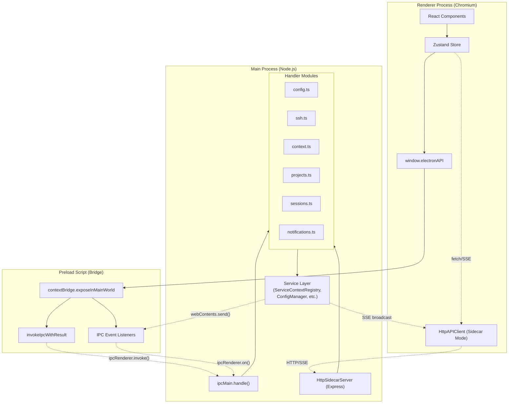
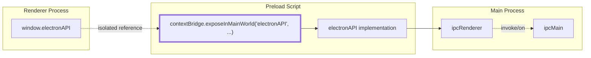
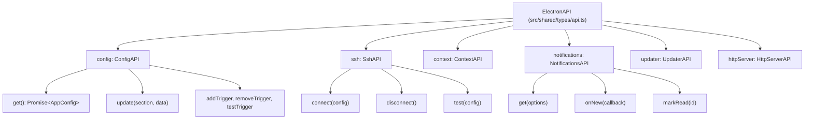
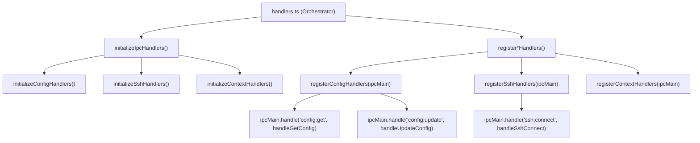
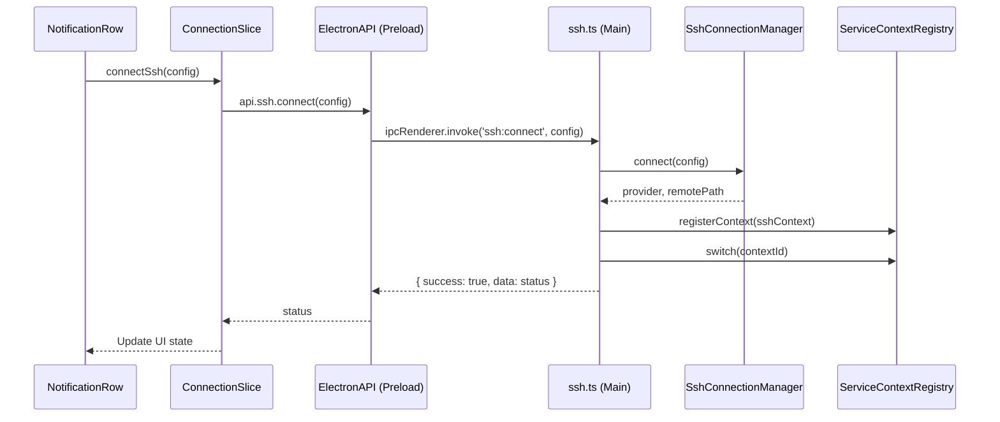

# IPC Communication Layer

<details>
<summary>Relevant source files</summary>

The following files were used as context for generating this wiki page:

- [src/main/ipc/config.ts](src/main/ipc/config.ts)
- [src/main/ipc/context.ts](src/main/ipc/context.ts)
- [src/main/ipc/handlers.ts](src/main/ipc/handlers.ts)
- [src/main/ipc/ssh.ts](src/main/ipc/ssh.ts)
- [src/main/services/error/ErrorTriggerChecker.ts](src/main/services/error/ErrorTriggerChecker.ts)
- [src/main/utils/pathDecoder.ts](src/main/utils/pathDecoder.ts)
- [src/preload/index.ts](src/preload/index.ts)
- [src/renderer/api/httpClient.ts](src/renderer/api/httpClient.ts)
- [src/renderer/components/notifications/NotificationRow.tsx](src/renderer/components/notifications/NotificationRow.tsx)
- [src/renderer/store/slices/connectionSlice.ts](src/renderer/store/slices/connectionSlice.ts)
- [src/shared/types/api.ts](src/shared/types/api.ts)
- [test/main/ipc/guards.test.ts](test/main/ipc/guards.test.ts)
- [test/main/utils/pathDecoder.test.ts](test/main/utils/pathDecoder.test.ts)
- [test/mocks/electronAPI.ts](test/mocks/electronAPI.ts)

</details>


The IPC (Inter-Process Communication) Communication Layer provides type-safe, secure communication between the renderer process (React UI) and the main process (Node.js services). It implements Electron's security model using `contextBridge` to expose a strictly-controlled API surface while keeping Node.js APIs isolated from the renderer.

This page covers the IPC bridge architecture, handler registration, and communication patterns. For information about the services invoked by IPC handlers, see [Multi-Context System](3.2). For state management in the renderer that consumes the IPC API, see [State Management](3.4).

---

## Architecture Overview

The IPC layer uses a three-tier architecture that enforces Electron's security model. It also supports an alternative HTTP-based communication path for browser-only environments (Sidecar mode).

### Process Communication Flow



**Key Responsibilities:**

| Layer | Responsibility | Context Isolation |
|-------|---------------|-------------------|
| **Renderer** | UI components, user interactions | No Node.js access |
| **Preload** | Security boundary, type-safe API | Limited Electron API |
| **Main** | File system, services, native APIs | Full Node.js/Electron |

Sources: [src/preload/index.ts:1-449](), [src/main/ipc/handlers.ts:1-123](), [src/renderer/api/httpClient.ts:46-55]()

---

## Security Boundary: contextBridge

The preload script uses `contextBridge.exposeInMainWorld()` to create a sandboxed API object that is accessible to the renderer without exposing Node.js globals like `require`, `process`, or `__dirname`.



The `contextBridge` ensures:
- Renderer cannot access `ipcRenderer` directly.
- All communication goes through explicitly exposed methods.
- Type safety is enforced via TypeScript interfaces.

**Implementation:**

[src/preload/index.ts:447-448]():
```typescript
contextBridge.exposeInMainWorld('electronAPI', electronAPI);
```

The `electronAPI` object is strictly typed via the `ElectronAPI` interface defined in [src/shared/types/api.ts:307-408]().

Sources: [src/preload/index.ts:447-449](), [src/shared/types/api.ts:307-408]()

---

## ElectronAPI Interface Structure

The `ElectronAPI` interface organizes methods into logical sub-APIs, mirroring the domain-specific handler modules in the main process:



**Type Definitions:**

Each sub-API is defined as an interface in [src/shared/types/api.ts]():

| Interface | Purpose | Key Methods |
|-----------|---------|-------------|
| `ConfigAPI` | App configuration and Claude root detection | `get()`, `update()`, `getClaudeRootInfo()` |
| `SshAPI` | SSH connection lifecycle and host resolution | `connect()`, `disconnect()`, `resolveHost()` |
| `ContextAPI` | Multi-context switching (Local vs SSH) | `list()`, `switch()`, `getActive()` |
| `NotificationsAPI` | Error detection and inbox management | `get()`, `markRead()`, `onNew()` |
| `UpdaterAPI` | Application auto-update orchestration | `check()`, `download()`, `install()` |

Sources: [src/shared/types/api.ts:1-419](), [src/preload/index.ts:122-445]()

---

## IPC Handler Organization

Handlers are organized into domain-specific modules under `src/main/ipc/`. Each module exports an initialization function to receive service dependencies and a registration function for the Electron `ipcMain`.



### Domain Handlers

| Module | Channels | Purpose |
|--------|----------|---------|
| `config.ts` | `config:*` | Persistence, notification triggers, folder selection dialogs [src/main/ipc/config.ts:80-125]() |
| `ssh.ts` | `ssh:*` | Connection management, SSH config host parsing [src/main/ipc/ssh.ts:69-116]() |
| `context.ts` | `context:*` | Listing and switching active service contexts [src/main/ipc/context.ts:50-90]() |
| `projects.ts` | `get-projects` | Discovery of Claude project directories [src/main/ipc/handlers.ts:87-87]() |
| `sessions.ts` | `get-sessions*` | Pagination and retrieval of JSONL session data [src/main/ipc/handlers.ts:88-88]() |

Sources: [src/main/ipc/handlers.ts:1-123](), [src/main/ipc/config.ts:1-125](), [src/main/ipc/ssh.ts:69-200](), [src/main/ipc/context.ts:50-97]()

---

## Error Handling Pattern: IpcResult<T>

All IPC handlers return a standardized `IpcResult<T>` structure. The preload script uses a type-safe wrapper to unwrap these results or throw descriptive errors.

[src/preload/index.ts:85-89]():
```typescript
interface IpcResult<T> {
  success: boolean;
  data?: T;
  error?: string;
}
```

### The invokeIpcWithResult Wrapper

This function ensures that the renderer only receives the raw data or a standard JavaScript `Error`, abstracting the IPC protocol details.

[src/preload/index.ts:103-109]():
```typescript
async function invokeIpcWithResult<T>(channel: string, ...args: unknown[]): Promise<T> {
  const result = (await ipcRenderer.invoke(channel, ...args)) as IpcResult<T>;
  if (!result.success) {
    throw new Error(result.error ?? 'Unknown error');
  }
  return result.data as T;
}
```

Sources: [src/preload/index.ts:79-109]()

---

## Request-Response Flow: SSH Connection Example

The following diagram illustrates the flow from a UI action to the main process service and back.



**Implementation Details:**
- The `ConnectionSlice` manages the high-level state transition from `local` to `ssh` mode [src/renderer/store/slices/connectionSlice.ts:65-103]().
- The SSH handler in the main process orchestrates the connection and switches the global `ServiceContext` [src/main/ipc/ssh.ts:70-116]().

Sources: [src/renderer/store/slices/connectionSlice.ts:65-129](), [src/main/ipc/ssh.ts:70-116](), [src/preload/index.ts:370-372]()

---

## Path Encoding & Validation

Since Claude Code project directories use an encoded format (e.g., `-Users-name-project`), the IPC layer utilizes `pathDecoder.ts` to ensure valid project IDs are passed between processes.

[src/main/utils/pathDecoder.ts:27-36]():
```typescript
export function encodePath(absolutePath: string): string {
  const encoded = absolutePath.replace(/[/\\]/g, '-');
  return encoded.startsWith('-') ? encoded : `-${encoded}`;
}
```

### IPC Guards
Before processing requests, handlers use guards to validate project and session IDs to prevent path traversal or malformed requests.

| Guard Function | Validation Logic | Source |
|----------------|------------------|--------|
| `validateProjectId` | Checks for leading dash and valid characters | [test/main/ipc/guards.test.ts:11-33]() |
| `validateSessionId` | Ensures valid JSONL filename format | [test/main/ipc/guards.test.ts:35-38]() |
| `isValidEncodedPath`| Validates legacy and modern Windows/POSIX formats | [src/main/utils/pathDecoder.ts:124-160]() |

Sources: [src/main/utils/pathDecoder.ts:1-216](), [test/main/ipc/guards.test.ts:1-55]()

---

## Sidecar HTTP Implementation

For environments where Electron's IPC is unavailable (e.g., browser-only mode), the system provides `HttpAPIClient`. This class implements the same `ElectronAPI` interface but uses `fetch` for requests and `EventSource` (Server-Sent Events) for real-time updates.

### EventSource (SSE) Infrastructure
The `HttpAPIClient` maintains a persistent connection to the sidecar server to receive broadcast events like file changes.

[src/renderer/api/httpClient.ts:61-68]():
```typescript
private initEventSource(): void {
  this.eventSource = new EventSource(`${this.baseUrl}/api/events`);
  this.eventSource.onerror = () => {
    console.warn('[HttpAPIClient] SSE connection error, will reconnect...');
  };
}
```

### JSON Reviver for Dates
Unlike Electron IPC which preserves `Date` objects via structured clone, HTTP serialization turns dates into strings. The `HttpAPIClient` uses a custom reviver to restore `Date` instances.

[src/renderer/api/httpClient.ts:99-107]():
```typescript
private static readonly ISO_DATE_RE = /^\d{4}-\d{2}-\d{2}T\d{2}:\d{2}:\d{2}(?:\.\d{1,9})?Z?$/;

private static reviveDates(_key: string, value: unknown): unknown {
  if (typeof value === 'string' && HttpAPIClient.ISO_DATE_RE.test(value)) {
    const d = new Date(value);
    if (!isNaN(d.getTime())) return d;
  }
  return value;
}
```

Sources: [src/renderer/api/httpClient.ts:1-116](), [src/renderer/api/httpClient.ts:46-107]()
