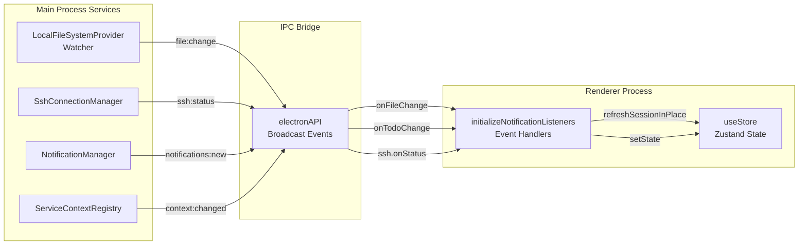
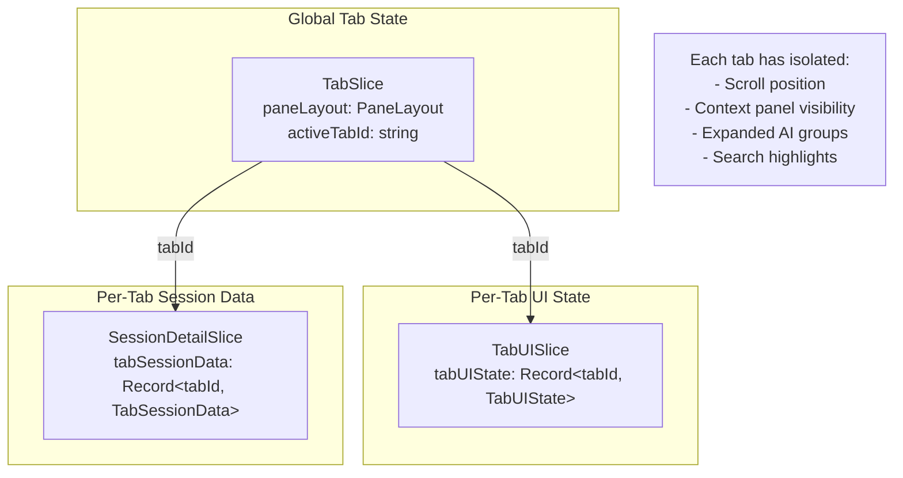

# State Management

<details>
<summary>Relevant source files</summary>

The following files were used as context for generating this wiki page:

- [src/main/services/infrastructure/LocalFileSystemProvider.ts](src/main/services/infrastructure/LocalFileSystemProvider.ts)
- [src/renderer/components/chat/DisplayItemList.tsx](src/renderer/components/chat/DisplayItemList.tsx)
- [src/renderer/components/chat/items/ExecutionTrace.tsx](src/renderer/components/chat/items/ExecutionTrace.tsx)
- [src/renderer/components/chat/items/LinkedToolItem.tsx](src/renderer/components/chat/items/LinkedToolItem.tsx)
- [src/renderer/components/chat/items/TextItem.tsx](src/renderer/components/chat/items/TextItem.tsx)
- [src/renderer/components/chat/items/ThinkingItem.tsx](src/renderer/components/chat/items/ThinkingItem.tsx)
- [src/renderer/components/layout/PaneContent.tsx](src/renderer/components/layout/PaneContent.tsx)
- [src/renderer/components/layout/SortableTab.tsx](src/renderer/components/layout/SortableTab.tsx)
- [src/renderer/components/notifications/NotificationsView.tsx](src/renderer/components/notifications/NotificationsView.tsx)
- [src/renderer/hooks/useAutoScrollBottom.ts](src/renderer/hooks/useAutoScrollBottom.ts)
- [src/renderer/store/index.ts](src/renderer/store/index.ts)
- [src/renderer/store/slices/notificationSlice.ts](src/renderer/store/slices/notificationSlice.ts)
- [src/renderer/store/slices/projectSlice.ts](src/renderer/store/slices/projectSlice.ts)
- [src/renderer/store/slices/sessionDetailSlice.ts](src/renderer/store/slices/sessionDetailSlice.ts)
- [src/renderer/store/slices/tabSlice.ts](src/renderer/store/slices/tabSlice.ts)
- [src/renderer/types/tabs.ts](src/renderer/types/tabs.ts)
- [test/renderer/store/notificationSlice.test.ts](test/renderer/store/notificationSlice.test.ts)
- [test/renderer/store/sessionSlice.test.ts](test/renderer/store/sessionSlice.test.ts)
- [test/renderer/store/tabSlice.test.ts](test/renderer/store/tabSlice.test.ts)

</details>


## Purpose and Scope

This document describes the state management architecture in claude-devtools, covering the Zustand store structure, slice organization, real-time event handling, and context snapshots. The application uses a unified global store that combines 15 specialized slices organized into data, UI, and system categories.

The store acts as the central hub for the renderer process, synchronizing with the main process via IPC events and maintaining a reactive UI that responds to file system changes, SSH status updates, and notification triggers.

---

## Store Architecture

The application uses Zustand as its global state management solution. The store is created by combining multiple independent slices, each responsible for a specific domain of state.

### Store Creation

The main store is created in [src/renderer/store/index.ts:32-48]() by merging all slice creators:

```typescript
export const useStore = create<AppState>()((...args) => ({
  ...createProjectSlice(...args),
  ...createRepositorySlice(...args),
  ...createSessionSlice(...args),
  ...createSessionDetailSlice(...args),
  ...createSubagentSlice(...args),
  ...createConversationSlice(...args),
  ...createTabSlice(...args),
  ...createTabUISlice(...args),
  ...createPaneSlice(...args),
  ...createUISlice(...args),
  ...createNotificationSlice(...args),
  ...createConfigSlice(...args),
  ...createConnectionSlice(...args),
  ...createContextSlice(...args),
  ...createUpdateSlice(...args),
}));
```

Each slice is created using Zustand's `StateCreator` pattern, which receives `set` and `get` functions to mutate and access state.

**Sources:** [src/renderer/store/index.ts:1-48]()

---

## Slice Organization

The store combines 15 slices organized into three categories:

| Category | Slices | Purpose |
|----------|--------|---------|
| **Data** | `projectSlice`, `repositorySlice`, `sessionSlice`, `sessionDetailSlice`, `subagentSlice`, `conversationSlice` | Repository groups, session lists, conversation data, subagent processes |
| **UI** | `tabSlice`, `tabUISlice`, `paneSlice`, `uiSlice` | Tab management, multi-pane layouts, sidebar/settings visibility, search state |
| **System** | `configSlice`, `connectionSlice`, `contextSlice`, `notificationSlice`, `updateSlice` | Application settings, SSH connection state, context switching, notifications, auto-updates |

### Slice Architecture Diagram

```mermaid
graph TB
    subgraph "Global Store (Zustand)"
        Store["useStore<br/>Combined State"]
    end
    
    subgraph "Data Slices"
        ProjectSlice["createProjectSlice<br/>Repository Groups"]
        RepositorySlice["createRepositorySlice<br/>Grouped Worktrees"]
        SessionSlice["createSessionSlice<br/>Paginated Sessions"]
        DetailSlice["createSessionDetailSlice<br/>Conversation Detail"]
        SubagentSlice["createSubagentSlice<br/>Nested Sessions"]
        ConversationSlice["createConversationSlice<br/>AI Group Expansion"]
    end
    
    subgraph "UI Slices"
        TabSlice["createTabSlice<br/>Tab Management"]
        TabUISlice["createTabUISlice<br/>Tab-Specific UI"]
        PaneSlice["createPaneSlice<br/>Layout Config"]
        UISlice["createUISlice<br/>Sidebar/Settings"]
    end
    
    subgraph "System Slices"
        ConfigSlice["createConfigSlice<br/>Settings"]
        ConnectionSlice["createConnectionSlice<br/>SSH State"]
        ContextSlice["createContextSlice<br/>Active Context"]
        NotificationSlice["createNotificationSlice<br/>Alert List"]
        UpdateSlice["createUpdateSlice<br/>Auto-Update"]
    end
    
    Store --> ProjectSlice
    Store --> RepositorySlice
    Store --> SessionSlice
    Store --> DetailSlice
    Store --> SubagentSlice
    Store --> ConversationSlice
    Store --> TabSlice
    Store --> TabUISlice
    Store --> PaneSlice
    Store --> UISlice
    Store --> ConfigSlice
    Store --> ConnectionSlice
    Store --> ContextSlice
    Store --> NotificationSlice
    Store --> UpdateSlice
```



**Sources:** [src/renderer/store/index.ts:32-48](), [src/renderer/store/slices/sessionDetailSlice.ts:122-125](), [src/renderer/store/slices/tabSlice.ts:118-118]()

---

## State Initialization & Event Handling

State initialization occurs when the app starts. The `initializeNotificationListeners` function in [src/renderer/store/index.ts:62-362]() registers handlers for broadcast events from the main process.

### IPC Event Listener Registration

| Event | Handler | Purpose |
|-------|---------|---------|
| `api.notifications.onNew` | [index.ts:103-120]() | Adds new notifications to the list |
| `api.notifications.onUpdated` | [index.ts:123-136]() | Updates unread notification count |
| `api.notifications.onClicked` | [index.ts:138-149]() | Navigates to error when OS notification is clicked |
| `api.onTodoChange` | [index.ts:171-205]() | Refreshes session when task-list files change |
| `api.onFileChange` | [index.ts:208-268]() | Refreshes sessions on file system changes |
| `api.onStatus` | [index.ts:271-313]() | Updates auto-update status and progress |
| `api.ssh.onStatus` | [index.ts:318-332]() | Syncs SSH connection state |
| `api.context.onChanged` | [index.ts:335-348]() | Triggers renderer-side context switch |

### IPC Event Flow Diagram



**Sources:** [src/renderer/store/index.ts:62-362](), [src/main/services/infrastructure/LocalFileSystemProvider.ts:1-50]()

---

## Real-Time Updates

The application maintains a reactive UI by responding to file system changes in real-time. File change events trigger debounced/throttled refreshes to avoid excessive updates.

### Refresh Strategies

The store implements two refresh mechanisms in [src/renderer/store/index.ts:64-100]():

1. **Project Refresh** (debounced 300ms) - Triggers when new sessions are detected, refreshes the session list via `refreshSessionsInPlace`.
2. **Session Refresh** (throttled 150ms) - Triggers when session content changes, refreshes conversation data via `refreshSessionInPlace`.

### Multi-Pane Awareness

When a file change is detected, the store checks if the session is visible in any pane before triggering a refresh [src/renderer/store/index.ts:158-168]():

```typescript
const isSessionVisibleInAnyPane = (sessionId: string): boolean => {
  const { paneLayout } = useStore.getState();
  return paneLayout.panes.some(
    (pane) =>
      pane.activeTabId != null &&
      pane.tabs.some(
        (tab) =>
          tab.id === pane.activeTabId && tab.type === 'session' && tab.sessionId === sessionId
      )
  );
};
```

**Sources:** [src/renderer/store/index.ts:64-100](), [src/renderer/store/index.ts:158-168]()

---

## Generation Tracking

To prevent race conditions when multiple async operations update the same state, the store uses generation counters. When a newer request starts, responses from older requests are discarded.

### Generation Counter Mechanism

[src/renderer/store/slices/sessionDetailSlice.ts:24-27]() declares generation trackers:

```typescript
const sessionRefreshGeneration = new Map<string, number>();
const sessionRefreshInFlight = new Set<string>();
const sessionRefreshQueued = new Set<string>();
let sessionDetailFetchGeneration = 0;
```

### Generation Tracking in Action

[src/renderer/store/slices/sessionDetailSlice.ts:150-177]() shows how generation tracking prevents stale overwrites:

```typescript
fetchSessionDetail: async (projectId: string, sessionId: string, tabId?: string) => {
  const requestGeneration = ++sessionDetailFetchGeneration;
  // ... set loading state
  try {
    const detail = await api.getSessionDetail(projectId, sessionId);
    if (requestGeneration !== sessionDetailFetchGeneration) {
      return; // Discard stale response
    }
    // ... process and update state
  }
}
```

**Sources:** [src/renderer/store/slices/sessionDetailSlice.ts:24-27](), [src/renderer/store/slices/sessionDetailSlice.ts:150-177]()

---

## Tab & Pane Management

The application supports a complex multi-pane layout where each tab can host different content types. The `tabSlice` manages the lifecycle of these tabs, including deduplication and state restoration.

### Tab Navigation Requests

Navigation is handled through a unified request model defined in [src/renderer/types/tabs.ts:54-65](). This allows precise deep-linking into specific AI groups or search matches.

```typescript
export interface TabNavigationRequest {
  id: string; // Unique nonce per click
  kind: 'error' | 'search' | 'autoBottom';
  source: 'notification' | 'triggerPreview' | 'commandPalette' | 'sessionOpen';
  highlight: TriggerColor | 'yellow' | 'none';
  payload: ErrorNavigationPayload | SearchNavigationPayload | Record<string, never>;
}
```

### Tab Lifecycle Logic

- **Deduplication**: When opening a session, the store checks if it's already open in any pane [src/renderer/store/slices/tabSlice.ts:135-143]().
- **Dashboard Replacement**: If the active tab is a dashboard, it is replaced by the new session tab to reduce clutter [src/renderer/store/slices/tabSlice.ts:147-169]().
- **Scroll Restoration**: Tab scroll positions are saved and restored when switching between tabs [src/renderer/store/slices/tabSlice.ts:53-53]().

### Tab Data Isolation Diagram



**Sources:** [src/renderer/types/tabs.ts:54-65](), [src/renderer/store/slices/tabSlice.ts:135-169](), [src/renderer/store/slices/sessionDetailSlice.ts:104-105]()

---

## Context Snapshots

When switching between local and SSH contexts, the application saves a snapshot of the current workspace state to IndexedDB and restores it when switching back.

### Snapshot Restoration Logic

The context system uses snapshots to provide instant workspace recovery. This includes:
- **Projects & Sessions**: The list of available projects and the currently selected session.
- **Tab Layout**: All open tabs, their order, and the active tab in each pane.
- **UI State**: Sidebar collapse state and other global UI toggles.

Snapshots have a TTL (Time-To-Live) of 5 minutes to ensure users don't return to stale data after a long absence.

**Sources:** [src/renderer/store/slices/contextSlice.ts:1-50](), [src/renderer/store/slices/projectSlice.ts:69-97]()

---

## UI Integration

Components consume store state using optimized selectors and hooks.

### Auto-Scroll Management

The `useAutoScrollBottom` hook [src/renderer/hooks/useAutoScrollBottom.ts:116-231]() integrates with the store to maintain scroll position during real-time session updates. It uses a threshold check to determine if the user is "at bottom" and should follow new content.

### Tab Rendering

The `PaneContent` component [src/renderer/components/layout/PaneContent.tsx:20-55]() uses CSS display toggles (`display: isActive ? 'flex' : 'none'`) to keep all tabs mounted. This preserves component-local state (like input field contents) that isn't stored in Zustand.

**Sources:** [src/renderer/hooks/useAutoScrollBottom.ts:116-231](), [src/renderer/components/layout/PaneContent.tsx:20-55]()
