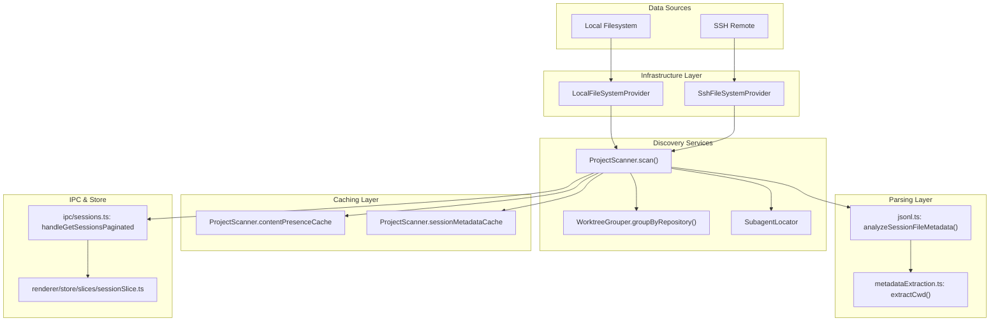
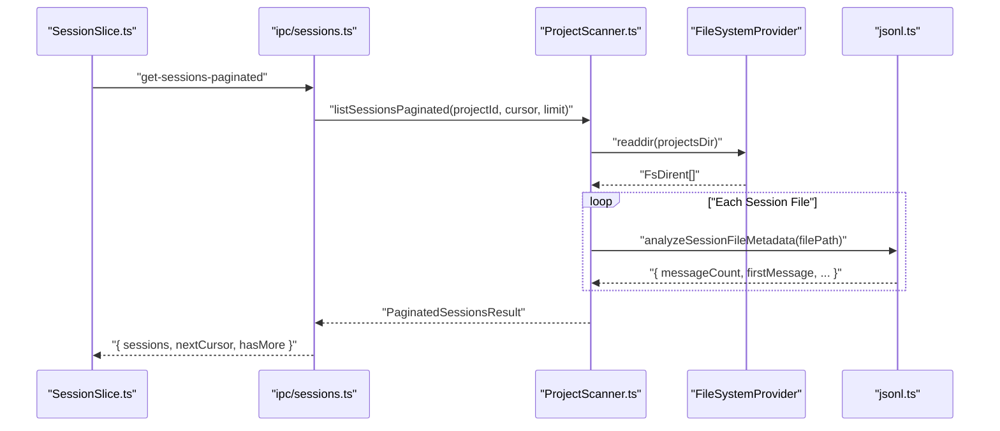

# Session Discovery & Parsing

<details>
<summary>Relevant source files</summary>

The following files were used as context for generating this wiki page:

- [src/main/http/sessions.ts](src/main/http/sessions.ts)
- [src/main/ipc/sessions.ts](src/main/ipc/sessions.ts)
- [src/main/services/discovery/ProjectScanner.ts](src/main/services/discovery/ProjectScanner.ts)
- [src/main/types/domain.ts](src/main/types/domain.ts)
- [src/main/types/messages.ts](src/main/types/messages.ts)
- [src/main/utils/jsonl.ts](src/main/utils/jsonl.ts)
- [src/renderer/components/sidebar/SessionItem.tsx](src/renderer/components/sidebar/SessionItem.tsx)
- [src/renderer/store/slices/sessionSlice.ts](src/renderer/store/slices/sessionSlice.ts)

</details>


## Purpose and Scope

This section describes how `claude-devtools` discovers, indexes, and parses Claude Code session files from the filesystem. It covers the overall discovery pipeline, directory structure conventions, and the transformation of raw JSONL files into structured session metadata displayed in the UI.

For detailed information about specific subsystems:
- **Project scanning implementation**: See [Project Scanner](#4.1)
- **Path encoding and composite project IDs**: See [Path Encoding & Project IDs](#4.2)
- **JSONL file format and parsing**: See [JSONL Parsing](#4.3)
- **Caching and performance optimization**: See [Caching Strategy](#4.4)
- **SSH remote access**: See [SSH Remote Access](#5)
- **Multi-context architecture**: See [Multi-Context System](#3.2)

**Sources**: [src/main/services/discovery/ProjectScanner.ts:1-16]()

---

## Overview

Session discovery is the process of scanning Claude Code's data directories (`~/.claude/projects/`) and transforming raw JSONL session files into structured metadata. The system supports three data sources:

1. **Local filesystem** - Standard `~/.claude/` directory.
2. **SSH remote** - Remote `~/.claude/` accessed via SFTP.
3. **WSL** - Windows Subsystem for Linux paths accessed via UNC paths.

The discovery pipeline consists of multiple stages: filesystem scanning, path decoding, session filtering, metadata extraction, and caching. All operations are abstracted through the `FileSystemProvider` interface [src/main/services/infrastructure/FileSystemProvider.ts](), allowing the same logic to work across local and remote contexts.

**Sources**: [src/main/services/discovery/ProjectScanner.ts:18-58](), [src/main/services/discovery/ProjectScanner.ts:116-156]()

---

## Claude Code Directory Structure

Claude Code stores session data in a predictable directory structure under `~/.claude/`:

```
~/.claude/
├── projects/
│   └── {encoded-path}/               # Project directory (encoded absolute path)
│       ├── {session-id}.jsonl        # Session file (JSONL format)
│       └── {session-id}/
│           └── subagents/            # Nested subagent sessions
│               └── {subagent-id}.jsonl
└── todos/
    └── {session-id}.json             # Task list data for session [src/main/services/discovery/ProjectScanner.ts:8]()
```

### Encoded Path Format

Project directories use a path encoding scheme where filesystem separators are replaced with dashes. This is handled by `pathDecoder.ts` [src/main/utils/pathDecoder.ts:1-44]().

| Original Path | Encoded Directory Name |
|--------------|------------------------|
| `/Users/username/project` | `-Users-username-project` |
| `C:\Users\username\project` | `-C:-Users-username-project` |

**Sources**: [src/main/utils/pathDecoder.ts:1-44](), [src/main/services/discovery/ProjectScanner.ts:5-10]()

---

## Discovery Pipeline Architecture

The following diagram shows the complete session discovery pipeline, from filesystem scanning to UI rendering:

### Discovery Pipeline: Code Entity Mapping


**Sources**: [src/main/services/discovery/ProjectScanner.ts:64-106](), [src/main/ipc/sessions.ts:105-134](), [src/renderer/store/slices/sessionSlice.ts:124-167]()

---

## Multi-Context Discovery

The discovery system supports multiple filesystem contexts through the `ServiceContextRegistry`. Each context (local or SSH) maintains its own `ProjectScanner` instance with an appropriate `FileSystemProvider`.

### Context Switching Logic
```mermaid
graph LR
    subgraph "Registry"
        Registry["ServiceContextRegistry.getActive()"]
    end
    
    subgraph "Local Context"
        L_Provider["LocalFileSystemProvider"]
        L_Scanner["ProjectScanner (local)"]
        Registry --> L_Scanner
        L_Scanner --> L_Provider
    end
    
    subgraph "SSH Context"
        S_Provider["SshFileSystemProvider"]
        S_Scanner["ProjectScanner (ssh)"]
        Registry --> S_Scanner
        S_Scanner --> S_Provider
    end
```

**Sources**: [src/main/ipc/sessions.ts:121-122](), [src/main/services/discovery/ProjectScanner.ts:145-151]()

---

## Key Components

### ProjectScanner

The `ProjectScanner` class is the primary orchestrator for session discovery [src/main/services/discovery/ProjectScanner.ts:64]().

| Component | Responsibility | Key Methods |
|-----------|---------------|-------------|
| `ProjectScanner` | Orchestrates discovery pipeline | `scan()`, `listSessions()`, `listSessionsPaginated()` |
| `WorktreeGrouper` | Groups git worktrees | `groupByRepository()` |
| `SubagentLocator` | Detects nested subagent files | `findSubagentFiles()` |
| `SessionSearcher` | Cross-session text search | `searchSessions()` |

The scanner maintains three in-memory caches to optimize repeated access: `contentPresenceCache`, `sessionMetadataCache`, and `sessionPreviewCache` [src/main/services/discovery/ProjectScanner.ts:67-82]().

**Sources**: [src/main/services/discovery/ProjectScanner.ts:64-106](), [src/main/services/discovery/ProjectScanner.ts:173-188]()

---

## Session Discovery Flow

The flow from file detection to UI rendering:



**Sources**: [src/main/ipc/sessions.ts:105-134](), [src/renderer/store/slices/sessionSlice.ts:124-167](), [src/main/utils/jsonl.ts:52-82]()

---

## Metadata Levels

The scanner supports two metadata extraction modes to optimize performance, especially for SSH:

### Deep Metadata (`metadataLevel: 'deep'`)
- Full JSONL file parsing via `analyzeSessionFileMetadata`.
- Extracts: `firstMessage`, `messageCount`, `gitBranch`, `contextConsumption` [src/main/types/domain.ts:81-112]().
- Used by default for local filesystem.

### Light Metadata (`metadataLevel: 'light'`)
- Filesystem stats only (mtime, size).
- Extracts: First message preview via streaming read.
- Used by default for SSH connections to reduce latency [src/main/ipc/sessions.ts:178-185]().

**Sources**: [src/main/services/discovery/ProjectScanner.ts:25-28](), [src/main/ipc/sessions.ts:177-186](), [src/main/types/domain.ts:65-112]()

---

## Noise Filtering

The discovery pipeline filters out sessions that contain only "noise" messages (internal metadata and tool output). This is handled by `SessionContentFilter` [src/main/services/discovery/SessionContentFilter.ts]().

1. Streams JSONL files line-by-line using `readline` [src/main/utils/jsonl.ts:63-66]().
2. Skips messages with system-only tags like `<local-command-stdout>` [src/main/types/messages.ts:178-182]().
3. Sessions without user-visible messages are excluded from the UI.

**Sources**: [src/main/utils/jsonl.ts:10-28](), [src/main/types/messages.ts:165-210]()

---

## Pagination Strategy

The scanner implements cursor-based pagination to handle projects with thousands of sessions:

1. **Initial Load**: `fetchSessionsInitial` fetches the first 20 sessions [src/renderer/store/slices/sessionSlice.ts:124-134]().
2. **Cursor Generation**: The backend returns a `nextCursor` for the next page [src/main/ipc/sessions.ts:118-129]().
3. **Next Page**: `fetchSessionsMore` uses the cursor to fetch subsequent batches [src/renderer/store/slices/sessionSlice.ts:170-185]().

**Sources**: [src/renderer/store/slices/sessionSlice.ts:124-200](), [src/main/ipc/sessions.ts:105-134]()

---

## Real-Time Updates

The system guarantees last-write-wins under rapid file changes using generation tracking.

1. Renderer calls `refreshSessionsInPlace(projectId)` [src/renderer/store/slices/sessionSlice.ts:54]().
2. `projectRefreshGeneration` map tracks the latest request per project [src/renderer/store/slices/sessionSlice.ts:18]().
3. Stale responses from the filesystem are discarded if a newer generation has started.

**Sources**: [src/renderer/store/slices/sessionSlice.ts:15-18](), [src/renderer/store/slices/sessionSlice.ts:54]()
