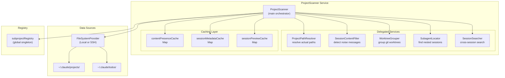
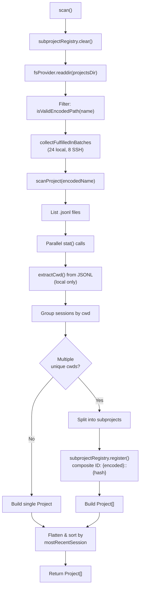
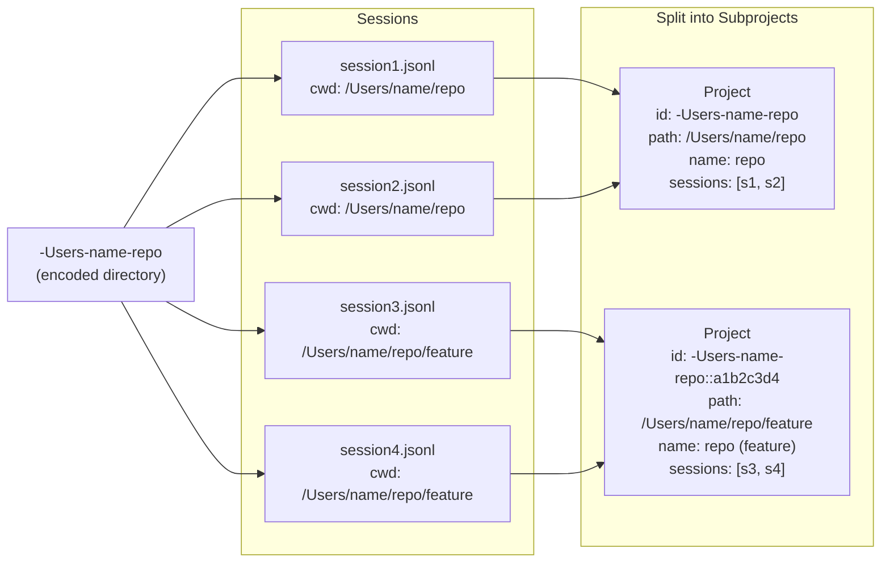
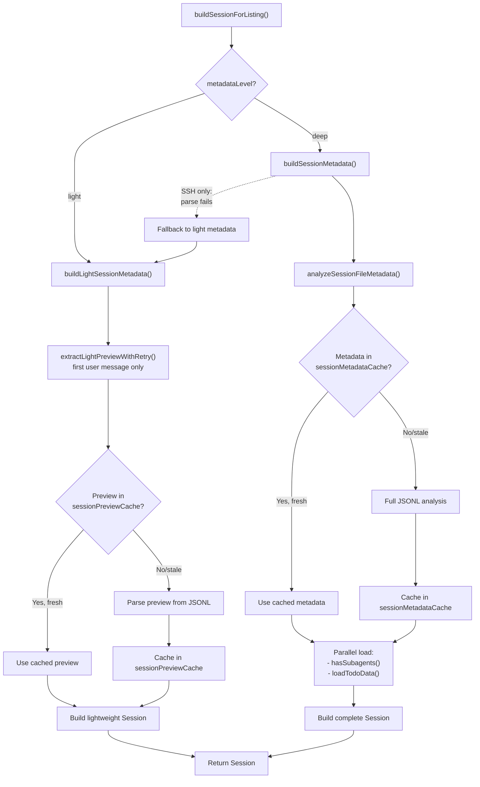
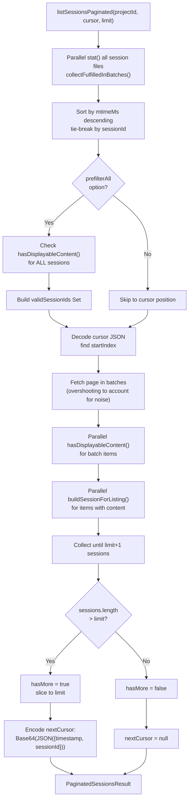
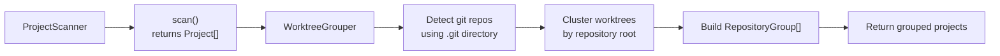
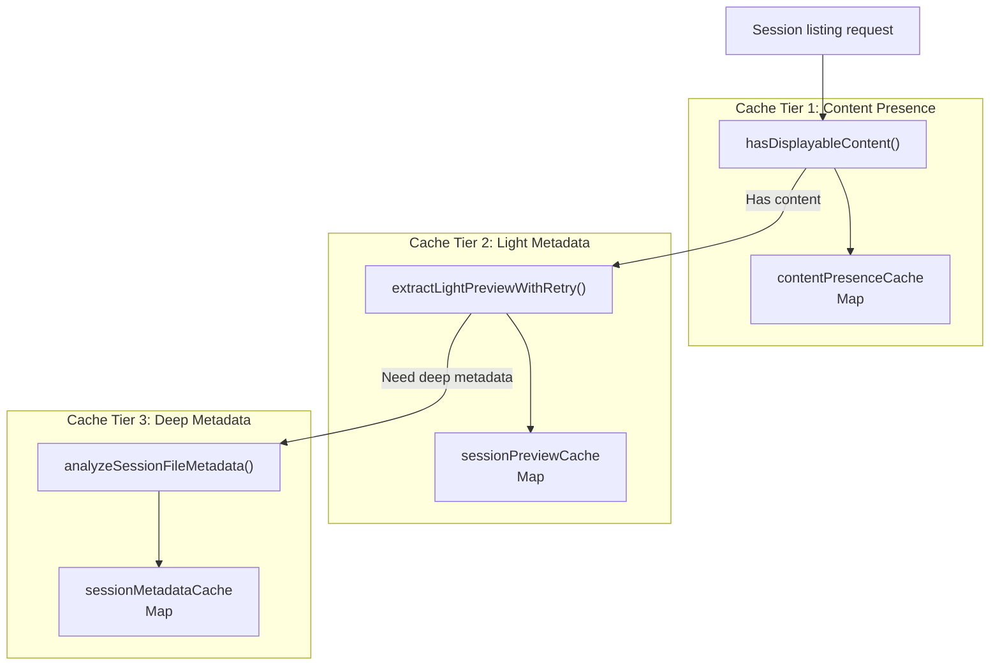
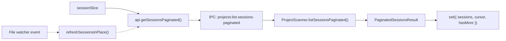

# Project Scanner

<details>
<summary>Relevant source files</summary>

The following files were used as context for generating this wiki page:

- [src/main/ipc/utility.ts](src/main/ipc/utility.ts)
- [src/main/services/discovery/ProjectScanner.ts](src/main/services/discovery/ProjectScanner.ts)
- [src/main/services/discovery/SearchTextExtractor.ts](src/main/services/discovery/SearchTextExtractor.ts)
- [src/main/services/discovery/SubagentLocator.ts](src/main/services/discovery/SubagentLocator.ts)
- [src/main/services/discovery/WorktreeGrouper.ts](src/main/services/discovery/WorktreeGrouper.ts)
- [src/main/services/discovery/index.ts](src/main/services/discovery/index.ts)
- [src/main/services/parsing/GitIdentityResolver.ts](src/main/services/parsing/GitIdentityResolver.ts)
- [src/renderer/components/sidebar/SessionItem.tsx](src/renderer/components/sidebar/SessionItem.tsx)
- [src/renderer/store/slices/sessionSlice.ts](src/renderer/store/slices/sessionSlice.ts)
- [test/main/services/discovery/ProjectScanner.cwdSplit.test.ts](test/main/services/discovery/ProjectScanner.cwdSplit.test.ts)
- [test/main/services/discovery/SearchTextCache.test.ts](test/main/services/discovery/SearchTextCache.test.ts)
- [test/main/services/discovery/SearchTextExtractor.test.ts](test/main/services/discovery/SearchTextExtractor.test.ts)

</details>


The `ProjectScanner` service is responsible for discovering and indexing Claude Code session files from the `~/.claude/projects/` directory. It scans project directories, extracts session metadata, handles subproject splitting when sessions span multiple working directories, and provides paginated session listings with aggressive caching for SSH performance.

For information about the path encoding scheme used by Claude Code, see [Path Encoding & Project IDs](4.2). For details about parsing individual session files, see [JSONL Parsing](4.3). For the multi-tier caching architecture, see [Caching Strategy](4.4).

**Sources**: [src/main/services/discovery/ProjectScanner.ts:1-16]()

## Directory Structure

Claude Code stores session data in a specific directory structure under `~/.claude/`:

```
~/.claude/
├── projects/              # Project directories (encoded paths)
│   ├── -Users-name-app/   # Encoded path: /Users/name/app
│   │   ├── session1.jsonl
│   │   ├── session2.jsonl
│   │   └── session3/
│   │       └── subagents/ # Nested session files
│   └── -home-user-repo/   # Another project
│       └── abc123.jsonl
└── todos/                 # Task list data
    └── session1.json
```

The `ProjectScanner` reads from both `projectsDir` (`~/.claude/projects/`) and `todosDir` (`~/.claude/todos/`) to build complete session metadata.

**Sources**: [src/main/services/discovery/ProjectScanner.ts:96-106](), [src/main/utils/pathDecoder.ts:41-42]()

## Core Architecture



**Sources**: [src/main/services/discovery/ProjectScanner.ts:64-106]()

## Project Discovery Workflow

### Main Scanning Flow



The `scan()` method orchestrates project discovery by reading all directories in `~/.claude/projects/`, filtering for valid encoded paths, and processing each directory to extract project metadata. Sessions within a project directory are grouped by their `cwd` (current working directory), and projects with multiple unique `cwd` values are split into subprojects with composite IDs.

**Sources**: [src/main/services/discovery/ProjectScanner.ts:116-156](), [src/main/services/discovery/ProjectScanner.ts:205-365]()

### Subproject Splitting

When a project directory contains sessions with different `cwd` values, `ProjectScanner` splits them into separate logical projects. This handles cases where Claude Code sessions run in different worktrees or subdirectories of the same repository.



Composite project IDs follow the format `{encodedPath}::{8-char-hex}`, where the hash is derived from the actual `cwd` path. The `subprojectRegistry` maintains mappings between composite IDs and their session sets.

**Sources**: [src/main/services/discovery/ProjectScanner.ts:264-359](), [src/main/services/discovery/SubprojectRegistry.ts:1-100]()

## Session Metadata Extraction

### Metadata Levels

`ProjectScanner` supports two metadata extraction levels optimized for different contexts:

| Level | Mode | Parsing Depth | Use Case |
|-------|------|---------------|----------|
| `light` | SSH | Filesystem stats + first message preview | Fast listing over network |
| `deep` | Local | Full JSONL analysis + subagent detection | Complete metadata with context stats |

**Sources**: [src/main/services/discovery/ProjectScanner.ts:404-408](), [src/main/services/discovery/ProjectScanner.ts:491-492]()

### Session Building Pipeline



The caching system uses file modification time (`mtimeMs`) and size as cache keys to detect stale entries. Cache invalidation is automatic when files change.

**Sources**: [src/main/services/discovery/ProjectScanner.ts:712-876](), [src/main/services/discovery/ProjectScanner.ts:67-82]()

## Pagination System

### Cursor-Based Pagination

`listSessionsPaginated()` implements efficient cursor-based pagination for large session lists. The cursor encodes the last item's timestamp and session ID to enable stateless pagination.



The cursor format is Base64-encoded JSON containing `{timestamp: number, sessionId: string}`. This enables deterministic pagination even when sessions are added or removed during iteration.

**Sources**: [src/main/services/discovery/ProjectScanner.ts:477-707](), [src/main/types.ts:115-130]()

### Noise Filtering

Sessions containing only "noise messages" (internal system messages with no user-visible content) are filtered from listings:

```typescript
// Example noise detection flow
const hasContent = await this.hasDisplayableContent(
  filePath,
  prefetchedMtimeMs,
  prefetchedSize
);
if (!hasContent) {
  return null; // Filter out noise-only session
}
```

The `hasDisplayableContent()` method delegates to `SessionContentFilter.hasDisplayableContent()`, which checks the `contentPresenceCache` first, then parses the JSONL file if needed.

**Sources**: [src/main/services/discovery/ProjectScanner.ts:430-440](), [src/main/services/discovery/SessionContentFilter.ts:31-50]()

## Delegated Services

`ProjectScanner` delegates specialized operations to five service classes:

### Service Responsibilities

| Service | Purpose | Key Methods |
|---------|---------|-------------|
| `ProjectPathResolver` | Resolve actual filesystem paths from encoded names | `resolveProjectPath()` |
| `SessionContentFilter` | Detect noise-only sessions | `hasDisplayableContent()` |
| `WorktreeGrouper` | Group projects by git repository | `groupByRepository()` |
| `SubagentLocator` | Find nested subagent session files | `hasSubagents()`, `listSubagentFiles()` |
| `SessionSearcher` | Cross-session full-text search | `search()` |

**Sources**: [src/main/services/discovery/ProjectScanner.ts:87-106]()

### Repository Grouping

The `scanWithWorktreeGrouping()` method delegates to `WorktreeGrouper` to cluster projects by their git repository:



Each `RepositoryGroup` contains one or more worktrees. Non-git projects are represented as single-worktree groups.

**Sources**: [src/main/services/discovery/ProjectScanner.ts:173-188](), [src/main/services/discovery/WorktreeGrouper.ts:52-194]()

## Caching Architecture

### Three-Tier Cache System



All caches use `(mtimeMs, size)` tuples as cache validity keys. When a file changes, its `mtimeMs` changes, causing cache misses and re-parsing.

**Sources**: [src/main/services/discovery/ProjectScanner.ts:67-82]()

### Cache Invalidation

Caches are in-memory and never explicitly cleared. Stale entries are detected by comparing cached `mtimeMs` and `size` against current file stats:

```typescript
const cachedMetadata = this.sessionMetadataCache.get(filePath);
const metadata =
  cachedMetadata?.mtimeMs === effectiveMtime && cachedMetadata.size === effectiveSize
    ? cachedMetadata.metadata
    : await analyzeSessionFileMetadata(filePath, this.fsProvider);
```

This approach ensures cache freshness without manual invalidation logic.

**Sources**: [src/main/services/discovery/ProjectScanner.ts:729-739]()

## SSH Optimization Strategies

### Batch Parallel Processing

SSH operations have high latency but can process multiple requests concurrently. `ProjectScanner` uses batch processing via `collectFulfilledInBatches()` to parallelize file operations:

```typescript
const sessionInfos = await this.collectFulfilledInBatches(
  sessionFiles,
  this.fsProvider.type === 'ssh' ? 32 : 128,  // Lower batch size for SSH
  async (file) => {
    const filePath = path.join(projectPath, file.name);
    const { mtimeMs, birthtimeMs } = await this.resolveFileDetails(file, filePath);
    // ... process file
  }
);
```

Batch sizes are tuned per operation type:

| Operation | SSH Batch Size | Local Batch Size |
|-----------|----------------|------------------|
| Project scan | 8 | 24 |
| Session stat | 32-48 | 128-200 |
| Session build | 4 | 16 |

**Sources**: [src/main/services/discovery/ProjectScanner.ts:135-139](), [src/main/services/discovery/ProjectScanner.ts:518-534]()

### Metadata Level Fallback

When deep metadata parsing fails over SSH (due to network issues or corrupted files), `buildSessionForListing()` falls back to light metadata instead of dropping the session:

```typescript
try {
  return await this.buildSessionMetadata(/* deep metadata */);
} catch (error) {
  if (this.fsProvider.type !== 'ssh') {
    throw error;  // Local failures should propagate
  }
  logger.debug(`SSH metadata parse failed for ${sessionId}, using light fallback`);
  return this.buildLightSessionMetadata(/* light metadata */);
}
```

This ensures sessions remain visible even with transient network failures.

**Sources**: [src/main/services/discovery/ProjectScanner.ts:849-875]()

### CWD Extraction Skipping

Over SSH, `scanProject()` skips extracting `cwd` from JSONL files during project discovery to avoid reading file bodies:

```typescript
const shouldSplitByCwd = this.fsProvider.type !== 'ssh';
// Over SSH, avoid reading every file body during project discovery
if (shouldSplitByCwd) {
  try {
    cwd = await extractCwd(filePath, this.fsProvider);
  } catch {
    // Ignore unreadable files
  }
}
```

This trades subproject splitting accuracy for dramatically faster SSH scans.

**Sources**: [src/main/services/discovery/ProjectScanner.ts:232-248]()

## Integration with Store

The renderer process consumes `ProjectScanner` results via the `sessionSlice`:



The `refreshSessionsInPlace()` method updates session listings without loading states, enabling real-time updates when new sessions are added or modified.

**Sources**: [src/renderer/store/slices/sessionSlice.ts:216-254]()

## Public API Methods

### Core Methods

| Method | Purpose | Returns |
|--------|---------|---------|
| `scan()` | Scan all projects | `Promise<Project[]>` |
| `scanWithWorktreeGrouping()` | Scan with git repository grouping | `Promise<RepositoryGroup[]>` |
| `getProject(projectId)` | Get single project metadata | `Promise<Project \| null>` |
| `listSessions(projectId)` | List all sessions for project | `Promise<Session[]>` |
| `listSessionsPaginated(projectId, cursor, limit)` | Paginated session listing | `Promise<PaginatedSessionsResult>` |
| `getSession(projectId, sessionId)` | Get single session metadata | `Promise<Session \| null>` |

### Utility Methods

| Method | Purpose | Returns |
|--------|---------|---------|
| `getSessionPath(projectId, sessionId)` | Build session file path | `string` |
| `listSessionFiles(projectId)` | List all session file paths | `Promise<string[]>` |
| `hasSubagents(projectId, sessionId)` | Check for nested sessions | `Promise<boolean>` |
| `loadTodoData(sessionId)` | Load task list data | `Promise<unknown>` |

**Sources**: [src/main/services/discovery/ProjectScanner.ts:116-1100]()
