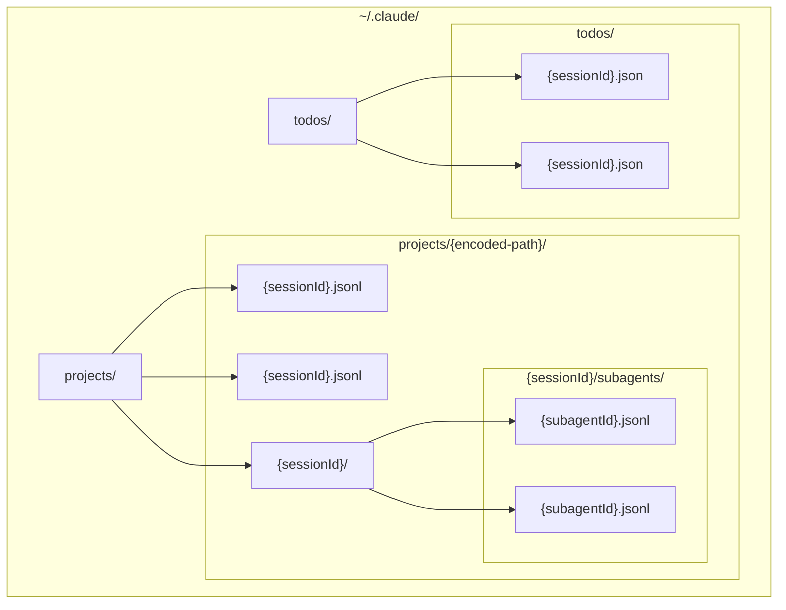
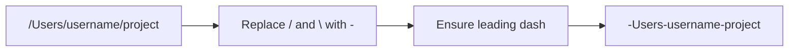
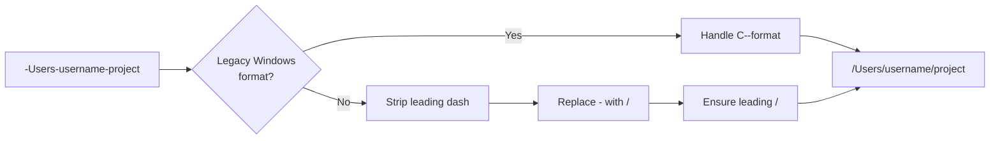
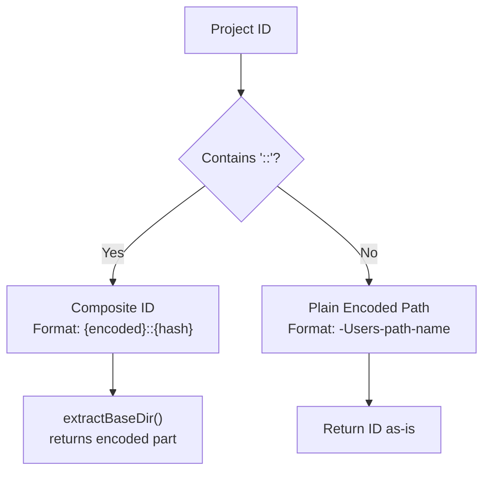
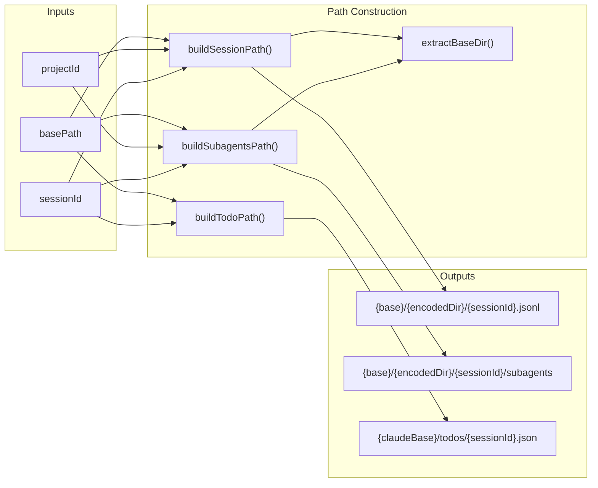
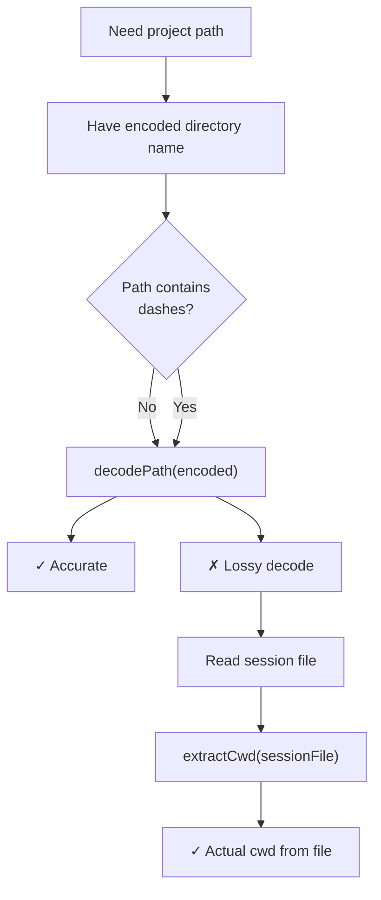

# Path Encoding & Project IDs

<details>
<summary>Relevant source files</summary>

The following files were used as context for generating this wiki page:

- [.github/workflows/ci.yml](.github/workflows/ci.yml)
- [src/main/ipc/config.ts](src/main/ipc/config.ts)
- [src/main/services/error/ErrorTriggerChecker.ts](src/main/services/error/ErrorTriggerChecker.ts)
- [src/main/utils/metadataExtraction.ts](src/main/utils/metadataExtraction.ts)
- [src/main/utils/pathDecoder.ts](src/main/utils/pathDecoder.ts)
- [src/main/utils/pathValidation.ts](src/main/utils/pathValidation.ts)
- [src/renderer/components/chat/ChatHistoryLoadingState.tsx](src/renderer/components/chat/ChatHistoryLoadingState.tsx)
- [src/renderer/components/notifications/NotificationRow.tsx](src/renderer/components/notifications/NotificationRow.tsx)
- [src/renderer/index.html](src/renderer/index.html)
- [test/main/ipc/guards.test.ts](test/main/ipc/guards.test.ts)
- [test/main/services/discovery/ProjectPathResolver.test.ts](test/main/services/discovery/ProjectPathResolver.test.ts)
- [test/main/utils/pathDecoder.test.ts](test/main/utils/pathDecoder.test.ts)
- [test/main/utils/pathValidation.test.ts](test/main/utils/pathValidation.test.ts)
- [test/mocks/electronAPI.ts](test/mocks/electronAPI.ts)

</details>


This page documents the path encoding system used by Claude Code to organize session files in the filesystem, and how `claude-devtools` decodes these paths to reconstruct project metadata. This includes the encoding/decoding algorithms, composite project ID format for subprojects, validation patterns, and path construction utilities.

For information about scanning and discovering these encoded directories, see [Project Scanner](). For details on parsing the session files within these directories, see [JSONL Parsing]().

## Purpose and Scope

Claude Code stores all session data in the `~/.claude/` directory. Project directories are encoded by transforming absolute filesystem paths (e.g., `/Users/username/myproject`) into dash-separated directory names (e.g., `-Users-username-myproject`). This encoding is **lossy** for paths containing dashes, requiring fallback mechanisms to recover the original path.

This page covers:
- The directory structure used by Claude Code
- The encoding/decoding algorithm and its limitations
- Composite project IDs for multi-cwd projects
- Validation patterns for encoded paths and project IDs
- Path construction utilities for session files, subagents, and todos

## Claude Directory Structure

Claude Code organizes session data in a well-defined directory hierarchy under `~/.claude/`.

**Claude Directory Hierarchy**


**Directory Structure Example:**
```
~/.claude/
├── projects/
│   ├── -Users-matt-myproject/
│   │   ├── abc123.jsonl           # Session file
│   │   ├── def456.jsonl           # Session file
│   │   └── abc123/                # Session-specific directory
│   │       └── subagents/
│   │           ├── sub1.jsonl     # Subagent session
│   │           └── sub2.jsonl     # Subagent session
│   └── -home-user-another-project/
│       └── xyz789.jsonl
└── todos/
    ├── abc123.json                # Task list for session abc123
    └── def456.json
```

**Sources:** [src/main/utils/pathDecoder.ts:236-309]()

## Path Encoding Algorithm

The encoding algorithm transforms absolute filesystem paths into directory names by replacing all path separators (`/` and `\`) with dashes (`-`).

### Encoding Function

**Path to Encoded Name Flow**


**Encoding Process:**
1. Replace all forward slashes (`/`) and backslashes (`\`) with dashes (`-`) [src/main/utils/pathDecoder.ts:32-32]().
2. Ensure the result starts with a dash to indicate an absolute path [src/main/utils/pathDecoder.ts:35-35]().

**Function:** `encodePath(absolutePath: string): string` [src/main/utils/pathDecoder.ts:27-36]()

**Examples:**
| Input Path | Encoded Directory Name |
|-----------|----------------------|
| `/Users/username/projectname` | `-Users-username-projectname` |
| `C:\Users\username\projectname` | `-C:-Users-username-projectname` |
| `/home/user/projects/myapp` | `-home-user-projects-myapp` |

**Sources:** [src/main/utils/pathDecoder.ts:20-36](), [test/main/utils/pathDecoder.test.ts:18-44]()

### Decoding Function

The decoding process reverses the encoding, but **cannot accurately restore paths containing dashes** in directory names [src/main/utils/pathDecoder.ts:11-14]().

**Encoded Name to Path Flow**


**Decoding Process:**
1. Check for legacy Windows format (`C--Users-...`) where drive separator is encoded as `--` [src/main/utils/pathDecoder.ts:50-58]().
2. Remove leading dash [src/main/utils/pathDecoder.ts:61-61]().
3. Replace all dashes with forward slashes [src/main/utils/pathDecoder.ts:64-64]().
4. Ensure leading slash for POSIX paths (unless Windows drive detected) [src/main/utils/pathDecoder.ts:71-72]().
5. Translate WSL mount paths (e.g., `/mnt/c/...`) to Windows drive letters if running on Windows [src/main/utils/pathDecoder.ts:75-75]().

**Function:** `decodePath(encodedName: string): string` [src/main/utils/pathDecoder.ts:45-76]()

**Lossiness Example:**
```
Original path:    /Users/matt/claude-devtools
Encoded:          -Users-matt-claude-devtools
Decoded (lossy):  /Users/matt/claude/devtools  ❌ Incorrect!
```

**Sources:** [src/main/utils/pathDecoder.ts:38-76](), [test/main/utils/pathDecoder.test.ts:46-82]()

### Extracting Project Names

The `extractProjectName` function extracts the last path segment from an encoded directory name. It supports a `cwdHint` parameter to avoid lossiness [src/main/utils/pathDecoder.ts:84-95]().

**Function Signature:**
```typescript
extractProjectName(encodedName: string, cwdHint?: string): string
```

**Logic:**
1. If `cwdHint` is provided (actual filesystem path), extract the last segment by splitting on separators [src/main/utils/pathDecoder.ts:87-91]().
2. Otherwise, decode the encoded name and extract the last segment [src/main/utils/pathDecoder.ts:92-94]().
3. Return the extracted name or fall back to the encoded name [src/main/utils/pathDecoder.ts:94-94]().

**Sources:** [src/main/utils/pathDecoder.ts:79-95](), [test/main/utils/pathDecoder.test.ts:105-112]()

## Composite Project IDs

When sessions within a single encoded directory have different `cwd` values, the system splits them into multiple logical projects using **composite IDs**.

### Composite ID Format

```
{encodedPath}::{8-char-hex-hash}
```

**Components:**
- **Base Directory:** The encoded path (e.g., `-Users-matt-workspace`).
- **Separator:** Double colon (`::`).
- **Hash Suffix:** 8-character hex hash derived from the `cwd` path.

### ID Type Decision Tree



**Functions:**
- `extractBaseDir(projectId: string): string` - Extracts the base encoded path from a composite ID [src/main/utils/pathDecoder.ts:192-198]().
- `isValidProjectId(projectId: string): boolean` - Validates the format of both plain and composite IDs [src/main/utils/pathDecoder.ts:169-185]().

**Sources:** [src/main/utils/pathDecoder.ts:169-198](), [test/main/ipc/guards.test.ts:12-33]()

## Path Validation

### Encoded Path Validation

The `isValidEncodedPath` function validates that directory names follow the Claude encoding pattern [src/main/utils/pathDecoder.ts:124-160]().

**Validation Rules:**
1. Must start with a dash (`-`) OR match legacy Windows format (`C--...`) [src/main/utils/pathDecoder.ts:131-137]().
2. Allow only alphanumeric, underscores, dots, spaces, and dashes [src/main/utils/pathDecoder.ts:142-143]().
3. Allow single colon (`:`) only for Windows drives immediately after leading dash (e.g., `-C:-...`) [src/main/utils/pathDecoder.ts:150-159]().

**Valid Examples:**
- `-Users-username-projectname` ✓
- `-C:-Users-username-projectname` ✓ (Windows)
- `C--Users-username-projectname` ✓ (legacy Windows)

**Sources:** [src/main/utils/pathDecoder.ts:119-160](), [test/main/utils/pathDecoder.test.ts:119-160]()

## Path Construction Utilities

The `pathDecoder` module provides utility functions for constructing full paths to session files, subagents, and todos.

### Path Construction Logic



### Function Signatures

| Function | Purpose | Signature |
|----------|---------|-----------|
| `buildSessionPath` | Path to session JSONL file | `(basePath, projectId, sessionId) => string` [src/main/utils/pathDecoder.ts:216-223]() |
| `buildSubagentsPath` | Path to subagents directory | `(basePath, projectId, sessionId) => string` [src/main/utils/pathDecoder.ts:228-234]() |
| `buildTodoPath` | Path to task list JSON file | `(claudeBasePath, sessionId) => string` [src/main/utils/pathDecoder.ts:239-242]() |

**Sources:** [src/main/utils/pathDecoder.ts:216-242](), [test/main/utils/pathDecoder.test.ts:182-210]()

## Base Path Configuration

The system provides functions to get and configure the Claude base directory paths, including support for WSL.

**Functions:**
- `getClaudeBasePath()`: Returns the current base path, prioritizing manual overrides (e.g., for WSL) [src/main/utils/pathDecoder.ts:258-261]().
- `getProjectsBasePath()`: Returns the absolute path to the `projects` directory [src/main/utils/pathDecoder.ts:276-278]().
- `getTodosBasePath()`: Returns the absolute path to the `todos` directory [src/main/utils/pathDecoder.ts:283-285]().
- `translateWslMountPath(posixPath)`: Converts `/mnt/X/...` to `X:/...` when running on Windows [src/main/utils/pathDecoder.ts:101-112]().

**Sources:** [src/main/utils/pathDecoder.ts:258-309](), [src/main/ipc/config.ts:117-120]()

## Metadata Extraction & CWD Fallback

The encoding algorithm is lossy for paths containing dashes. `claude-devtools` addresses this by reading the actual `cwd` field from the first message in session JSONL files.

### Resolution Strategy



### ProjectPathResolver

The `ProjectPathResolver` service (used by `ProjectScanner`) handles path resolution with `cwd` fallback.

**Method:** `resolveProjectPath(projectId: string, options?: { cwdHint?: string })`

**Resolution Steps:**
1. If a `cwdHint` is provided, it is used directly as the project path [test/main/services/discovery/ProjectPathResolver.test.ts:34-44]().
2. Otherwise, the resolver attempts to read the `cwd` from the first line of the first session file in the project directory [test/main/services/discovery/ProjectPathResolver.test.ts:46-61]().
3. If no sessions exist, it falls back to the lossy `decodePath()` result [test/main/services/discovery/ProjectPathResolver.test.ts:63-71]().

**Function:** `extractCwd(filePath, fsProvider)` [src/main/utils/metadataExtraction.ts:41-75]()
- Reads the JSONL file line-by-line using `readline`.
- Parses the first entry containing a `cwd` field.
- Normalizes drive letters and translates WSL paths [src/main/utils/metadataExtraction.ts:64-64]().

**Sources:** [src/main/utils/metadataExtraction.ts:41-75](), [test/main/services/discovery/ProjectPathResolver.test.ts:1-95]()
