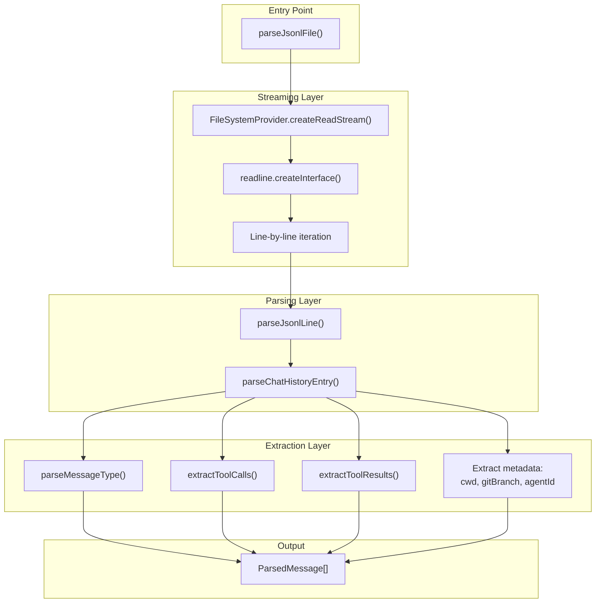
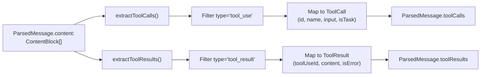
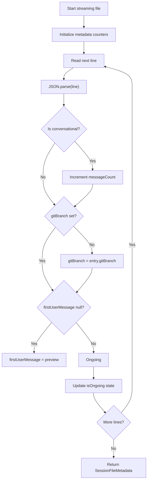

# JSONL Parsing

<details>
<summary>Relevant source files</summary>

The following files were used as context for generating this wiki page:

- [public/demo.mp4](public/demo.mp4)
- [public/icon.png](public/icon.png)
- [resources/demo.mp4](resources/demo.mp4)
- [src/main/services/discovery/SubagentResolver.ts](src/main/services/discovery/SubagentResolver.ts)
- [src/main/services/parsing/ClaudeMdReader.ts](src/main/services/parsing/ClaudeMdReader.ts)
- [src/main/services/parsing/SessionParser.ts](src/main/services/parsing/SessionParser.ts)
- [src/main/types/messages.ts](src/main/types/messages.ts)
- [src/main/utils/jsonl.ts](src/main/utils/jsonl.ts)
- [test/main/services/parsing/SessionParser.test.ts](test/main/services/parsing/SessionParser.test.ts)
- [test/main/utils/jsonl.test.ts](test/main/utils/jsonl.test.ts)

</details>


## Purpose and Scope

This page describes how `claude-devtools` parses Claude Code session files, which are stored in JSONL (JSON Lines) format. It covers the streaming parsing pipeline, message type handling, metadata extraction, and session state detection.

For information about how sessions are discovered and indexed, see [Project Scanner [4.1]](). For details on path encoding and project IDs, see [Path Encoding & Project IDs [4.2]](). For caching strategies that optimize repeated parsing, see [Caching Strategy [4.4]]().

---

## JSONL File Format

Claude Code sessions are stored as `.jsonl` files in the `~/.claude/projects/` directory. Each file contains one JSON object per line, representing a chat history entry.

**Format characteristics:**
- One complete JSON object per line [src/main/utils/jsonl.ts:4-5]()
- No trailing commas between lines [src/main/utils/jsonl.ts:6]()
- Empty lines are skipped during parsing [src/main/utils/jsonl.ts:7]()
- UTF-8 encoding [src/main/utils/jsonl.ts:62]()

**File location pattern:**
```
~/.claude/projects/{encoded-project-path}/{session-id}.jsonl
```

Each line represents a `ChatHistoryEntry` which can be one of several types:
- `user` - User messages and tool results [src/main/utils/jsonl.ts:143-152]()
- `assistant` - AI responses with usage and tool calls [src/main/utils/jsonl.ts:153-159]()
- `system` - System messages (meta information) [src/main/utils/jsonl.ts:160-162]()
- `summary` - Conversation summaries [src/main/utils/jsonl.ts:207-208]()
- `file-history-snapshot` - File system state snapshots [src/main/utils/jsonl.ts:209-210]()
- `queue-operation` - Operation queue entries [src/main/utils/jsonl.ts:211-212]()

**Sources:** [src/main/utils/jsonl.ts:1-8](), [src/main/utils/jsonl.ts:199-217](), [src/main/types/messages.ts:63-108]()

---

## Core Parsing Pipeline

### Streaming Architecture

The parser uses Node.js `readline` to stream files line-by-line, avoiding memory overhead for large session files. This is implemented in `parseJsonlFile`.

**Parsing Flow Diagram:**



**Sources:** [src/main/utils/jsonl.ts:52-82](), [src/main/utils/jsonl.ts:88-95]()

### Key Parsing Classes and Functions

The `SessionParser` class provides the high-level interface for parsing, while `jsonl.ts` contains the utility logic.

| Entity | File | Purpose |
|----------|---------|---------|
| `SessionParser` | [src/main/services/parsing/SessionParser.ts:54]() | Service for high-level session data extraction and grouping. |
| `parseJsonlFile()` | [src/main/utils/jsonl.ts:52]() | Parse entire JSONL file via streaming. |
| `parseJsonlLine()` | [src/main/utils/jsonl.ts:88]() | Parse single JSON line into `ParsedMessage`. |
| `processMessages()` | [src/main/services/parsing/SessionParser.ts:84]() | Categorizes messages by type (realUser, internalUser, sidechain). |

**Sources:** [src/main/services/parsing/SessionParser.ts:54-139](), [src/main/utils/jsonl.ts:52-95]()

---

## Message Types and Structure

### ParsedMessage Structure

The `parseChatHistoryEntry()` function transforms raw JSONL entries into a normalized `ParsedMessage` format.

```typescript
export interface ParsedMessage {
  uuid: string;
  parentUuid: string | null;
  type: MessageType;
  timestamp: Date;
  role?: string;
  content: ContentBlock[] | string;
  usage?: TokenUsage;
  model?: string;
  cwd?: string;
  gitBranch?: string;
  agentId?: string;
  isSidechain: boolean;
  isMeta: boolean;
  userType?: string;
  toolCalls: ToolCall[];
  toolResults: ToolResult[];
  requestId?: string;
}
```

**Key parsing logic:**

1. **UUID validation** - Entries without `uuid` are skipped [src/main/utils/jsonl.ts:106-108]()
2. **Type filtering** - Unknown message types return `null` [src/main/utils/jsonl.ts:199-217]()
3. **Tool extraction** - Calls `extractToolCalls()` and `extractToolResults()` [src/main/utils/jsonl.ts:166-167]()
4. **Metadata copying** - Extracts `cwd`, `gitBranch`, `agentId` from conversational entries [src/main/utils/jsonl.ts:134-163]()

**Sources:** [src/main/utils/jsonl.ts:104-194](), [src/main/types/messages.ts:63-108]()

---

## Content Block and Tool Extraction

Assistant messages contain arrays of `ContentBlock` objects. `extractToolCalls` and `extractToolResults` (imported from `toolExtraction`) process these blocks.

**Tool Call Mapping:**

| Code Entity | Purpose |
|------------|---------|
| `ToolCall` | Extracted from assistant `tool_use` blocks [src/main/types/messages.ts:28-41]() |
| `ToolResult` | Extracted from user `tool_result` blocks [src/main/types/messages.ts:46-53]() |
| `isParsedRealUserMessage()` | Distinguishes human input from tool results [src/main/types/messages.ts:125-144]() |

**Tool Extraction Flow:**



**Sources:** [src/main/utils/jsonl.ts:166-167](), [src/main/types/messages.ts:25-53]()

---

## Metadata Extraction

### Efficient Session Metadata

The `analyzeSessionFileMetadata()` function performs a **single streaming pass** to extract key session information without parsing the entire conversation.

**Algorithm:**



**Ongoing Detection Logic:**
A session is marked `isOngoing: true` if there is activity (thinking, tool calls) following the last "ending event" (like `ExitPlanMode` or `shutdown_response`).

**Sources:** [src/main/utils/jsonl.ts:42](), [test/main/utils/jsonl.test.ts:139-184]()

---

## Metrics Calculation

The `calculateMetrics()` function aggregates token usage across all messages.

**Calculated metrics:**

| Metric | Source | Description |
|--------|--------|-------------|
| `inputTokens` | `usage.input_tokens` | Tokens in requests [test/main/utils/jsonl.test.ts:40-43]() |
| `outputTokens` | `usage.output_tokens` | Tokens in responses [test/main/utils/jsonl.test.ts:40-43]() |
| `cacheReadTokens` | `usage.cache_read_input_tokens` | Prompt cache hits [test/main/utils/jsonl.test.ts:75]() |
| `cacheCreationTokens` | `usage.cache_creation_input_tokens` | Prompt cache writes [test/main/utils/jsonl.test.ts:76]() |
| `durationMs` | Max - Min Timestamps | Session duration [test/main/utils/jsonl.test.ts:87-95]() |

**Sources:** [test/main/utils/jsonl.test.ts:27-137](), [src/main/services/parsing/SessionParser.ts:126]()

---

## Subagent Resolution

The `SubagentResolver` links `Task` tool calls in a parent session to their corresponding subagent JSONL files.

1. **Detection:** It scans the `{sessionId}/subagents/` directory [src/main/services/discovery/SubagentResolver.ts:45]().
2. **Parsing:** Each subagent file is parsed using `parseJsonlFile` [src/main/services/discovery/SubagentResolver.ts:91]().
3. **Filtering:** "Warmup" subagents (first message content is "Warmup") are discarded [src/main/services/discovery/SubagentResolver.ts:144-154]().
4. **Linking:** Subagents are matched to parent `Task` calls via `agentId` found in `tool_result` messages [src/main/services/discovery/SubagentResolver.ts:207-211]().

**Sources:** [src/main/services/discovery/SubagentResolver.ts:38-136](), [src/main/services/discovery/SubagentResolver.ts:144-154]()

---

## Error Handling

The parser is designed to be resilient to malformed files:
- **Skip Malformed Lines:** If `JSON.parse` fails on a specific line, it is logged and skipped [src/main/utils/jsonl.ts:71-79]().
- **Non-Existent Files:** If a file path is invalid, the parser returns an empty array rather than throwing [src/main/utils/jsonl.ts:58-60]().
- **Incomplete Metadata:** Metadata extraction uses optional chaining and fallbacks to handle missing fields in early session entries.

**Sources:** [src/main/utils/jsonl.ts:71-81](), [src/main/utils/jsonl.ts:58-60]()
