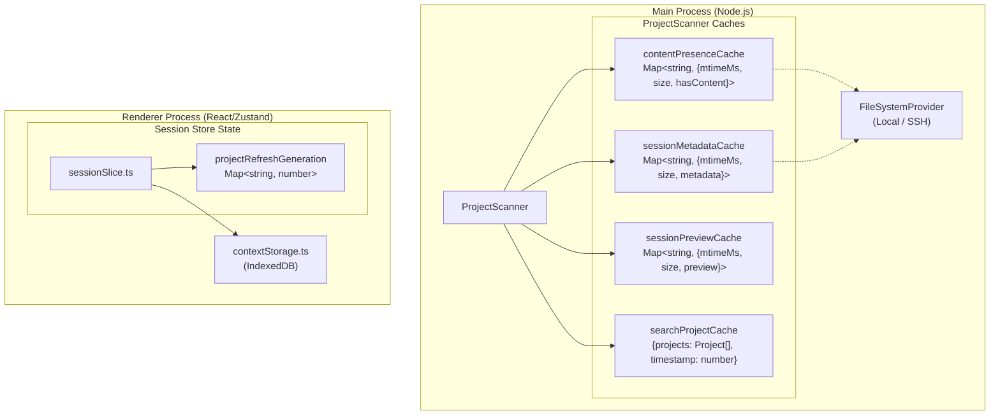
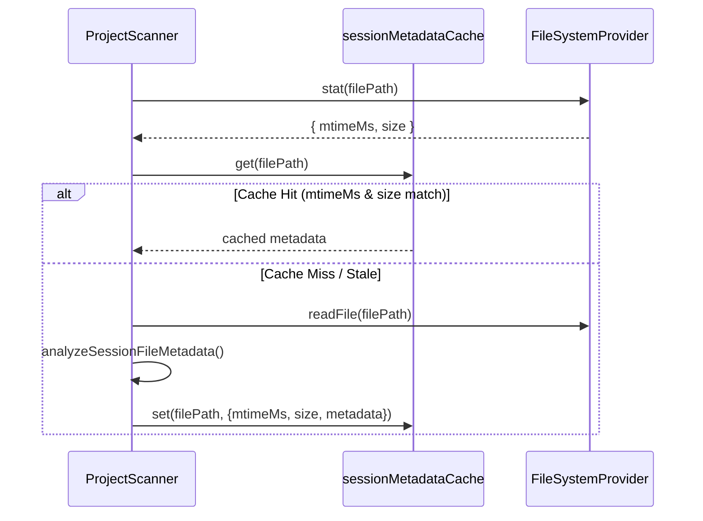
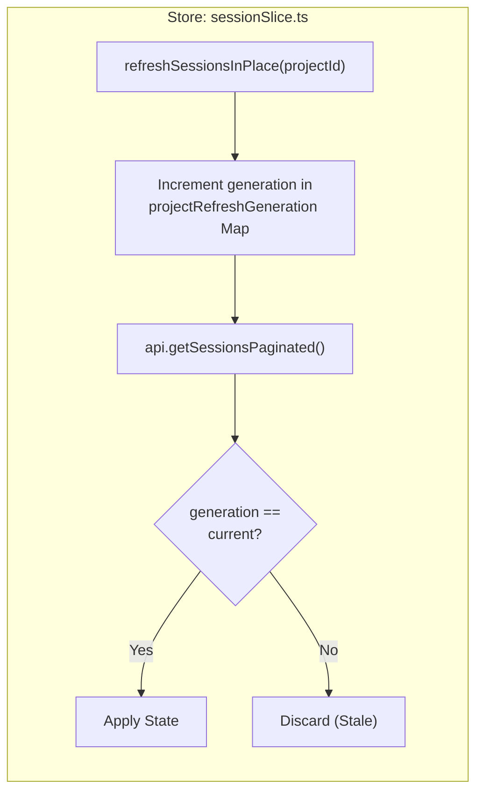

# Caching Strategy

Relevant source files

The following files were used as context for generating this wiki page:

- [src/main/services/discovery/ProjectPathResolver.ts](src/main/services/discovery/ProjectPathResolver.ts)
- [src/main/services/discovery/ProjectScanner.ts](src/main/services/discovery/ProjectScanner.ts)
- [src/main/services/infrastructure/DataCache.ts](src/main/services/infrastructure/DataCache.ts)
- [src/main/services/infrastructure/FileSystemProvider.ts](src/main/services/infrastructure/FileSystemProvider.ts)
- [src/main/services/infrastructure/FileWatcher.ts](src/main/services/infrastructure/FileWatcher.ts)
- [src/main/services/infrastructure/SshFileSystemProvider.ts](src/main/services/infrastructure/SshFileSystemProvider.ts)
- [src/renderer/components/sidebar/SessionItem.tsx](src/renderer/components/sidebar/SessionItem.tsx)
- [src/renderer/store/slices/sessionSlice.ts](src/renderer/store/slices/sessionSlice.ts)

This document describes the multi-tier caching architecture used throughout `claude-devtools` to optimize performance, particularly for SSH remote access scenarios. The caching system operates at multiple levels: in-memory file metadata caches in the main process, IndexedDB context snapshots in the renderer, and generation tracking to prevent stale data overwrites.

## Overview

The caching strategy addresses three performance challenges:

1.  **Repeated File System Access**: Session files (JSONL format) are read multiple times during pagination, real-time updates, and detail views.
2.  **SSH Latency**: Remote file operations over SFTP can take 100-500ms per file, making uncached access prohibitively slow [src/main/services/infrastructure/SshFileSystemProvider.ts:24-25]().
3.  **Context Switching**: Switching between local and SSH environments should be instantaneous, requiring full state preservation.

The solution uses complementary caching layers, each with distinct TTL policies and invalidation strategies.

Sources: [src/main/services/discovery/ProjectScanner.ts:1-16](), [src/main/services/infrastructure/SshFileSystemProvider.ts:23-27]()

## Multi-Tier Cache Architecture

The system bridges Natural Language requirements (fast UI, remote support) to Code Entities (specific `Map` objects and services).

### Architecture Overview: Logic to Code Entity Mapping

**Cache Layers:**

| Layer | Code Entity | Invalidation | Purpose |
| :--- | :--- | :--- | :--- |
| **Content Presence** | `contentPresenceCache` | `mtimeMs` + `size` | Noise detection (has displayable content?) |
| **Session Metadata** | `sessionMetadataCache` | `mtimeMs` + `size` | Full analysis (tokens, git branch, message count) |
| **Session Preview** | `sessionPreviewCache` | `mtimeMs` + `size` | Lightweight preview (first message text/timestamp) |
| **Search Cache** | `searchProjectCache` | 30s TTL | Avoids re-scanning disk on every search query |
| **Generation Tracking** | `projectRefreshGeneration` | Per-request increment | Prevent stale async responses from overwriting state |

Sources: [src/main/services/discovery/ProjectScanner.ts:64-85](), [src/renderer/store/slices/sessionSlice.ts:18](), [src/main/services/discovery/ProjectScanner.ts:62]()

## Session File Caching (Main Process)

The `ProjectScanner` maintains three in-memory caches for session file data. Each cache uses the same invalidation strategy but stores different levels of detail.

### Cache Lookup and Invalidation Flow

The invalidation logic compares both modification time (`mtimeMs`) and file size to ensure cache correctness even if files are modified and quickly restored to the same size.

The `DataCache` service also provides a higher-level LRU (Least Recently Used) cache for parsed `SessionDetail` objects with a configurable `maxSize` (default 50) and `ttl` (default 10 minutes) [src/main/services/infrastructure/DataCache.ts:27-40]().

Sources: [src/main/services/discovery/ProjectScanner.ts:67-78](), [src/main/services/infrastructure/DataCache.ts:35-40]()

### Cache Specifics

1.  **Content Presence Cache**: Populated during project scanning to filter out "noise" sessions (e.g., sessions with no actual user/assistant messages) [src/main/services/discovery/ProjectScanner.ts:67-70]().
2.  **Session Metadata Cache**: Stores the result of `analyzeSessionFileMetadata`, which includes token counts and message summaries [src/main/services/discovery/ProjectScanner.ts:71-78]().
3.  **Search Project Cache**: Specifically caches the full project list for search operations with a 30-second TTL (`SEARCH_PROJECT_CACHE_TTL_MS`) to keep the UI responsive during typing [src/main/services/discovery/ProjectScanner.ts:62-85]().

Sources: [src/main/services/discovery/ProjectScanner.ts:61-85]()

## Generation Tracking for Real-Time Updates

The renderer process uses generation tracking in `sessionSlice.ts` to guarantee "last-write-wins" semantics under rapid file change events.

### Stale Update Prevention

When a file changes, `FileWatcher` emits an event [src/main/services/infrastructure/FileWatcher.ts:8-10](). The renderer responds by calling `refreshSessionsInPlace`.

This ensures that if multiple refreshes are triggered in quick succession (common during active Claude Code sessions), a slower, older request cannot overwrite the results of a faster, newer request.

Sources: [src/renderer/store/slices/sessionSlice.ts:15-18](), [src/renderer/store/slices/sessionSlice.ts:210-235]()

## SSH Performance Optimization

Caching is critical for SSH performance due to the overhead of SFTP operations.

### Multi-Level Metadata

The system differentiates between "light" and "deep" metadata to optimize for high-latency connections:

*   **Light Metadata**: Fetches only what is needed for the sidebar (first message preview, timestamp). This is the default for SSH mode [src/main/services/discovery/ProjectScanner.ts:25-28]().
*   **Deep Metadata**: Includes full token analysis and git information.

### Batching and Concurrency

The `ProjectScanner` adjusts its concurrency based on the provider type:
*   **Local**: Uses higher concurrency (24 batches) [src/main/services/discovery/ProjectScanner.ts:137]().
*   **SSH**: Uses lower concurrency (8 batches) to avoid saturating the SSH channel and causing timeouts [src/main/services/discovery/ProjectScanner.ts:137]().

### SSH Polling and Caching

Since `fs.watch` is not available over SFTP, the `FileWatcher` uses a polling mechanism for SSH (`SSH_POLL_INTERVAL_MS = 3000`) [src/main/services/infrastructure/FileWatcher.ts:73-76](). It maintains a `polledFileSizes` map to detect changes without re-reading entire files [src/main/services/infrastructure/FileWatcher.ts:81-82]().

Sources: [src/main/services/discovery/ProjectScanner.ts:135-139](), [src/main/services/infrastructure/FileWatcher.ts:73-82](), [src/main/services/infrastructure/SshFileSystemProvider.ts:23-27]()

## Path Resolution Caching

The `ProjectPathResolver` memoizes the mapping between project IDs (encoded paths) and their canonical filesystem paths in `projectPathCache` [src/main/services/discovery/ProjectPathResolver.ts:30-33]().

This is particularly important because resolving a path may require:
1.  Checking a `cwdHint` [src/main/services/discovery/ProjectPathResolver.ts:63-67]().
2.  Extracting the `cwd` from the actual JSONL session files [src/main/services/discovery/ProjectPathResolver.ts:76-82]().
3.  Decoding the directory name as a fallback [src/main/services/discovery/ProjectPathResolver.ts:88-90]().

By caching this result, subsequent lookups for the same project (e.g., during sidebar rendering) are instantaneous.

Sources: [src/main/services/discovery/ProjectPathResolver.ts:30-33](), [src/main/services/discovery/ProjectPathResolver.ts:43-91]()
