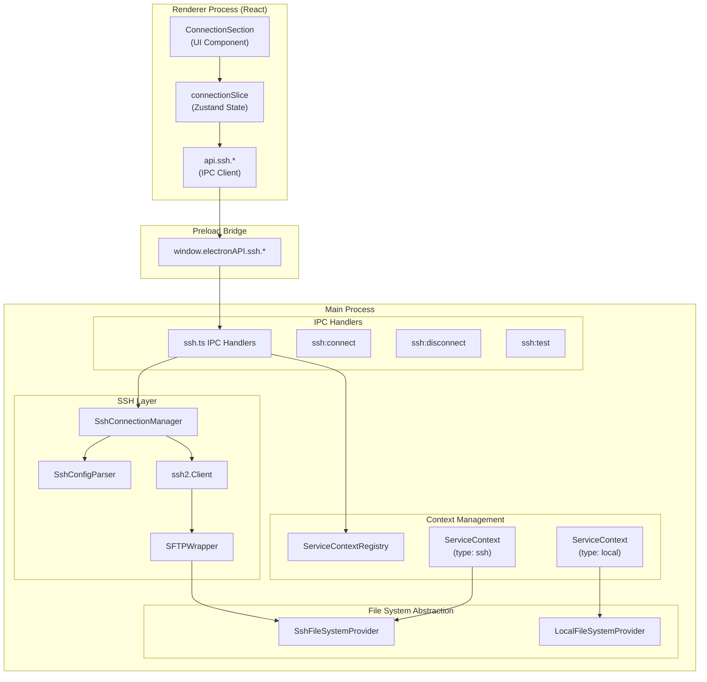
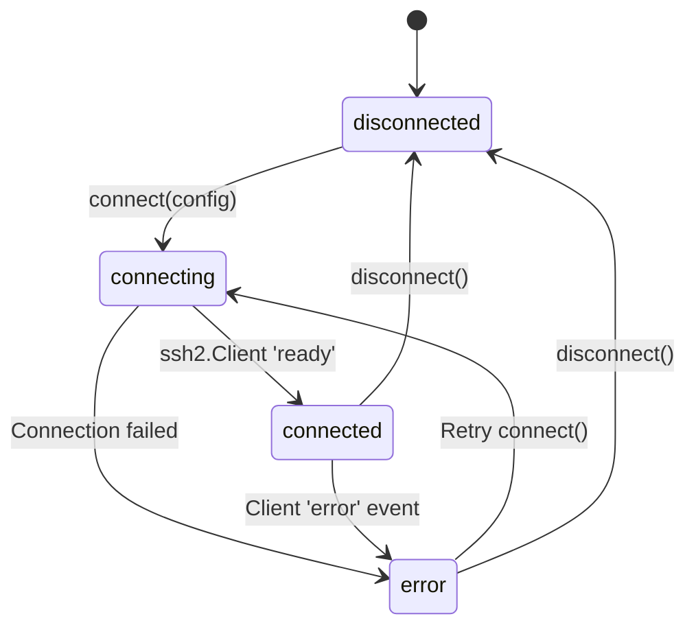
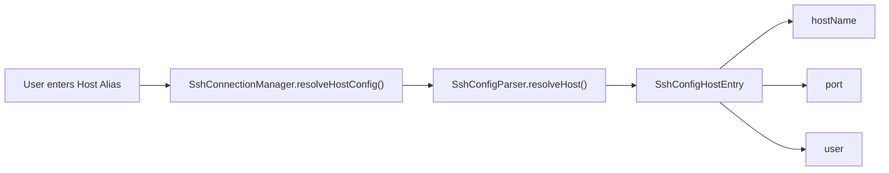
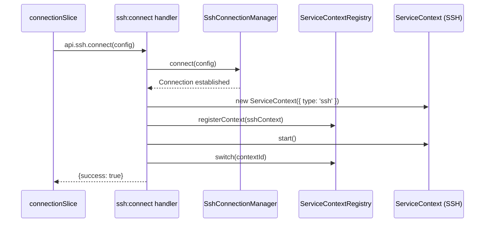

# SSH Remote Access

<details>
<summary>Relevant source files</summary>

The following files were used as context for generating this wiki page:

- [.github/workflows/release.yml](.github/workflows/release.yml)
- [package.json](package.json)
- [pnpm-lock.yaml](pnpm-lock.yaml)
- [resources/afterInstall.sh](resources/afterInstall.sh)
- [src/main/ipc/context.ts](src/main/ipc/context.ts)
- [src/main/ipc/handlers.ts](src/main/ipc/handlers.ts)
- [src/main/ipc/ssh.ts](src/main/ipc/ssh.ts)
- [src/main/services/infrastructure/SshConnectionManager.ts](src/main/services/infrastructure/SshConnectionManager.ts)
- [src/renderer/store/slices/connectionSlice.ts](src/renderer/store/slices/connectionSlice.ts)

</details>


This document describes claude-devtools' SSH remote access system, which enables viewing and analyzing Claude Code sessions running on remote machines. It covers connection management, authentication, file system abstraction, and the multi-context architecture that allows seamless switching between local and remote data sources.

For information about the broader multi-context system and how SSH contexts integrate with the `ServiceContextRegistry`, see [Multi-Context System](#3.2). For details on the IPC communication layer that bridges SSH operations between processes, see [IPC Communication Layer](#3.3).

---

## System Architecture

The SSH system consists of three main layers: the **SshConnectionManager** in the main process, the **IPC bridge** that exposes SSH operations to the renderer, and the **ConnectionSection UI** that provides user controls for connection management.

### SSH Remote Access Architecture



**Sources:** [src/main/services/infrastructure/SshConnectionManager.ts:1-57](), [src/main/ipc/ssh.ts:1-13](), [src/renderer/store/slices/connectionSlice.ts:1-25](), [src/main/ipc/handlers.ts:64-101]()

---

## Connection Manager

The `SshConnectionManager` class manages the SSH connection lifecycle, including establishing connections, handling authentication, maintaining the SFTP channel, and providing a `FileSystemProvider` abstraction to other services.

### Core Responsibilities

| Responsibility | Implementation |
|---|---|
| Connection lifecycle | `connect()`, `disconnect()`, `testConnection()` |
| SSH config parsing | Delegates to `SshConfigParser` |
| File system abstraction | Switches between `LocalFileSystemProvider` and `SshFileSystemProvider` |
| State tracking | Maintains `SshConnectionState` and `SshConnectionStatus` |

### Connection State Machine



**Sources:** [src/main/services/infrastructure/SshConnectionManager.ts:57-66](), [src/main/services/infrastructure/SshConnectionManager.ts:125-181]()

### Key Methods

The `SshConnectionManager` exposes these primary methods:

```typescript
// Connection lifecycle
connect(config: SshConnectionConfig): Promise<void>
disconnect(): void
testConnection(config: SshConnectionConfig): Promise<{success: boolean, error?: string}>

// Provider access
getProvider(): FileSystemProvider
getRemoteProjectsPath(): string | null
isRemote(): boolean

// Status tracking
getStatus(): SshConnectionStatus
```

**Sources:** [src/main/services/infrastructure/SshConnectionManager.ts:77-106](), [src/main/services/infrastructure/SshConnectionManager.ts:125-238]()

---

## Authentication Methods

The SSH system supports multiple authentication methods defined in the `SshAuthMethod` type.

### Supported Auth Methods

| Method | Description | Implementation |
|---|---|---|
| `password` | Password-based authentication | `config.password` |
| `privateKey` | Private key file authentication | `config.privateKeyPath` |
| `agent` | SSH agent authentication | Uses local SSH agent socket |
| `auto` | Automatic method selection | Resolves via SSH config or defaults |

**Sources:** [src/main/services/infrastructure/SshConnectionManager.ts:35-44](), [src/main/services/infrastructure/SshConnectionManager.ts:195-219]()

---

## SSH Config Integration

The `SshConfigParser` class parses `~/.ssh/config` to provide host alias resolution and auto-fill capabilities in the UI.

### Config Host Resolution

When a user enters a host alias, the system resolves it to actual connection parameters:



**Sources:** [src/main/services/infrastructure/SshConnectionManager.ts:111-120](), [src/main/ipc/ssh.ts:173-182]()

---

## File System Abstraction

The SSH system uses the `FileSystemProvider` interface to abstract file operations, allowing the same code to work with both local and remote file systems.

### Provider Architecture

```mermaid
graph TB
    subgraph "Abstract Interface"
        FileSystemProvider["FileSystemProvider (interface)"]
    end
    
    subgraph "Implementations"
        LocalFileSystemProvider["LocalFileSystemProvider"]
        SshFileSystemProvider["SshFileSystemProvider"]
    end
    
    subgraph "Contexts"
        ServiceContext_Local["ServiceContext (Local)"]
        ServiceContext_SSH["ServiceContext (SSH)"]
    end
    
    ServiceContext_Local --> LocalFileSystemProvider
    ServiceContext_SSH --> SshFileSystemProvider
    LocalFileSystemProvider --|> FileSystemProvider
    SshFileSystemProvider --|> FileSystemProvider
```

**Sources:** [src/main/services/infrastructure/SshConnectionManager.ts:58-60](), [src/main/ipc/ssh.ts:92-98]()

---

## Context Management Integration

When an SSH connection is established, the system creates a new `ServiceContext` with type `'ssh'` and registers it in the `ServiceContextRegistry`.

### Context Creation Flow



**Sources:** [src/main/ipc/ssh.ts:70-116](), [src/renderer/store/slices/connectionSlice.ts:65-103]()

---

## IPC Handlers

The SSH IPC handlers in `src/main/ipc/ssh.ts` bridge SSH operations between the renderer and main processes.

| Channel | Purpose |
|---|---|
| `ssh:connect` | Establish SSH connection and create context |
| `ssh:disconnect` | Disconnect and switch back to local context |
| `ssh:test` | Test connection without switching context |
| `ssh:getState` | Get current connection status |
| `ssh:getConfigHosts` | List SSH config host aliases |

**Sources:** [src/main/ipc/ssh.ts:14-21](), [src/main/ipc/ssh.ts:70-182]()

---

## Child Pages

For deep technical details on specific subsystems, see:
- [SSH Connection Manager](#5.1) — Detailed service logic, auth resolution, and state management.
- [SSH Configuration](#5.2) — Config parsing logic, host resolution, and profile persistence.
- [Remote File Operations](#5.3) — SFTP implementation details and remote path discovery.
