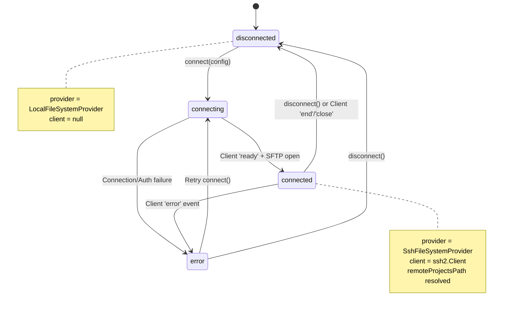
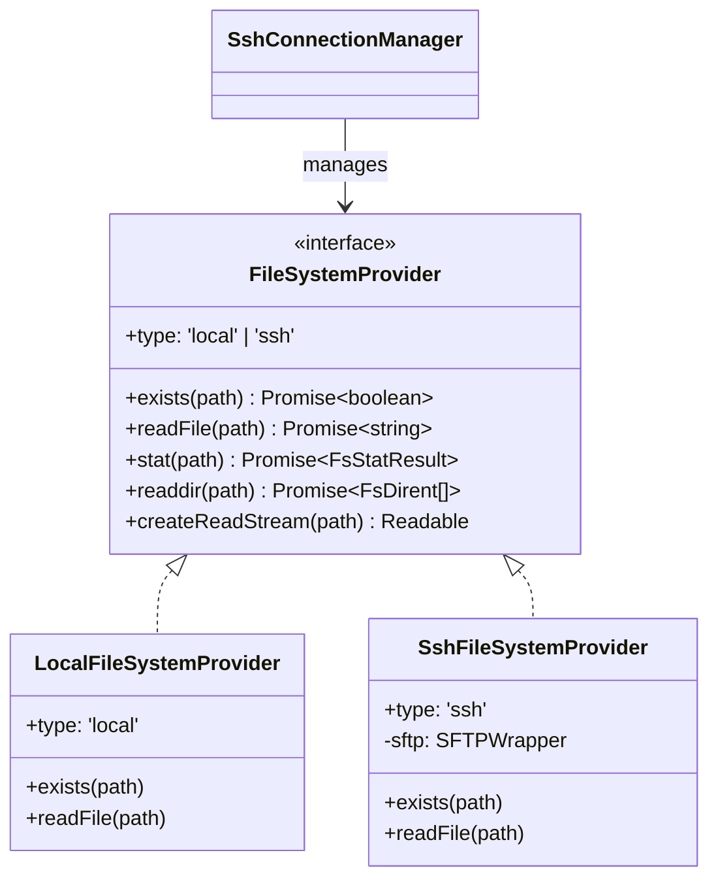

# SSH Connection Manager

<details>
<summary>Relevant source files</summary>

The following files were used as context for generating this wiki page:

- [.github/workflows/release.yml](.github/workflows/release.yml)
- [package.json](package.json)
- [pnpm-lock.yaml](pnpm-lock.yaml)
- [resources/afterInstall.sh](resources/afterInstall.sh)
- [src/main/services/discovery/ProjectPathResolver.ts](src/main/services/discovery/ProjectPathResolver.ts)
- [src/main/services/infrastructure/DataCache.ts](src/main/services/infrastructure/DataCache.ts)
- [src/main/services/infrastructure/FileSystemProvider.ts](src/main/services/infrastructure/FileSystemProvider.ts)
- [src/main/services/infrastructure/FileWatcher.ts](src/main/services/infrastructure/FileWatcher.ts)
- [src/main/services/infrastructure/SshConnectionManager.ts](src/main/services/infrastructure/SshConnectionManager.ts)
- [src/main/services/infrastructure/SshFileSystemProvider.ts](src/main/services/infrastructure/SshFileSystemProvider.ts)

</details>


**Purpose**: This document describes the `SshConnectionManager` service, which manages SSH connection lifecycle, authentication, and provides a unified file system abstraction for remote access. This service enables claude-devtools to connect to remote machines and access Claude Code session files over SSH.

---

## Overview

The `SshConnectionManager` class is the core service responsible for establishing and maintaining SSH connections. It abstracts the complexity of SSH authentication, SFTP channel management, and provides a consistent `FileSystemProvider` interface that allows the rest of the application to work with both local and remote file systems transparently.

**Key Responsibilities**:
- Manage SSH connection lifecycle (connect, disconnect, cleanup) [src/main/services/infrastructure/SshConnectionManager.ts:4-9]()
- Handle multiple authentication methods (password, private key, SSH agent, auto-detection) [src/main/services/infrastructure/SshConnectionManager.ts:35-44]()
- Provide SFTP-based `FileSystemProvider` for remote file access [src/main/services/infrastructure/SshConnectionManager.ts:158-158]()
- Parse and resolve SSH config files (`~/.ssh/config`) [src/main/services/infrastructure/SshConnectionManager.ts:111-121]()
- Emit connection state events for UI updates [src/main/services/infrastructure/SshConnectionManager.ts:180-180]()
- Resolve remote Claude directory paths [src/main/services/infrastructure/SshConnectionManager.ts:161-161]()
- Discover SSH agent sockets across platforms [src/main/services/infrastructure/SshConnectionManager.ts:310-380]()

**Sources**: [src/main/services/infrastructure/SshConnectionManager.ts:1-544]()

---

## System Architecture

The following diagram illustrates how the `SshConnectionManager` integrates with the Electron main process and the unified file system provider model.

### Code Entity Space to Infrastructure Mapping

```mermaid
graph TB
    subgraph "Main Process (Code Entity Space)"
        Manager["SshConnectionManager class<br/>(EventEmitter)"]
        SshParser["SshConfigParser class"]
        SshFS["SshFileSystemProvider class"]
        LocalFS["LocalFileSystemProvider class"]
        
        subgraph "IPC Handlers (ssh.ts)"
            ConnectH["SSH_CONNECT handler"]
            DisconnectH["SSH_DISCONNECT handler"]
            TestH["SSH_TEST handler"]
        end
    end
    
    subgraph "External Resources"
        SshConfig["~/.ssh/config file"]
        SshAgent["SSH Agent Socket<br/>(SSH_AUTH_SOCK)"]
        RemoteHost["Remote SSH Server"]
    end

    ConnectH --> Manager
    DisconnectH --> Manager
    Manager --> SshParser
    SshParser -.->|reads| SshConfig
    Manager -.->|detects| SshAgent
    
    Manager --> SshFS
    SshFS -->|SFTP Protocol| RemoteHost
    
    Manager -->|getProvider()| ProviderInterface["FileSystemProvider interface"]
    ProviderInterface -.->|implemented by| SshFS
    ProviderInterface -.->|implemented by| LocalFS
```

**Sources**: [src/main/services/infrastructure/SshConnectionManager.ts:57-73](), [src/main/services/infrastructure/SshFileSystemProvider.ts:23-27](), [src/main/services/infrastructure/FileSystemProvider.ts:60-81]()

---

## Connection Lifecycle

The SSH connection lifecycle follows a state machine with four states: `disconnected`, `connecting`, `connected`, and `error`.

### State Machine Diagram



**Sources**: [src/main/services/infrastructure/SshConnectionManager.ts:33-51](), [src/main/services/infrastructure/SshConnectionManager.ts:124-190]()

### Connection Flow

The `connect` method performs a sequence of asynchronous steps to establish the session and initialize the remote file provider.

1.  **Disconnect Existing**: If a client exists, it is cleaned up first [src/main/services/infrastructure/SshConnectionManager.ts:127-129]().
2.  **Build Config**: Resolves `~/.ssh/config` and merges authentication parameters [src/main/services/infrastructure/SshConnectionManager.ts:138-138]().
3.  **Establish SSH**: Connects using `ssh2.Client` and waits for the `ready` event [src/main/services/infrastructure/SshConnectionManager.ts:140-144]().
4.  **Open SFTP**: Requests an SFTP channel from the client [src/main/services/infrastructure/SshConnectionManager.ts:147-155]().
5.  **Initialize Provider**: Wraps the SFTP channel in a `SshFileSystemProvider` [src/main/services/infrastructure/SshConnectionManager.ts:158-158]().
6.  **Path Discovery**: Resolves the remote `~/.claude/projects/` path [src/main/services/infrastructure/SshConnectionManager.ts:161-161]().

**Sources**: [src/main/services/infrastructure/SshConnectionManager.ts:125-190]()

---

## Authentication Methods

The manager supports a variety of authentication strategies via the `SshAuthMethod` type.

| Method | Description | Configuration Keys |
| :--- | :--- | :--- |
| `password` | Standard password auth | `password` |
| `privateKey` | Key-based auth | `privateKeyPath` |
| `agent` | Use local SSH agent | `SSH_AUTH_SOCK` environment |
| `auto` | Cascading fallback | IdentityFile → Agent → Default keys |

**Sources**: [src/main/services/infrastructure/SshConnectionManager.ts:35-44](), [src/main/services/infrastructure/SshConnectionManager.ts:264-301]()

### SSH Agent Discovery

Since Electron GUI apps often lack shell environment variables on macOS, the manager implements platform-specific discovery for `SSH_AUTH_SOCK` [src/main/services/infrastructure/SshConnectionManager.ts:310-312]().

-   **macOS**: Attempts to query `launchctl getenv SSH_AUTH_SOCK` [src/main/services/infrastructure/SshConnectionManager.ts:322-344]().
-   **Known Paths**: Checks for 1Password agent sockets and standard locations like `~/.ssh/agent.sock` [src/main/services/infrastructure/SshConnectionManager.ts:347-372]().

---

## FileSystemProvider Abstraction

A critical feature of the `SshConnectionManager` is its ability to provide a unified interface for file operations. Services like `ProjectScanner` or `FileWatcher` do not need to know if they are operating locally or remotely.

### Code Entity Space: Provider Hierarchy



**Sources**: [src/main/services/infrastructure/FileSystemProvider.ts:60-81](), [src/main/services/infrastructure/SshFileSystemProvider.ts:23-27](), [src/main/services/infrastructure/LocalFileSystemProvider.ts:1-20]()

### SSH Polling for File Changes

Because `fs.watch` does not work over SFTP, the system switches to a polling mechanism when in SSH mode. The `FileWatcher` service checks the filesystem provider type and activates `startPollingMode()` if the provider is `ssh` [src/main/services/infrastructure/FileWatcher.ts:137-141]().

-   **Interval**: Polls every 3000ms [src/main/services/infrastructure/FileWatcher.ts:76-76]().
-   **Detection**: Compares remote file sizes and `mtime` to detect changes [src/main/services/infrastructure/FileWatcher.ts:81-82]().

**Sources**: [src/main/services/infrastructure/FileWatcher.ts:73-82](), [src/main/services/infrastructure/FileWatcher.ts:137-141]()

---

## Remote Path Resolution

When an SSH connection is established, the manager must locate the Claude projects directory on the remote host. This is handled by `resolveRemoteProjectsPath` [src/main/services/infrastructure/SshConnectionManager.ts:437-460]().

1.  **Home Detection**: Executes a remote command `printf %s "$HOME"` to find the user's home directory [src/main/services/infrastructure/SshConnectionManager.ts:465-477]().
2.  **Candidate Checking**: Iterates through common paths:
    -   `$HOME/.claude/projects`
    -   `/home/{username}/.claude/projects`
    -   `/Users/{username}/.claude/projects`
3.  **Validation**: Uses `provider.exists()` to verify which path actually contains the data [src/main/services/infrastructure/SshConnectionManager.ts:452-452]().

**Sources**: [src/main/services/infrastructure/SshConnectionManager.ts:437-477]()

---

## Error Handling and Cleanup

The service ensures that network interruptions or manual disconnects do not leave dangling SSH sessions.

-   **Event Listeners**: Listens for `end`, `close`, and `error` events on the `ssh2.Client` [src/main/services/infrastructure/SshConnectionManager.ts:164-178]().
-   **Cleanup**: The `cleanup()` method ends the client session and disposes of the `SshFileSystemProvider` (closing the SFTP channel) [src/main/services/infrastructure/SshConnectionManager.ts:526-538]().
-   **Fallback**: On disconnect, the manager automatically reverts the provider back to `localProvider` [src/main/services/infrastructure/SshConnectionManager.ts:518-524]().

**Sources**: [src/main/services/infrastructure/SshConnectionManager.ts:518-538](), [src/main/services/infrastructure/SshConnectionManager.ts:164-178]()
