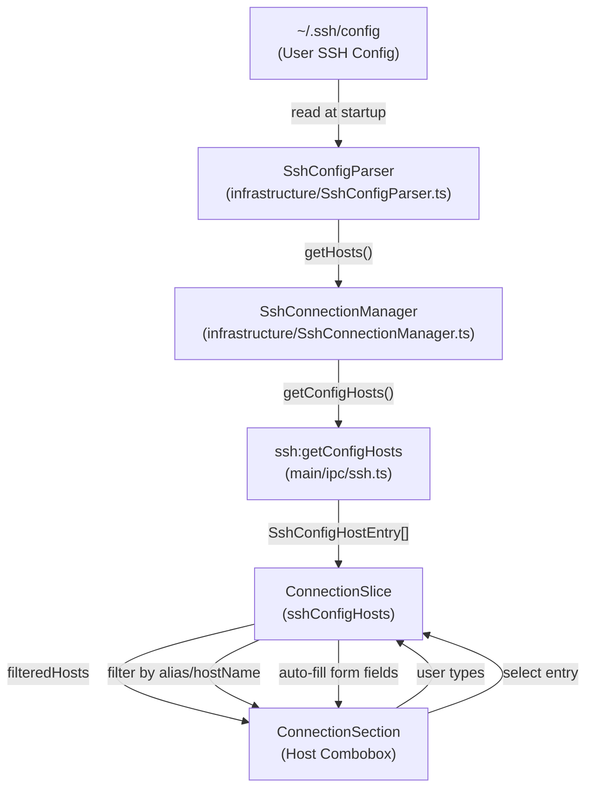
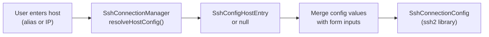
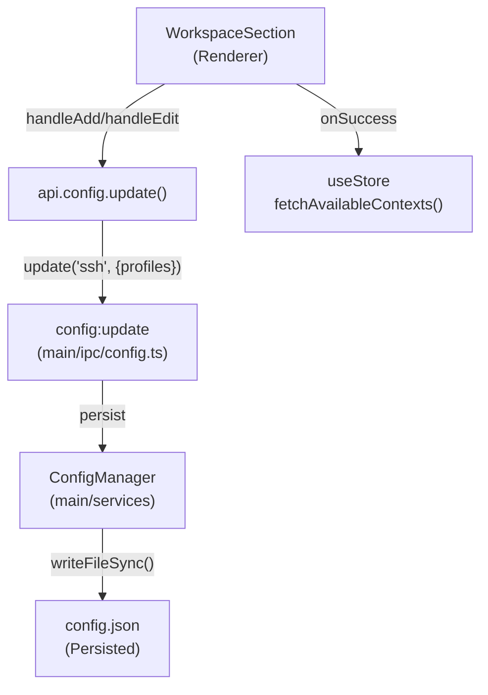
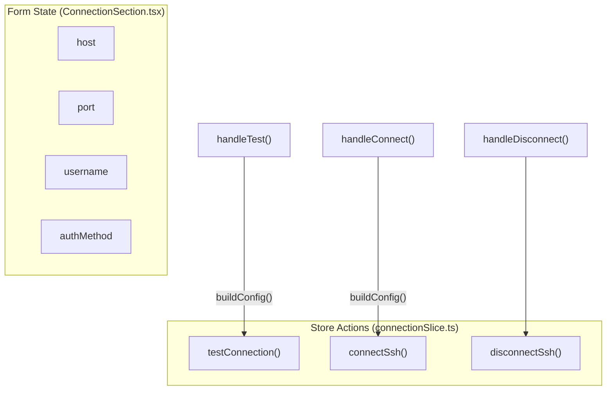
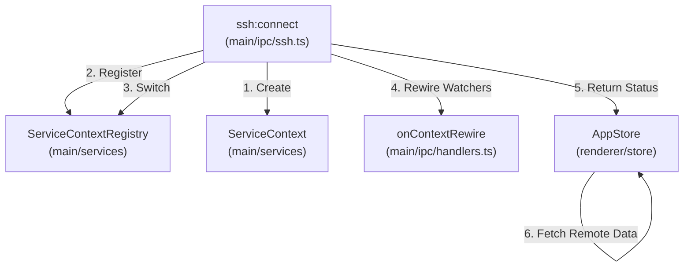

# SSH Configuration

<details>
<summary>Relevant source files</summary>

The following files were used as context for generating this wiki page:

- [src/main/ipc/context.ts](src/main/ipc/context.ts)
- [src/main/ipc/handlers.ts](src/main/ipc/handlers.ts)
- [src/main/ipc/ssh.ts](src/main/ipc/ssh.ts)
- [src/main/services/infrastructure/SshConfigParser.ts](src/main/services/infrastructure/SshConfigParser.ts)
- [src/main/services/infrastructure/TriggerManager.ts](src/main/services/infrastructure/TriggerManager.ts)
- [src/renderer/App.tsx](src/renderer/App.tsx)
- [src/renderer/components/common/ConfirmDialog.tsx](src/renderer/components/common/ConfirmDialog.tsx)
- [src/renderer/components/settings/NotificationTriggerSettings/utils/trigger.ts](src/renderer/components/settings/NotificationTriggerSettings/utils/trigger.ts)
- [src/renderer/components/settings/components/SettingsSelect.tsx](src/renderer/components/settings/components/SettingsSelect.tsx)
- [src/renderer/components/settings/sections/ConnectionSection.tsx](src/renderer/components/settings/sections/ConnectionSection.tsx)
- [src/renderer/components/settings/sections/WorkspaceSection.tsx](src/renderer/components/settings/sections/WorkspaceSection.tsx)
- [src/renderer/hooks/useKeyboardShortcuts.ts](src/renderer/hooks/useKeyboardShortcuts.ts)
- [src/renderer/store/slices/connectionSlice.ts](src/renderer/store/slices/connectionSlice.ts)

</details>


This page documents SSH configuration management in claude-devtools, including SSH config file parsing, workspace profiles, and the connection UI. For information about the SSH connection lifecycle and file system operations, see [SSH Connection Manager](#5.1) and [Remote File Operations](#5.3).

## Overview

SSH configuration in claude-devtools encompasses three main areas:

1.  **SSH Config Parsing**: Reading and resolving host entries from `~/.ssh/config` for auto-fill.
2.  **Workspace Profiles**: Saving SSH connection profiles for quick reconnection.
3.  **Connection UI**: Form-based SSH connection interface with host auto-completion.
4.  **Local Claude Root Management**: Configuring the local `~/.claude` directory path, including WSL detection on Windows.

All SSH configuration is managed through the Settings panel, with state synchronized between the main process (config persistence) and renderer (UI).

---

## SSH Config File Parsing

### SshConfigParser Service

The `SshConfigParser` class reads and parses the user's SSH config file to enable auto-fill in the connection form. It extracts host entries including aliases, hostnames, ports, usernames, and identity file hints.

**Natural Language to Code Entity Mapping: SSH Host Discovery**



**SSH Config Host Entry Structure**

Sources: [src/renderer/components/settings/sections/ConnectionSection.tsx:24-27](), [src/main/ipc/ssh.ts:162-171]()

```typescript
interface SshConfigHostEntry {
  alias: string;           // Host alias from config
  hostName?: string;       // Resolved HostName
  port?: number;          // Port if specified
  user?: string;          // User if specified
  hasIdentityFile?: boolean; // Whether IdentityFile is configured
}
```

The parser is instantiated by `SshConnectionManager` and provides key methods for the IPC layer to expose host data to the renderer.

- `getConfigHosts`: Returns all parsed host entries [src/main/ipc/ssh.ts:162-171]().
- `resolveHost`: Resolves a specific host alias to its full configuration [src/main/ipc/ssh.ts:173-182]().

### Host Resolution in Connection Flow

When a user enters a host in the connection form, the system attempts to resolve it against SSH config to determine the correct connection parameters.



**Resolution Priority**
The `SshConnectionManager` handles the merging of user-provided form data with SSH config defaults.

Sources: [src/main/ipc/ssh.ts:173-182](), [src/renderer/store/slices/connectionSlice.ts:205-211]()

### Auto-Fill in Connection UI

The `ConnectionSection` component provides a combobox that filters SSH config hosts as the user types.

**Filtering Logic**

Sources: [src/renderer/components/settings/sections/ConnectionSection.tsx:130-137]()

```typescript
const filteredHosts = useMemo(() => {
  if (!host.trim()) return sshConfigHosts;
  const lower = host.toLowerCase();
  return sshConfigHosts.filter(
    (entry) =>
      entry.alias.toLowerCase().includes(lower) || entry.hostName?.toLowerCase().includes(lower)
  );
}, [host, sshConfigHosts]);
```

When a user selects an SSH config host via `handleSelectConfigHost`, the form auto-fills:
- `host` → `entry.alias`
- `port` → `entry.port` (if present)
- `username` → `entry.user` (if present)
- `authMethod` → `'auto'` (uses SSH config identity files)

Sources: [src/renderer/components/settings/sections/ConnectionSection.tsx:141-149]()

---

## Workspace Profiles

Workspace profiles allow users to save SSH connection configurations for quick reconnection. Profiles are persisted via the `ConfigManager`.

### Profile Data Structure

Sources: [src/renderer/components/settings/sections/WorkspaceSection.tsx:23]()

```typescript
interface SshConnectionProfile {
  id: string;                    // UUID
  name: string;                  // User-friendly name
  host: string;                  // Hostname or SSH config alias
  port: number;                  // SSH port (default 22)
  username: string;              // SSH username
  authMethod: SshAuthMethod;     // 'auto' | 'agent' | 'privateKey' | 'password'
  privateKeyPath?: string;       // Path to private key
}
```

### Profile Storage Flow



**Profile Management Operations**

| Operation | Handler | Description |
| :--- | :--- | :--- |
| **List profiles** | `loadProfiles()` | Fetch saved profiles from config [src/renderer/components/settings/sections/WorkspaceSection.tsx:71-82](). |
| **Add profile** | `handleAdd()` | Persist new profile with UUID [src/renderer/components/settings/sections/WorkspaceSection.tsx:103-119](). |
| **Edit profile** | `handleEdit()` | Update existing profile by ID [src/renderer/components/settings/sections/WorkspaceSection.tsx:121-141](). |
| **Delete profile** | `handleDelete()` | Remove profile with confirmation [src/renderer/components/settings/sections/WorkspaceSection.tsx:143-159](). |

Sources: [src/renderer/components/settings/sections/WorkspaceSection.tsx:103-159]()

### WorkspaceSection UI Component

The `WorkspaceSection` component provides inline editing for profiles. The authentication dropdown `SettingsSelect` provides the following options:

- **Auto**: Uses SSH config identity files or agent.
- **SSH Agent**: Specifically targets the running SSH agent.
- **Private Key**: Requires a path to a private key file.
- **Password**: Prompted during connection.

Sources: [src/renderer/components/settings/sections/WorkspaceSection.tsx:32-37](), [src/renderer/components/settings/sections/WorkspaceSection.tsx:164-210]()

---

## Connection UI

The `ConnectionSection` component provides the main SSH connection interface in the Settings panel.

### Connection Form Architecture



**buildConfig() Function**
Creates the configuration object passed to the main process for connection attempts.

Sources: [src/renderer/components/settings/sections/ConnectionSection.tsx:162-169]()

```typescript
const buildConfig = (): SshConnectionConfig => ({
  host,
  port: parseInt(port, 10) || 22,
  username,
  authMethod,
  password: authMethod === 'password' ? password : undefined,
  privateKeyPath: authMethod === 'privateKey' ? privateKeyPath : undefined,
});
```

### Connection State Management

The `connectionSlice` manages the active connection state and triggers context switches upon successful connection.

**Connection Flow**
1.  **Connect**: `connectSsh` calls `api.ssh.connect(config)` [src/renderer/store/slices/connectionSlice.ts:65-73]().
2.  **State Update**: On success, `connectionMode` becomes `'ssh'`, and the `activeContextId` is set to `ssh-${config.host}` [src/renderer/store/slices/connectionSlice.ts:74-82]().
3.  **Data Reset**: Local data (tabs, projects) is cleared to prevent cross-context leakage [src/renderer/store/slices/connectionSlice.ts:83-100]().
4.  **Data Fetch**: Remote projects and repository groups are fetched [src/renderer/store/slices/connectionSlice.ts:108-109]().

Sources: [src/renderer/store/slices/connectionSlice.ts:65-121]()

### Test Connection Flow

Before establishing a full connection, users can test credentials using `handleTest` which invokes the `ssh:test` IPC handler. This creates a temporary connection to validate settings without switching the application context.

Sources: [src/renderer/components/settings/sections/ConnectionSection.tsx:171-177](), [src/main/ipc/ssh.ts:152-160]()

---

## Local Claude Root Configuration

The `ConnectionSection` also displays the local Claude root directory path, which is critical for local mode operations.

### Claude Root Info

The UI displays the resolved path (either default `~/.claude` or a user override).

Sources: [src/renderer/components/settings/sections/ConnectionSection.tsx:189](), [src/renderer/components/settings/sections/ConnectionSection.tsx:78-85]()

### Context Switching and SSH

When an SSH connection is established, the application performs a context switch.

**Natural Language to Code Entity Mapping: Context Switching**



**Key Code Entities in Context Switching:**
- `ServiceContext`: Encapsulates the `FileSystemProvider` and path configuration for a specific environment [src/main/ipc/ssh.ts:92-98]().
- `ServiceContextRegistry`: Manages the lifecycle and active state of multiple `ServiceContext` instances [src/main/ipc/ssh.ts:101-105]().
- `onContextRewire`: A callback passed during initialization to ensure file watchers are correctly attached to the new context [src/main/ipc/ssh.ts:108]().

Sources: [src/main/ipc/ssh.ts:70-116](), [src/main/ipc/handlers.ts:64-84]()

---

## Summary of IPC Handlers

The `registerSshHandlers` function in `src/main/ipc/ssh.ts` exposes the following channels to the renderer:

| Channel | Functionality |
| :--- | :--- |
| `ssh:connect` | Connects to host and switches context [src/main/ipc/ssh.ts:70-116](). |
| `ssh:disconnect` | Disconnects and reverts to local context [src/main/ipc/ssh.ts:118-146](). |
| `ssh:getState` | Retrieves current connection status [src/main/ipc/ssh.ts:148-150](). |
| `ssh:test` | Validates connection parameters [src/main/ipc/ssh.ts:152-160](). |
| `ssh:getConfigHosts` | Lists entries from `~/.ssh/config` [src/main/ipc/ssh.ts:162-171](). |
| `ssh:saveLastConnection` | Persists connection metadata for form pre-fill [src/main/ipc/ssh.ts:184-198](). |

Sources: [src/main/ipc/ssh.ts:69-205]()
