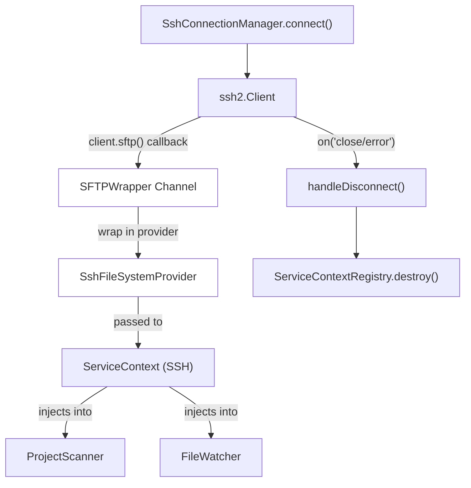
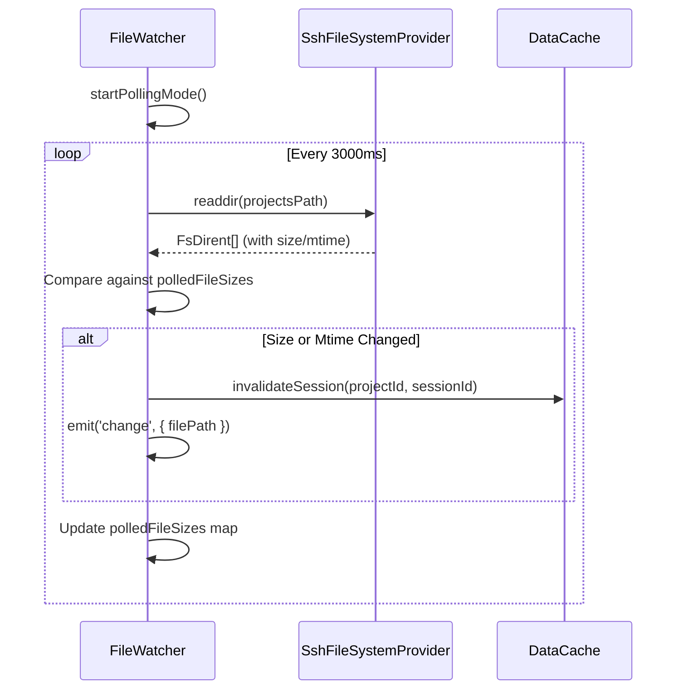

# Remote File Operations

Relevant source files

The following files were used as context for generating this wiki page:

- [src/main/services/discovery/ProjectPathResolver.ts](src/main/services/discovery/ProjectPathResolver.ts)
- [src/main/services/infrastructure/DataCache.ts](src/main/services/infrastructure/DataCache.ts)
- [src/main/services/infrastructure/FileSystemProvider.ts](src/main/services/infrastructure/FileSystemProvider.ts)
- [src/main/services/infrastructure/FileWatcher.ts](src/main/services/infrastructure/FileWatcher.ts)
- [src/main/services/infrastructure/ServiceContext.ts](src/main/services/infrastructure/ServiceContext.ts)
- [src/main/services/infrastructure/ServiceContextRegistry.ts](src/main/services/infrastructure/ServiceContextRegistry.ts)
- [src/main/services/infrastructure/SshFileSystemProvider.ts](src/main/services/infrastructure/SshFileSystemProvider.ts)
- [src/main/services/infrastructure/index.ts](src/main/services/infrastructure/index.ts)
- [src/renderer/components/common/WorkspaceIndicator.tsx](src/renderer/components/common/WorkspaceIndicator.tsx)

## Purpose and Scope

This page documents the SFTP integration layer that enables `claude-devtools` to read session files from remote SSH hosts. It covers the `SshFileSystemProvider` implementation, file watching via polling for remote contexts, and performance optimizations designed to mitigate network latency.

For SSH connection lifecycle and authentication, see [SSH Connection Manager (5.1)](). For SSH configuration parsing and host resolution, see [SSH Configuration (5.2)]().

---

## SFTP Channel Architecture

When an SSH connection is established, the application opens a persistent SFTP channel. This channel is wrapped in the `SshFileSystemProvider` class, which implements the `FileSystemProvider` interface. This abstraction allows all discovery and parsing services to work identically across local and remote environments.

**SFTP Channel Lifecycle**

Sources: [src/main/services/infrastructure/SshConnectionManager.ts:146-158](), [src/main/services/infrastructure/SshFileSystemProvider.ts:23-32](), [src/main/services/infrastructure/ServiceContext.ts:81-119]()

The `SshFileSystemProvider` translates abstract file operations into SFTP commands using the `ssh2` library's `SFTPWrapper`.

Sources: [src/main/services/infrastructure/SshFileSystemProvider.ts:57-70](), [src/main/services/infrastructure/SshFileSystemProvider.ts:86-111]()

---

## FileSystemProvider Implementation

The `FileSystemProvider` interface defines the contract for all session-data services. `SshFileSystemProvider` implements this by wrapping SFTP callbacks in Promises and providing Node-compatible streams.

**Key Implementation Details**

| Method | SSH Implementation Detail |
|--------|---------------------------|
| `type` | Hardcoded to `'ssh'`. [src/main/services/infrastructure/SshFileSystemProvider.ts:27-27]() |
| `stat()` | Converts SFTP mode bitmask to `isFile()`/`isDirectory()`. [src/main/services/infrastructure/SshFileSystemProvider.ts:96-109]() |
| `readdir()` | Maps SFTP attributes (size, mtime) directly into `FsDirent`. [src/main/services/infrastructure/SshFileSystemProvider.ts:138-156]() |
| `readFile()` | Implements retry logic for transient SFTP errors. [src/main/services/infrastructure/SshFileSystemProvider.ts:58-81]() |
| `createReadStream()` | Pipes SFTP stream through `PassThrough` for Node compatibility. [src/main/services/infrastructure/SshFileSystemProvider.ts:178-192]() |

The provider uses a classification system to distinguish between `not_found`, `transient` (retryable), and `permanent` errors. Transient errors (like SFTP code 4/EOF or `ETIMEDOUT`) trigger an exponential backoff retry mechanism.

Sources: [src/main/services/infrastructure/SshFileSystemProvider.ts:34-55](), [src/main/services/infrastructure/SshFileSystemProvider.ts:211-235]()

---

## Remote File Watching (Polling Mode)

Unlike local contexts which use `fs.watch`, remote contexts utilize a polling mechanism within `FileWatcher` because SFTP does not support native file system events.

**Polling Logic Flow**

Sources: [src/main/services/infrastructure/FileWatcher.ts:73-82](), [src/main/services/infrastructure/FileWatcher.ts:137-141](), [src/main/services/infrastructure/FileWatcher.ts:446-485]()

**Optimizations in Polling:**
- **Metadata Reuse:** `FileWatcher` leverages the fact that `SshFileSystemProvider.readdir` returns file sizes and mtimes in the initial directory listing, avoiding N subsequent `stat` calls. [src/main/services/infrastructure/FileWatcher.ts:460-475]()
- **Priming Phase:** The first poll cycle ("priming") establishes a baseline without emitting events to prevent a flood of notifications on connection. [src/main/services/infrastructure/FileWatcher.ts:455-458]()
- **Concurrency Guard:** `pollingInProgress` prevents overlapping poll cycles if a large remote directory takes longer than the interval to scan. [src/main/services/infrastructure/FileWatcher.ts:447-450]()

---

## Performance Optimizations

Remote operations are optimized to reduce round-trips and handle high-latency links.

### Batched Parallel Operations
The `ProjectScanner` dynamically adjusts batch sizes based on the provider type. SSH batches are significantly smaller to prevent saturating the SFTP channel.

| Operation | Local Batch | SSH Batch |
|-----------|-------------|-----------|
| Project directory scan | 24 | 8 |
| Session file stat calls | 128 | 32 |
| Paginated metadata | 200 | 48 |
| Metadata parsing | 16 | 4 |

Sources: [src/main/services/discovery/ProjectScanner.ts:129-133](), [src/main/services/discovery/ProjectScanner.ts:227-231](), [src/main/services/discovery/ProjectScanner.ts:512-527](), [src/main/services/discovery/ProjectScanner.ts:639-653]()

### Metadata Level Selection
The system supports a `light` metadata level for SSH mode. This level only reads the beginning of a JSONL file to extract the first user message, rather than parsing the entire multi-megabyte session file.

- **Light Metadata:** First user message, timestamp, and basic stats. [src/main/services/discovery/ProjectScanner.ts:764-815]()
- **Deep Metadata:** Full analysis including tool usage, token costs, and subagents. [src/main/services/discovery/ProjectScanner.ts:701-762]()

In SSH mode, the `sessionSlice` in the renderer defaults to `light` metadata for list views.

Sources: [src/main/services/discovery/ProjectScanner.ts:821-870](), [src/main/services/discovery/ProjectScanner.ts:398-398]()

### Path Resolution Short-circuit
`ProjectPathResolver` optimizes SSH resolution by stopping after the first successful CWD extraction from a session file, whereas in local mode it may inspect multiple files for accuracy.

Sources: [src/main/services/discovery/ProjectPathResolver.ts:73-76]()

---

## Caching Strategy

To avoid redundant network requests, `ProjectScanner` maintains internal caches that are keyed by file path and validated by `mtimeMs` and `size`.

**Scanner Caches**

| Cache Name | Data Stored | Invalidation Trigger |
|------------|-------------|----------------------|
| `contentPresenceCache` | Boolean (has non-noise content) | Change in size or mtime |
| `sessionMetadataCache` | Full `ParsedSessionMetadata` | Change in size or mtime |
| `sessionPreviewCache` | First user message preview | Change in size or mtime |

Sources: [src/main/services/discovery/ProjectScanner.ts:64-79](), [src/main/services/discovery/ProjectScanner.ts:1209-1237]()

The `DataCache` service also provides a higher-level LRU cache for fully parsed `SessionDetail` objects, which is shared across the `ServiceContext`.

Sources: [src/main/services/infrastructure/DataCache.ts:27-40](), [src/main/services/infrastructure/ServiceContext.ts:108-108]()

---

## Remote Error Handling

Transient network failures are handled gracefully to prevent UI flickering or session loss.

**Retry and Fallback Strategy**
1. **Transient Detection:** Errors like `ECONNRESET` or SFTP EOF trigger up to 3 retries with a base delay of 75ms. [src/main/services/infrastructure/SshFileSystemProvider.ts:24-25](), [src/main/services/infrastructure/SshFileSystemProvider.ts:211-235]()
2. **Graceful Degradation:** If a `deep` metadata parse fails over SSH, the scanner automatically falls back to `light` metadata for that session rather than throwing an error. [src/main/services/discovery/ProjectScanner.ts:843-869]()
3. **Potentially Present:** In `exists()` checks, transient SFTP errors (code 4) result in a `true` return value to avoid false negatives during temporary connection hiccups. [src/main/services/infrastructure/SshFileSystemProvider.ts:45-51]()

Sources: [src/main/services/infrastructure/SshFileSystemProvider.ts:34-55](), [src/main/services/discovery/ProjectScanner.ts:1131-1154]()
