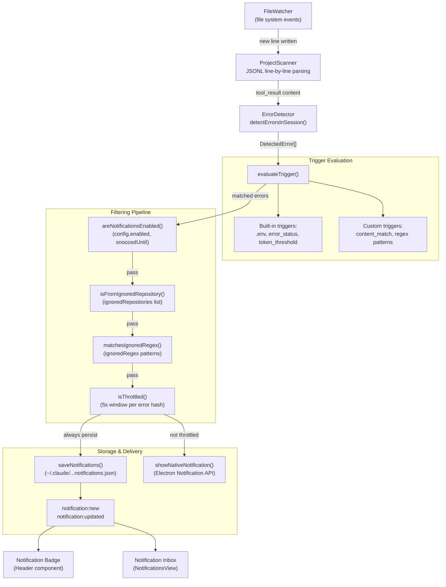

# Notification System

Relevant source files

The following files were used as context for generating this wiki page:

- [electron.vite.config.ts](electron.vite.config.ts)
- [src/main/services/infrastructure/NotificationManager.ts](src/main/services/infrastructure/NotificationManager.ts)
- [src/renderer/components/notifications/NotificationsView.tsx](src/renderer/components/notifications/NotificationsView.tsx)
- [src/renderer/store/slices/notificationSlice.ts](src/renderer/store/slices/notificationSlice.ts)
- [test/renderer/store/notificationSlice.test.ts](test/renderer/store/notificationSlice.test.ts)

The Notification System monitors Claude Code session files in real-time and generates alerts when specific conditions are met. It combines error detection, custom trigger evaluation, multi-stage filtering, and native OS notifications to keep users informed of important events without overwhelming them with noise.

This is a **parent page**. For implementation details of specific components, see:
- [Notification Manager](#6.1) — NotificationManager service, persistence, and native macOS notifications.
- [Trigger System](#6.2) — Built-in triggers, custom trigger creation, pattern matching, and testing.
- [Filtering & Throttling](#6.3) — Notification filtering pipeline, ignore lists, and throttling mechanisms.

---

## System Architecture

The notification system operates as a pipeline that processes session file changes through multiple stages: error detection, trigger evaluation, filtering, storage, and delivery.

### Notification Flow Diagram

**Sources:** [src/main/services/infrastructure/NotificationManager.ts:1-13](), [src/renderer/components/notifications/NotificationsView.tsx:32-53]()

---

## Core Components

### NotificationManager

The `NotificationManager` class [src/main/services/infrastructure/NotificationManager.ts:86-112]() is the central service that orchestrates the notification pipeline. It is a singleton that manages:

- **Persistence**: Stores up to 100 notifications in `~/.claude/claude-devtools-notifications.json` [src/main/services/infrastructure/NotificationManager.ts:74-80]().
- **Native notifications**: Shows macOS toasts via Electron's `Notification` API [src/main/services/infrastructure/NotificationManager.ts:6-6]().
- **Throttling**: Deduplicates notifications using a 5-second window per unique error hash [src/main/services/infrastructure/NotificationManager.ts:76-77]().
- **IPC events**: Broadcasts `notification:new` and `notification:updated` to the renderer [src/main/services/infrastructure/NotificationManager.ts:12-12]().

For details on persistence and macOS integration, see [Notification Manager](#6.1).

**Sources:** [src/main/services/infrastructure/NotificationManager.ts:1-112]()

### Trigger System

The system evaluates session data against both built-in and user-defined triggers. When a trigger matches, a `DetectedError` object [src/main/services/infrastructure/NotificationManager.ts:36-41]() is generated.

- **Built-in triggers**: Include `.env` file access alerts, tool result errors, and high token usage thresholds.
- **Custom triggers**: Support regex pattern matching on fields like `command`, `content`, and `thinking`.

For details on creating and testing triggers, see [Trigger System](#6.2).

**Sources:** [src/main/services/infrastructure/NotificationManager.ts:22-31](), [src/renderer/components/notifications/NotificationsView.tsx:79-97]()

### Filtering Pipeline

The notification system implements a multi-stage filtering pipeline to prevent spam. The pipeline is asymmetric: **all errors are persisted to disk**, but only errors that pass all filters trigger native OS notifications.

| Filter | Logic |
|--------|-------|
| **Enable Check** | Respects global `enabled` flag and `snoozedUntil` timestamps [src/main/services/infrastructure/NotificationManager.ts:8-8](). |
| **Repository Filter** | Filters errors from projects in the `ignoredProjects` list [src/main/services/infrastructure/NotificationManager.ts:10-10](). |
| **Regex Filter** | Filters messages matching `ignoredRegex` patterns [src/main/services/infrastructure/NotificationManager.ts:9-9](). |
| **Throttle** | Enforces a 5-second window per unique error hash [src/main/services/infrastructure/NotificationManager.ts:7-7](). |

For details on filter configuration and throttling, see [Filtering & Throttling](#6.3).

**Sources:** [src/main/services/infrastructure/NotificationManager.ts:1-13]()

---

## Storage and UI Integration

### Data Persistence

Notifications are stored as `StoredNotification` objects [src/main/services/infrastructure/NotificationManager.ts:36-41](). The `NotificationManager` performs auto-pruning on startup to maintain the 100-entry limit [src/main/services/infrastructure/NotificationManager.ts:11-11]().

### Renderer Store

The `notificationSlice` [src/renderer/store/slices/notificationSlice.ts:43-46]() manages the frontend state. It fetches notifications from the main process and provides actions for marking notifications as read or deleting them.

| Action | Description |
|--------|-------------|
| `fetchNotifications` | Loads history from the main process [src/renderer/store/slices/notificationSlice.ts:54-79](). |
| `markNotificationRead` | Updates the read status of a single entry [src/renderer/store/slices/notificationSlice.ts:82-100](). |
| `clearNotifications` | Removes notifications, optionally scoped by trigger [src/renderer/store/slices/notificationSlice.ts:162-200](). |

### Notifications View

The `NotificationsView` [src/renderer/components/notifications/NotificationsView.tsx:32-53]() provides an inbox-style interface for browsing alerts. It includes:
- **Filter Chips**: Allows filtering the list by trigger name [src/renderer/components/notifications/NotificationsView.tsx:79-97]().
- **Virtual List**: Uses `@tanstack/react-virtual` for performant rendering of large notification histories [src/renderer/components/notifications/NotificationsView.tsx:119-124]().
- **Deep Linking**: Navigates directly to the error location in the session view [src/renderer/components/notifications/NotificationsView.tsx:165-171]().

**Sources:** [src/renderer/store/slices/notificationSlice.ts:1-200](), [src/renderer/components/notifications/NotificationsView.tsx:1-214]()
