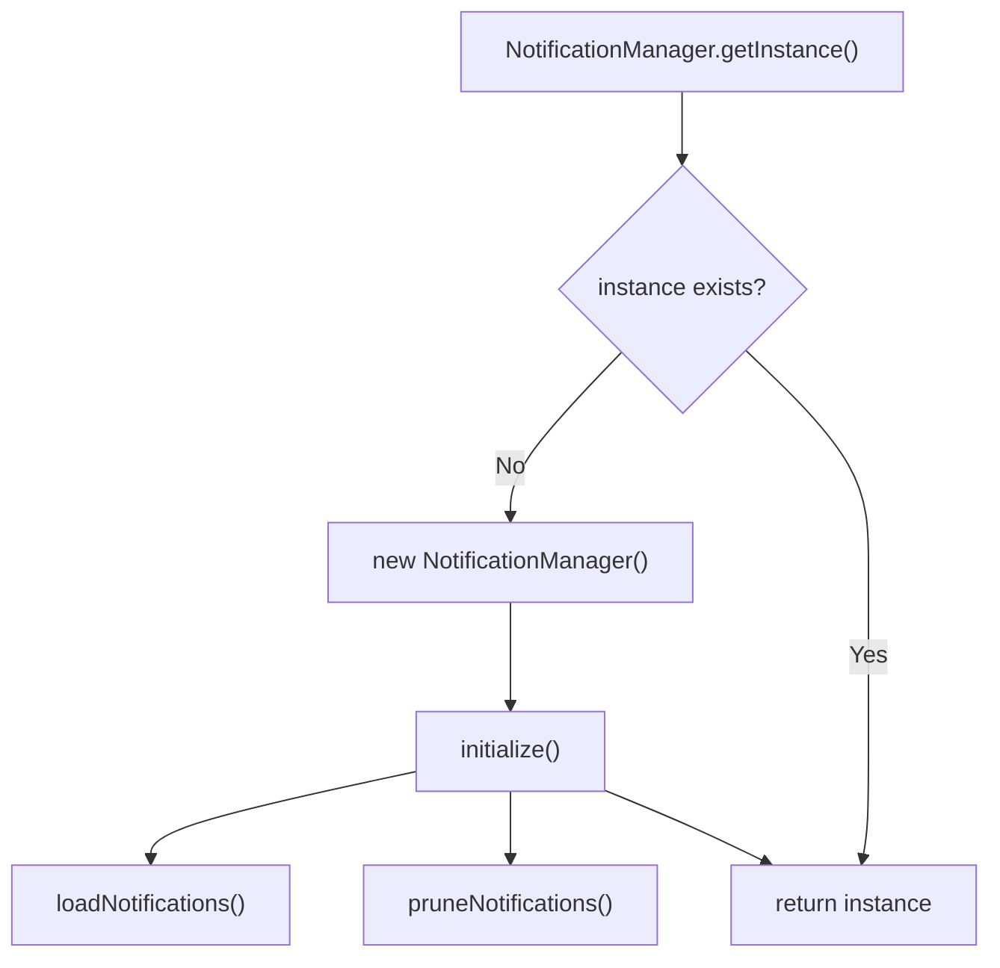
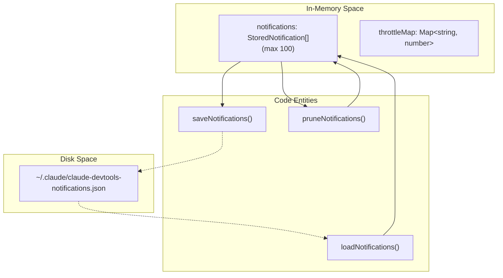
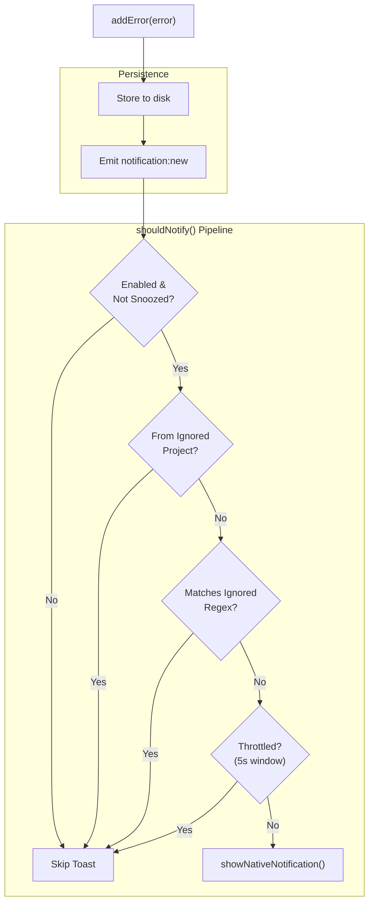
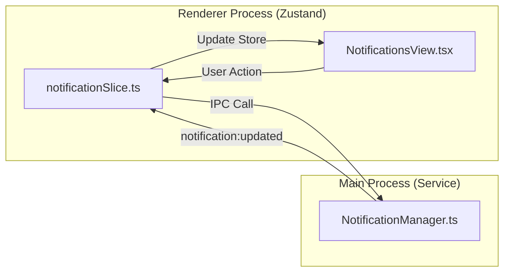

# Notification Manager

Relevant source files

The following files were used as context for generating this wiki page:

- [electron.vite.config.ts](electron.vite.config.ts)
- [src/main/services/infrastructure/NotificationManager.ts](src/main/services/infrastructure/NotificationManager.ts)
- [src/renderer/components/notifications/NotificationsView.tsx](src/renderer/components/notifications/NotificationsView.tsx)
- [src/renderer/store/slices/notificationSlice.ts](src/renderer/store/slices/notificationSlice.ts)
- [src/renderer/types/notifications.ts](src/renderer/types/notifications.ts)
- [test/renderer/store/notificationSlice.test.ts](test/renderer/store/notificationSlice.test.ts)

The `NotificationManager` service manages native macOS notifications and error history tracking for claude-devtools. It provides persistent storage of detected errors, implements multi-stage filtering to prevent notification spam, and emits IPC events for renderer synchronization.

---

## Overview

The `NotificationManager` class ([src/main/services/infrastructure/NotificationManager.ts:86]()) is a singleton service responsible for:

- **Persistence**: Storing up to 100 notifications at `~/.claude/claude-devtools-notifications.json` ([src/main/services/infrastructure/NotificationManager.ts:74-80]()).
- **Native notifications**: Showing macOS toast notifications via Electron's `Notification` API ([src/main/services/infrastructure/NotificationManager.ts:369-406]()).
- **Filtering pipeline**: Multi-stage filter to prevent spam, including status checks, repository ignores, regex filtering, and throttling ([src/main/services/infrastructure/NotificationManager.ts:219-366]()).
- **IPC events**: Broadcasting notification events (`notification:new`, `notification:updated`) to the renderer process ([src/main/services/infrastructure/NotificationManager.ts:409-438]()).
- **Read status tracking**: Managing unread counts and marking individual or all notifications as read ([src/main/services/infrastructure/NotificationManager.ts:500-573]()).

**Sources**: [src/main/services/infrastructure/NotificationManager.ts:1-13](), [src/main/services/infrastructure/NotificationManager.ts:86-92]()

---

## Initialization and Lifecycle

### Singleton Pattern

The `NotificationManager` uses a singleton pattern with lazy initialization.

Title: NotificationManager Singleton Initialization

The singleton can be reset for testing via `resetInstance()` or injected via `setInstance()` ([src/main/services/infrastructure/NotificationManager.ts:106-126]()).

### Main Process Integration

The notification manager is initialized during application startup and requires a reference to the `BrowserWindow` to emit IPC events via `setMainWindow()` ([src/main/services/infrastructure/NotificationManager.ts:151-153]()).

**Sources**: [src/main/services/infrastructure/NotificationManager.ts:106-153]()

---

## Storage and Persistence

### Storage Format

Notifications are stored as JSON at `~/.claude/claude-devtools-notifications.json` ([src/main/services/infrastructure/NotificationManager.ts:80]()). The `StoredNotification` interface extends `DetectedError` to include metadata for the UI ([src/main/services/infrastructure/NotificationManager.ts:36-41]()).

| Field | Type | Description |
|-------|------|-------------|
| `id` | `string` | Unique notification ID |
| `isRead` | `boolean` | Whether the notification has been read |
| `createdAt` | `number` | When the notification was created (ms) |
| `triggerName` | `string?` | Name of the trigger that generated the error |
| `message` | `string` | The error message content |
| `timestamp` | `number` | When the error originally occurred |

Title: Notification Storage Architecture

### Pruning Logic

When notifications exceed `MAX_NOTIFICATIONS` (100), the oldest are removed based on `createdAt` descending ([src/main/services/infrastructure/NotificationManager.ts:202-214]()).

**Sources**: [src/main/services/infrastructure/NotificationManager.ts:74-80](), [src/main/services/infrastructure/NotificationManager.ts:158-214]()

---

## Error Filtering Pipeline

The `shouldNotify()` method ([src/main/services/infrastructure/NotificationManager.ts:219]()) implements a multi-stage filter pipeline to determine whether to show a native toast notification. Note that even if a toast is skipped, the error is still stored in the history.

Title: Notification Filtering Pipeline

### Stage 1: Enabled Check
Checks `config.notifications.enabled` and `config.notifications.snoozedUntil`. If a snooze has expired, it is automatically cleared ([src/main/services/infrastructure/NotificationManager.ts:269-288]()).

### Stage 2: Project Filter
Checks if the error's `projectId` is in the `config.notifications.ignoredProjects` list ([src/main/services/infrastructure/NotificationManager.ts:317-342]()).

### Stage 3: Regex Filter
Tests `error.message` against patterns in `config.notifications.ignoredRegex` ([src/main/services/infrastructure/NotificationManager.ts:291-314]()).

### Stage 4: Throttle Filter
Prevents duplicate toasts for the same error (defined by `projectId:message` hash) within a 5-second window (`THROTTLE_MS`) ([src/main/services/infrastructure/NotificationManager.ts:233-248]()).

**Sources**: [src/main/services/infrastructure/NotificationManager.ts:219-366]()

---

## Renderer State Management

The renderer process maintains notification state via the `notificationSlice` in the Zustand store ([src/renderer/store/slices/notificationSlice.ts:43]()).

### notificationSlice Actions

| Action | Purpose | IPC Method Called |
|--------|---------|-------------------|
| `fetchNotifications` | Hydrates store with history | `api.notifications.get` |
| `markNotificationRead` | Marks single ID as read | `api.notifications.markRead` |
| `markAllNotificationsRead` | Scoped or global mark read | `api.notifications.markAllRead` |
| `deleteNotification` | Removes single notification | `api.notifications.delete` |
| `clearNotifications` | Scoped or global deletion | `api.notifications.clear` |

Title: Notification State Synchronization

### Scoped Operations
The UI allows filtering notifications by `triggerName` ([src/renderer/components/notifications/NotificationsView.tsx:107-113]()). Actions like `markAllNotificationsRead` can be scoped to the active filter, in which case the slice iterates through matching notifications and calls individual `markRead` IPC methods ([src/renderer/store/slices/notificationSlice.ts:103-124]()).

**Sources**: [src/renderer/store/slices/notificationSlice.ts:22-37](), [src/renderer/components/notifications/NotificationsView.tsx:32-53](), [test/renderer/store/notificationSlice.test.ts:90-103]()

---

## Tool Use ID Deduplication

The `addError()` method implements deduplication by `toolUseId` ([src/main/services/infrastructure/NotificationManager.ts:449]()). This prevents duplicate notifications when the same tool error is reported via different event streams (e.g., a subagent error appearing in the parent session).

1. If an error has a `toolUseId`, the manager checks for existing notifications with that ID ([src/main/services/infrastructure/NotificationManager.ts:452-454]()).
2. If an existing notification is found and lacks a `subagentId`, but the new error *has* a `subagentId`, the existing one is replaced to provide better context ([src/main/services/infrastructure/NotificationManager.ts:457-463]()).
3. Otherwise, the duplicate is skipped ([src/main/services/infrastructure/NotificationManager.ts:466-468]()).

**Sources**: [src/main/services/infrastructure/NotificationManager.ts:443-472]()
