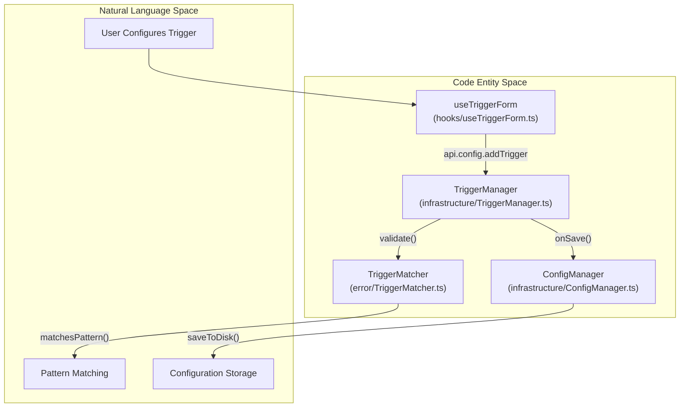
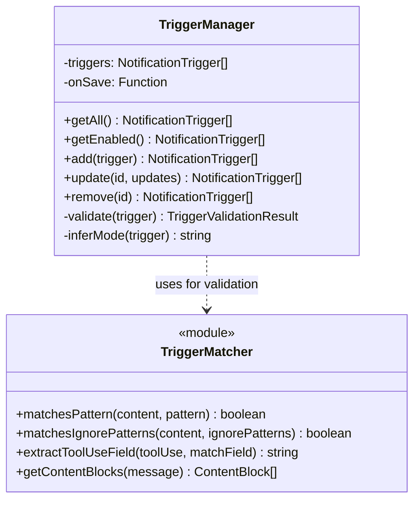

# Trigger System

Relevant source files

The following files were used as context for generating this wiki page:

- [src/main/services/error/TriggerMatcher.ts](src/main/services/error/TriggerMatcher.ts)
- [src/main/services/infrastructure/SshConfigParser.ts](src/main/services/infrastructure/SshConfigParser.ts)
- [src/main/services/infrastructure/TriggerManager.ts](src/main/services/infrastructure/TriggerManager.ts)
- [src/renderer/components/settings/NotificationTriggerSettings/hooks/useTriggerForm.ts](src/renderer/components/settings/NotificationTriggerSettings/hooks/useTriggerForm.ts)
- [src/renderer/components/settings/NotificationTriggerSettings/utils/trigger.ts](src/renderer/components/settings/NotificationTriggerSettings/utils/trigger.ts)

## Purpose and Scope

The **Trigger System** is a core component of the notification engine in `claude-devtools`. It defines the logic for detecting specific events, errors, or patterns within Claude Code session files. The system allows for both built-in safety alerts (e.g., sensitive file access) and user-defined custom triggers with advanced regex matching, token thresholds, and repository scoping.

This system is implemented primarily in the `TriggerManager` for lifecycle management and `TriggerMatcher` for pattern evaluation.

---

## Trigger Architecture

The trigger system bridges the gap between raw session data (JSONL files) and the notification pipeline.

### Data Flow and Logic

**Sources:** [src/main/services/infrastructure/TriggerManager.ts:72-79](), [src/main/services/error/TriggerMatcher.ts:60-67](), [src/renderer/components/settings/NotificationTriggerSettings/hooks/useTriggerForm.ts:91-106]()

---

## Trigger Configuration

Triggers are defined by the `NotificationTrigger` interface. They specify what content to watch and how to evaluate it.

### Built-in Triggers
The system provides three default triggers that cover common developer concerns. These are marked `isBuiltin: true` and cannot be removed, only disabled.

| ID | Name | Mode | Purpose |
|----|------|------|---------|
| `builtin-bash-command` | .env File Access Alert | `content_match` | Detects attempts to read or write `.env` files via `tool_use`. |
| `builtin-tool-result-error` | Tool Result Error | `error_status` | Catches any tool that returns an error status, excluding user interruptions. |
| `builtin-high-token-usage` | High Token Usage | `token_threshold` | Alerts when a session exceeds 8,000 total tokens. |

**Sources:** [src/main/services/infrastructure/TriggerManager.ts:30-66]()

### Trigger Modes
The `mode` property determines the evaluation logic:
1.  **`error_status`**: Checks if a `tool_result` contains an error flag. [src/main/services/infrastructure/TriggerManager.ts:168]()
2.  **`content_match`**: Performs regex matching against specific fields (e.g., `command`, `file_path`, `text`). [src/main/services/infrastructure/TriggerManager.ts:169]()
3.  **`token_threshold`**: Compares session token counts against a defined limit. [src/main/services/infrastructure/TriggerManager.ts:170]()

---

## Pattern Matching and Security

The `TriggerMatcher` service handles the execution of regex patterns. To prevent **Regular Expression Denial of Service (ReDoS)** attacks, the system uses a validation and caching layer.

### ReDoS Protection and Caching
-   **Validation**: All patterns are validated using `validateRegexPattern` before being accepted. [src/main/services/infrastructure/TriggerManager.ts:223-238]()
-   **Safe Compilation**: The system uses `createSafeRegExp` to instantiate patterns. [src/main/services/error/TriggerMatcher.ts:46]()
-   **LRU Cache**: Compiled `RegExp` objects are stored in `regexCache` (limited to 500 entries) to improve performance during heavy session scanning. [src/main/services/error/TriggerMatcher.ts:18-49]()

### Match Fields by Content Type
Depending on the `contentType`, different fields are available for matching:

| Content Type | Available Fields |
|--------------|------------------|
| `tool_use` | `command`, `file_path`, `old_string`, `new_string`, `url`, `query`, etc. |
| `tool_result`| `content` |
| `thinking`   | `thinking` |
| `text`       | `text` |

**Sources:** [src/renderer/components/settings/NotificationTriggerSettings/utils/trigger.ts:17-85]()

---

## Trigger Management

The `TriggerManager` class handles CRUD operations and ensures the integrity of the trigger list.

### Implementation Details
-   **Validation**: The `validate()` method ensures required fields (ID, Name, Mode) are present and that regex patterns are safe. [src/main/services/infrastructure/TriggerManager.ts:202-238]()
-   **Persistence**: Every mutation (`add`, `update`, `remove`) triggers the `onSave` callback, which persists the updated list to the application configuration. [src/main/services/infrastructure/TriggerManager.ts:124-158]()
-   **Immutability**: Built-in triggers are protected; attempts to `remove()` a built-in trigger will throw an error. [src/main/services/infrastructure/TriggerManager.ts:186-188]()

**Sources:** [src/main/services/infrastructure/TriggerManager.ts:72-193](), [src/main/services/error/TriggerMatcher.ts:60-121]()

---

## Testing and Preview

The system allows users to test triggers against historical data before saving them. This is facilitated by the `useTriggerForm` hook and the `api.config.testTrigger` IPC method.

### Test Execution Flow
1.  **Form Construction**: `buildTriggerForTest` creates a temporary `NotificationTrigger` from UI state. [src/renderer/components/settings/NotificationTriggerSettings/hooks/useTriggerForm.ts:136-174]()
2.  **Scanning**: The main process scans up to 100 historical sessions (limited to 30 seconds or 10,000 matches) to find hits. [src/renderer/components/settings/NotificationTriggerSettings/hooks/useTriggerForm.ts:84-90]()
3.  **Result Mapping**: Hits are returned as `TriggerTestResult`, which includes `toolUseId` and `lineNumber` for deep-linking. [src/renderer/components/settings/NotificationTriggerSettings/hooks/useTriggerForm.ts:113-128]()

**Sources:** [src/renderer/components/settings/NotificationTriggerSettings/hooks/useTriggerForm.ts:91-131]()
