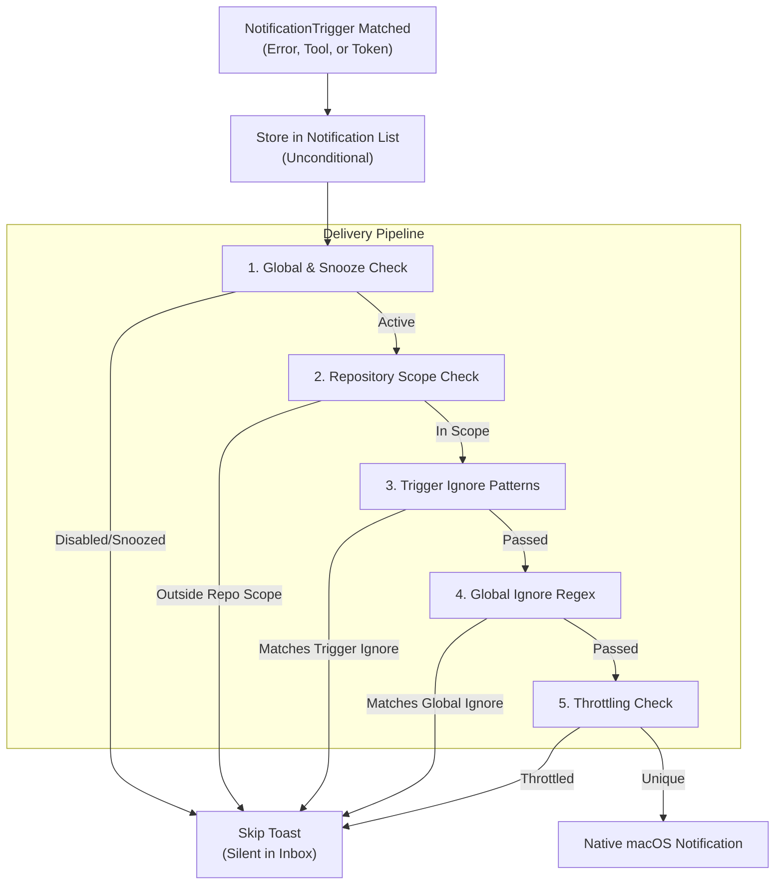
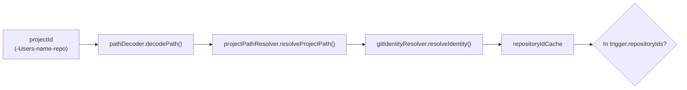

# Filtering & Throttling

Relevant source files

The following files were used as context for generating this wiki page:

- [src/main/ipc/config.ts](src/main/ipc/config.ts)
- [src/main/ipc/configValidation.ts](src/main/ipc/configValidation.ts)
- [src/main/services/error/ErrorTriggerChecker.ts](src/main/services/error/ErrorTriggerChecker.ts)
- [src/main/services/infrastructure/ConfigManager.ts](src/main/services/infrastructure/ConfigManager.ts)
- [src/main/utils/pathDecoder.ts](src/main/utils/pathDecoder.ts)
- [src/renderer/components/notifications/NotificationRow.tsx](src/renderer/components/notifications/NotificationRow.tsx)
- [src/renderer/components/settings/hooks/useSettingsConfig.ts](src/renderer/components/settings/hooks/useSettingsConfig.ts)
- [src/renderer/components/settings/hooks/useSettingsHandlers.ts](src/renderer/components/settings/hooks/useSettingsHandlers.ts)
- [src/renderer/components/settings/sections/GeneralSection.tsx](src/renderer/components/settings/sections/GeneralSection.tsx)
- [src/shared/types/notifications.ts](src/shared/types/notifications.ts)
- [test/main/ipc/guards.test.ts](test/main/ipc/guards.test.ts)
- [test/main/utils/pathDecoder.test.ts](test/main/utils/pathDecoder.test.ts)
- [test/mocks/electronAPI.ts](test/mocks/electronAPI.ts)

This page documents the notification filtering pipeline and throttling mechanisms that prevent notification spam in claude-devtools. These systems control whether detected errors trigger native macOS toast notifications, while preserving all errors in persistent storage for later review.

For information about the `NotificationManager` service and notification storage, see [Notification Manager](6.1). For information about error detection and custom triggers, see [Trigger System](6.2).

## Purpose and Scope

The filtering and throttling system addresses a fundamental challenge: Claude Code sessions can generate numerous events (errors, tool uses, high token usage) during intensive development. Without filtering, users would be overwhelmed by constant notifications. The system provides multiple layers of control:

1.  **Global enable/disable** - Master switch for all notifications. [src/main/services/infrastructure/ConfigManager.ts:35-35]()
2.  **Snooze timer** - Temporary silence for a specified duration. [src/main/services/infrastructure/ConfigManager.ts:39-40]()
3.  **Repository filtering** - Ignore errors from specific repository groups. [src/main/services/infrastructure/ConfigManager.ts:38-38]()
4.  **Regex pattern matching** - Filter notifications by message content or specific trigger fields. [src/main/services/infrastructure/ConfigManager.ts:37-37](), [src/main/services/infrastructure/ConfigManager.ts:147-147]()
5.  **Throttling** - Deduplicate identical notifications within a time window.

**Key Design Principle:** Filtering logic is decoupled from storage. All detected events matching a trigger are persisted to the notification store, but the filtering pipeline determines if a native UI toast is displayed. [src/shared/types/notifications.ts:22-60]()

Sources: [src/main/services/infrastructure/ConfigManager.ts:34-45](), [src/shared/types/notifications.ts:151-194]()

## Five-Stage Filtering Pipeline

When a notification is generated (via a `NotificationTrigger`), it passes through a series of checks to determine its delivery status.

### Pipeline Overview

Sources: [src/main/services/infrastructure/ConfigManager.ts:133-176](), [src/main/services/error/ErrorTriggerChecker.ts:98-114](), [src/main/services/error/TriggerMatcher.ts:34-36]()

## Stage 1: Enabled and Snooze Check

The first filter checks conditions from `NotificationConfig`:

| Condition | Configuration Key | Behavior |
| :--- | :--- | :--- |
| Global Enable | `notifications.enabled` | If `false`, all native notifications are suppressed. [src/main/services/infrastructure/ConfigManager.ts:35-35]() |
| Snooze Timer | `notifications.snoozedUntil` | If current Unix timestamp < `snoozedUntil`, notifications are suppressed. [src/main/services/infrastructure/ConfigManager.ts:39-39]() |

Snooze is managed via `config:snooze` and `config:clearSnooze` IPC handlers. [src/main/ipc/config.ts:96-97]()

Sources: [src/main/services/infrastructure/ConfigManager.ts:34-45](), [src/main/ipc/config.ts:96-97]()

## Stage 2: Repository Scope Check

Triggers can be scoped to specific repositories. If a trigger has `repositoryIds` defined, the system resolves the current project's repository identity to see if it matches. [src/main/services/infrastructure/ConfigManager.ts:171-171]()

### Repository Resolution Logic

The `ErrorTriggerChecker` uses `GitIdentityResolver` to map a `projectId` (encoded path) to a stable repository ID. [src/main/services/error/ErrorTriggerChecker.ts:65-75]()

Sources: [src/main/services/error/ErrorTriggerChecker.ts:56-75](), [src/main/services/error/ErrorTriggerChecker.ts:98-114]()

## Stage 3: Trigger-Specific Ignore Patterns

Each `NotificationTrigger` can define its own `ignorePatterns`. These are regex strings tested against the specific field that matched the trigger (e.g., the error message or tool command). [src/main/services/infrastructure/ConfigManager.ts:147-147]()

*   **Logic:** If `matchesIgnorePatterns(content, trigger.ignorePatterns)` returns true, the notification is suppressed. [src/main/services/error/TriggerMatcher.ts:34-36]()
*   **Evaluation:** Patterns are compiled into case-insensitive regular expressions. [src/main/services/error/ErrorTriggerChecker.ts:179-181]()

Sources: [src/main/services/infrastructure/ConfigManager.ts:147-147](), [src/main/services/error/ErrorTriggerChecker.ts:179-181]()

## Stage 4: Global Ignore Regex

In addition to trigger-specific ignores, there is a global `ignoredRegex` list in the notification config. [src/main/services/infrastructure/ConfigManager.ts:37-37]()

*   **Usage:** Typically used for broad suppression of known-safe errors across all projects.
*   **Management:** Handlers `config:addIgnoreRegex` and `config:removeIgnoreRegex` allow users to update this list. [src/main/ipc/config.ts:88-89]()
*   **Validation:** Patterns are validated during the IPC call to ensure they are valid regular expressions before being saved. [src/main/ipc/config.ts:199-204]()

Sources: [src/main/services/infrastructure/ConfigManager.ts:37-37](), [src/main/ipc/config.ts:199-204]()

## Stage 5: Throttling Mechanism

Throttling prevents notification fatigue by deduplicating identical events within a time window. This is critical when Claude enters a loop or repeats a failing tool call.

### Throttle Logic Implementation

The system maintains a sliding window (typically 5-10 seconds) for unique event signatures.

1.  **Signature Generation:** A hash is created from `projectId`, `triggerId`, and the primary content (e.g., `message`).
2.  **Check:** If the signature exists in the recent history map, the notification is suppressed.
3.  **Cleanup:** Expired signatures are pruned from the map periodically.

Sources: [src/main/services/infrastructure/ConfigManager.ts:34-45](), [src/shared/types/notifications.ts:22-60]()

## Configuration Management via IPC

The `ConfigManager` provides the backend for these filters, while the `registerConfigHandlers` function exposes them to the renderer. [src/main/ipc/config.ts:80-126]()

### IPC Handler Reference

| Handler | Parameters | Purpose |
| :--- | :--- | :--- |
| `config:addIgnoreRegex` | `pattern: string` | Adds a global regex suppression. [src/main/ipc/config.ts:190-210]() |
| `config:addIgnoreRepository` | `repositoryId: string` | Suppresses all notifications from a specific repo. [src/main/ipc/config.ts:233-250]() |
| `config:snooze` | `minutes: number` | Temporarily silences all notifications. [src/main/ipc/config.ts:273-286]() |
| `config:updateTrigger` | `id, updates` | Modifies `ignorePatterns` for a specific trigger. [src/main/ipc/config.ts:101-101]() |

### Validation Layer

All configuration updates pass through `validateConfigUpdatePayload` to ensure type safety and prevent invalid data from corrupting the configuration file. [src/main/ipc/configValidation.ts:31-37]()

*   **Regex Validation:** Checks syntax using `new RegExp(pattern)`. [src/main/ipc/config.ts:201-201]()
*   **Snooze Validation:** Caps duration to 24 hours (1440 minutes). [src/main/ipc/configValidation.ts:46-46]()
*   **Trigger Validation:** Ensures mandatory fields like `id`, `name`, and `mode` are present. [src/main/ipc/configValidation.ts:60-95]()

Sources: [src/main/ipc/config.ts:80-126](), [src/main/ipc/configValidation.ts:1-193]()

## UI Integration

The renderer process interacts with these mechanisms through the Settings interface.

*   **`useSettingsHandlers`**: Provides React callbacks for toggling notification states and managing ignore lists. [src/renderer/components/settings/hooks/useSettingsHandlers.ts:92-128]()
*   **`useSettingsConfig`**: Manages the optimistic state of filters so the UI feels responsive even before the disk write completes. [src/renderer/components/settings/hooks/useSettingsConfig.ts:115-145]()
*   **`GeneralSection`**: Handles the configuration of the Claude root path, which influences how project paths are decoded for repository matching. [src/renderer/components/settings/sections/GeneralSection.tsx:123-149]()

Sources: [src/renderer/components/settings/hooks/useSettingsHandlers.ts:1-215](), [src/renderer/components/settings/hooks/useSettingsConfig.ts:1-205]()
