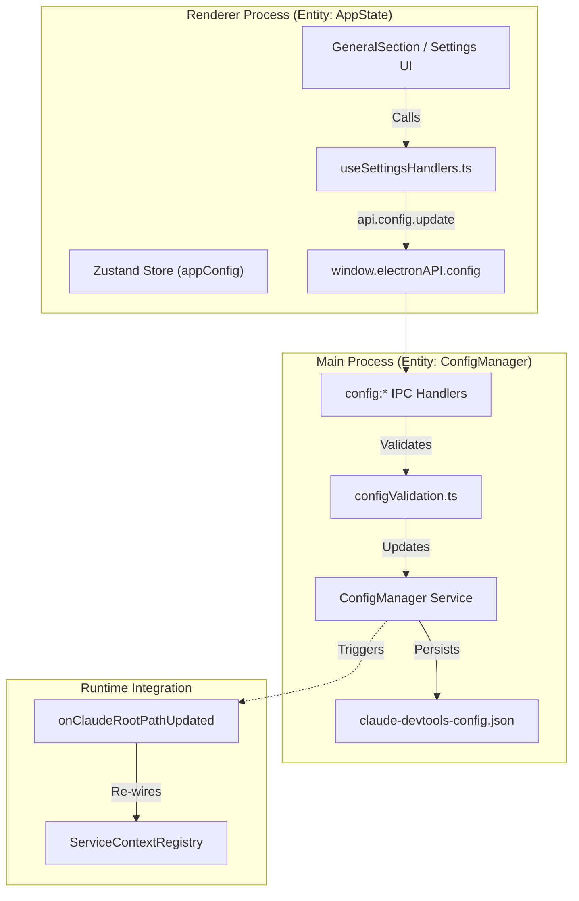
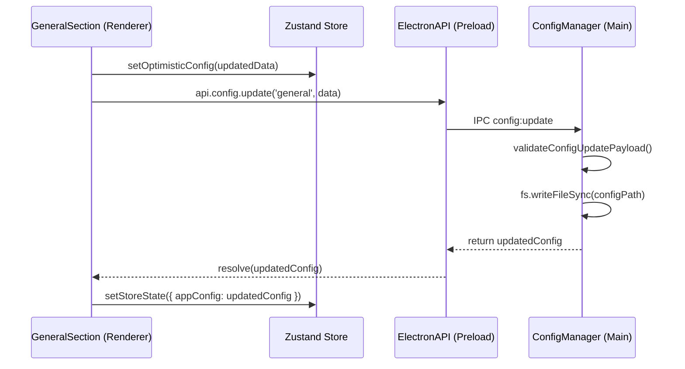

# Configuration Management

Relevant source files

The following files were used as context for generating this wiki page:

- [src/main/ipc/configValidation.ts](src/main/ipc/configValidation.ts)
- [src/main/ipc/context.ts](src/main/ipc/context.ts)
- [src/main/ipc/handlers.ts](src/main/ipc/handlers.ts)
- [src/main/ipc/ssh.ts](src/main/ipc/ssh.ts)
- [src/main/services/infrastructure/ConfigManager.ts](src/main/services/infrastructure/ConfigManager.ts)
- [src/renderer/components/settings/hooks/useSettingsConfig.ts](src/renderer/components/settings/hooks/useSettingsConfig.ts)
- [src/renderer/components/settings/hooks/useSettingsHandlers.ts](src/renderer/components/settings/hooks/useSettingsHandlers.ts)
- [src/renderer/components/settings/sections/GeneralSection.tsx](src/renderer/components/settings/sections/GeneralSection.tsx)
- [src/renderer/store/slices/connectionSlice.ts](src/renderer/store/slices/connectionSlice.ts)
- [src/shared/types/notifications.ts](src/shared/types/notifications.ts)

Configuration Management handles application settings persistence, Claude root path detection, and runtime configuration updates. It provides a centralized `ConfigManager` service that persists user preferences to disk and exposes them to the renderer process via IPC handlers.

For details on specific IPC channels and their parameters, see [Config IPC Handlers](#7.1). For Claude root path auto-detection and WSL integration, see [Claude Root Detection](#7.2).

## Overview

Configuration is stored as a JSON file managed by the `ConfigManager` singleton in the main process. The renderer accesses configuration via `window.electronAPI.config.*` methods, which invoke IPC handlers that delegate to the service layer. Configuration updates trigger callbacks that can re-initialize services (e.g., switching the Claude root path triggers project rescanning).

**Key components:**
- **ConfigManager** ([src/main/services/infrastructure/ConfigManager.ts:24-24]()): Singleton service managing the config file at `~/.claude/claude-devtools-config.json` [src/main/services/infrastructure/ConfigManager.ts:26-28]().
- **Config IPC Handlers** ([src/main/ipc/handlers.ts:19-19]()): Handlers for reading/updating configuration sections, initialized via `initializeConfigHandlers` [src/main/ipc/handlers.ts:82-84]().
- **GeneralSection** ([src/renderer/components/settings/sections/GeneralSection.tsx:34-39]()): UI for Claude root selection, theme management, and WSL detection.
- **useSettingsConfig** ([src/renderer/components/settings/hooks/useSettingsConfig.ts:72-72]()): Hook for managing settings state and providing safe defaults [src/renderer/components/settings/hooks/useSettingsConfig.ts:151-179]().

## Configuration Architecture

The following diagram illustrates the flow from UI interactions to disk persistence and service re-wiring.

Title: Configuration Management Data Flow

**Sources:** [src/main/services/infrastructure/ConfigManager.ts:1-28](), [src/main/ipc/handlers.ts:82-84](), [src/renderer/components/settings/hooks/useSettingsHandlers.ts:1-13](), [src/renderer/components/settings/hooks/useSettingsConfig.ts:130-145]()

## Configuration Structure

The `AppConfig` interface defines several sections stored in the JSON file [src/main/services/infrastructure/ConfigManager.ts:217-224]():

| Section | Key Fields | Purpose |
|---------|------------|---------|
| **general** | `theme`, `claudeRootPath`, `launchAtLogin` | Core app behavior and pathing [src/main/services/infrastructure/ConfigManager.ts:178-186](). |
| **notifications** | `enabled`, `triggers`, `ignoredRepositories`, `snoozedUntil` | Alerting rules and silence periods [src/main/services/infrastructure/ConfigManager.ts:34-45](). |
| **display** | `showTimestamps`, `compactMode`, `syntaxHighlighting` | UI presentation preferences [src/main/services/infrastructure/ConfigManager.ts:188-192](). |
| **ssh** | `profiles`, `lastConnection`, `autoReconnect` | Remote connection persistence [src/main/services/infrastructure/ConfigManager.ts:199-210](). |
| **httpServer** | `enabled`, `port` | Sidecar API configuration [src/main/services/infrastructure/ConfigManager.ts:212-215](). |

**Sources:** [src/main/services/infrastructure/ConfigManager.ts:34-224]()

## IPC Handler Registration

IPC handlers are orchestrated in `src/main/ipc/handlers.ts` [src/main/ipc/handlers.ts:1-14](). Configuration handlers are registered via `registerConfigHandlers(ipcMain)` [src/main/ipc/handlers.ts:94-94]().

| Handler Channel | Functionality |
|-----------------|---------------|
| `config:get` | Retrieves the full current `AppConfig` [src/renderer/components/settings/hooks/useSettingsConfig.ts:94-94](). |
| `config:update` | Validates and updates a specific config section [src/main/ipc/configValidation.ts:31-37](). |
| `config:snooze` | Sets a temporary suppression for notifications [src/renderer/components/settings/hooks/useSettingsHandlers.ts:103-103](). |
| `config:getClaudeRootInfo` | Returns auto-detected vs override paths [src/renderer/components/settings/sections/GeneralSection.tsx:66-66](). |
| `config:findWslClaudeRoots` | Scans WSL distributions for Claude session data [src/renderer/components/settings/sections/GeneralSection.tsx:211-211](). |

**Sources:** [src/main/ipc/handlers.ts:82-94](), [src/renderer/components/settings/hooks/useSettingsHandlers.ts:99-106](), [src/main/ipc/configValidation.ts:31-37]()

## Configuration Update Flow

When a user toggles a setting in the UI, the system performs an optimistic update in the renderer's state before persisting to the main process.

Title: Settings Update Sequence

**Sources:** [src/renderer/components/settings/hooks/useSettingsConfig.ts:116-145](), [src/main/ipc/configValidation.ts:1-4]()

## Claude Root Path System

The Claude root path is critical for session discovery. The application tracks both the default platform path and user overrides.

### Path Resolution
The `GeneralSection` component uses `api.config.getClaudeRootInfo()` to display current path status [src/renderer/components/settings/sections/GeneralSection.tsx:64-73](). If a user selects a new folder via `api.config.selectClaudeRootFolder()`, the system validates it contains a `projects` directory [src/renderer/components/settings/sections/GeneralSection.tsx:151-182]().

### Runtime Re-wiring
When the `claudeRootPath` is updated, the `onClaudeRootPathUpdated` callback is executed [src/main/ipc/handlers.ts:71-71](). This triggers a workspace reset in the renderer, clearing projects and repository groups to ensure the UI reflects the new root [src/renderer/components/settings/sections/GeneralSection.tsx:100-121]().

**Sources:** [src/renderer/components/settings/sections/GeneralSection.tsx:123-149](), [src/main/ipc/handlers.ts:82-84]()

## SSH Persistence

The `ConfigManager` persists SSH connection details to enable seamless reconnections. This includes:
- **Profiles**: Saved SSH host configurations [src/main/services/infrastructure/ConfigManager.ts:208-208]().
- **Last Connection**: Metadata about the most recent session (host, port, user) to pre-fill connection forms [src/main/services/infrastructure/ConfigManager.ts:200-206]().
- **Active Context**: Tracking whether the app should launch into a local or specific SSH context [src/main/services/infrastructure/ConfigManager.ts:209-209]().

When an SSH connection is established, the `connectionSlice` calls `api.ssh.saveLastConnection` to update these settings [src/renderer/store/slices/connectionSlice.ts:112-120]().

**Sources:** [src/main/services/infrastructure/ConfigManager.ts:199-210](), [src/renderer/store/slices/connectionSlice.ts:65-129]()

## Validation and Safety

To prevent configuration corruption, the system employs runtime validation:
- **Type Checking**: Payloads for `config:update` are checked against allowed keys and types in `configValidation.ts` [src/main/ipc/configValidation.ts:39-45]().
- **Constraint Enforcement**: For example, `snoozeMinutes` is capped at 1440 minutes (24 hours) [src/main/ipc/configValidation.ts:46-46]().
- **Safe Defaults**: The `useSettingsConfig` hook ensures that even if the config file is missing or partial, the UI receives valid default values to prevent crashes [src/renderer/components/settings/hooks/useSettingsConfig.ts:151-179]().

**Sources:** [src/main/ipc/configValidation.ts:48-95](), [src/renderer/components/settings/hooks/useSettingsConfig.ts:151-179]()
