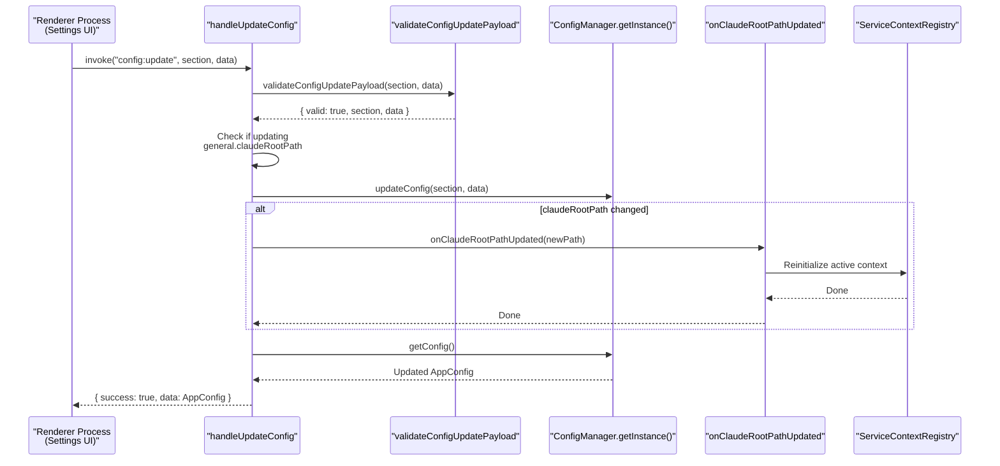
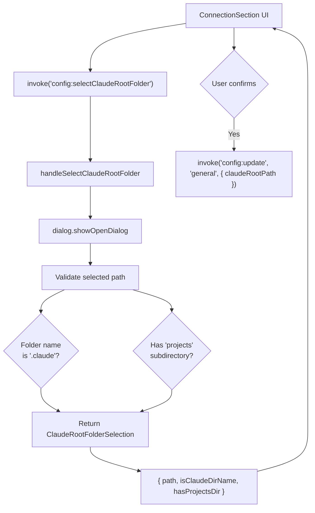
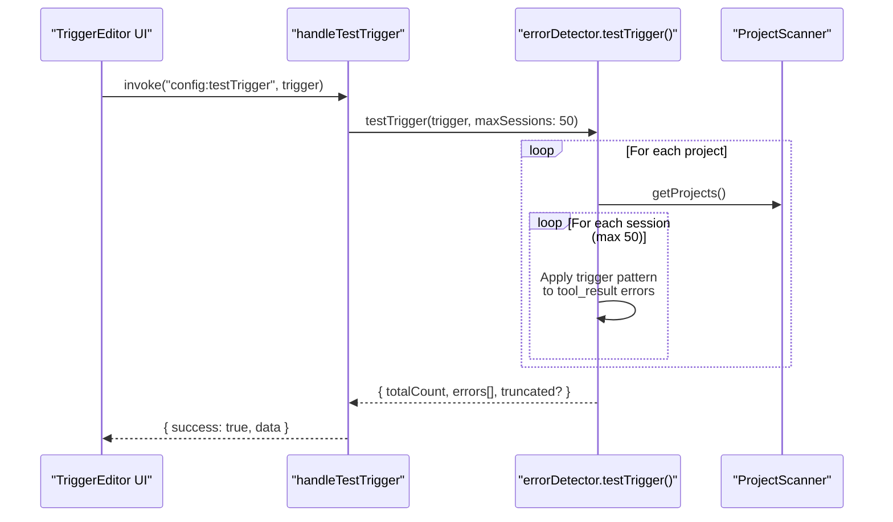

# Config IPC Handlers

<details>
<summary>Relevant source files</summary>

The following files were used as context for generating this wiki page:

- [src/main/http/config.ts](src/main/http/config.ts)
- [src/main/http/events.ts](src/main/http/events.ts)
- [src/main/http/notifications.ts](src/main/http/notifications.ts)
- [src/main/http/projects.ts](src/main/http/projects.ts)
- [src/main/http/ssh.ts](src/main/http/ssh.ts)
- [src/main/http/subagents.ts](src/main/http/subagents.ts)
- [src/main/ipc/config.ts](src/main/ipc/config.ts)
- [src/main/ipc/context.ts](src/main/ipc/context.ts)
- [src/main/ipc/handlers.ts](src/main/ipc/handlers.ts)
- [src/main/ipc/ssh.ts](src/main/ipc/ssh.ts)
- [src/main/services/error/ErrorTriggerChecker.ts](src/main/services/error/ErrorTriggerChecker.ts)
- [src/main/utils/pathDecoder.ts](src/main/utils/pathDecoder.ts)
- [src/renderer/components/notifications/NotificationRow.tsx](src/renderer/components/notifications/NotificationRow.tsx)
- [src/renderer/store/slices/connectionSlice.ts](src/renderer/store/slices/connectionSlice.ts)
- [test/main/ipc/guards.test.ts](test/main/ipc/guards.test.ts)
- [test/main/utils/pathDecoder.test.ts](test/main/utils/pathDecoder.test.ts)
- [test/mocks/electronAPI.ts](test/mocks/electronAPI.ts)

</details>


## Purpose and Scope

The config IPC handlers module provides the inter-process communication interface for all application configuration operations. It exposes IPC channels in the `config:*` namespace that the renderer process uses to read and modify settings stored by the `ConfigManager` [src/main/ipc/config.ts:5-17]().

This page documents the IPC layer specifically. For information about configuration persistence and the underlying storage, see [Configuration Management](#7). For Claude root path auto-detection logic, see [Claude Root Detection](#7.2). For the UI that calls these handlers, see [Settings Interface](#9.4).

**Sources:** [src/main/ipc/config.ts:1-126]()

## Handler Registration

The module exports two initialization functions that must be called during main process startup [src/main/ipc/handlers.ts:64-73]():

```typescript
initializeConfigHandlers(options: {
  onClaudeRootPathUpdated?: (claudeRootPath: string | null) => Promise<void> | void;
})
```

Registers optional callbacks that require app-level services. The `onClaudeRootPathUpdated` callback allows the main process to respond to Claude root path changes at runtime by reinitializing the active service context [src/main/ipc/config.ts:69-75]().

```typescript
registerConfigHandlers(ipcMain: IpcMain)
```

Registers all config IPC handlers with Electron's `ipcMain` [src/main/ipc/config.ts:80-126](). Called once during application initialization via `initializeIpcHandlers` [src/main/ipc/handlers.ts:94]().

### IPC Channel Mapping

| Code Entity (Handler) | IPC Channel Name | Purpose |
|:---|:---|:---|
| `handleGetConfig` | `config:get` | Returns full `AppConfig` object |
| `handleUpdateConfig` | `config:update` | Updates a config section with runtime callback support |
| `handleAddTrigger` | `config:addTrigger` | Add custom notification trigger |
| `handleUpdateTrigger` | `config:updateTrigger` | Update existing trigger properties |
| `handleRemoveTrigger` | `config:removeTrigger` | Delete trigger by ID |
| `handleGetTriggers` | `config:getTriggers` | List all triggers (built-in + custom) |
| `handleTestTrigger` | `config:testTrigger` | Test trigger against historical sessions |
| `handleAddIgnoreRegex` | `config:addIgnoreRegex` | Add regex pattern to notification ignore list |
| `handleRemoveIgnoreRegex` | `config:removeIgnoreRegex` | Remove regex pattern from ignore list |
| `handleAddIgnoreRepository` | `config:addIgnoreRepository` | Add repository ID to ignore list |
| `handleRemoveIgnoreRepository` | `config:removeIgnoreRepository` | Remove repository ID from ignore list |
| `handleSnooze` | `config:snooze` | Set snooze duration |
| `handleClearSnooze` | `config:clearSnooze` | Clear active snooze timer |
| `handlePinSession` | `config:pinSession` | Pin session to top of project list |
| `handleUnpinSession` | `config:unpinSession` | Unpin session from project |
| `handleSelectFolders` | `config:selectFolders` | Open native folder picker (multi-select) |
| `handleSelectClaudeRootFolder` | `config:selectClaudeRootFolder` | Open folder picker for Claude root |
| `handleGetClaudeRootInfo` | `config:getClaudeRootInfo` | Get current/default/custom Claude root paths |
| `handleFindWslClaudeRoots` | `config:findWslClaudeRoots` | Detect WSL Claude root candidates (Windows only) |
| `handleOpenInEditor` | `config:openInEditor` | Open config JSON in external editor |

**Sources:** [src/main/ipc/config.ts:80-126](), [src/main/ipc/handlers.ts:64-101]()

## Config Update Flow with Runtime Callback

The `handleUpdateConfig` handler includes special logic to trigger runtime context reinitialization when the Claude root path changes [src/main/ipc/config.ts:162-176]():



**Implementation Details:**

1.  **Validation:** Uses `validateConfigUpdatePayload` to ensure type safety before calling `ConfigManager` [src/main/ipc/config.ts:157-160]().
2.  **Detection:** Checks if the update includes `general.claudeRootPath` property [src/main/ipc/config.ts:162-164]().
3.  **Callback Invocation:** If Claude root changed and `onClaudeRootPathUpdated` callback is registered, it's called with the new path [src/main/ipc/config.ts:168-176]().
4.  **Error Handling:** Callback errors are logged but don't fail the config update operation [src/main/ipc/config.ts:174-175]().

**Sources:** [src/main/ipc/config.ts:151-184]()

## Claude Root Selection System

The config handlers provide three mechanisms for selecting the Claude root path:

### Manual Folder Selection



The handler performs path validation and returns metadata to help the UI present confirmation dialogs [src/main/ipc/config.ts:648-696]().

### WSL Claude Root Detection (Windows)

On Windows, `handleFindWslClaudeRoots` detects Claude roots inside WSL2 distributions via UNC paths [src/main/ipc/config.ts:742-750]().

1.  **Executable Search:** Tries various `wsl.exe` locations [src/main/ipc/config.ts:752-763]().
2.  **Distro Parsing:** Executes `wsl --list --quiet` and decodes the UTF-16 LE output [src/main/ipc/config.ts:765-812]().
3.  **Home Resolution:** Runs `sh -lc 'printf %s "$HOME"'` inside each distro to find the POSIX home [src/main/ipc/config.ts:886-896]().
4.  **Path Construction:** Maps POSIX home to UNC path `\\wsl.localhost\<distro>\home\...` [src/main/ipc/config.ts:930-935]().

**Sources:** [src/main/ipc/config.ts:742-959]()

## Trigger Testing System

The `handleTestTrigger` handler runs a trigger pattern against historical session data to preview detection results [src/main/ipc/config.ts:464-470]().



**Safety Limits:**
*   Maximum 50 sessions scanned [src/main/ipc/config.ts:488]().
*   Results are truncated if they exceed internal safety thresholds [src/main/ipc/config.ts:505-509]().

**Sources:** [src/main/ipc/config.ts:464-516](), [src/main/services/error/ErrorTriggerChecker.ts:157-198]()

## Integration with Services

All handlers interact with the singleton `ConfigManager` instance [src/main/ipc/config.ts:53]().

| Handler Action | ConfigManager Method | Purpose |
|:---|:---|:---|
| `handleGetConfig` | `getConfig()` | Read full config [src/main/ipc/config.ts:138]() |
| `handleUpdateConfig` | `updateConfig()` | Update section [src/main/ipc/config.ts:166]() |
| `handleAddIgnoreRegex` | `addIgnoreRegex()` | Add to ignore list [src/main/ipc/config.ts:207]() |
| `handleSnooze` | `setSnooze()` | Set snooze timer [src/main/ipc/config.ts:291]() |
| `handleAddTrigger` | `addTrigger()` | Add trigger [src/main/ipc/config.ts:347]() |

**Sources:** [src/main/ipc/config.ts:53-350]()

## Renderer Integration

The renderer accesses these handlers through the `api.config` object defined in the preload script [test/mocks/electronAPI.ts:56-77]().


**Sources:** [test/mocks/electronAPI.ts:129-179](), [src/renderer/store/slices/connectionSlice.ts:120]()

## Handler Cleanup

The module exports `removeConfigHandlers()` to clean up all registered handlers during application shutdown [src/main/ipc/config.ts:969-991]().

```typescript
export function removeConfigHandlers(ipcMain: IpcMain): void {
  ipcMain.removeHandler('config:get');
  ipcMain.removeHandler('config:update');
  // ...
}
```

**Sources:** [src/main/ipc/config.ts:969-991](), [src/main/ipc/handlers.ts:115]()
