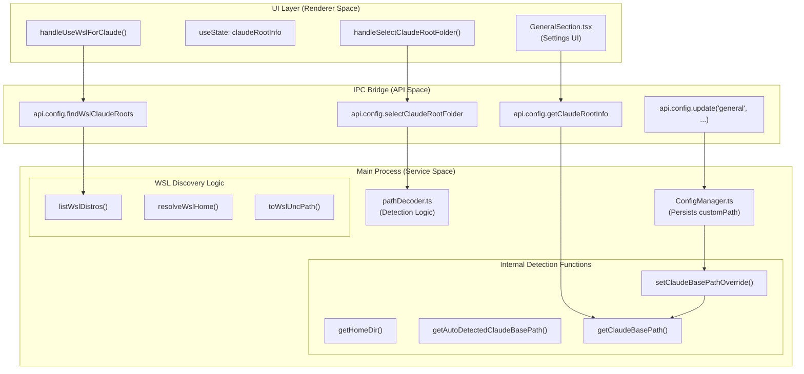
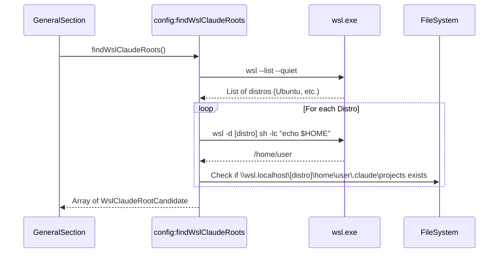

# Claude Root Detection

<details>
<summary>Relevant source files</summary>

The following files were used as context for generating this wiki page:

- [src/main/ipc/configValidation.ts](src/main/ipc/configValidation.ts)
- [src/main/services/infrastructure/ConfigManager.ts](src/main/services/infrastructure/ConfigManager.ts)
- [src/preload/index.ts](src/preload/index.ts)
- [src/renderer/api/httpClient.ts](src/renderer/api/httpClient.ts)
- [src/renderer/components/settings/hooks/useSettingsConfig.ts](src/renderer/components/settings/hooks/useSettingsConfig.ts)
- [src/renderer/components/settings/hooks/useSettingsHandlers.ts](src/renderer/components/settings/hooks/useSettingsHandlers.ts)
- [src/renderer/components/settings/sections/GeneralSection.tsx](src/renderer/components/settings/sections/GeneralSection.tsx)
- [src/shared/types/api.ts](src/shared/types/api.ts)
- [src/shared/types/notifications.ts](src/shared/types/notifications.ts)

</details>


This page documents the system responsible for locating and configuring the Claude data directory (typically `~/.claude`), which contains session logs, project data, and configuration files. The system supports auto-detection, manual selection, and Windows Subsystem for Linux (WSL) integration.

For SSH remote path configuration, see [SSH Remote Access](). For general configuration management, see [Configuration Management]().

---

## Purpose and Scope

The Claude Root Detection system determines where `claude-devtools` should read session data from on the local filesystem. It provides:

- **Auto-detection** of the default `~/.claude` directory across platforms.
- **Manual override** via a native folder picker dialog.
- **WSL integration** for Windows users running Claude in Linux environments.
- **Path validation** to ensure selected directories contain the expected structure (e.g., a `projects` folder).
- **Runtime reconfiguration** that updates the application state without requiring a restart.

This system handles **local** filesystem paths. Remote paths accessed via SSH are managed by the `SshConnectionManager` [src/main/services/ssh/SshConnectionManager.ts:1-20]().

---

## System Architecture

The following diagram maps the Natural Language concepts to the specific Code Entities involved in the detection and override flow.

### Logic Flow: UI to Code Entities



**Sources:** [src/renderer/components/settings/sections/GeneralSection.tsx:52-182](), [src/main/ipc/config.ts:649-732](), [src/main/utils/pathDecoder.ts:228-310]()

---

## Auto-Detection Logic

The system automatically detects the Claude root directory by locating the user's home directory and appending `.claude`.

### Home Directory Resolution

The `getHomeDir()` function uses a cross-platform fallback chain to ensure reliability across macOS, Linux, and Windows.

**Implementation:** [src/main/utils/pathDecoder.ts:228-234]()

| Platform | Typical Result |
|----------|----------------|
| macOS | `/Users/username` |
| Linux | `/home/username` |
| Windows | `C:\Users\username` |

### Default Path Construction

`getAutoDetectedClaudeBasePath()` returns the default path regardless of any active overrides.

```typescript
// Simplified logic from pathDecoder.ts
const defaultPath = path.join(getHomeDir(), '.claude');
```

**Implementation:** [src/main/utils/pathDecoder.ts:245-247]()

---

## Manual Selection and Validation

Users can override the auto-detected path via the folder picker dialog in the Settings UI.

### Folder Selection Flow

1. **Selection**: The renderer calls `api.config.selectClaudeRootFolder()` [src/shared/types/api.ts:100]().
2. **Native Dialog**: The main process opens a native directory picker.
3. **Validation**: Upon selection, the system checks:
   - If the folder name is exactly `.claude` [src/shared/types/api.ts:134]().
   - If the folder contains a `projects` directory [src/shared/types/api.ts:135]().
4. **Normalization**: The path is passed through `normalizeOverridePath()` to ensure it is absolute and lacks trailing slashes [src/main/utils/pathDecoder.ts:249-275]().

### Path Normalization Rules

| Input | Output | Notes |
|-------|--------|-------|
| `/Users/name/.claude/` | `/Users/name/.claude` | Trailing slash removed |
| `C:\Users\name\.claude\` | `C:\Users\name\.claude` | Windows path normalized |
| `.claude` | `null` | Relative path rejected |

**Sources:** [src/main/utils/pathDecoder.ts:249-275](), [src/renderer/components/settings/sections/GeneralSection.tsx:151-182]()

---

## WSL Integration (Windows Only)

On Windows, users can select Claude data directories from WSL distributions via UNC paths (e.g., `\\wsl.localhost\Ubuntu\home\user\.claude`).

### WSL Discovery Logic

The system executes `wsl.exe` to discover installed distributions and their respective home directories.



**Implementation Details:**
- **Encoding Detection**: WSL output can be UTF-16 LE or UTF-8; the system detects this via byte-pattern heuristics [src/main/ipc/config.ts:765-796]().
- **UNC Conversion**: POSIX paths are converted using the `\\wsl.localhost\[distro]` prefix [src/main/ipc/config.ts:747-750]().

**Sources:** [src/main/ipc/config.ts:734-959](), [src/renderer/components/settings/sections/GeneralSection.tsx:207-235]()

---

## Runtime Override and Persistence

The override path is managed through both persistent storage and in-memory state.

### Persistent Storage
The `ConfigManager` persists the `claudeRootPath` in `~/.claude/claude-devtools-config.json` under the `general` section [src/main/services/infrastructure/ConfigManager.ts:183]().

### In-Memory State
The `pathDecoder` module maintains a module-level variable `claudeBasePathOverride` [src/main/utils/pathDecoder.ts:281]().

```typescript
export function getClaudeBasePath(): string {
  return claudeBasePathOverride ?? getAutoDetectedClaudeBasePath();
}
```

### Workspace Reset on Change
When a new Claude root is applied in the UI, the application performs a "Soft Reset" of the workspace state to ensure data consistency.

**Reset Actions:**
- Clears `projects` and `repositoryGroups` in the Zustand store [src/renderer/components/settings/sections/GeneralSection.tsx:101-103]().
- Resets the `paneLayout` and `openTabs` [src/renderer/components/settings/sections/GeneralSection.tsx:104-118]().
- Re-triggers `fetchProjects()` and `fetchRepositoryGroups()` using the new path [src/renderer/components/settings/sections/GeneralSection.tsx:134]().

**Sources:** [src/renderer/components/settings/sections/GeneralSection.tsx:100-149](), [src/main/utils/pathDecoder.ts:281-295](), [src/main/services/infrastructure/ConfigManager.ts:178-186]()

---

## Summary of IPC Handlers

The following handlers in `src/main/ipc/config.ts` facilitate the root detection system:

| Channel | Description |
|---------|-------------|
| `config:getClaudeRootInfo` | Returns the default, resolved, and custom paths [src/main/ipc/config.ts:701-732](). |
| `config:selectClaudeRootFolder` | Opens the folder picker and validates the selection [src/main/ipc/config.ts:649-696](). |
| `config:findWslClaudeRoots` | Scans WSL distributions for Claude data [src/main/ipc/config.ts:734-745](). |
| `config:update` | Persists the new path and updates the runtime override [src/main/ipc/config.ts:160-177](). |

**Sources:** [src/main/ipc/config.ts:649-745](), [src/shared/types/api.ts:99-104]()
