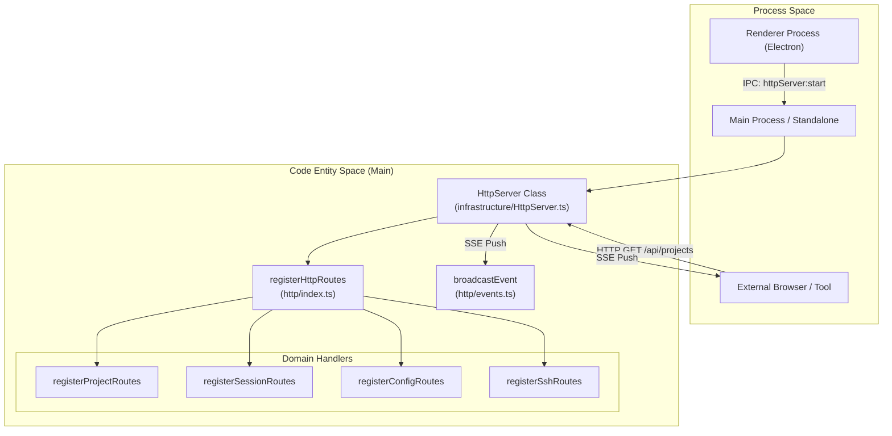
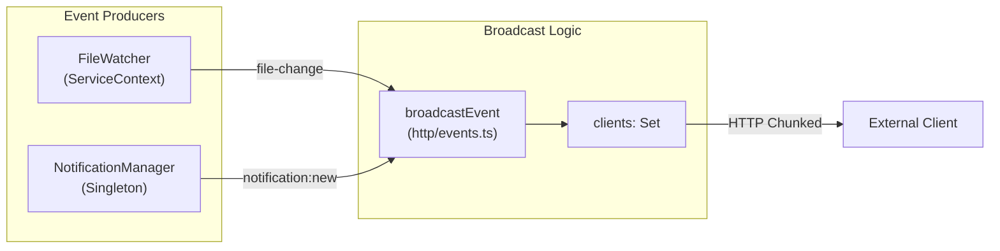

# HTTP Sidecar Server

<details>
<summary>Relevant source files</summary>

The following files were used as context for generating this wiki page:

- [knip.json](knip.json)
- [src/main/http/config.ts](src/main/http/config.ts)
- [src/main/http/events.ts](src/main/http/events.ts)
- [src/main/http/index.ts](src/main/http/index.ts)
- [src/main/http/notifications.ts](src/main/http/notifications.ts)
- [src/main/http/projects.ts](src/main/http/projects.ts)
- [src/main/http/ssh.ts](src/main/http/ssh.ts)
- [src/main/http/subagents.ts](src/main/http/subagents.ts)
- [src/main/services/infrastructure/HttpServer.ts](src/main/services/infrastructure/HttpServer.ts)
- [src/main/standalone.ts](src/main/standalone.ts)
- [vite.standalone.config.ts](vite.standalone.config.ts)

</details>


The HTTP Sidecar Server is a Fastify-based HTTP API that enables external tools, integrations, and remote clients to access `claude-devtools` data and receive real-time updates. It exposes REST endpoints for querying projects, sessions, and configuration, and provides Server-Sent Events (SSE) for live notifications of file changes and system events. 

In addition to the Electron-integrated mode, the codebase supports a **Standalone Mode** [src/main/standalone.ts:1-7](), allowing the server to run in headless environments like Docker or remote servers without Electron dependencies.

## Purpose and Architecture

The HTTP server runs within the Electron main process (or as a standalone Node.js process) and provides a localhost-only API by default. It serves three primary functions:

1.  **REST API**: Provides programmatic access to session data, project metadata, and system state [src/main/http/index.ts:1-6]().
2.  **Event Streaming**: Broadcasts real-time updates via Server-Sent Events (SSE) for file changes, SSH status, and notifications [src/main/http/events.ts:1-6]().
3.  **Static Hosting**: Serves the bundled Renderer UI as a Single Page Application (SPA), allowing the interface to be accessed via a standard web browser [src/main/services/infrastructure/HttpServer.ts:94-118]().

### System Context & Data Flow



**Sources:** [src/main/services/infrastructure/HttpServer.ts:45-63](), [src/main/http/index.ts:45-63](), [src/main/standalone.ts:118-158]()

## Server Lifecycle

### Initialization and Port Allocation
The server is instantiated via the `HttpServer` class [src/main/services/infrastructure/HttpServer.ts:45](). It attempts to bind to a host (default `127.0.0.1`) starting at a preferred port (default `3456`). If the port is in use, it increments the port number and retries up to 10 times [src/main/services/infrastructure/HttpServer.ts:124-143]().

| Environment | Default Host | Default Port | Behavior |
| :--- | :--- | :--- | :--- |
| **Electron** | `127.0.0.1` | `3456` | Localhost security for desktop app [src/main/services/infrastructure/HttpServer.ts:4-5]() |
| **Standalone** | `0.0.0.0` | `3456` | Accessible across network/Docker [src/main/standalone.ts:35-36]() |

**Sources:** [src/main/services/infrastructure/HttpServer.ts:124-143](), [src/main/standalone.ts:35-36]()

### Static File & SPA Handling
The server dynamically resolves the path to the renderer build output [src/main/services/infrastructure/HttpServer.ts:25-43](). If found, it:
1.  Registers `@fastify/static` to serve assets from the root `/` [src/main/services/infrastructure/HttpServer.ts:103-107]().
2.  Sets a "Not Found" handler that serves `index.html` for non-API routes, enabling SPA client-side routing [src/main/services/infrastructure/HttpServer.ts:113-118]().

## API Route Structure

The API is organized into domain-specific modules, mirroring the IPC handler structure used in the Electron app [src/main/http/index.ts:1-6]().

| Endpoint Prefix | Description | File |
| :--- | :--- | :--- |
| `/api/projects` | List projects and worktrees | [src/main/http/projects.ts]() |
| `/api/sessions` | Fetch session JSONL and metadata | [src/main/http/sessions.ts]() |
| `/api/config` | Get/Update app settings and triggers | [src/main/http/config.ts]() |
| `/api/ssh` | Manage remote connections | [src/main/http/ssh.ts]() |
| `/api/notifications` | Access persistent notification history | [src/main/http/notifications.ts]() |
| `/api/events` | SSE stream for real-time updates | [src/main/http/events.ts]() |

**Sources:** [src/main/http/index.ts:50-61]()

## Event Broadcasting (SSE)

The server implements a Server-Sent Events (SSE) stream at `/api/events` [src/main/http/events.ts:23](). It maintains a set of active `FastifyReply` objects and periodically sends `:ping` comments to keep connections alive [src/main/http/events.ts:17-36]().

### Event Flow: Source to Client



**Sources:** [src/main/http/events.ts:53-63](), [src/main/standalone.ts:122-138]()

## Standalone Mode

The `standalone.ts` entry point allows running the application without Electron [src/main/standalone.ts:2-7](). 

### Differences from Electron Mode:
1.  **Stubbed Services**: Features like `UpdaterService` (auto-updates) and `SshConnectionManager` (multi-user SSH profiles) are replaced with no-op stubs [src/main/standalone.ts:49-75]().
2.  **Environment Configuration**: Uses `CLAUDE_ROOT`, `HOST`, and `PORT` environment variables for setup [src/main/standalone.ts:35-37]().
3.  **CORS**: Defaults to `*` (allow all) to facilitate usage inside Docker containers where network isolation is handled by the container runtime [src/main/standalone.ts:39-42]().
4.  **Process Lifecycle**: Listens for `SIGTERM` and `SIGINT` to perform graceful shutdowns of the Fastify server and service contexts [src/main/standalone.ts:179-180]().

**Sources:** [src/main/standalone.ts:1-195](), [vite.standalone.config.ts:1-115]()

## Security and CORS

The server uses `@fastify/cors` to control access. In standard mode, it uses a regex to strictly allow only localhost origins [src/main/services/infrastructure/HttpServer.ts:77-91]().

```typescript
const localhostPattern = /^https?:\/\/(?:localhost|127\.0\.0\.1)(?::\d+)?$/;
```

If `CORS_ORIGIN` is set to `*` (common in Standalone/Docker mode), it allows all origins [src/main/services/infrastructure/HttpServer.ts:67-69]().

**Sources:** [src/main/services/infrastructure/HttpServer.ts:65-92]()
