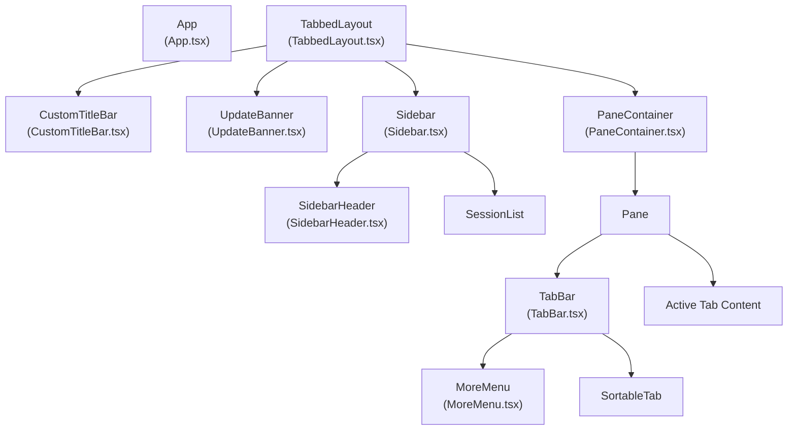
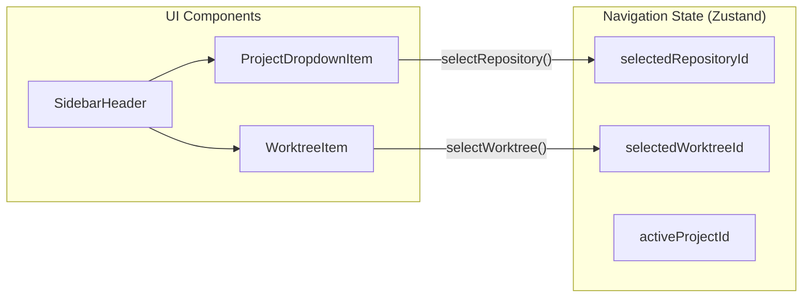

# User Interface

Relevant source files

The following files were used as context for generating this wiki page:

- [src/main/ipc/window.ts](src/main/ipc/window.ts)
- [src/renderer/api/index.ts](src/renderer/api/index.ts)
- [src/renderer/components/common/UpdateBanner.tsx](src/renderer/components/common/UpdateBanner.tsx)
- [src/renderer/components/layout/CustomTitleBar.tsx](src/renderer/components/layout/CustomTitleBar.tsx)
- [src/renderer/components/layout/MoreMenu.tsx](src/renderer/components/layout/MoreMenu.tsx)
- [src/renderer/components/layout/SidebarHeader.tsx](src/renderer/components/layout/SidebarHeader.tsx)
- [src/renderer/components/layout/TabBar.tsx](src/renderer/components/layout/TabBar.tsx)
- [src/renderer/components/layout/TabbedLayout.tsx](src/renderer/components/layout/TabbedLayout.tsx)
- [src/renderer/index.css](src/renderer/index.css)

## Purpose and Scope

This page documents the renderer process UI architecture of claude-devtools, including React components, Zustand state management, layout systems, and user interaction patterns. The renderer process runs in an isolated browser context with no direct access to Node.js APIs, communicating with the main process via the preload bridge documented in [IPC Communication Layer](#3.3).

For details on specific UI areas, see the child pages:
- [Application Shell](#9.1) — App component initialization, theme system, and global event listeners.
- [Session Views](#9.2) — Session list rendering, pagination, detail views, and conversation display.
- [Command Palette](#9.3) — Search interface, cross-session search, keyboard navigation, and result highlighting.
- [Settings Interface](#9.4) — Configuration UI, SSH profile management, and notification trigger editor.
- [Real-Time Updates](#9.5) — File change handling, optimistic updates, and refresh mechanisms.

## Application Architecture

The renderer process is a React 18 application built with TypeScript, Vite, and Tailwind CSS. State management uses Zustand with a slice-based architecture. All UI components are themed via CSS custom properties defined in `src/renderer/index.css` [src/renderer/index.css:6-194]().

### Component Hierarchy

**Sources:** [src/renderer/components/layout/TabbedLayout.tsx:23-52](), [src/renderer/components/layout/TabBar.tsx:29-200](), [src/renderer/components/layout/SidebarHeader.tsx:197-226]()

### Layout and Window Management

The `TabbedLayout` component serves as the primary structural wrapper [src/renderer/components/layout/TabbedLayout.tsx:23-52](). It manages global elements like the `CommandPalette`, `UpdateBanner`, and `WorkspaceIndicator`.

- **Custom Title Bar**: On Windows and Linux, a `CustomTitleBar` is rendered to provide window controls (minimize, maximize, close) when the native frame is hidden [src/renderer/components/layout/CustomTitleBar.tsx:23-33](). These controls communicate via the `windowControls` IPC API [src/main/ipc/window.ts:19-49]().
- **macOS Traffic Lights**: On macOS, the layout reserves space for native window controls using a CSS variable `--macos-traffic-light-padding-left` [src/renderer/components/layout/TabbedLayout.tsx:32-34]().
- **Sidebar**: Occupies a fixed 280px width, containing the `SidebarHeader` for project/worktree selection and the session list [src/renderer/components/layout/TabbedLayout.tsx:43]().

**Sources:** [src/renderer/components/layout/TabbedLayout.tsx:23-52](), [src/renderer/components/layout/CustomTitleBar.tsx:23-96](), [src/main/ipc/window.ts:19-49]()

## Navigation and Tabs

The UI uses a multi-pane tabbed system. Each pane contains a `TabBar` and a content area that renders the active tab's view (Dashboard, Session, Settings, or Search).

### TabBar and Pane Interaction

The `TabBar` component [src/renderer/components/layout/TabBar.tsx:29-80]() manages:
- **Tab Switching**: Clicking a tab sets it as active via `setActiveTab` [src/renderer/components/layout/TabBar.tsx:187]().
- **Multi-select**: Supports Shift+click for range selection and Cmd/Ctrl+click for toggle selection [src/renderer/components/layout/TabBar.tsx:153-190]().
- **Drag-and-Drop**: Uses `@dnd-kit` for reordering tabs and moving them between panes [src/renderer/components/layout/TabBar.tsx:118-125]().
- **Context Menus**: Right-click actions for closing tabs or pinning sessions [src/renderer/components/layout/TabBar.tsx:23-78]().

### More Menu

The `MoreMenu` [src/renderer/components/layout/MoreMenu.tsx:32-204]() provides access to less frequent actions, grouped into:
- **Search**: Triggers the Command Palette [src/renderer/components/layout/MoreMenu.tsx:85-96]().
- **Export**: Allows exporting the active session as Markdown, JSON, or Plain Text [src/renderer/components/layout/MoreMenu.tsx:98-122]().
- **Settings**: Opens the settings tab [src/renderer/components/layout/MoreMenu.tsx:124-135]().

**Sources:** [src/renderer/components/layout/TabBar.tsx:29-200](), [src/renderer/components/layout/MoreMenu.tsx:32-204]()

## Context and Worktree Selection

The `SidebarHeader` [src/renderer/components/layout/SidebarHeader.tsx:197-226]() manages the high-level navigation context. It allows users to switch between different projects and specific Git worktrees within those projects.

**Sources:** [src/renderer/components/layout/SidebarHeader.tsx:197-226](), [src/renderer/components/layout/SidebarHeader.tsx:99-139]()

## State and API Integration

The UI is driven by a unified Zustand store [src/renderer/store/index.ts:32-48]() and interacts with the backend through a unified `api` adapter [src/renderer/api/index.ts:59-68]().

- **Unified API**: The `api` proxy detects if it is running in Electron (using `window.electronAPI`) or a browser (using `HttpAPIClient`) [src/renderer/api/index.ts:37-45]().
- **Real-Time Feedback**: The `UpdateBanner` [src/renderer/components/common/UpdateBanner.tsx:10-90]() provides immediate feedback on application update status, showing download progress and a "Restart now" prompt when ready [src/renderer/components/common/UpdateBanner.tsx:34-78]().

**Sources:** [src/renderer/api/index.ts:1-69](), [src/renderer/components/common/UpdateBanner.tsx:10-90]()

## Theming and Visual Language

The visual identity is defined by a set of CSS variables that support both dark (default) and light modes [src/renderer/index.css:6-206]().

| Area | Variable Examples |
| :--- | :--- |
| **Surface** | `--color-surface`, `--color-surface-sidebar` |
| **Typography** | `--color-text`, `--color-text-muted` |
| **Messages** | `--chat-user-bg`, `--chat-ai-border` |
| **Blocks** | `--code-bg`, `--thinking-bg`, `--tool-call-bg` |
| **Feedback** | `--badge-error-bg`, `--warning-border` |

**Sources:** [src/renderer/index.css:6-194]()
