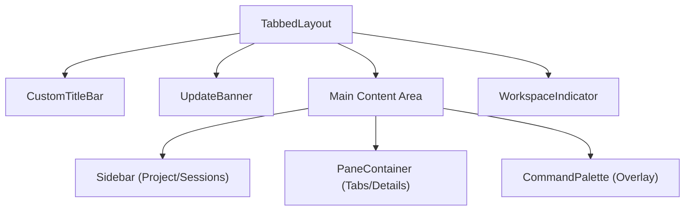
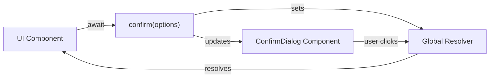

# Application Shell

<details>
<summary>Relevant source files</summary>

The following files were used as context for generating this wiki page:

- [src/main/ipc/window.ts](src/main/ipc/window.ts)
- [src/renderer/App.tsx](src/renderer/App.tsx)
- [src/renderer/api/index.ts](src/renderer/api/index.ts)
- [src/renderer/components/common/ConfirmDialog.tsx](src/renderer/components/common/ConfirmDialog.tsx)
- [src/renderer/components/common/UpdateBanner.tsx](src/renderer/components/common/UpdateBanner.tsx)
- [src/renderer/components/layout/CustomTitleBar.tsx](src/renderer/components/layout/CustomTitleBar.tsx)
- [src/renderer/components/layout/SidebarHeader.tsx](src/renderer/components/layout/SidebarHeader.tsx)
- [src/renderer/components/layout/TabbedLayout.tsx](src/renderer/components/layout/TabbedLayout.tsx)
- [src/renderer/components/settings/components/SettingsSelect.tsx](src/renderer/components/settings/components/SettingsSelect.tsx)
- [src/renderer/components/settings/sections/ConnectionSection.tsx](src/renderer/components/settings/sections/ConnectionSection.tsx)
- [src/renderer/components/settings/sections/WorkspaceSection.tsx](src/renderer/components/settings/sections/WorkspaceSection.tsx)
- [src/renderer/hooks/useKeyboardShortcuts.ts](src/renderer/hooks/useKeyboardShortcuts.ts)
- [src/renderer/hooks/useTheme.ts](src/renderer/hooks/useTheme.ts)

</details>


## Purpose and Scope

The Application Shell is the root React component that initializes and orchestrates the renderer process. It sets up the theme system, context management, real-time event listeners, and renders the core UI layout. This page covers the initialization sequence, component hierarchy, and global event wiring.

**Sources:** [src/renderer/App.tsx:1-51]()

## Component Structure

The `App` component is defined in [src/renderer/App.tsx:11-51]() and serves as the single entry point for the React application. It performs initialization tasks in a specific order and renders core layout components wrapped in an `ErrorBoundary`.

### Component Hierarchy
The shell follows a nested structure to ensure global utilities (like dialogs and overlays) remain accessible regardless of the active view.

| Component | File Path | Role |
|-----------|-----------|------|
| `App` | [src/renderer/App.tsx:11]() | Root initialization and state orchestration. |
| `ErrorBoundary` | [src/renderer/components/common/ErrorBoundary.tsx]() | Catches rendering exceptions to prevent white-screens. |
| `ContextSwitchOverlay` | [src/renderer/components/common/ContextSwitchOverlay.tsx]() | Full-screen loading state during workspace transitions. |
| `TabbedLayout` | [src/renderer/components/layout/TabbedLayout.tsx:23]() | Main UI container (Sidebar + Panes). |
| `ConfirmDialog` | [src/renderer/components/common/ConfirmDialog.tsx:69]() | Singleton modal for imperative user confirmations. |

**Sources:** [src/renderer/App.tsx:44-50](), [src/renderer/components/layout/TabbedLayout.tsx:23-53]()

## Initialization Sequence

The `App` component executes initialization logic in multiple `useEffect` hooks to prepare the environment before user interaction.

```mermaid
sequenceDiagram
    participant React
    participant App
    participant useTheme
    participant Store
    participant API
    participant DOM
    
    React->>App: Mount component
    App->>useTheme: useTheme() hook
    Note over useTheme: Apply CSS variables to :root
    
    App->>DOM: getElementById('splash')
    DOM-->>App: Splash Element
    App->>DOM: opacity = 0; setTimeout(300ms, remove())
    
    App->>Store: initializeContextSystem()
    Note over Store: Setup ServiceContextRegistry
    
    App->>API: api.ssh.onStatus(callback)
    Note over API: Listen for connection changes
    
    App->>Store: initializeNotificationListeners()
    Note over Store: Bind "file:change", "notification:new"
    
    App->>React: Render TabbedLayout
```

**Sources:** [src/renderer/App.tsx:11-51]()

### Theme and Splash Screen
The theme system is initialized immediately via the `useTheme()` hook [src/renderer/App.tsx:13](), which applies CSS custom properties to the document root. Simultaneously, the splash screen (defined in the base HTML) is transitioned out by setting its opacity to `0` and removing it from the DOM after 300ms [src/renderer/App.tsx:16-22]().

### Context and SSH Monitoring
The shell triggers `initializeContextSystem()` [src/renderer/App.tsx:26]() to prepare the `ServiceContextRegistry`. It also attaches a listener to `api.ssh.onStatus` [src/renderer/App.tsx:32-35](). When an SSH connection is established or lost, the app automatically calls `fetchAvailableContexts()` to update the workspace list.

**Sources:** [src/renderer/App.tsx:25-36]()

### IPC Event Listeners
The function `initializeNotificationListeners()` [src/renderer/App.tsx:40]() wires the renderer to main-process events. This ensures real-time UI updates for background activities.

| IPC Channel | Trigger | Effect |
|-------------|---------|--------|
| `notification:new` | Background error detection | Adds item to notification store |
| `file:change` | Claude session log update | Triggers `refreshSessionInPlace()` |
| `context:changed` | Remote context ready | Triggers `loadContextSnapshot()` |

**Sources:** [src/renderer/App.tsx:38-42]()

## Main Layout: TabbedLayout

The `TabbedLayout` component [src/renderer/components/layout/TabbedLayout.tsx:23]() defines the visual structure of the application. It manages the high-level arrangement of the sidebar and the multi-pane content area.

### Visual Architecture



**Sources:** [src/renderer/components/layout/TabbedLayout.tsx:30-51]()

### Window Controls and Platform Adaptation
The shell adapts to different operating systems and display modes:
- **macOS Traffic Lights:** The layout calculates `trafficLightPadding` based on the current zoom factor to ensure the sidebar header doesn't overlap native window controls [src/renderer/components/layout/TabbedLayout.tsx:26-27]().
- **Windows/Linux Title Bar:** On non-macOS platforms, `CustomTitleBar` [src/renderer/components/layout/CustomTitleBar.tsx:23]() provides a draggable region and window controls (minimize/maximize/close) using the `windowControls` IPC API [src/main/ipc/window.ts:19-49]().
- **Browser Mode:** If `isElectronMode()` is false, Electron-specific UI like custom title bars and native traffic light padding are disabled [src/renderer/api/index.ts:57]().

**Sources:** [src/renderer/components/layout/TabbedLayout.tsx:26-36](), [src/renderer/components/layout/CustomTitleBar.tsx:17-21](), [src/main/ipc/window.ts:19-49]()

## Global Utilities

### Imperative Confirmation Dialog
The shell includes a `ConfirmDialog` [src/renderer/components/common/ConfirmDialog.tsx:69]() that replaces native `window.confirm()`. It is triggered by an exported `confirm()` function that returns a `Promise<boolean>`.



**Sources:** [src/renderer/components/common/ConfirmDialog.tsx:41-64]()

### Update System
The shell monitors for application updates. If a download starts, the `UpdateBanner` [src/renderer/components/common/UpdateBanner.tsx:10]() appears at the top of the layout, showing a progress bar. Once downloaded, it provides a "Restart now" button that triggers `app:relaunch` via IPC [src/main/ipc/window.ts:43-46]().

**Sources:** [src/renderer/components/common/UpdateBanner.tsx:34-78](), [src/main/ipc/window.ts:43-46]()

### Keyboard Shortcuts
The `useKeyboardShortcuts` hook [src/renderer/hooks/useKeyboardShortcuts.ts:18]() is initialized within the shell to handle global navigation:
- **Tab Management:** `Ctrl+Tab` (Cycle), `Cmd+W` (Close) [src/renderer/hooks/useKeyboardShortcuts.ts:81-163]().
- **Pane Management:** `Cmd+\` (Split), `Cmd+Option+1-4` (Focus) [src/renderer/hooks/useKeyboardShortcuts.ts:109-138]().
- **Context Switching:** `Cmd+Shift+K` (Cycle workspace contexts) [src/renderer/hooks/useKeyboardShortcuts.ts:217-221]().

**Sources:** [src/renderer/hooks/useKeyboardShortcuts.ts:18-225]()
