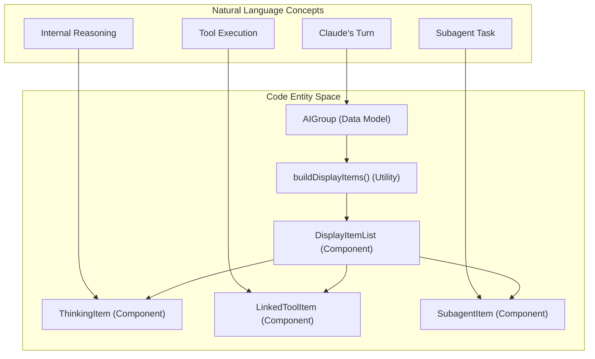
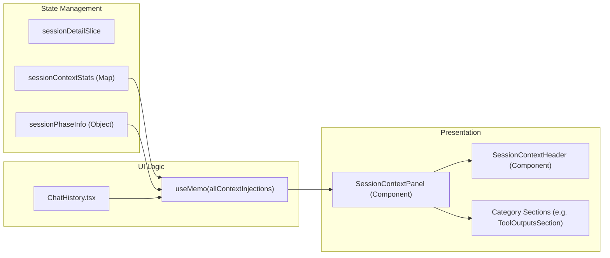

# Session Views

Relevant source files

The following files were used as context for generating this wiki page:

- [src/main/services/discovery/ProjectScanner.ts](src/main/services/discovery/ProjectScanner.ts)
- [src/renderer/components/chat/ChatHistory.tsx](src/renderer/components/chat/ChatHistory.tsx)
- [src/renderer/components/chat/DisplayItemList.tsx](src/renderer/components/chat/DisplayItemList.tsx)
- [src/renderer/components/chat/SessionContextPanel/components/SessionContextHeader.tsx](src/renderer/components/chat/SessionContextPanel/components/SessionContextHeader.tsx)
- [src/renderer/components/chat/SessionContextPanel/index.tsx](src/renderer/components/chat/SessionContextPanel/index.tsx)
- [src/renderer/components/chat/SessionContextPanel/types.ts](src/renderer/components/chat/SessionContextPanel/types.ts)
- [src/renderer/components/chat/items/ExecutionTrace.tsx](src/renderer/components/chat/items/ExecutionTrace.tsx)
- [src/renderer/components/chat/items/LinkedToolItem.tsx](src/renderer/components/chat/items/LinkedToolItem.tsx)
- [src/renderer/components/chat/items/TextItem.tsx](src/renderer/components/chat/items/TextItem.tsx)
- [src/renderer/components/chat/items/ThinkingItem.tsx](src/renderer/components/chat/items/ThinkingItem.tsx)
- [src/renderer/components/sidebar/SessionItem.tsx](src/renderer/components/sidebar/SessionItem.tsx)
- [src/renderer/store/slices/projectSlice.ts](src/renderer/store/slices/projectSlice.ts)
- [src/renderer/store/slices/sessionSlice.ts](src/renderer/store/slices/sessionSlice.ts)
- [src/renderer/utils/displayItemBuilder.ts](src/renderer/utils/displayItemBuilder.ts)
- [test/renderer/store/sessionSlice.test.ts](test/renderer/store/sessionSlice.test.ts)
- [test/renderer/utils/displayItemBuilder.test.ts](test/renderer/utils/displayItemBuilder.test.ts)

## Purpose and Scope

Session Views are the primary UI components that display Claude Code session data to the user. This page documents the **renderer-side state management and UI architecture** for session lists and detail views, including pagination, per-tab data isolation, conversation rendering, and the specialized context injection panel.

For backend session discovery and parsing, see [Session Discovery & Parsing](). For general state management patterns, see [State Management]().

---

## Session List Architecture

The session list (sidebar) displays sessions for a selected project. It supports cursor-based pagination, pinned sessions, and real-time updates without loading flicker.

### State Structure
The `sessionSlice` manages list state in the Zustand store.

| Property | Type | Purpose |
|----------|------|---------|
| `sessions` | `Session[]` | Currently loaded session records |
| `sessionsCursor` | `string \| null` | Opaque cursor for next page [src/renderer/store/slices/sessionSlice.ts:31]() |
| `sessionsHasMore` | `boolean` | Whether more pages exist [src/renderer/store/slices/sessionSlice.ts:32]() |
| `pinnedSessionIds` | `string[]` | User-pinned session IDs [src/renderer/store/slices/sessionSlice.ts:36]() |
| `sidebarMultiSelectActive` | `boolean` | State for bulk operations [src/renderer/store/slices/sessionSlice.ts:42]() |

**Sources:** [src/renderer/store/slices/sessionSlice.ts:24-45]()

### Pagination and Pinned Sessions
Sessions are fetched using cursor-based pagination to handle large histories over SSH. `fetchSessionsInitial` resets the state [src/renderer/store/slices/sessionSlice.ts:124-132](), while `fetchSessionsMore` appends results and updates the cursor [src/renderer/store/slices/sessionSlice.ts:170-208]().

Pinned sessions are persisted in the application config. If a pinned session falls outside the current paginated window, the store explicitly fetches it by ID to ensure it appears at the top of the sidebar [src/renderer/store/slices/sessionSlice.ts:279-319]().

### Real-Time Updates
When a file change event indicates a new session or update, `refreshSessionsInPlace` is called [src/renderer/store/slices/sessionSlice.ts:210-248](). This uses a `projectRefreshGeneration` map to ensure that only the latest async response updates the UI, preventing "last-write-wins" issues under rapid file changes [src/renderer/store/slices/sessionSlice.ts:18]().

**Sources:** [src/renderer/store/slices/sessionSlice.ts:18-248]()

---

## Session Detail and Conversation Display

The session detail view transforms raw session "chunks" into a structured conversation of `UserGroup` and `AIGroup` entities.

### Per-Tab Data Isolation
To support multi-pane layouts where different tabs view the same session at different scroll positions, the store uses `tabSessionData` [src/renderer/store/slices/sessionDetailSlice.ts:72](). This isolates `conversation`, `sessionContextStats`, and `visibleAIGroupId` per tab ID [src/renderer/store/slices/sessionDetailSlice.ts:46-70]().

### AI Group Rendering
An `AIGroup` represents one turn of Claude's response. It is rendered using a flat chronological list of `AIGroupDisplayItem` objects [src/renderer/utils/displayItemBuilder.ts:94-100]().

The `buildDisplayItems` function maps semantic steps to UI items:
1. **Thinking**: Mapped to `ThinkingItem` [src/renderer/utils/displayItemBuilder.ts:150-159]().
2. **Tool Calls**: Mapped to `LinkedToolItem`, which associates a tool call with its result [src/renderer/utils/displayItemBuilder.ts:161-176]().
3. **Subagents**: Mapped to `SubagentItem` [src/renderer/utils/displayItemBuilder.ts:182-192]().
4. **Teammate Messages**: Parsed and linked to their triggering `SendMessage` calls [src/renderer/utils/displayItemBuilder.ts:52-74]().

**Sources:** [src/renderer/utils/displayItemBuilder.ts:1-205](), [src/renderer/components/chat/DisplayItemList.tsx:64-205]()

### System to Code Mapping: Conversation Rendering
This diagram maps the natural language concepts of a conversation to the specific React components and utility functions used to render them.

**Sources:** [src/renderer/utils/displayItemBuilder.ts:94-205](), [src/renderer/components/chat/DisplayItemList.tsx:100-205]()

---

## Visible Context Panel

The `SessionContextPanel` provides a specialized view of all data currently "in-context" for the AI at a specific point in the conversation.

### Context Components
The panel categorizes context injections into collapsible sections:
- **User Messages**: History of user input [src/renderer/components/chat/SessionContextPanel/index.tsx:105-107]().
- **CLAUDE.md Files**: Global, project, and directory-level rules [src/renderer/components/chat/SessionContextPanel/index.tsx:90-92]().
- **Mentioned Files**: Files explicitly read or mentioned by the user [src/renderer/components/chat/SessionContextPanel/index.tsx:93-95]().
- **Tool Outputs**: Results from previous tool executions [src/renderer/components/chat/SessionContextPanel/index.tsx:96-98]().

### Phase-Aware Context
Claude Code performs "compactions" (summarizing history) to manage context limits. The UI supports viewing context at different "Phases" [src/renderer/components/chat/SessionContextPanel/components/SessionContextHeader.tsx:119-157](). Selecting a phase updates the `allContextInjections` list to show exactly what was visible to the model at that specific historical turn [src/renderer/components/chat/ChatHistory.tsx:116-170]().

**Sources:** [src/renderer/components/chat/SessionContextPanel/index.tsx:43-129](), [src/renderer/components/chat/ChatHistory.tsx:116-170]()

### System to Code Mapping: Context Panel Data Flow
This diagram tracks how raw context injection data moves from the store to the specialized panel UI.

**Sources:** [src/renderer/store/slices/sessionDetailSlice.ts:88-101](), [src/renderer/components/chat/ChatHistory.tsx:116-170](), [src/renderer/components/chat/SessionContextPanel/index.tsx:43-200]()

---

## User Interaction and Navigation

### Scrolling and Auto-Scroll
The `ChatHistory` component uses `@tanstack/react-virtual` for virtualization when conversation length exceeds 120 items [src/renderer/components/chat/ChatHistory.tsx:40, 185](). It implements `useAutoScrollBottom` to stick the view to the bottom as new messages arrive [src/renderer/components/chat/ChatHistory.tsx:3]().

### Deep Linking and Search
The UI supports navigating to specific tool executions or AI groups. When a search result is selected, `ChatHistory` uses `scrollToIndex` or `scrollIntoView` on refs stored in `aiGroupRefs` and `toolItemRefs` to bring the item into focus [src/renderer/components/chat/ChatHistory.tsx:177-179, 323-350]().

### Context Menus
`SessionItem` in the sidebar provides a context menu for advanced operations, such as splitting the pane to open a session in a new vertical/horizontal layout [src/renderer/components/sidebar/SessionItem.tsx:189-222]().

**Sources:** [src/renderer/components/chat/ChatHistory.tsx:1-350](), [src/renderer/components/sidebar/SessionItem.tsx:133-225]()
