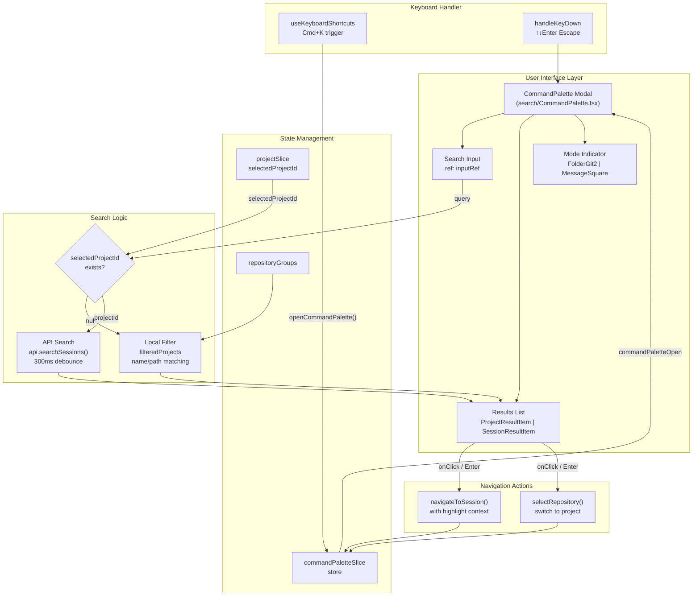
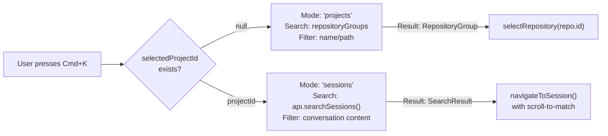
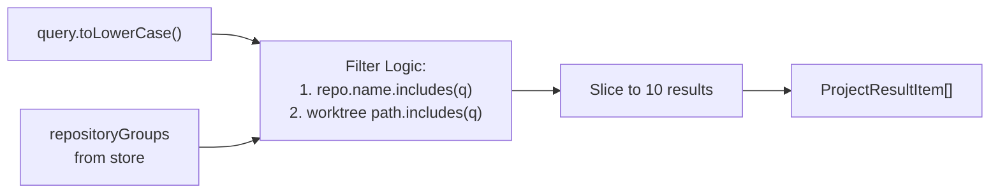
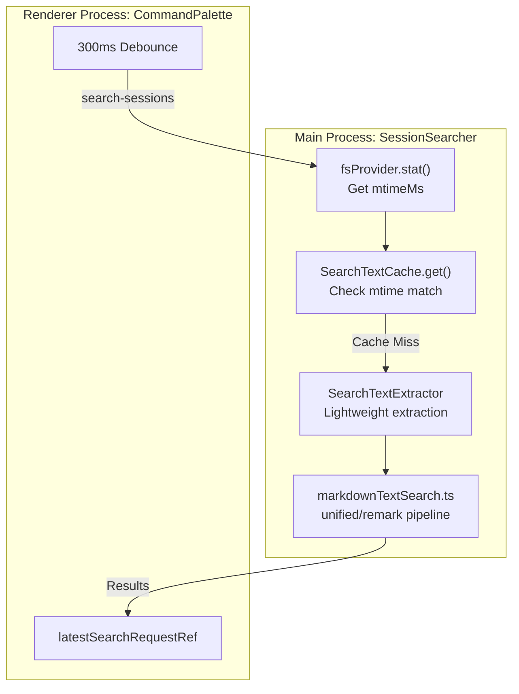
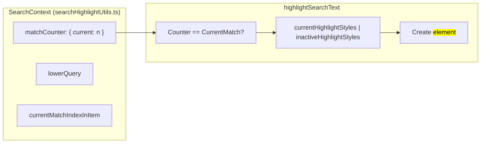
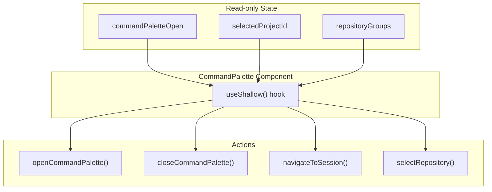

# Command Palette

Relevant source files

The following files were used as context for generating this wiki page:

- [src/main/http/search.ts](src/main/http/search.ts)
- [src/main/ipc/search.ts](src/main/ipc/search.ts)
- [src/main/services/discovery/SearchTextCache.ts](src/main/services/discovery/SearchTextCache.ts)
- [src/main/services/discovery/SessionSearcher.ts](src/main/services/discovery/SessionSearcher.ts)
- [src/renderer/components/chat/LastOutputDisplay.tsx](src/renderer/components/chat/LastOutputDisplay.tsx)
- [src/renderer/components/chat/searchHighlightUtils.ts](src/renderer/components/chat/searchHighlightUtils.ts)
- [src/renderer/components/search/CommandPalette.tsx](src/renderer/components/search/CommandPalette.tsx)
- [src/renderer/components/search/SearchBar.tsx](src/renderer/components/search/SearchBar.tsx)
- [src/renderer/store/slices/conversationSlice.ts](src/renderer/store/slices/conversationSlice.ts)
- [src/renderer/utils/keyboardUtils.ts](src/renderer/utils/keyboardUtils.ts)
- [src/shared/utils/markdownTextSearch.ts](src/shared/utils/markdownTextSearch.ts)
- [test/main/ipc/globalSearch.test.ts](test/main/ipc/globalSearch.test.ts)
- [test/main/services/discovery/SessionSearcher.test.ts](test/main/services/discovery/SessionSearcher.test.ts)
- [test/renderer/utils/keyboardUtils.test.ts](test/renderer/utils/keyboardUtils.test.ts)

The Command Palette provides a Spotlight/Alfred-style global search interface accessible via `Cmd+K`. It operates in two distinct modes: project search when no project is selected, and cross-session conversation search within a selected project. The interface implements keyboard navigation, debounced search, and intelligent result highlighting.

For information about navigating to search results, see [Session Views](#9.2). For keyboard shortcut configuration, see [Application Shell](#9.1).

---

## Architecture Overview

The Command Palette is implemented as a modal overlay with context-aware behavior. The search mode automatically switches based on workspace state, using distinct search algorithms for project discovery versus conversation content matching.

**Sources:** [src/renderer/components/search/CommandPalette.tsx:1-189](), [src/renderer/store/slices/conversationSlice.ts:94-108]()

---

## Dual-Mode Operation

The Command Palette automatically switches between two search modes based on workspace context. This eliminates the need for mode selection UI and provides contextually appropriate results.

### Mode Determination Logic

**Sources:** [src/renderer/components/search/CommandPalette.tsx:157-189]()

| Mode | Trigger Condition | Data Source | Result Type | Action on Select |
|------|------------------|-------------|-------------|------------------|
| `'projects'` | `selectedProjectId === null` | `repositoryGroups` (local filter) | `RepositoryGroup` | `selectRepository(repo.id)` |
| `'sessions'` | `selectedProjectId !== null` | `api.searchSessions()` (IPC call) | `SearchResult` | `navigateToSession()` with highlight context |

**Sources:** [src/renderer/components/search/CommandPalette.tsx:189-206]()

---

## Project Search Mode

When no project is selected, the palette searches across all discovered repositories using client-side filtering. This mode enables rapid project switching without requiring server-side indexing.

### Filtering Implementation

The project filter operates on in-memory `repositoryGroups` data with case-insensitive substring matching on repository name and path:

**Sources:** [src/renderer/components/search/CommandPalette.tsx:192-206]()

### ProjectResultItem Component

Each project result displays repository metadata with timestamp formatting:

| Display Element | Data Source | Formatting |
|----------------|-------------|-----------|
| Repository name | `repo.name` | Truncated text-sm |
| Worktree path | `repo.worktrees[0]?.path` | Monospace text-xs |
| Session count | `repo.totalSessions` | "{n} sessions" |
| Last activity | `repo.mostRecentSession` | `formatDistanceToNow()` with suffix |

**Sources:** [src/renderer/components/search/CommandPalette.tsx:44-84]()

---

## Session Search Mode

When a project is selected, the palette performs cross-session content search with server-side indexing. Search queries are debounced and cancellable to prevent race conditions.

### Search Request Flow

The backend search logic is handled by `SessionSearcher` which restricts matches to user text and the last AI output to reduce noise.

**Sources:** [src/main/services/discovery/SessionSearcher.ts:36-190](), [src/shared/utils/markdownTextSearch.ts:154-176]()

### Search Performance (SSH Mode)

In SSH environments, `SessionSearcher` uses a staged breadth approach to maintain responsiveness:
- **Time Budget**: Searches are capped at 4500ms [src/main/services/discovery/SessionSearcher.ts:31]().
- **Staged Boundaries**: Scans in batches (40, 140, 320) to find minimum results quickly [src/main/services/discovery/SessionSearcher.ts:29-30]().
- **Partial Results**: Returns `isPartial: true` if the budget or result minimum is hit [src/main/services/discovery/SessionSearcher.ts:179-185]().

**Sources:** [src/main/services/discovery/SessionSearcher.ts:107-177]()

---

## Markdown-Aware Search

The system uses a specialized markdown search pipeline to ensure that match counts in the Command Palette align exactly with what the user sees in the rendered chat.

### Search Pipeline (`markdownTextSearch.ts`)

1. **Parsing**: Uses `unified`, `remark-parse`, and `remark-gfm` to build an MDAST [src/shared/utils/markdownTextSearch.ts:29-46]().
2. **HAST Conversion**: Converts MDAST to HAST (Hypertext Abstract Syntax Tree) [src/shared/utils/markdownTextSearch.ts:112-113]().
3. **Selective Collection**: Only text nodes from `HL_TAGS` (e.g., `p`, `li`, `code`) are collected [src/shared/utils/markdownTextSearch.ts:91-104]().
4. **Segment Matching**: The query is searched within individual text segments rather than the raw markdown string to avoid matching hidden syntax [src/shared/utils/markdownTextSearch.ts:165-174]().

**Sources:** [src/shared/utils/markdownTextSearch.ts:74-140]()

---

## Keyboard Navigation & In-Session Search

The application also features an in-session search bar (`Cmd+F`) that shares logic with the Command Palette but focuses on the current conversation.

### Navigation State Machine (`conversationSlice.ts`)

The store tracks search matches and provides navigation actions:

| Action | Description |
|--------|-------------|
| `nextSearchResult` | Increments `currentSearchIndex` and calls `expandForCurrentSearchResult` [src/renderer/store/slices/conversationSlice.ts:104]() |
| `previousSearchResult`| Decrements index with wrap-around logic [src/renderer/store/slices/conversationSlice.ts:105]() |
| `expandForCurrentSearchResult` | Automatically expands collapsed AI groups or subagent traces to reveal the match [src/renderer/store/slices/conversationSlice.ts:107]() |

**Sources:** [src/renderer/store/slices/conversationSlice.ts:55-75]()

### Search Context Highlighting

Matches are rendered using a `SearchContext` which uses a mutable counter to track match indices as the React tree is traversed.

**Sources:** [src/renderer/components/chat/searchHighlightUtils.ts:33-113]()

---

## Store Integration

The Command Palette integrates with Zustand store slices for state management and action dispatch.

### Store Dependencies

**Sources:** [src/renderer/components/search/CommandPalette.tsx:158-176]()

---

## Performance Optimizations

1. **SearchTextCache**: An LRU cache in the main process stores extracted searchable entries, invalidated by file `mtimeMs` [src/main/services/discovery/SearchTextCache.ts:20-50]().
2. **Segment Caching**: `markdownTextSearch.ts` caches the parsed text segments for the 1000 most recent markdown strings to speed up repetitive queries [src/shared/utils/markdownTextSearch.ts:52-68]().
3. **Debounced Inputs**: Both `CommandPalette` and `SearchBar` use debouncing (200ms-300ms) to avoid expensive re-parsing on every keystroke [src/renderer/components/search/SearchBar.tsx:15](), [src/renderer/components/search/CommandPalette.tsx:216]().
4. **Shallow Selectors**: Use of `useShallow` in components like `LastOutputDisplay` ensures re-renders only occur when the specific AI group contains search matches [src/renderer/components/chat/LastOutputDisplay.tsx:44-53]().

**Sources:** [src/main/services/discovery/SearchTextCache.ts:1-12](), [src/renderer/components/search/SearchBar.tsx:64-80]()
