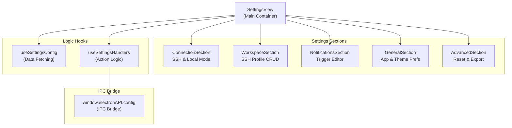
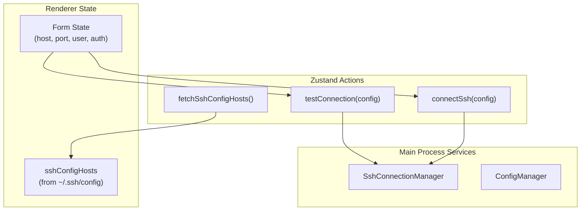

# Settings Interface

Relevant source files

The following files were used as context for generating this wiki page:

- [src/main/ipc/configValidation.ts](src/main/ipc/configValidation.ts)
- [src/main/services/infrastructure/ConfigManager.ts](src/main/services/infrastructure/ConfigManager.ts)
- [src/renderer/App.tsx](src/renderer/App.tsx)
- [src/renderer/components/chat/SessionContextPanel/components/RankedInjectionList.tsx](src/renderer/components/chat/SessionContextPanel/components/RankedInjectionList.tsx)
- [src/renderer/components/common/ConfirmDialog.tsx](src/renderer/components/common/ConfirmDialog.tsx)
- [src/renderer/components/settings/SettingsTabs.tsx](src/renderer/components/settings/SettingsTabs.tsx)
- [src/renderer/components/settings/SettingsView.tsx](src/renderer/components/settings/SettingsView.tsx)
- [src/renderer/components/settings/components/SettingsSelect.tsx](src/renderer/components/settings/components/SettingsSelect.tsx)
- [src/renderer/components/settings/hooks/useSettingsConfig.ts](src/renderer/components/settings/hooks/useSettingsConfig.ts)
- [src/renderer/components/settings/hooks/useSettingsHandlers.ts](src/renderer/components/settings/hooks/useSettingsHandlers.ts)
- [src/renderer/components/settings/sections/ConnectionSection.tsx](src/renderer/components/settings/sections/ConnectionSection.tsx)
- [src/renderer/components/settings/sections/GeneralSection.tsx](src/renderer/components/settings/sections/GeneralSection.tsx)
- [src/renderer/components/settings/sections/WorkspaceSection.tsx](src/renderer/components/settings/sections/WorkspaceSection.tsx)
- [src/renderer/components/settings/sections/index.ts](src/renderer/components/settings/sections/index.ts)
- [src/renderer/components/sidebar/DateGroupedSessions.tsx](src/renderer/components/sidebar/DateGroupedSessions.tsx)
- [src/renderer/hooks/useKeyboardShortcuts.ts](src/renderer/hooks/useKeyboardShortcuts.ts)
- [src/shared/types/notifications.ts](src/shared/types/notifications.ts)

## Purpose and Scope

The Settings Interface provides a comprehensive configuration UI for claude-devtools, enabling users to manage application settings, SSH connections, workspace profiles, and notification triggers. This page documents the renderer-side UI components that compose the settings panel, their integration with the configuration IPC layer, and the patterns used for form state management and validation.

For information about the underlying configuration persistence and management, see [Configuration Management](7). For notification trigger evaluation logic, see [Trigger System](6.2). For SSH connection management services, see [SSH Connection Manager](5.1).

## Settings Panel Architecture

The settings interface is organized into multiple sections, each responsible for a specific configuration domain. Settings are accessed via the `SettingsView` component, which manages sub-section navigation and optimistic state updates.

### Component Hierarchy

**Sources:** [src/renderer/components/settings/SettingsView.tsx:12-18](), [src/renderer/components/settings/SettingsView.tsx:124-165](), [src/renderer/components/settings/hooks/useSettingsHandlers.ts:29-55]()

## Connection Section

The `ConnectionSection` component provides dual-mode configuration for local Claude root path selection and SSH remote connection management. It handles SSH host discovery from local config files and connection testing.

### SSH Connection Management

The SSH connection form provides host selection via a combobox (populated from `~/.ssh/config`), authentication method selection, and connection testing.

**Sources:** [src/renderer/components/settings/sections/ConnectionSection.tsx:37-46](), [src/renderer/components/settings/sections/ConnectionSection.tsx:162-169](), [src/renderer/components/settings/sections/ConnectionSection.tsx:171-181]()

#### Authentication Method Handling

The form dynamically adjusts based on the selected `SshAuthMethod`:

| Auth Method | Logic | Component Behavior |
|-------------|-------|--------------------|
| `auto` | Reads from `~/.ssh/config` | Hides specific credential fields |
| `agent` | Uses local SSH agent | Hides specific credential fields |
| `privateKey` | Uses file path | Shows `privateKeyPath` input |
| `password` | Uses interactive password | Shows `password` input |

**Sources:** [src/renderer/components/settings/sections/ConnectionSection.tsx:29-34](), [src/renderer/components/settings/sections/ConnectionSection.tsx:162-169]()

## Workspace Section

The `WorkspaceSection` component provides CRUD operations for `SshConnectionProfile` entities. These profiles are persisted in the application configuration and allow users to save multiple remote environments.

### Profile Data Flow

1.  **Creation**: `handleAdd` generates a UUID via `crypto.randomUUID()` and updates the `ssh.profiles` section of the config [src/renderer/components/settings/sections/WorkspaceSection.tsx:103-119]().
2.  **Persistence**: Updates are sent to the main process via `api.config.update('ssh', ...)` [src/renderer/components/settings/sections/WorkspaceSection.tsx:114]().
3.  **Context Refresh**: After a profile is added or modified, `fetchAvailableContexts()` is called to ensure the multi-context switcher reflects the changes [src/renderer/components/settings/sections/WorkspaceSection.tsx:118]().

**Sources:** [src/renderer/components/settings/sections/WorkspaceSection.tsx:103-159]()

## Notification Trigger Editor

The `NotificationsSection` (managed via `useSettingsHandlers`) allows users to define custom `NotificationTrigger` rules. These triggers determine which events in the Claude session logs (like specific tool errors or token thresholds) generate system notifications.

### Trigger Configuration Model

Triggers are defined by a `TriggerMode` and `TriggerContentType`:

*   **error_status**: Simple boolean check on the `is_error` field of a tool result [src/main/services/infrastructure/ConfigManager.ts:122]().
*   **content_match**: Regex evaluation against specific fields like `file_path`, `command`, or `thinking` [src/main/services/infrastructure/ConfigManager.ts:157-161]().
*   **token_threshold**: Numerical comparison against `input`, `output`, or `total` tokens [src/main/services/infrastructure/ConfigManager.ts:163-167]().

**Sources:** [src/main/services/infrastructure/ConfigManager.ts:133-176](), [src/shared/types/notifications.ts:151-194]()

## General Section

The `GeneralSection` manages application-wide preferences and local environment settings.

### Claude Root Path Management

The UI allows overriding the default Claude directory. Changing this path triggers a workspace reset to ensure no stale session data remains in the UI.

*   **WSL Integration**: Users on Windows can use `api.config.findWslClaudeRoots()` to automatically discover Claude installations within WSL distributions [src/renderer/components/settings/sections/GeneralSection.tsx:211]().
*   **Workspace Reset**: `resetWorkspaceForRootChange` clears all open tabs, projects, and repository groups from the Zustand store when the root path is modified [src/renderer/components/settings/sections/GeneralSection.tsx:100-121]().

**Sources:** [src/renderer/components/settings/sections/GeneralSection.tsx:123-149](), [src/renderer/components/settings/sections/GeneralSection.tsx:151-182]()

## State Management and IPC

The interface uses an optimistic update pattern for settings to ensure a responsive UI.

### Configuration Validation

The main process performs runtime validation on all configuration updates using `configValidation.ts` to prevent malformed data from being persisted to disk.

| Section | Validator Function | Validation Logic |
|---------|--------------------|------------------|
| `notifications` | `validateNotificationsSection` | Validates snooze limits and trigger structures [src/main/ipc/configValidation.ts:97-193]() |
| `general` | `validateGeneralSection` | Validates theme enums and path strings [src/main/ipc/configValidation.ts:195-263]() |
| `ssh` | `validateSshSection` | Validates port ranges and auth method enums [src/main/ipc/configValidation.ts:316-398]() |

**Sources:** [src/main/ipc/configValidation.ts:1-398]()

### Optimistic Updates

The `useSettingsHandlers` hook implements optimistic updates for triggers. When a trigger is updated, the local `optimisticConfig` state is modified immediately. If the IPC call to `api.config.updateTrigger` fails, the state is rolled back using a reference to the previous configuration [src/renderer/components/settings/hooks/useSettingsHandlers.ts:182-209]().

**Sources:** [src/renderer/components/settings/hooks/useSettingsHandlers.ts:182-209]()
