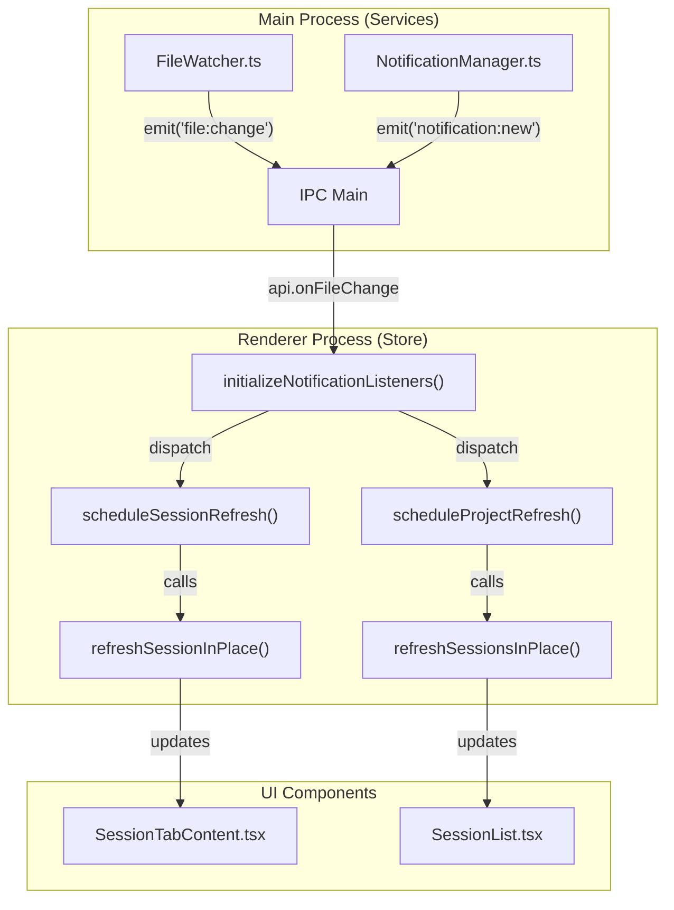
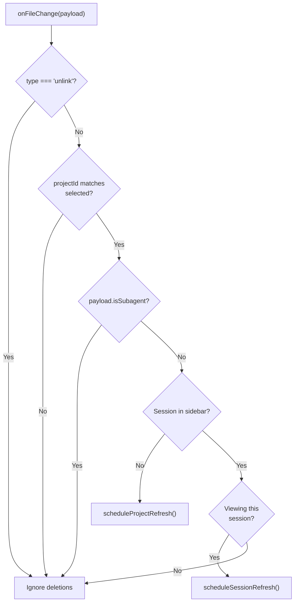
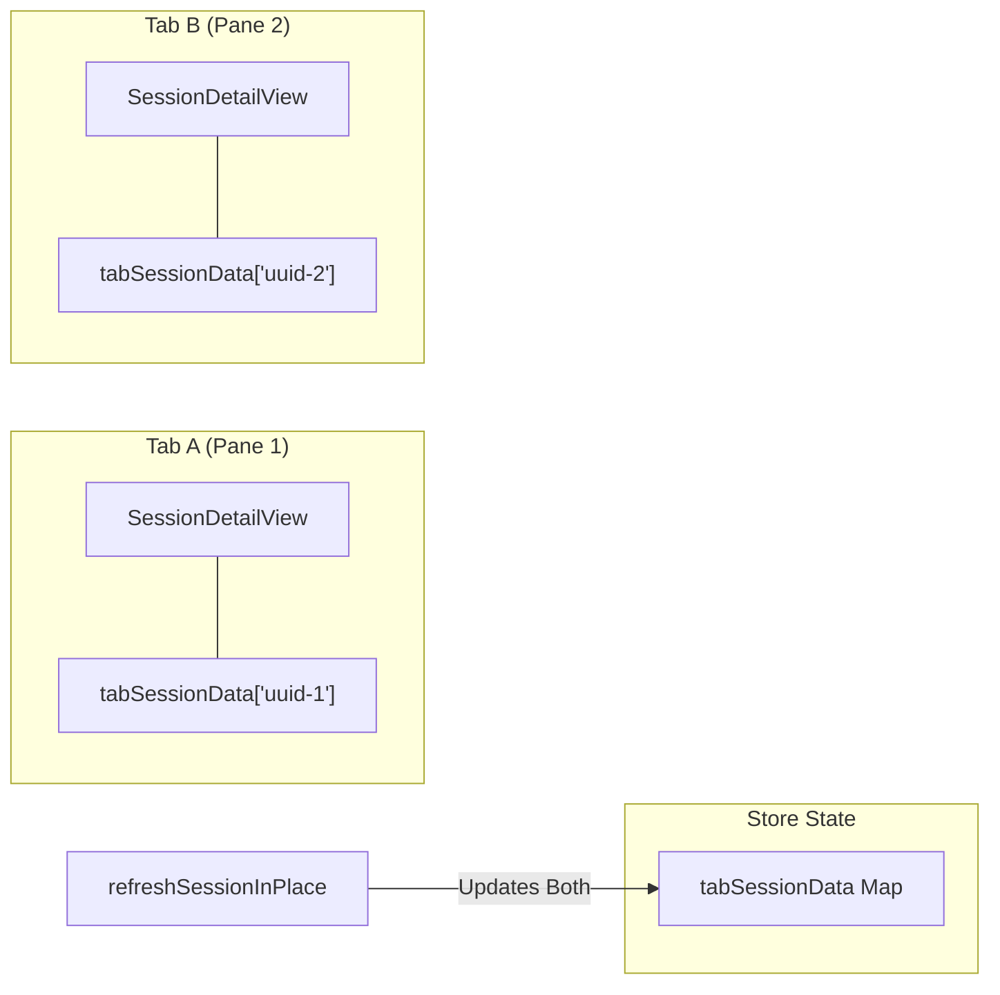

# Real-Time Updates

Relevant source files

The following files were used as context for generating this wiki page:

- [src/main/services/discovery/ProjectPathResolver.ts](src/main/services/discovery/ProjectPathResolver.ts)
- [src/main/services/infrastructure/DataCache.ts](src/main/services/infrastructure/DataCache.ts)
- [src/main/services/infrastructure/FileSystemProvider.ts](src/main/services/infrastructure/FileSystemProvider.ts)
- [src/main/services/infrastructure/FileWatcher.ts](src/main/services/infrastructure/FileWatcher.ts)
- [src/main/services/infrastructure/SshFileSystemProvider.ts](src/main/services/infrastructure/SshFileSystemProvider.ts)
- [src/renderer/components/layout/PaneContent.tsx](src/renderer/components/layout/PaneContent.tsx)
- [src/renderer/components/layout/SortableTab.tsx](src/renderer/components/layout/SortableTab.tsx)
- [src/renderer/hooks/useAutoScrollBottom.ts](src/renderer/hooks/useAutoScrollBottom.ts)
- [src/renderer/store/slices/tabSlice.ts](src/renderer/store/slices/tabSlice.ts)
- [src/renderer/types/tabs.ts](src/renderer/types/tabs.ts)
- [test/renderer/store/tabSlice.test.ts](test/renderer/store/tabSlice.test.ts)

This page documents how claude-devtools keeps the UI synchronized with filesystem changes in real-time. It covers IPC event listeners, debouncing/throttling strategies, in-place refresh mechanisms, generation tracking to prevent stale overwrites, and UI state preservation during updates.

For information about the overall state management architecture, see [State Management](). For information about file watching infrastructure in the main process, see [Project Scanner]().

---

## Overview

claude-devtools monitors session files on disk and automatically updates the UI when files change. The system uses a multi-layered approach:

1.  **File watchers** in the main process detect filesystem changes using `fs.watch` or SSH polling [src/main/services/infrastructure/FileWatcher.ts:137-141]().
2.  **IPC event broadcasts** notify the renderer process via `onFileChange` and `onTodoChange` [src/main/services/infrastructure/FileWatcher.ts:8-11]().
3.  **Throttled/debounced refresh handlers** batch updates in the renderer store [src/renderer/store/index.ts:66-100]().
4.  **In-place refresh methods** update data without triggering global loading states [src/renderer/store/slices/sessionDetailSlice.ts:448-450]().
5.  **Generation tracking** prevents stale async responses from overwriting newer data [src/renderer/store/slices/sessionSlice.ts:220-224]().
6.  **UI state preservation** maintains scroll position and AI group expansion states [src/renderer/store/slices/sessionDetailSlice.ts:512-551]().

Sources: [src/main/services/infrastructure/FileWatcher.ts:1-11](), [src/renderer/store/index.ts:62-100](), [src/renderer/store/slices/sessionDetailSlice.ts:448-592]()

---

## IPC Event Listeners

The `initializeNotificationListeners()` function sets up all real-time event listeners when the application starts. It registers handlers for multiple event types and returns a cleanup function [src/renderer/store/index.ts:103-110]().

### Event Flow: Main to Renderer

**Diagram: Real-Time Event Routing**

Sources: [src/main/services/infrastructure/FileWatcher.ts:54-55](), [src/renderer/store/index.ts:103-362](), [src/renderer/store/slices/sessionDetailSlice.ts:448-450]()

### Event Types

| Event | Source | Handler | Purpose |
| :--- | :--- | :--- | :--- |
| `file:change` | `FileWatcher` | `onFileChange` | Session file content changed or new session added [src/renderer/store/index.ts:208]() |
| `todo:change` | `FileWatcher` | `onTodoChange` | Task list file updated [src/renderer/store/index.ts:171]() |
| `notification:new` | `NotificationManager` | `onNew` | New error detected [src/renderer/store/index.ts:113]() |
| `ssh:status` | `SshConnectionManager` | `onStatus` | SSH connection state changed [src/renderer/store/index.ts:321]() |
| `context:changed` | `ServiceContextRegistry` | `onChanged` | Active context switched (e.g., SSH disconnect) [src/renderer/store/index.ts:335]() |

Sources: [src/renderer/store/index.ts:103-348]()

---

## File Change Events

The `onFileChange` event handles three scenarios: new session detection, session content updates, and subagent events [src/renderer/store/index.ts:208-268]().

### Logic Flow

**Diagram: File Change Processing Logic**

Sources: [src/renderer/store/index.ts:208-268]()

---

## Refresh Mechanisms

### Throttling vs Debouncing

The system uses different timing strategies to balance responsiveness and performance [src/renderer/store/index.ts:66-67]().

*   **Throttling (Session Content)**: Uses a 150ms window via `scheduleSessionRefresh`. It ensures that during rapid Claude Code output, the UI updates at most every 150ms without waiting for the output to finish [src/renderer/store/index.ts:74-87]().
*   **Debouncing (Project List)**: Uses a 300ms trailing debounce via `scheduleProjectRefresh`. This groups multiple file additions (e.g., when starting a multi-agent session) into a single sidebar refresh [src/renderer/store/index.ts:89-100]().

Sources: [src/renderer/store/index.ts:74-100]()

---

## In-Place Refresh Methods

Both `refreshSessionInPlace` and `refreshSessionsInPlace` update data **without** setting loading states, preventing UI flicker during real-time updates [src/renderer/store/slices/sessionDetailSlice.ts:448-450]().

### refreshSessionInPlace Flow

1.  **Coalescing**: If a refresh for the specific `sessionId` is already in-flight, the request is queued in `pendingSessionRefreshes` [src/renderer/store/slices/sessionDetailSlice.ts:456-460]().
2.  **Generation Tracking**: Increments `sessionRefreshGeneration` to ignore stale responses [src/renderer/store/slices/sessionDetailSlice.ts:465-467]().
3.  **Data Fetching**: Calls `api.getSessionDetail` [src/renderer/store/slices/sessionDetailSlice.ts:474]().
4.  **UI Preservation**: Before updating state, it checks if the currently visible AI group still exists in the new conversation data [src/renderer/store/slices/sessionDetailSlice.ts:512-520]().
5.  **Multi-Tab Sync**: Iterates through `allTabs` to update `tabSessionData` for every tab viewing that session [src/renderer/store/slices/sessionDetailSlice.ts:554-581]().

Sources: [src/renderer/store/slices/sessionDetailSlice.ts:448-592]()

---

## UI State Preservation

The system maintains user context during updates to prevent jarring jumps in the interface.

### Auto-Scroll Management

The `useAutoScrollBottom` hook manages the "follow-log" behavior common in terminal emulators and chat apps [src/renderer/hooks/useAutoScrollBottom.ts:90-97]().

*   **Stick-to-bottom**: If the user is already at the bottom (within a 100px threshold), new content triggers a smooth scroll to the new bottom [src/renderer/hooks/useAutoScrollBottom.ts:147-154]().
*   **User override**: If the user scrolls up to inspect previous messages, `isAtBottomRef` becomes `false`, and automatic scrolling is paused [src/renderer/hooks/useAutoScrollBottom.ts:194-199]().
*   **Tab switching**: The `resetKey` (usually `tabId`) forces an initial scroll to bottom when switching between sessions [src/renderer/hooks/useAutoScrollBottom.ts:230-240]().

Sources: [src/renderer/hooks/useAutoScrollBottom.ts:116-245]()

### Tab Persistence

Because `PaneContent` uses CSS `display: none` rather than unmounting inactive tabs, React state and DOM state (like scroll position) are preserved naturally [src/renderer/components/layout/PaneContent.tsx:3-4](). However, `tabSlice` also explicitly saves `savedScrollTop` to ensure positions survive more complex layout changes [src/renderer/store/slices/tabSlice.ts:53]().

Sources: [src/renderer/components/layout/PaneContent.tsx:34-53](), [src/renderer/store/slices/tabSlice.ts:35-79]()

---

## Generation Tracking

Generation tracking is the primary defense against race conditions in asynchronous updates.

| Scope | Variable | Purpose |
| :--- | :--- | :--- |
| **Project** | `projectRefreshGeneration` | Prevents Project A results from overwriting Project B if the user switches rapidly [src/renderer/store/slices/sessionSlice.ts:18](). |
| **Session** | `sessionRefreshGeneration` | Per-session map ensuring that multiple appends to the same file are processed in order [src/renderer/store/slices/sessionDetailSlice.ts:20](). |
| **Global Detail** | `sessionDetailFetchGeneration` | Protects the primary `fetchSessionDetail` action used during tab switching [src/renderer/store/slices/sessionDetailSlice.ts:27](). |

Sources: [src/renderer/store/slices/sessionSlice.ts:18-224](), [src/renderer/store/slices/sessionDetailSlice.ts:20-481]()

---

## Per-Tab Session Data

The `tabSessionData` architecture allows independent interaction with the same session across multiple panes [src/renderer/store/slices/sessionDetailSlice.ts:46-57]().

**Diagram: Per-Tab Data Isolation**

When `refreshSessionInPlace` completes, it calculates the new conversation once and then updates the entry for every active tab associated with that `sessionId` [src/renderer/store/slices/sessionDetailSlice.ts:554-581]().

Sources: [src/renderer/store/slices/sessionDetailSlice.ts:46-581]()
