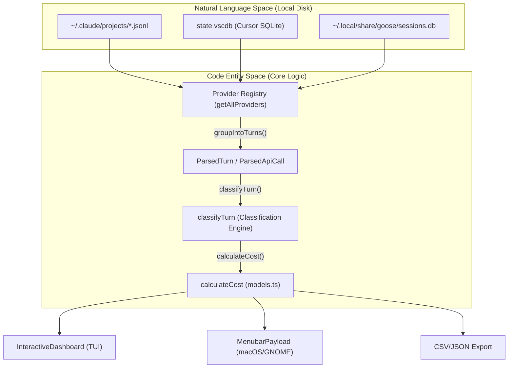
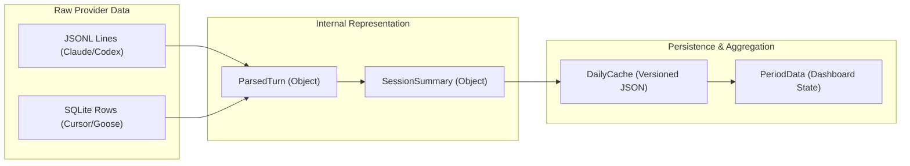

# CodeBurn Overview

Relevant source files

The following files were used as context for generating this wiki page:

- [.github/FUNDING.yml](.github/FUNDING.yml)
- [.gitignore](.gitignore)
- [CHANGELOG.md](CHANGELOG.md)
- [README.md](README.md)
- [assets/dashboard.jpg](assets/dashboard.jpg)
- [assets/logo.ico](assets/logo.ico)
- [assets/logo.png](assets/logo.png)
- [assets/menubar-0.8.0.png](assets/menubar-0.8.0.png)
- [package.json](package.json)

CodeBurn is a developer-focused observability tool designed to track and analyze AI coding token usage and costs directly from local session data. It provides deep visibility into where tokens are spent—categorized by task, tool, model, and project—without requiring API proxies or external wrappers.

### Purpose and Scope
The primary goal of CodeBurn is to answer the question: "Where do my AI coding tokens go?" It achieves this by parsing the local session logs of popular AI coding tools and providing an interactive dashboard (TUI), a macOS menubar application, a GNOME shell extension, and detailed export capabilities [README.md:16-18]().

CodeBurn tracks critical metrics like the **one-shot success rate** (the frequency with which an AI completes a task in a single turn without retries) and identifies **waste patterns** (e.g., redundant file reads or bloated context) to help developers optimize their AI budget [README.md:81-85]().

### Key Capabilities
*   **Multi-Provider Support**: Automatically discovers and parses data from 18+ tools, including Claude Code, Cursor, GitHub Copilot, Codex, Goose, and Roo Code [README.md:92-112](), [CHANGELOG.md:25-29]().
*   **Granular Analysis**: Breaks down costs by `TaskCategory` (e.g., coding, testing, terminal usage) and specific tools [README.md:16-17]().
*   **Cost Transparency**: Integrates with LiteLLM pricing data to provide accurate USD estimates across hundreds of models [README.md:18]().
*   **Optimization Engine**: Scans session history to detect "token burn" patterns like junk reads, duplicate reads, or unused MCP tool context [README.md:81-82](), [CHANGELOG.md:5-15]().
*   **Cross-Platform Interfaces**: Offers a terminal-based interactive dashboard, a native macOS menubar app, and a GNOME shell extension for real-time monitoring [README.md:20-37]().

### High-Level System Architecture

The following diagram illustrates how CodeBurn bridges the gap between raw session logs (Natural Language Space) and structured analysis (Code Entity Space).

**Data Transformation Pipeline**

**Sources**: [README.md:92-113](), [package.json:20-31](), [CHANGELOG.md:25-29](), [CHANGELOG.md:69-75]()

### Subsystem Relationships

CodeBurn is organized into several functional layers that interact to provide a cohesive experience:

| Subsystem | Primary Responsibility | Key Code Entities |
| :--- | :--- | :--- |
| **Ingestion** | Locating and reading raw session files from various providers. | `discoverAllSessions`, `parseSessionFile` |
| **Parsing** | Converting raw logs into standardized `ParsedTurn` and `Session` objects. | `groupIntoTurns`, `ParsedApiCall` |
| **Analysis** | Categorizing turns into tasks and calculating costs. | `classifyTurn`, `calculateCost`, `TaskCategory` |
| **Aggregation** | Bucketing data into time periods for reporting and caching. | `aggregateProjectsIntoDays`, `DailyCache` |
| **Presentation** | Rendering the TUI, macOS Menubar, GNOME extension, or file exports. | `InteractiveDashboard`, `MenuBarContent`, `exportCsv` |

**Logical Entity Mapping**

**Sources**: [CHANGELOG.md:75-76](), [CHANGELOG.md:18-19](), [README.md:121-125]()

### Navigation
For deeper technical dives, please refer to the following child pages:

*   **[Getting Started](#1.1)**: Installation via `npm install -g codeburn`, prerequisites (Node.js 22+), and initial configuration in `~/.config/codeburn/config.json` [package.json:32-34](), [README.md:45-56]().
*   **[Key Concepts and Terminology](#1.2)**: Definitions for domain-specific terms like "one-shot rate," "turn," "ParsedApiCall," and "waste patterns."
*   **Core Architecture**: Detailed look at the `Data Ingestion` pipeline, `Turn Classification` engine, and `DailyCache` persistence.
*   **CLI Reference**: Documentation for commands like `codeburn optimize`, `codeburn compare`, `codeburn yield`, and `codeburn status` [README.md:68-86]().
*   **Provider Plugin System**: Technical details on how 18+ providers (Claude, Cursor, Copilot, Goose, etc.) are extracted and deduplicated [README.md:92-112]().
*   **macOS Menubar Application**: Architecture of the Swift-based companion app located in the `mac/` directory, including its heartbeat and refresh logic [CHANGELOG.md:20-22](), [CHANGELOG.md:54-66]().
*   **GNOME Shell Extension**: Overview of the Linux indicator and its communication with the CLI via `Gio`.

**Sources**: [package.json:1-60](), [README.md:1-125](), [CHANGELOG.md:1-98]()
