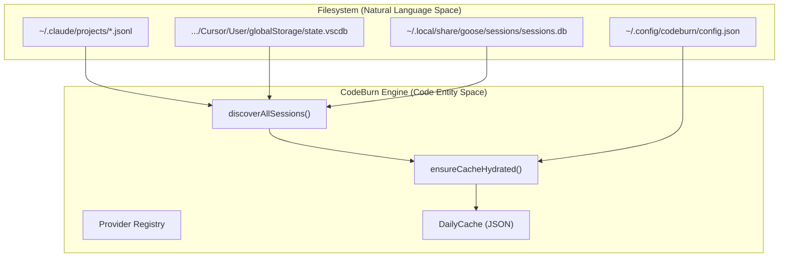
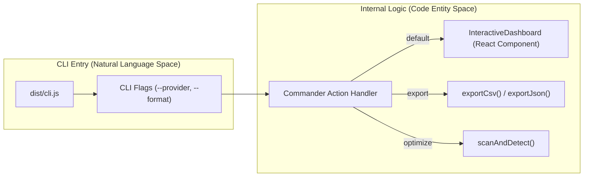

# Getting Started

<details>
<summary>Relevant source files</summary>

The following files were used as context for generating this wiki page:

- [CHANGELOG.md](CHANGELOG.md)
- [README.md](README.md)
- [assets/menubar-0.8.0.png](assets/menubar-0.8.0.png)
- [package-lock.json](package-lock.json)
- [package.json](package.json)
- [tsconfig.json](tsconfig.json)
- [tsup.config.ts](tsup.config.ts)

</details>


CodeBurn is a developer-centric observability tool designed to track AI token consumption and costs directly from local session logs. It provides visibility into how AI coding assistants—such as Claude Code, Cursor, and GitHub Copilot—utilize resources across different projects, models, and task categories without requiring API proxies or wrappers [README.md:16-19]().

## Prerequisites

To run CodeBurn, your environment must meet the following requirements:

*   **Node.js**: Version 22 or higher is required [package.json:32-34](). The project is built using `tsup` targeting `node20` for compatibility, but runtime execution relies on modern Node features [tsup.config.ts:6-6]().
*   **Operating System**: macOS, Linux, or Windows. While session log paths like `~/.claude` are standard on Unix-like systems, CodeBurn automatically detects Windows equivalents [README.md:113-113]().
*   **Supported AI Tools**: At least one of the 18 supported providers must have session data on disk (e.g., Claude Code, Cursor, Goose, or Roo Code) [README.md:16-16, 92-111]().
*   **Database Drivers**: For Cursor and OpenCode support, `better-sqlite3` is required and typically installed as an optional dependency [README.md:43-43]().

## Installation

CodeBurn can be installed via NPM, Homebrew, or executed on-demand.

### Global Installation
```bash
npm install -g codeburn
```
[README.md:47-49]()

### Homebrew (macOS/Linux)
```bash
brew tap getagentseal/codeburn
brew install codeburn
```
[README.md:51-56]()

### One-time Execution
```bash
npx codeburn
# or
bunx codeburn
```
[README.md:58-64]()

## First Run and Data Flow

On the first run, CodeBurn performs an automatic discovery of provider session logs. It scans default directories such as `~/.claude/projects/` for Claude Code, `~/.local/share/goose/sessions/` for Goose, or SQLite databases for Cursor [README.md:92-111](). 

The system utilizes a **Durable Daily Cache** (v4) to ensure subsequent runs are instant. This cache is hydrated via `ensureCacheHydrated()` and stored with atomic file writes to prevent corruption [CHANGELOG.md:75-75, 84-84]().

### Data Ingestion Overview

Sources: [README.md:92-111](), [CHANGELOG.md:75-75](), [CHANGELOG.md:84-84]()

## Configuration

CodeBurn stores its persistent settings in a JSON configuration file.

*   **Location**: `~/.config/codeburn/config.json`
*   **Durable Cache Location**: CodeBurn uses a versioned cache to store aggregated daily data, which is migrated automatically if the schema changes [CHANGELOG.md:75-75]().

### Plan and Currency
CodeBurn allows users to set subscription plans (e.g., Claude Pro, Cursor Pro) to track budget utilization [README.md:86-86](). It also supports currency conversion using the Frankfurter FX API, ensuring that costs are displayed in the user's preferred local currency [CHANGELOG.md:40-40, 61-61]().

## CLI Command Tour

The CLI is the primary interface, supporting an interactive TUI (built with `ink`) and structured data exports.

### Main Commands

| Command | Purpose |
| :--- | :--- |
| `codeburn` | Launches the interactive dashboard (default: 7-day view) [README.md:69-69]() |
| `codeburn today` | Displays usage for the current day [README.md:70-70]() |
| `codeburn month` | Displays usage for the current calendar month [README.md:71-71]() |
| `codeburn report` | Generates detailed reports (supports `--from`/`--to` dates) [README.md:72-74]() |
| `codeburn optimize` | Scans for waste (e.g., unused MCP tools, session outliers) [CHANGELOG.md:6-15, README.md:81-82]() |
| `codeburn compare` | Side-by-side model performance and cost comparison [README.md:83-83]() |
| `codeburn export` | Exports data to CSV or JSON formats [README.md:79-80]() |

### Filtering and Formatting
*   **Provider Filtering**: Use `--provider <name>` (e.g., `claude`, `cursor`, `goose`) to scope any command [README.md:117-117]().
*   **JSON Output**: Use `--format json` for automation or piping to `jq` [README.md:75-75]().
*   **Period Control**: Use `-p` (e.g., `30days`, `week`, `all`) to set the lookback window [README.md:72-73, 85-85]().

### Command Implementation Flow
The CLI leverages `commander` for command routing and `react`/`ink` for terminal UI rendering.


Sources: [package.json:7-9, 45-51](), [README.md:68-86](), [CHANGELOG.md:75-75]()
