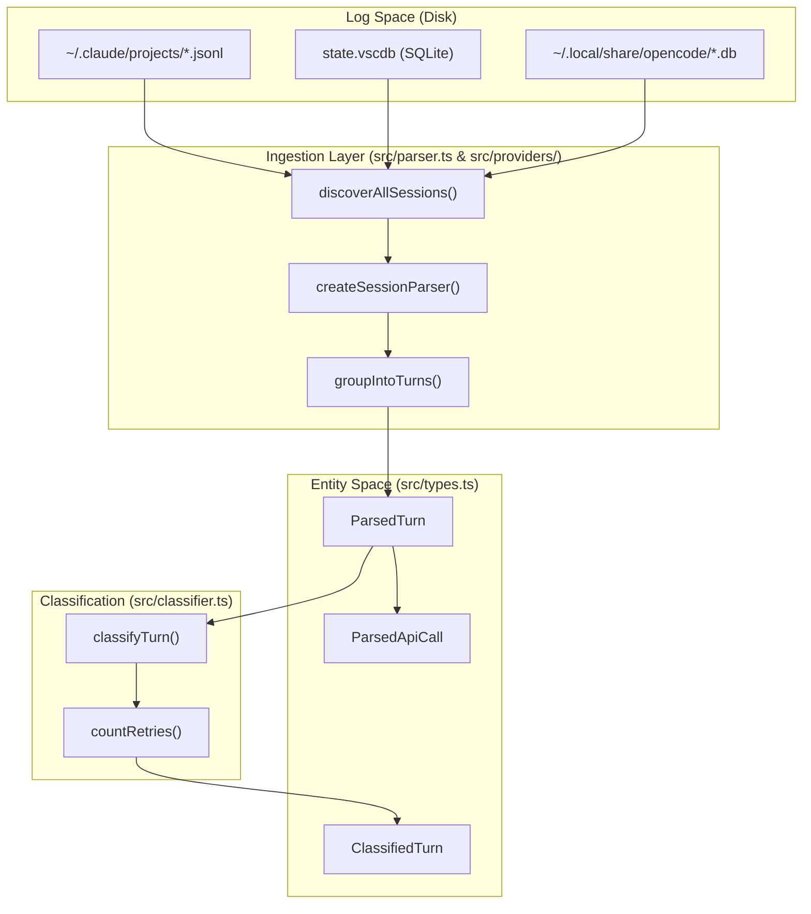
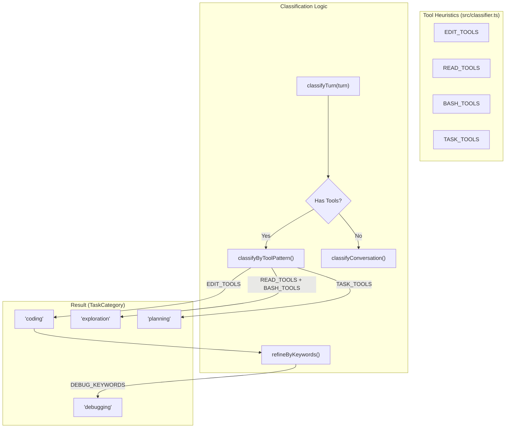

# Key Concepts and Terminology

Relevant source files

The following files were used as context for generating this wiki page:

- [src/classifier.ts](src/classifier.ts)
- [src/data/litellm-snapshot.json](src/data/litellm-snapshot.json)
- [src/parser.ts](src/parser.ts)
- [src/providers/antigravity.ts](src/providers/antigravity.ts)
- [src/providers/opencode.ts](src/providers/opencode.ts)
- [src/providers/types.ts](src/providers/types.ts)
- [src/types.ts](src/types.ts)

This page defines the core domain vocabulary and technical entities used throughout the CodeBurn codebase. Understanding these concepts is essential for navigating the data pipeline, from raw log ingestion to the final dashboard presentation.

## Purpose and Scope

CodeBurn is designed to provide visibility into AI coding expenditures by parsing local session logs from various AI providers. It transforms raw, heterogeneous event streams into a unified data model that allows for cost analysis, task classification, and waste detection without requiring API proxies or wrappers.

## Core Domain Entities

The system architecture revolves around a hierarchy of entities that represent the interaction between a developer and an AI agent.

### Provider
A **Provider** is a plugin-based abstraction representing an AI coding tool (e.g., Claude Code, Cursor, OpenCode). Each provider implements the `Provider` interface, which defines how to discover session files on disk and how to resolve display names for models and tools.
- **Implementation:** `Provider` interface in [src/providers/types.ts:32-39]().
- **Registry:** Managed via `getAllProviders` in [src/providers/index.ts:15-20]().

### Session
A **Session** represents a continuous interaction within a specific project context. In the codebase, this is encapsulated by the `SessionSummary` type. It aggregates multiple "Turns" and provides metadata such as total cost, token usage, and tool breakdowns.
- **Data Structure:** `SessionSummary` in [src/types.ts:106-130]().
- **Source:** Represented as a `SessionSource` during discovery [src/providers/types.ts:1-5]().

### Turn
A **Turn** is the atomic unit of conversation, consisting of a single user prompt and the subsequent sequence of assistant responses, including tool calls.
- **Raw Form:** `ParsedTurn` [src/types.ts:61-66]().
- **Enriched Form:** `ClassifiedTurn`, which adds category labels, retry counts, and edit flags [src/types.ts:99-104]().

### ParsedApiCall
A **ParsedApiCall** represents a single request/response exchange with an LLM within a Turn. A single Turn may contain multiple `ParsedApiCall` entities if the agent uses tools in a loop (e.g., Read -> Edit -> Bash).
- **Attributes:** Includes `usage` (tokens), `costUSD`, `tools` used, `bashCommands` extracted, and `deduplicationKey` [src/types.ts:68-82]().

### TaskCategory
A **TaskCategory** is a label assigned to a Turn by the classification engine. It identifies the intent of the interaction (e.g., `coding`, `debugging`, `exploration`).
- **Labels:** Defined in `CATEGORY_LABELS` [src/types.ts:145-159]().
- **Logic:** Determined by `classifyTurn` in [src/classifier.ts:150-174]().

---

## Technical Concepts and Metrics

### One-Shot Rate
The percentage of turns in a specific category that resulted in a successful outcome without requiring retries or self-corrections. CodeBurn tracks this to help users identify where models "nail it" first try versus where they burn tokens on repetitive edits.
- **Calculation:** Tracked via `oneShotTurns` in `categoryBreakdown` [src/types.ts:122]().

### Cache Hit Rate
The ratio of `cacheReadInputTokens` to total input tokens. This metric is critical for understanding the efficiency of prompt caching (specifically for Anthropic/Claude providers).
- **Source:** Extracted from `TokenUsage` [src/types.ts:1-9]().

### Waste Patterns
The `codeburn optimize` command scans sessions for "waste patterns"—inefficient behaviors that inflate costs.
- **Junk Reads:** Reading the same file multiple times without intervening edits.
- **Bloated Context:** Large `CLAUDE.md` or project instructions that are sent in every turn.
- **Ghost Agents:** Spawning sub-agents that perform no meaningful work.
- **Implementation:** Identified by tool patterns like `Agent` (spawn) [src/parser.ts:128]() or `EnterPlanMode` [src/parser.ts:129]().

### Plan and Budget
Users can define a monthly "Plan" to track their spending against a budget.
- **Projection:** The system calculates a projected month spend using a median-daily cost of the trailing 7 days.
- **Reset Day:** The day of the month the billing cycle restarts.

---

## Data Flow and Entity Mapping

The following diagrams illustrate how raw data is transformed into the internal types used by the application.

### Log Ingestion to Classified Entities
This diagram bridges the "Natural Language/Log Space" to the "Code Entity Space".

*Sources: [src/parser.ts:5](), [src/parser.ts:161-204](), [src/types.ts:61-104](), [src/classifier.ts:150-174]()*

### Turn Classification Logic
This diagram shows how `classifyTurn` maps tool usage patterns to `TaskCategory` labels.

*Sources: [src/classifier.ts:18-22](), [src/classifier.ts:60-94](), [src/classifier.ts:96-111]()*

---

## Summary Table of Key Metrics

| Term | Definition | Code Reference |
| :--- | :--- | :--- |
| **Input Tokens** | Tokens sent to the model (including context). | `TokenUsage.inputTokens` [src/types.ts:2]() |
| **Output Tokens** | Tokens generated by the model. | `TokenUsage.outputTokens` [src/types.ts:3]() |
| **Cache Creation** | Tokens written to cache (expensive). | `TokenUsage.cacheCreationInputTokens` [src/types.ts:4]() |
| **Cache Read** | Tokens read from cache (cheap). | `TokenUsage.cacheReadInputTokens` [src/types.ts:5]() |
| **Retries** | Detected loop of Edit -> Error -> Edit. | `countRetries()` [src/classifier.ts:124-144]() |
| **Reasoning Tokens** | Tokens used for internal "thought" (e.g., o1/R1). | `TokenUsage.reasoningTokens` [src/types.ts:7]() |

*Sources: [src/types.ts:1-9](), [src/classifier.ts:124-144](), [src/parser.ts:90-135]()*
