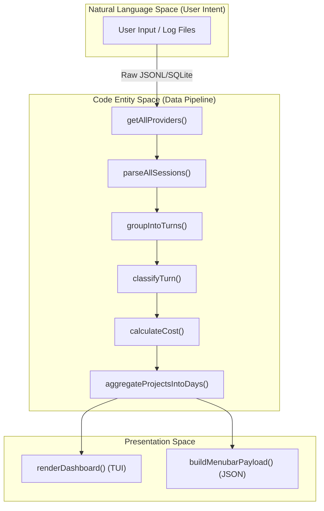
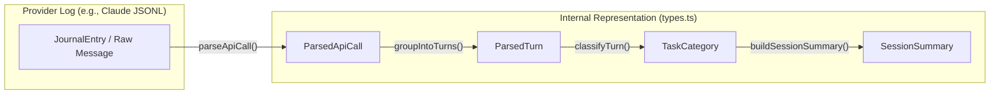

# Core Architecture

Relevant source files

The following files were used as context for generating this wiki page:

- [CHANGELOG.md](CHANGELOG.md)
- [README.md](README.md)
- [assets/menubar-0.8.0.png](assets/menubar-0.8.0.png)
- [package.json](package.json)
- [src/cli.ts](src/cli.ts)

The CodeBurn architecture is designed to transform high-volume, fragmented AI provider logs into structured financial and operational insights. It operates as a multi-stage pipeline that moves data from raw provider-specific formats (JSONL, SQLite) into a unified internal representation for analysis and display.

## End-to-End Data Pipeline

The pipeline follows a linear progression from discovery to presentation. Every invocation of a `codeburn` command (or a refresh of the macOS menubar app) triggers a pass through these layers, often coordinated by `hydrateCache` [src/cli.ts:27-36]().

### 1. Ingestion & Discovery
The system identifies session data on the local filesystem. The `getAllProviders` function [src/providers/index.ts:25-50]() returns a registry of supported tools (e.g., Claude, Cursor, Copilot, Roo Code). Each provider implements a discovery mechanism; for example, the Claude provider scans `~/.claude/projects/` [src/providers/claude.ts:81-91]().

### 2. Parsing & Normalization
The `parseAllSessions` function [src/parser.ts:241-285]() orchestrates the conversion of raw files into `ParsedTurn` objects [src/types.ts:61-66]().
*   **Deduplication:** Uses a `deduplicationKey` (typically a message ID) to ensure that logs from overlapping sources (like Desktop vs. CLI agents) are not double-counted [src/parser.ts:148-149]().
*   **Grouping:** The `groupIntoTurns` function [src/parser.ts:122-165]() collects a user message and all subsequent assistant tool calls/responses into a single logical "Turn".

For details, see [Data Ingestion and Parsing Pipeline](#2.1).

### 3. Classification & Costing
Parsed turns are enriched with metadata to provide actionable insights:
*   **Classification:** `classifyTurn` [src/classifier.ts:14-55]() analyzes tool usage patterns (like `str_replace_editor` or `bash`) to assign a `TaskCategory` [src/types.ts:83-97]().
*   **Costing:** The engine resolves model names to canonical pricing tiers using LiteLLM data [src/models.ts:141-164]() and calculates USD cost via `calculateCost` [src/models.ts:238-278](), accounting for input, output, and cache hits.

For details, see [Turn Classification Engine](#2.2) and [Pricing and Cost Calculation](#2.3).

### 4. Aggregation & Caching
To maintain high performance across thousands of session files, the system reduces granular turns into summaries.
*   **Project Summaries:** Data is grouped by project path into `ProjectSummary` objects [src/types.ts:123-129]().
*   **Temporal Bucketing:** `aggregateProjectsIntoDays` [src/day-aggregator.ts:41-195]() buckets costs and metrics by calendar date for time-series charts.
*   **Persistence:** The `DailyCache` [src/daily-cache.ts:22-38]() stores versioned, aggregated daily data in `~/.config/codeburn/cache/v4/` to avoid re-parsing historical logs on every run.

For details, see [Day Aggregation and Caching](#2.4).

### 5. Presentation
Finally, the data is rendered for the user.
*   **CLI/TUI:** Commands like `codeburn report` or `codeburn today` use `renderDashboard` [src/dashboard.ts:16-18]() (via React Ink) or `renderStatusBar` [src/format.ts:27-59]().
*   **JSON/Export:** Data can be exported via `buildJsonReport` [src/cli.ts:115-195]() for the macOS Menubar app or external tools.

---

## Architecture Diagrams

### Pipeline Flow: From Logs to Dashboard
This diagram shows how data flows through the major code entities.

**Sources:** [src/parser.ts:241-285](), [src/day-aggregator.ts:41-42](), [src/classifier.ts:14](), [src/models.ts:238](), [src/cli.ts:27-36]()

### Entity Mapping: Log Data to Internal Types
This diagram bridges the gap between raw provider data and the internal TypeScript interfaces used for logic.

**Sources:** [src/parser.ts:77-120](), [src/parser.ts:122-165](), [src/parser.ts:167-239](), [src/types.ts:46-121]()

---

## Core Components Overview

| Layer | Primary Responsibility | Key Files |
| :--- | :--- | :--- |
| **Providers** | File discovery and raw log extraction for 18+ tools. | `src/providers/*` |
| **Parsing** | Turning raw lines into logical turns and API calls. | `src/parser.ts` |
| **Classification** | Identifying task types (Coding, Debugging, etc.). | `src/classifier.ts` |
| **Economics** | Model pricing (LiteLLM), token math, and FX. | `src/models.ts`, `src/currency.ts` |
| **Aggregation** | Summarizing data by project, day, and model. | `src/day-aggregator.ts` |
| **Storage** | Persisting calculated totals to disk (DailyCache). | `src/daily-cache.ts` |
| **Config** | User settings, plans, and model aliases. | `src/config.ts`, `src/plans.ts` |

**Sources:** [src/parser.ts](), [src/classifier.ts](), [src/models.ts](), [src/day-aggregator.ts](), [src/daily-cache.ts](), [src/cli.ts]()
