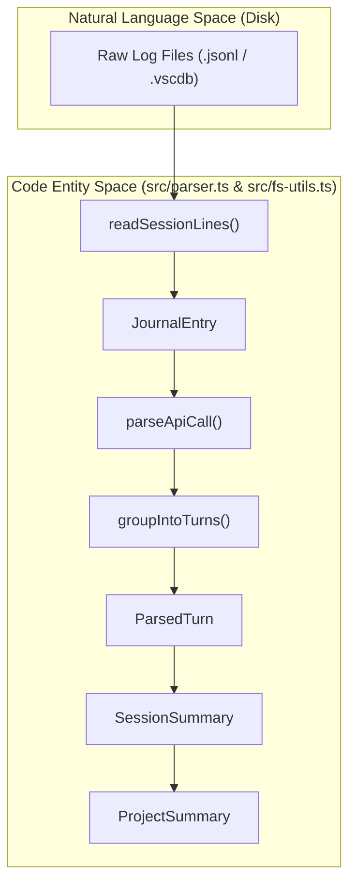
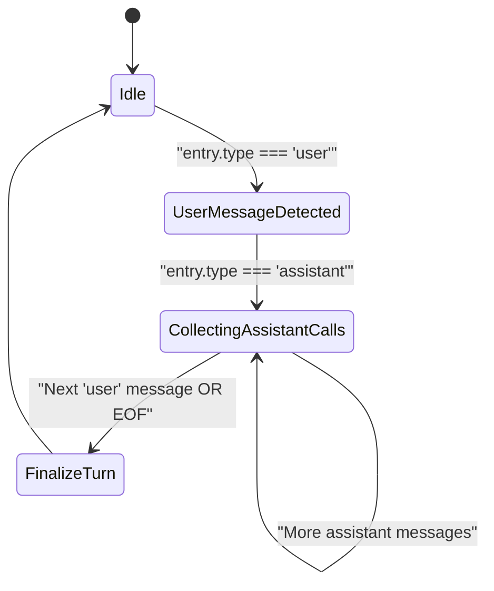

# Data Ingestion and Parsing Pipeline

Relevant source files

The following files were used as context for generating this wiki page:

- [src/cli-date.ts](src/cli-date.ts)
- [src/fs-utils.ts](src/fs-utils.ts)
- [src/parser.ts](src/parser.ts)
- [src/types.ts](src/types.ts)
- [tests/cli-date.test.ts](tests/cli-date.test.ts)
- [tests/date-range-filter.test.ts](tests/date-range-filter.test.ts)
- [tests/fs-utils.test.ts](tests/fs-utils.test.ts)
- [tests/mcp-coverage.test.ts](tests/mcp-coverage.test.ts)
- [tests/models.test.ts](tests/models.test.ts)
- [tests/parser-filter.test.ts](tests/parser-filter.test.ts)
- [tests/parser-mcp-inventory.test.ts](tests/parser-mcp-inventory.test.ts)

The Data Ingestion and Parsing Pipeline is the foundational subsystem of CodeBurn. It is responsible for discovering raw log files from various AI providers, reading them efficiently from disk, deduplicating messages, and transforming unstructured JSONL or SQLite data into structured `ParsedTurn` and `SessionSummary` objects for downstream analysis.

## Pipeline Overview

The pipeline operates in a linear sequence: discovery, reading, parsing, grouping, and summarization.

### Logic Flow: Raw Data to Project Summary

1.  **Discovery**: The system identifies session files using provider-specific logic via `discoverAllSessions` [src/parser.ts:5]().
2.  **Reading**: Files are read from disk using a memory-aware strategy in `readSessionLines` that uses `createReadStream` to keep memory usage stable [src/fs-utils.ts:79-104]().
3.  **Parsing**: Raw lines are converted into `JournalEntry` objects using `parseJsonlLine` [src/parser.ts:29-35]().
4.  **Grouping**: Sequential entries are grouped into "Turns" via `groupIntoTurns` (a user message followed by one or more assistant responses/tool calls) [src/parser.ts:161-204]().
5.  **Classification**: Each turn is analyzed by `classifyTurn` to determine its `TaskCategory` [src/parser.ts:22]().
6.  **Summarization**: Turns are aggregated into `SessionSummary` and finally `ProjectSummary` objects [src/types.ts:106-138]().

### Data Flow Diagram

The following diagram maps the transition from "Natural Language Space" (User/Assistant interactions) to "Code Entity Space" (the internal data structures).

"Pipeline Data Transformation"

Sources: [src/parser.ts:5-204](), [src/fs-utils.ts:79-104](), [src/types.ts:46-138]()

## Session Discovery and Reading

The pipeline begins by invoking `discoverAllSessions` from the provider registry [src/parser.ts:5](). This returns paths to raw logs which are then processed by the `fs-utils` module.

### Memory-Aware File Reading
To prevent OOM (Out of Memory) errors when processing large session logs, CodeBurn implements a tiered reading strategy:
*   **Small Files (< 8MB)**: Read directly into memory using `readFile` for maximum speed [src/fs-utils.ts:49]().
*   **Large Files (8MB - 128MB)**: Processed via `readViaStream` using `createReadStream` and the `readline` interface to keep memory usage stable [src/fs-utils.ts:26-32](), [src/fs-utils.ts:49]().
*   **Oversize Files (> 128MB)**: `readSessionFile` returns `null` to protect the V8 heap, with a warning emitted if `CODEBURN_VERBOSE` is enabled [src/fs-utils.ts:43-46]().
*   **Streaming Limit**: For line-by-line processing (e.g., `readSessionLines`), a higher safety cap of 2GB is enforced [src/fs-utils.ts:16-17](), [src/fs-utils.ts:88-93]().

Sources: [src/fs-utils.ts:8-17](), [src/fs-utils.ts:26-55](), [src/fs-utils.ts:79-104]()

## Parsing and Grouping Logic

The core logic for transforming raw entries resides in `src/parser.ts`.

### API Call Extraction
The `parseApiCall` function extracts metadata from assistant messages, including:
*   **Token Usage**: Input, output, and cache-related tokens mapped to the `TokenUsage` type [src/parser.ts:96-104]().
*   **Cost**: Calculated via `calculateCost` using model-specific pricing and usage speed [src/parser.ts:108-116]().
*   **Tool Usage**: Extraction of core tools and MCP (Model Context Protocol) tools [src/parser.ts:125-126]().
*   **Deduplication**: A `deduplicationKey` is generated from the message ID or timestamp to ensure responses aren't double-counted [src/parser.ts:133]().

### Turn Grouping (`groupIntoTurns`)
CodeBurn organizes data into "Turns" to reflect the human-AI interaction cycle. A turn starts when a `user` message is encountered [src/parser.ts:169-170](). All subsequent `assistant` messages and their associated tool calls are collected into that turn until the next non-empty `user` message appears [src/parser.ts:172-179]().

"Turn Grouping Logic"

Sources: [src/parser.ts:161-204](), [src/types.ts:61-66]()

## Filtering and Caching

### Date-Range Filtering
The pipeline supports filtering sessions by date using the `--from` and `--to` flags.
*   **Boundary Constraints**: "All Time" is intentionally bounded to the last 6 months to keep the parse path bounded for providers with sparse multi-year history [src/cli-date.ts:11-16]().
*   **Inclusive Ranges**: The `parseDateRangeFlags` function ensures the `--to` date includes the entire day (up to 23:59:59.999) [src/cli-date.ts:55-63]().
*   **Validation**: It throws an error if the start date is after the end date [src/cli-date.ts:65-67]().

### TTL Caching
While `parseAllSessions` performs the heavy lifting, results are cached. The pipeline respects a versioned cache (e.g., `DailyCache`) to ensure that changes in parsing or pricing logic invalidate old data. Provider-specific caches like `flushCodexCache` and `flushAntigravityCache` are also managed [src/parser.ts:6-7]().

### Project Filtering
The `filterProjectsByName` function allows users to narrow down the analysis. It supports case-insensitive substring matches against both the project name and the file path [tests/parser-filter.test.ts:30-43]().

| Filter Type | Behavior | Code Reference |
| :--- | :--- | :--- |
| **Include** | OR semantics (matches any pattern) | [tests/parser-filter.test.ts:45-48]() |
| **Exclude** | AND-negation (removes if any pattern matches) | [tests/parser-filter.test.ts:50-53]() |
| **Path Match** | Matches substrings in the absolute directory path | [tests/parser-filter.test.ts:55-58]() |

Sources: [src/cli-date.ts:11-124](), [tests/parser-filter.test.ts:16-82](), [src/parser.ts:6-7]()
