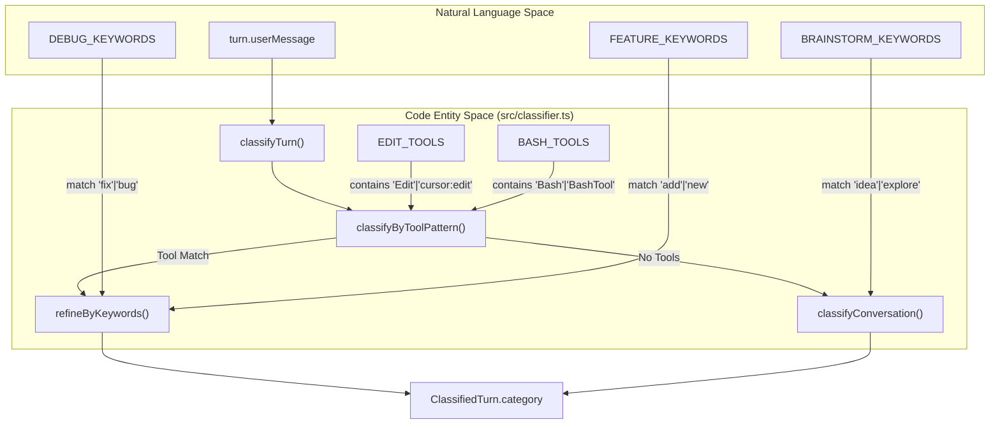
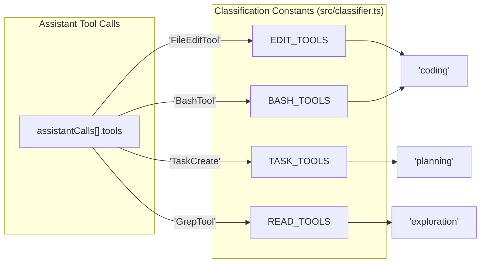
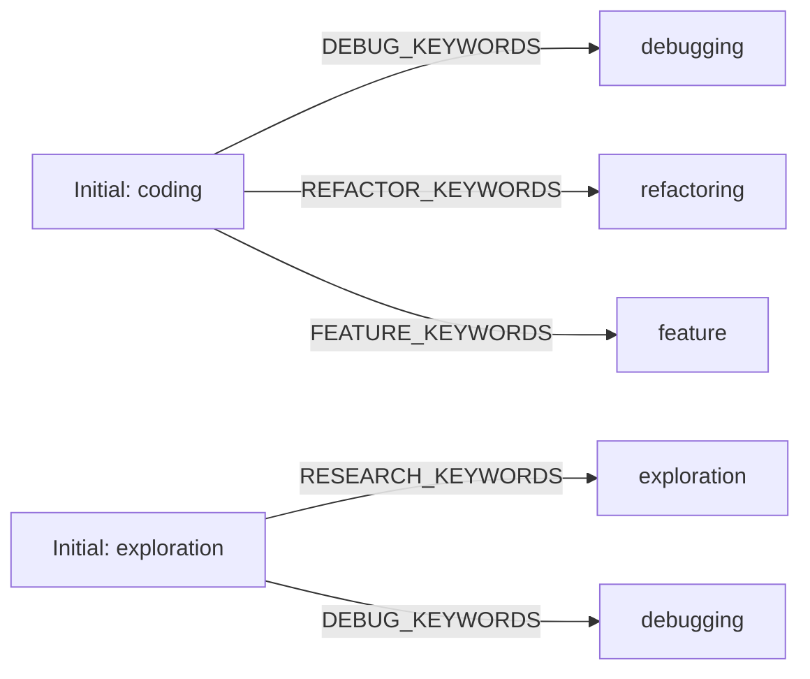

# Turn Classification Engine

Relevant source files

The following files were used as context for generating this wiki page:

- [src/bash-utils.ts](src/bash-utils.ts)
- [src/classifier.ts](src/classifier.ts)
- [tests/bash-commands.test.ts](tests/bash-commands.test.ts)
- [tests/classifier.test.ts](tests/classifier.test.ts)
- [tests/dashboard.test.ts](tests/dashboard.test.ts)
- [tests/day-aggregator.test.ts](tests/day-aggregator.test.ts)

The Turn Classification Engine is responsible for transforming a raw `ParsedTurn` into a `ClassifiedTurn` by assigning it one of 13 specific `TaskCategory` labels. This classification is performed by the `classifyTurn` function, which utilizes a hierarchical approach combining tool-usage patterns, keyword heuristics, and regex-based command analysis [src/classifier.ts:150-174]().

### Classification Pipeline

The classification process follows a fallback-oriented logic:
1.  **Tool Analysis**: If the turn contains tool calls, it is first categorized based on the specific tools invoked (e.g., `Edit`, `Bash`, `Read`) via `classifyByToolPattern` [src/classifier.ts:158-159]().
2.  **Keyword Refinement**: For turns identified as `coding` or `exploration` via tools, the engine applies `refineByKeywords` to assign more specific labels like `debugging` or `refactoring` [src/classifier.ts:160-161]().
3.  **Conversation Heuristics**: If no tools were used, or tool patterns are ambiguous, the engine falls back to `classifyConversation`, which analyzes the user's natural language message using regex patterns [src/classifier.ts:156,162]().

### Natural Language to Code Entity Mapping

The following diagrams illustrate how natural language patterns and tool identifiers from the code are mapped to internal task categories.

**Turn Classification Logic Flow**

Sources: [src/classifier.ts:8-11](), [src/classifier.ts:18-20](), [src/classifier.ts:150-164]()

**Tool Identifier Mapping**

Sources: [src/classifier.ts:18-22](), [src/classifier.ts:60-94]()

### Tool-Pattern Matching

The engine defines several sets of tool names used by various providers (Claude, Cursor, etc.) to determine the primary intent of a turn.

| Tool Set | Members | Primary Category |
| :--- | :--- | :--- |
| `EDIT_TOOLS` | `Edit`, `Write`, `FileEditTool`, `FileWriteTool`, `NotebookEdit`, `cursor:edit` | `coding` |
| `READ_TOOLS` | `Read`, `Grep`, `Glob`, `FileReadTool`, `GrepTool`, `GlobTool` | `exploration` |
| `BASH_TOOLS` | `Bash`, `BashTool`, `PowerShellTool` | `coding` / `testing` / `git` |
| `TASK_TOOLS` | `TaskCreate`, `TaskUpdate`, `TaskGet`, `TaskList`, `TaskOutput`, `TaskStop`, `TodoWrite` | `planning` |
| `SEARCH_TOOLS`| `WebSearch`, `WebFetch`, `ToolSearch` | `exploration` |

Sources: [src/classifier.ts:18-22](), [src/classifier.ts:67-91]()

#### Bash Command Refinement
When `BASH_TOOLS` are used without `EDIT_TOOLS`, the engine inspects the `userMessage` using specific regex patterns to differentiate infrastructure tasks from coding:
*   **Testing**: Matches `TEST_PATTERNS` (e.g., `npm test`, `vitest`, `pytest`) [src/classifier.ts:77]().
*   **Git**: Matches `GIT_PATTERNS` (e.g., `git push`, `git commit`) [src/classifier.ts:78]().
*   **Build/Deploy**: Matches `BUILD_PATTERNS` or `INSTALL_PATTERNS` (e.g., `docker`, `npm install`, `deploy`) [src/classifier.ts:79-80]().

### Keyword Heuristics

For turns involving file edits or terminal execution, `refineByKeywords` provides granular classification [src/classifier.ts:96-111]().

**Keyword Refinement Mapping**

Sources: [src/classifier.ts:96-111]()

### Retry Detection

The engine calculates a `retries` metric for each turn. A retry is detected when an assistant attempts a file edit, followed by a bash command (presumably to test or verify), and then immediately follows up with another file edit in the same turn [src/classifier.ts:124-144]().

*   **Logic**: It tracks the sequence of `hasEdit` and `hasBash` flags across the `assistantCalls` array [src/classifier.ts:129-141]().
*   **Increment**: If `sawBashAfterEdit` is true when a new edit tool is encountered, the `retries` counter increments [src/classifier.ts:134]().

### The 13 Category Labels

The final `TaskCategory` assigned to `ClassifiedTurn.category` will be one of the following:

1.  `coding`: General code modification or terminal-heavy tasks [src/classifier.ts:83,86,118-119]().
2.  `debugging`: Fixing bugs, analyzing stack traces, or resolving errors [src/classifier.ts:98,106,116]().
3.  `feature`: Implementing new functionality or scaffolding [src/classifier.ts:100,117]().
4.  `refactoring`: Cleaning up, renaming, or restructuring existing code [src/classifier.ts:99]().
5.  `exploration`: Reading files, searching docs, or investigating logic [src/classifier.ts:85,88-89,105,115,120]().
6.  `testing`: Running test suites or writing test cases [src/classifier.ts:77]().
7.  `git`: Version control operations [src/classifier.ts:78]().
8.  `build/deploy`: Dependency installation, building, or deployment [src/classifier.ts:79-80]().
9.  `planning`: Using task/todo tools or agent "plan mode" [src/classifier.ts:64,90]().
10. `delegation`: Spawning sub-agents [src/classifier.ts:65]().
11. `brainstorming`: High-level ideation and strategy discussion [src/classifier.ts:114]().
12. `conversation`: General chat without tool usage or specific technical intent [src/classifier.ts:121]().
13. `general`: Fallback for generic tool usage (e.g., `Skill` tool) [src/classifier.ts:91]().

Sources: [src/classifier.ts:60-122](), [src/types.js:1]() (Note: `TaskCategory` type definition).

### Bash Utility Integration

The classification engine relies on `extractBashCommands` from `src/bash-utils.ts` to parse complex terminal strings. This utility:
*   Strips quoted strings to avoid false positives in separators [src/bash-utils.ts:4-5,12]().
*   Splits commands by `&&`, `;`, and `|` [src/bash-utils.ts:14]().
*   Filters out noise like environment variable assignments (`NODE_ENV=test`) and utility commands like `cd`, `true`, or `false` [src/bash-utils.ts:37-40]().

Sources: [src/bash-utils.ts:8-46](), [tests/bash-commands.test.ts:5-76]()
