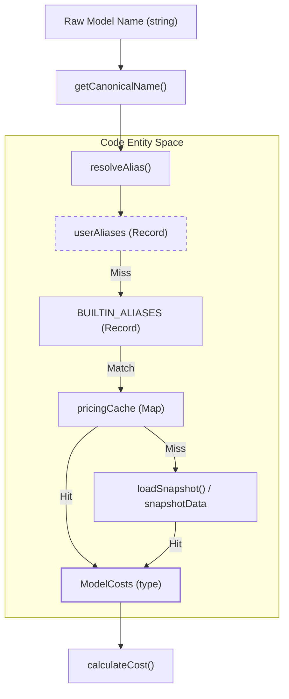
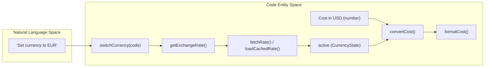

# Pricing and Cost Calculation

Relevant source files

The following files were used as context for generating this wiki page:

- [scripts/bundle-litellm.mjs](scripts/bundle-litellm.mjs)
- [src/currency.ts](src/currency.ts)
- [src/day-aggregator.ts](src/day-aggregator.ts)
- [src/export.ts](src/export.ts)
- [src/format.ts](src/format.ts)
- [src/models.ts](src/models.ts)
- [src/providers/gemini.ts](src/providers/gemini.ts)
- [src/providers/goose.ts](src/providers/goose.ts)
- [src/providers/openclaw.ts](src/providers/openclaw.ts)
- [src/providers/qwen.ts](src/providers/qwen.ts)
- [tests/export.test.ts](tests/export.test.ts)
- [tests/minimax.test.ts](tests/minimax.test.ts)

The pricing engine in CodeBurn is responsible for transforming raw token counts and tool usage into financial metrics. It leverages a multi-tiered resolution strategy that combines real-time data from LiteLLM, a bundled snapshot for offline reliability, hardcoded fallback rates for emerging models, and user-defined aliases.

## Model Cost Engine (`models.ts`)

The core of the pricing logic resides in `src/models.ts`. It manages the lifecycle of pricing data, from fetching remote updates to calculating the final USD cost for a specific interaction.

### Data Flow and Resolution

The system uses a hierarchical lookup strategy to determine the cost of a model. When `getModelCosts` is called, it traverses the following sources:

1.  **User Aliases**: Checks `userAliases` (populated via `setModelAliases`) which take precedence over all other lookups [src/models.ts:162-174]().
2.  **Built-in Aliases**: Checks `BUILTIN_ALIASES` to resolve provider-specific variants like `cursor-auto` or `anthropic--claude-4.6-sonnet` to canonical LiteLLM names [src/models.ts:127-160]().
3.  **Pricing Cache**: Searches the `pricingCache` populated from either the local `litellm-pricing.json` cache or the bundled `litellm-snapshot.json` [src/models.ts:34-50](), [src/models.ts:109-121]().

### Pricing Resolution Pipeline

The following diagram illustrates how a raw model string (e.g., from a Gemini JSONL log or a Qwen session) is resolved to a `ModelCosts` object.

**Model Resolution Entity Mapping**

Sources: [src/models.ts:6-13](), [src/models.ts:127-160](), [src/models.ts:170-180](), [src/models.ts:182-192]().

### Key Functions

*   **`loadPricing()`**: Initializes the engine. It attempts to read `litellm-pricing.json` from `~/.cache/codeburn/` or fetches it from the LiteLLM GitHub repository if the cache is older than 24 hours [src/models.ts:98-121]().
*   **`calculateCost()`**: The primary entry point for math. It accepts input tokens, output tokens, cache writes, cache reads, and web search counts. It applies the `fastMultiplier` for models like `claude-opus-4-7` [src/models.ts:29-32](), [src/models.ts:220-229]().
*   **`getCanonicalName()`**: Strips version pins (e.g., `@20250929`), date suffixes (e.g., `-20250514`), and provider prefixes (e.g., `anthropic/`) to find the base model ID [src/models.ts:175-180]().
*   **`parseLiteLLMEntry()`**: Maps the LiteLLM JSON schema to the internal `ModelCosts` structure. It calculates cache costs as 1.25x (write) and 0.1x (read) of the input cost if explicit cache pricing is missing [src/models.ts:60-70]().

## Currency Conversion (`currency.ts`)

CodeBurn performs all internal calculations in USD but presents data in the user's preferred currency using `src/currency.ts`.

### FX Rate Integration
The system uses the **Frankfurter API** to fetch exchange rates [src/currency.ts:14](). To ensure stability:
1.  **Caching**: Rates are cached in `~/.cache/codeburn/exchange-rate.json` for 24 hours [src/currency.ts:13](), [src/currency.ts:61-63]().
2.  **Validation**: Fetched rates are validated against `MIN_VALID_FX_RATE` (0.0001) and `MAX_VALID_FX_RATE` (1,000,000) [src/currency.ts:17-25]().
3.  **Formatting**: `formatCost` adjusts decimal precision based on the currency value (e.g., 2 digits for values >= 1, up to 4 digits for sub-cent values) [src/currency.ts:145-156]().

**Currency Conversion Logic**

Sources: [src/currency.ts:7-11](), [src/currency.ts:110-119](), [src/currency.ts:139-156]().

## Cost Components and Aggregation

Calculated costs are aggregated across different dimensions for reporting and dashboarding.

### Cost Components Table

| Component | Code Reference | Description |
| :--- | :--- | :--- |
| **Input Tokens** | `inputCostPerToken` | Base cost for prompt tokens. |
| **Output Tokens** | `outputCostPerToken` | Base cost for completion tokens. |
| **Cache Write** | `cacheWriteCostPerToken` | Cost to write to context cache (default 1.25x input). |
| **Cache Read** | `cacheReadCostPerToken` | Discounted cost for cache hits (default 0.1x input). |
| **Web Search** | `webSearchCostPerRequest` | Flat fee per search (default $0.01) [src/models.ts:27](). |
| **Fast Mode** | `fastMultiplier` | Applied to total for high-speed variants [src/models.ts:228](). |

### Aggregation Logic (`day-aggregator.ts`)
The `aggregateProjectsIntoDays` function iterates through sessions and turns to build `DailyEntry` objects. It buckets costs by the timestamp of the first assistant call in a turn [src/day-aggregator.ts:41-48](). This data is then used by `src/export.ts` to build CSV/JSON rows for daily, model, and activity-based reporting [src/export.ts:46-137]().

Sources: [src/models.ts:6-13](), [src/day-aggregator.ts:28-94](), [src/export.ts:46-80]().
