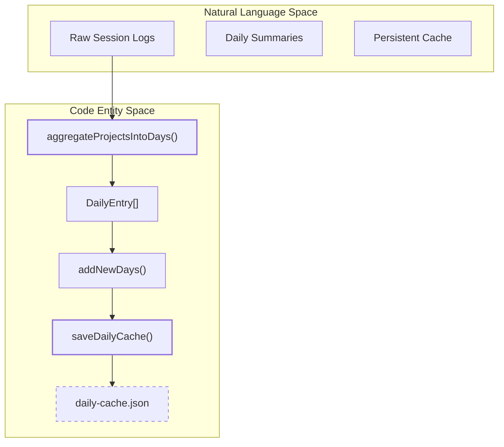
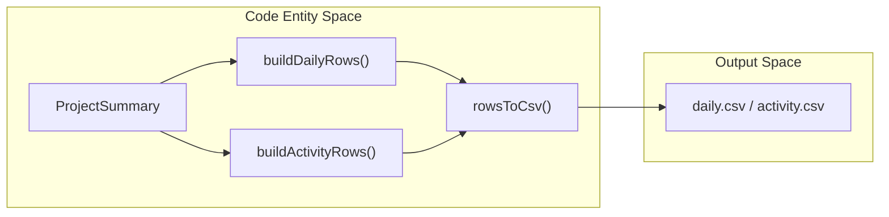

# Day Aggregation and Caching

Relevant source files

The following files were used as context for generating this wiki page:

- [mac/Sources/CodeBurnMenubar/Theme/Theme.swift](mac/Sources/CodeBurnMenubar/Theme/Theme.swift)
- [mac/Sources/CodeBurnMenubar/Views/FindingsSection.swift](mac/Sources/CodeBurnMenubar/Views/FindingsSection.swift)
- [mac/Sources/CodeBurnMenubar/Views/HeroSection.swift](mac/Sources/CodeBurnMenubar/Views/HeroSection.swift)
- [src/currency.ts](src/currency.ts)
- [src/daily-cache.ts](src/daily-cache.ts)
- [src/day-aggregator.ts](src/day-aggregator.ts)
- [src/export.ts](src/export.ts)
- [src/format.ts](src/format.ts)
- [tests/classifier.test.ts](tests/classifier.test.ts)
- [tests/daily-cache.test.ts](tests/daily-cache.test.ts)
- [tests/dashboard.test.ts](tests/dashboard.test.ts)
- [tests/day-aggregator.test.ts](tests/day-aggregator.test.ts)
- [tests/export.test.ts](tests/export.test.ts)

The day aggregation and caching system provides a high-performance layer for summarizing session data into calendar-based buckets. It transforms granular `ProjectSummary` objects into `DailyEntry` records, which are then persisted in a versioned JSON cache to enable fast dashboard rendering and historical reporting without re-parsing thousands of raw session files every time.

## Day Aggregation Logic

The aggregation process converts raw session and turn data into daily statistics. The primary entry point is `aggregateProjectsIntoDays`, which iterates through all projects and sessions to bucket metrics by date.

### Key Functions
- **`dateKey(iso: string)`**: A utility that converts an ISO timestamp into a `YYYY-MM-DD` string used as the primary key for daily buckets [src/day-aggregator.ts:23-26]().
- **`aggregateProjectsIntoDays(projects: ProjectSummary[])`**: The core transformation engine. It maps every `assistantCall` and `turn` to a specific day based on the timestamp of the first assistant call in that turn [src/day-aggregator.ts:28-94]().
- **`buildPeriodDataFromDays(days: DailyEntry[], label: string)`**: Roll up a range of daily entries into a single `PeriodData` object (e.g., "Last 30 Days") for use in the TUI or macOS menubar [src/day-aggregator.ts:96-143]().

### Aggregation Rules
| Entity | Date Attribution Logic |
| :--- | :--- |
| **Sessions** | Counted on the day of `session.firstTimestamp` [src/day-aggregator.ts:38-39](). |
| **Turns** | Attributed to the date of the *first assistant call* within that turn [src/day-aggregator.ts:43-44](). |
| **Costs/Tokens** | Summed individually based on each specific `assistantCall.timestamp` [src/day-aggregator.ts:61-69](). |
| **Categories** | Breakdown (turns, cost, editTurns, oneShotTurns) is stored per-category within each day [src/day-aggregator.ts:53-58](). |

**Sources:** [src/day-aggregator.ts:5-143](), [tests/day-aggregator.test.ts:42-201]()

## The DailyCache Persistence Layer

CodeBurn persists aggregated daily data in a versioned JSON file located at `~/.cache/codeburn/daily-cache.json` [src/daily-cache.ts:41-47](). This prevents expensive re-calculation of historical data by only parsing "gap" periods.

### Data Flow: From Projects to Disk
The following diagram illustrates how the system bridges raw project summaries to the persistent cache.

**Aggregation and Persistence Data Flow**

**Sources:** [src/daily-cache.ts:12-39](), [src/day-aggregator.ts:28-94]()

### Atomic Writes and Locking
To prevent data corruption during concurrent CLI or Menubar invocations, the cache implements two safety mechanisms:

1.  **Lock Chain**: All cache operations are serialized through `withDailyCacheLock`, which uses a `lockChain` promise to ensure only one process writes to the cache at a time [src/daily-cache.ts:146-152]().
2.  **Atomic Rename**: The `saveDailyCache` function writes data to a temporary file with a random suffix (e.g., `daily-cache.json.8f2a...tmp`), performs an `fsync` via `handle.sync()`, and then uses an atomic `rename` to overwrite the final destination [src/daily-cache.ts:109-128]().

### Cache Versioning and Migration
The cache includes a `DAILY_CACHE_VERSION` (currently `4`) [src/daily-cache.ts:8](). 
- **Migration**: If a cache file is version `2` or higher, `loadDailyCache` attempts to migrate the data by filling missing fields via `migrateDays` [src/daily-cache.ts:61-77](), [src/daily-cache.ts:90-100]().
- **Invalidation**: If the version is below `MIN_SUPPORTED_VERSION` (version `2`), the system creates a backup (e.g., `.bak`) and starts fresh with an `emptyCache` [src/daily-cache.ts:79-82](), [src/daily-cache.ts:101-103]().

**Sources:** [src/daily-cache.ts:8-107](), [src/daily-cache.ts:146-152](), [tests/daily-cache.test.ts:49-115]()

## Cache Hydration and TTL

The `ensureCacheHydrated` function manages the synchronization between raw provider logs and the `DailyCache`.

### Hydration Logic
- **Invalidate Yesterday**: The system always discards the current "today" and "yesterday" from the cache to ensure that sessions still being written to disk are fully captured [src/daily-cache.ts:173-178]().
- **Backfill**: If no cache exists, it defaults to a `BACKFILL_DAYS` of 365 days [src/daily-cache.ts:155](), [src/daily-cache.ts:186]().
- **Gap Detection**: It calculates the `gapStart` (the day after `lastComputedDate`) and only parses raw sessions for the range between `gapStart` and `yesterdayEnd` [src/daily-cache.ts:180-194]().

**Sources:** [src/daily-cache.ts:154-197]()

## Export and Reporting Integration

The aggregated data is consumed by the export engine to generate CSV and JSON reports.

### CSV Generation
The `export.ts` module provides functions like `buildDailyRows`, `buildActivityRows`, and `buildModelRows` that transform `ProjectSummary[]` into flat `Row` objects [src/export.ts:46-137]().

**CSV Export Entity Mapping**

### Security Measures
- **CSV Injection Protection**: The `escCsv` function sanitizes cells starting with formula-triggering characters (`=`, `+`, `-`, `@`, `\t`, `\r`) by prefixing them with a single quote [src/export.ts:8-14]().
- **Currency Conversion**: All cost-related rows are converted from USD to the active currency using `convertCost` before being rounded for display [src/export.ts:72](), [src/export.ts:100](), [src/export.ts:129]().

**Sources:** [src/export.ts:8-137](), [src/currency.ts:139-143](), [tests/export.test.ts:116-154]()
