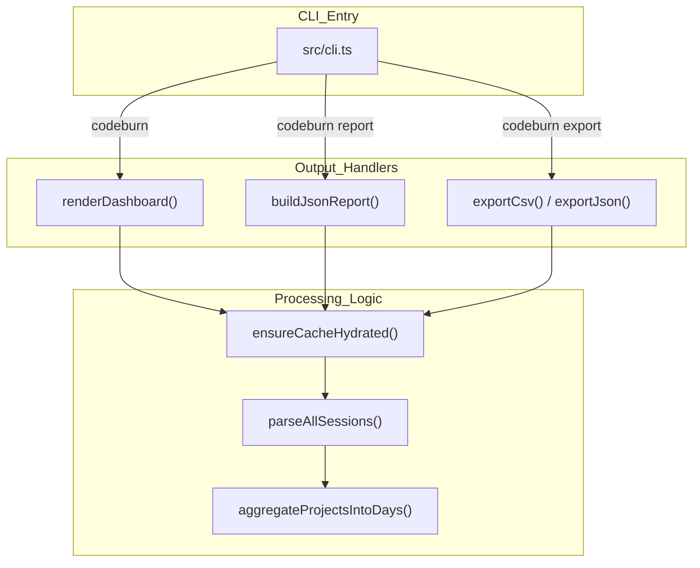
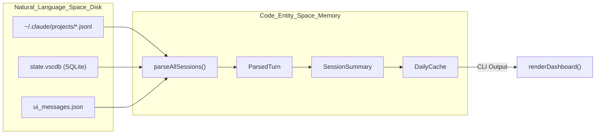

# CLI Reference

Relevant source files

The following files were used as context for generating this wiki page:

- [CHANGELOG.md](CHANGELOG.md)
- [package.json](package.json)
- [src/cli.ts](src/cli.ts)

The `codeburn` CLI is the primary interface for analyzing AI token consumption across different providers. It provides a suite of tools ranging from a real-time interactive terminal dashboard to structured data exports for financial reporting.

The CLI operates by reading local session logs from supported providers (Claude, Cursor, Copilot, etc.) and aggregating them into actionable metrics like cost per project, tool waste, and model efficiency [package.json:4]().

### Command Overview

The CLI is built using the `commander` library [src/cli.ts:1](). Most commands support common filtering flags for providers, projects, and date ranges.

| Command | Description |
|:---|:---|
| `codeburn` | Launches the **Interactive Dashboard** (default view) [src/cli.ts:13](). |
| `codeburn report` | Generates a detailed usage report (TUI or JSON) [src/cli.ts:77](). |
| `codeburn status` | Returns a compact one-liner summary of today and this month [src/cli.ts:7](). |
| `codeburn export` | Exports session data to CSV or JSON files [src/cli.ts:3](). |
| `codeburn optimize` | Scans for "token waste" and provides optimization tips [src/cli.ts:15](). |
| `codeburn compare` | Compares performance and cost across different AI models [src/cli.ts:16](). |
| `codeburn plan` | Manages subscription budgets and billing cycles [src/cli.ts:18](). |
| `codeburn currency` | Configures the display currency (e.g., USD, EUR, GBP) [src/cli.ts:25](). |

---

### Global Options & Filtering

These flags can be appended to almost any `codeburn` command to narrow the scope of the analysis. Global configuration such as timezones and model aliases are handled in the `preAction` hook [src/cli.ts:96-113]().

*   **Provider Filtering**: `--provider <name>` (e.g., `claude`, `cursor`, `copilot`) filters the session discovery process [src/cli.ts:80]().
*   **Project Filtering**: Use `--project <name>` to include or `--exclude <name>` to filter out specific directories. These are repeatable flags [src/cli.ts:77, 80]().
*   **Date Ranges**: 
    *   Presets: `today`, `week`, `30days`, `month`, `all` (defaulting to last 6 months) [src/cli.ts:14](), [CHANGELOG.md:18]().
    *   Explicit: `--from YYYY-MM-DD --to YYYY-MM-DD` [src/cli.ts:14]().
*   **Timezone**: `--timezone <zone>` allows for custom IANA timezone grouping [src/cli.ts:94]().

---

### System Mapping: CLI to Code Entities

The following diagram maps CLI command execution to the underlying TypeScript classes and functions that handle the data processing.

**Command Execution Flow**

Sources: [src/cli.ts:13-17](), [src/cli.ts:115](), [src/parser.ts:5](), [src/day-aggregator.ts:11](), [src/daily-cache.ts:29-32]().

---

### Interactive Dashboard (TUI)

Running `codeburn` without arguments launches the interactive dashboard. It uses `react-ink` to render a responsive terminal interface that includes cost overviews, project breakdowns, and token heatmaps [src/cli.ts:13](), [package.json:48-49]().

*   **View Modes**: Supports standard dashboard, optimization view, and model comparison [src/cli.ts:13, 15, 16]().
*   **Data Loading**: Uses a debounced data loading engine with cache hydration to ensure responsiveness [src/cli.ts:27-36]().

For details on the layout engine and keyboard shortcuts, see [Interactive Dashboard (TUI)](#3.1).

---

### Reporting and Exporting

CodeBurn provides structured data for external analysis. The `report` command is designed for stdout viewing or piping to `jq`, while `export` creates physical files.

*   **JSON Reports**: `codeburn report --format json` returns a comprehensive object including `avgCostPerSession`, `cacheHitPercent`, and `modelBreakdown` [src/cli.ts:115-175]().
*   **CSV Exports**: `codeburn export` generates a CSV file with automated protection against CSV injection via `escCsv` [src/export.ts:3]().
*   **Plan Integration**: Reports include a `JsonPlanSummary` if a subscription plan is active [src/cli.ts:63-75]().

For details on report schemas and export formats, see [Report, Status, and Export Commands](#3.2).

---

### Optimization and Model Comparison

The CLI includes advanced engines for reducing costs and evaluating model performance.

*   **Optimization**: `codeburn optimize` triggers `scanAndDetect` to find waste patterns such as "junk reads" or "unused MCP" servers [src/cli.ts:15](), [CHANGELOG.md:6-14]().
*   **Comparison**: `codeburn compare` evaluates metrics like one-shot success rates and cost-per-task across different models using `aggregateModelStats` [src/cli.ts:16]().

For details on waste detection logic, see [Optimization Engine (codeburn optimize)](#3.3). For model head-to-head metrics, see [Model Comparison (codeburn compare)](#3.4).

---

### Subscriptions and Currency

CodeBurn allows you to track spending against your actual subscription limits (e.g., Claude Pro $20/mo).

*   **Plans**: Use `codeburn plan` to set a `PlanId`. The CLI calculates "API Equivalent" costs to show how much value you are getting from a flat-rate subscription [src/cli.ts:18-20](), [src/cli.ts:67]().
*   **Currency**: Use `codeburn currency` to fetch live exchange rates and persist them via `CurrencyState` [src/cli.ts:25, 112]().

For details on billing period calculations and FX logic, see [Subscription Plans and Currency](#3.5).

---

### Data Pipeline Architecture

This diagram illustrates how the CLI bridges the gap between raw disk logs (Natural Language Space/User Activity) and structured metrics (Code Entity Space).

**Data Transformation Pipeline**

Sources: [src/parser.ts:5](), [src/types.ts:12](), [src/daily-cache.ts:10](), [src/dashboard.ts:13](), [CHANGELOG.md:71]().
