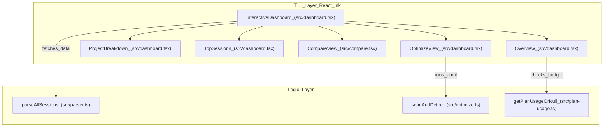
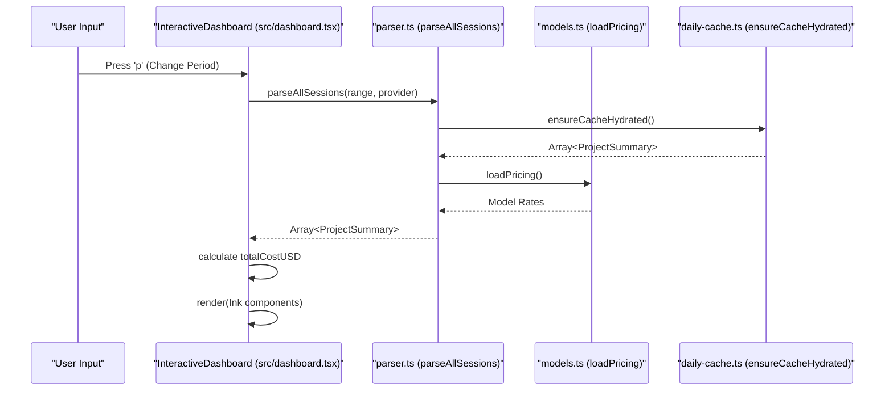

# Interactive Dashboard (TUI)

Relevant source files

The following files were used as context for generating this wiki page:

- [src/cli.ts](src/cli.ts)
- [src/dashboard.tsx](src/dashboard.tsx)

The Interactive Dashboard is the primary terminal user interface (TUI) for CodeBurn, built using [React-Ink](https://github.com/vadimdemedes/ink). It provides a real-time, navigable view of AI usage data, allowing users to toggle between standard reporting, waste optimization, and model comparison modes.

## Component Architecture

The dashboard is driven by the `InteractiveDashboard` component, which manages global state for the session data, view modes, and user input [src/dashboard.tsx:189-191]().

### Data Flow and Loading
The dashboard employs a debounced data loading strategy to ensure responsiveness when switching between date ranges or providers.

1.  **Trigger**: User changes `period` or `provider` via keyboard input [src/dashboard.tsx:238-251]().
2.  **Debounce**: A `useEffect` hook waits for state stabilization [src/dashboard.tsx:210-234]().
3.  **Fetch**: Calls `parseAllSessions` from the parser engine [src/dashboard.tsx:217-217]().
4.  **Process**: Updates the `projects` state, which triggers a re-render of the layout [src/dashboard.tsx:220-220]().

### System Component Map
The following diagram maps the TUI logical sections to their implementation components and data sources.

**TUI Component Association**

Sources: [src/dashboard.tsx:189-200](), [src/dashboard.tsx:155-187](), [src/dashboard.tsx:431-435](), [src/dashboard.tsx:379-382](), [src/compare.tsx:254-254](), [src/plan-usage.ts:41-41]().

## Layout Engine

The dashboard uses a dynamic layout engine that adjusts based on terminal width. It defines a `MIN_WIDE` threshold of 90 columns [src/dashboard.tsx:22-22]().

*   **Wide Mode (>= 90 cols)**: Renders a two-column grid using `halfWidth` calculations [src/dashboard.tsx:107-108]().
*   **Narrow Mode (< 90 cols)**: Renders a single-column vertical stack [src/dashboard.tsx:108-108]().

The `getLayout` function calculates these dimensions by reading `process.env['COLUMNS']` or using the `useWindowSize` hook from Ink [src/dashboard.tsx:104-112]().

### Visual Elements
*   **HBar Charts**: A custom horizontal bar chart component (`HBar`) that uses a three-stage linear interpolation (`lerp`) via `gradientColor` to generate a color gradient (Blue -> Yellow -> Red) based on percentage values [src/dashboard.tsx:85-96](), [src/dashboard.tsx:114-127]().
*   **Panel Chrome**: Standardized containers (`Panel`) with rounded borders and titles, using a width overhead for internal padding [src/dashboard.tsx:131-138]().
*   **Color Palettes**: The TUI uses defined constants for specific entities, such as `PROVIDER_COLORS` [src/dashboard.tsx:50-57]() and `CATEGORY_COLORS` [src/dashboard.tsx:59-73]().

Sources: [src/dashboard.tsx:22-22](), [src/dashboard.tsx:85-96](), [src/dashboard.tsx:104-112](), [src/dashboard.tsx:114-127]().

## View Modes

The dashboard supports three primary views, toggled via the `v` key [src/dashboard.tsx:244-244]().

| View | Component | Purpose |
| :--- | :--- | :--- |
| **Dashboard** | `InteractiveDashboard` | Default view showing project costs, top sessions, and category breakdowns. |
| **Optimize** | `OptimizeView` | Runs the `scanAndDetect` engine to find "waste" (e.g., junk reads, duplicate context) [src/dashboard.tsx:1020-1025](). |
| **Compare** | `CompareView` | Head-to-head model metrics (token efficiency, speed, cost) [src/compare.tsx:254-254](). |

### Plan Progress Bar
The `Overview` panel includes a `renderPlanBar` function that visualizes subscription usage [src/dashboard.tsx:144-153]().
*   **Within Budget**: Renders a shaded bar using `▓` and `░` characters up to 100% [src/dashboard.tsx:146-148]().
*   **Over Budget**: If usage exceeds 100%, it renders a full bar followed by "chevrons" (`▶`) representing the magnitude of the overage using a logarithmic scale [src/dashboard.tsx:150-152]().

Sources: [src/dashboard.tsx:20-20](), [src/dashboard.tsx:144-153](), [src/dashboard.tsx:1020-1025]().

## Keyboard Navigation

The dashboard captures input using the `useInput` hook from Ink [src/dashboard.tsx:238-251]().

| Key | Action | Code Reference |
| :--- | :--- | :--- |
| `q` / `Esc` / `Ctrl+C` | Exit the dashboard | [src/dashboard.tsx:240-240]() |
| `p` | Cycle through time periods (Today, 7 Days, 30 Days, Month, All) | [src/dashboard.tsx:241-241]() |
| `r` | Cycle through providers (Claude, Cursor, Codex, etc.) | [src/dashboard.tsx:242-242]() |
| `v` | Switch View (Dashboard -> Optimize -> Compare) | [src/dashboard.tsx:244-244]() |
| `↑` / `↓` | Scroll project list or session list | [src/dashboard.tsx:246-247]() |

Sources: [src/dashboard.tsx:238-251]().

## Implementation Details

### Data Aggregation Pipeline
Before rendering, the dashboard aggregates raw session data into `ProjectSummary` objects.

**TUI Data Processing Flow**

Sources: [src/dashboard.tsx:210-234](), [src/cli.ts:27-36](), [src/parser.ts:7-7](), [src/models.ts:8-8]().

### Debounced Loading
To prevent UI flickering and excessive CPU usage during rapid keyboard input, the dashboard uses a `loading` state and a `ref` to track the latest request ID [src/dashboard.tsx:196-203]().

1.  When a filter changes, `setLoading(true)` is called immediately [src/dashboard.tsx:212-212]().
2.  The `useEffect` triggers the parser asynchronously [src/dashboard.tsx:217-217]().
3.  Only the results from the most recent request (verified via `reqIdRef`) are applied to the state, preventing race conditions where an older, larger data set overwrites a newer, smaller one [src/dashboard.tsx:218-222]().

Sources: [src/dashboard.tsx:196-203](), [src/dashboard.tsx:210-234]().
