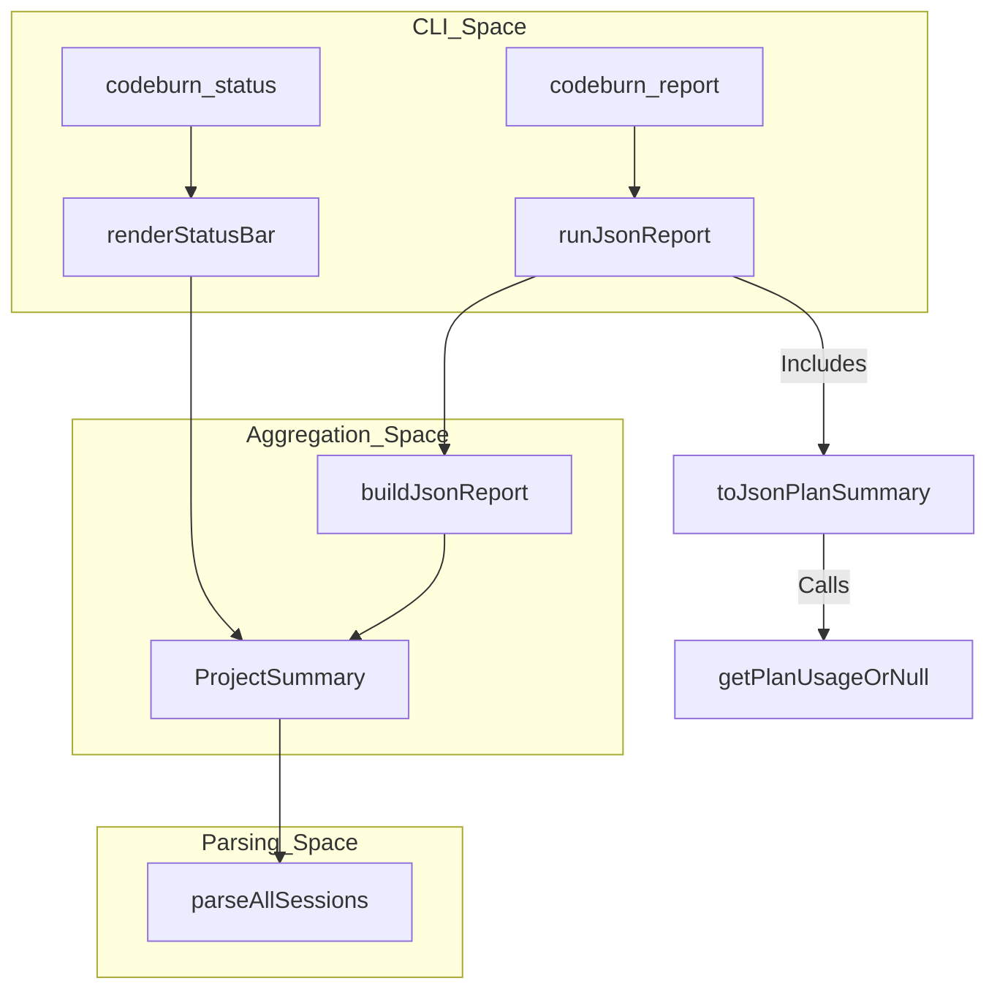

# Report, Status, and Export Commands

<details>
<summary>Relevant source files</summary>

The following files were used as context for generating this wiki page:

- [src/cli.ts](src/cli.ts)
- [src/currency.ts](src/currency.ts)
- [src/day-aggregator.ts](src/day-aggregator.ts)
- [src/export.ts](src/export.ts)
- [src/format.ts](src/format.ts)
- [src/menubar-json.ts](src/menubar-json.ts)
- [tests/export.test.ts](tests/export.test.ts)
- [tests/menubar-json.test.ts](tests/menubar-json.test.ts)

</details>


The CodeBurn CLI provides a suite of commands for non-interactive data retrieval, reporting, and structured export. These commands leverage the underlying parsing and aggregation engines to produce summaries in terminal-friendly formats (TUI), machine-readable JSON, or portable CSV files for external analysis.

## Reporting and Status Commands

The primary commands for observing usage without entering the full interactive dashboard are `codeburn report`, `codeburn status`, and the period-specific shortcuts `codeburn today` and `codeburn month`.

### JSON Reporting (`codeburn report`)
The `codeburn report` command generates a comprehensive JSON object containing cost breakdowns, token usage, and plan status.

*   **Implementation**: It invokes `runJsonReport` [src/cli.ts:77-87](), which calls `parseAllSessions` [src/parser.ts:5]() and filters the results using `filterProjectsByName`.
*   **Data Structure**: The `buildJsonReport` function [src/cli.ts:115-205]() constructs the payload, including:
    *   **Aggregates**: Total cost (USD), total API calls, and session counts [src/cli.ts:119-121]().
    *   **Token Metrics**: Input, output, and cache read/write tokens [src/cli.ts:122-125]().
    *   **Cache Efficiency**: A `cacheHitPercent` calculated as `totalCacheRead / (totalInput + totalCacheRead)` [src/cli.ts:128-129]().
    *   **Breakdowns**: Lists for `daily`, `projects`, `models`, and `categories` [src/cli.ts:143-183]().
*   **Plan Integration**: If a subscription plan is configured, it appends a `plan` summary using `toJsonPlanSummary` [src/cli.ts:63-75]().

### Status Bar (`codeburn status`)
The `codeburn status` command (and its aliases `today` and `month`) provides a high-level summary of recent activity.

*   **Logic**: It uses `renderStatusBar` [src/format.ts:27-59]() to iterate through projects and sessions.
*   **Bucketing**: Costs are bucketed by the timestamp of the first assistant call in a turn [src/format.ts:43-45](). This ensures that turns straddling midnight are correctly attributed to the moment the cost was incurred [src/format.ts:39-42]().
*   **Output**: Renders a two-column layout showing "Today" and "Month" costs and call counts using `chalk` for terminal formatting [src/format.ts:55]().

### Data Flow: Reporting Commands
This diagram shows how CLI commands interact with the parsing and aggregation layers to produce reports.

| Component | Code Entity |
| :--- | :--- |
| **CLI Entry** | `program.command('report')` [src/cli.ts:89-92]() |
| **JSON Builder** | `buildJsonReport` [src/cli.ts:115]() |
| **Status Renderer** | `renderStatusBar` [src/format.ts:27]() |
| **Data Source** | `parseAllSessions` [src/parser.ts:5]() |


Sources: [src/cli.ts:63-205](), [src/format.ts:27-59](), [src/day-aggregator.ts:23-26]()

---

## Export Engine

The `codeburn export` command allows users to dump their data into structured formats for use in spreadsheets or external databases. It supports both JSON and CSV output.

### CSV Export Logic
The export engine generates a directory containing multiple CSV files, each representing a specific dimension of the data (projects, models, tools, etc.).

*   **Function**: `exportCsv(periods: PeriodExport[], outputPath: string)` [src/export.ts:221-255]().
*   **File Generation**: It creates a folder and populates it with:
    *   `daily.csv`: Daily cost and token trends [src/export.ts:46-80]().
    *   `projects.csv`: Cost per project path [src/export.ts:177-191]().
    *   `models.csv`: Token usage and cost by model [src/export.ts:106-137]().
    *   `activity.csv`: Breakdown by `TaskCategory` [src/export.ts:82-104]().
    *   `tools.csv` and `shell-commands.csv`: Usage frequency of MCP/Core tools and bash commands [src/export.ts:139-175]().
    *   `sessions.csv`: Granular session-level data [src/export.ts:193-219]().

### Security and Safety
The export engine implements specific protections for data integrity and system security.

*   **CSV Injection Protection**: The `escCsv` function [src/export.ts:8-14]() prevents "CSV Injection" (Formula Injection). If a string starts with characters like `=`, `+`, `-`, or `@`, it is prefixed with a single quote (`'`) to ensure spreadsheet software treats it as literal text rather than an executable formula [src/export.ts:9]().
*   **Directory Safety**: Before writing, the system performs safety checks on the output path to ensure it doesn't overwrite critical system directories by resolving the path and ensuring it is not the root or home directory [src/export.ts:222-225]().

### CSV Injection Guarding Diagram
This diagram maps the security logic used during the export process.

| Component | Code Entity |
| :--- | :--- |
| **Sanitizer** | `escCsv` [src/export.ts:8]() |
| **Row Builder** | `rowsToCsv` [src/export.ts:18]() |
| **Malicious Pattern** | `/^[\t\r=+\-@]/` [src/export.ts:9]() |

```mermaid
graph LR
    subgraph "Input_Data"
        D1["Project: '=SUM(1,2)'"]
        D2["Model: '+danger-model'"]
        D3["Command: '@malicious'"]
    end

    subgraph "escCsv_Logic"
        S1{"Starts_with_=, +, -, @, \t, \r?"}
        S1 -- "Yes" --> S2["Prefix_with_'"]
        S1 -- "No" --> S3["Keep_as_is"]
        S2 --> S4{"Contains_,_or_\"_or_\n?"}
        S3 --> S4
        S4 -- "Yes" --> S5["Wrap_in_double_quotes"]
        S4 -- "No" --> S6["Return_string"]
    end

    D1 --> S1
    D2 --> S1
    D3 --> S1
    S5 --> O["'\"'=SUM(1,2)\""]
    S6 --> O
```
Sources: [src/export.ts:8-26](), [tests/export.test.ts:115-138]()

---

## Technical Implementation Details

### Period Export Structure
The `PeriodExport` type defines the input for the export functions, allowing the CLI to pass multiple date ranges (e.g., "This Month" vs "Last 30 Days") into a single export operation [src/export.ts:3, 221]().

### Currency and Cost Conversion
All export and report commands utilize the `currency.ts` module to ensure values are presented in the user's preferred currency.
*   **`convertCost`**: Used in `buildDailyRows`, `buildActivityRows`, and `buildModelRows` to transform raw USD values before rounding [src/export.ts:72, 100, 129]().
*   **`round2`**: A helper function that rounds numbers to two decimal places for financial clarity [src/export.ts:28-30]().
*   **`loadCurrency`**: Invoked during CLI pre-action to hydrate exchange rates from the Frankfurter API or local cache [src/cli.ts:112](), [src/currency.ts:110-119]().

### Token Formatting
For terminal output (TUI/Status), the `formatTokens` function [src/format.ts:10-14]() provides human-readable strings (e.g., `1.2M` or `450K`) instead of raw integers.

### Directory Handling
The `exportCsv` function handles directory creation recursively using `mkdir(folder, { recursive: true })` [src/export.ts:227]() and utilizes `resolve` to handle relative output paths provided by the user [src/export.ts:222]().

Sources: [src/export.ts:1-255](), [src/format.ts:1-59](), [src/cli.ts:63-121](), [src/currency.ts:139-143]()
