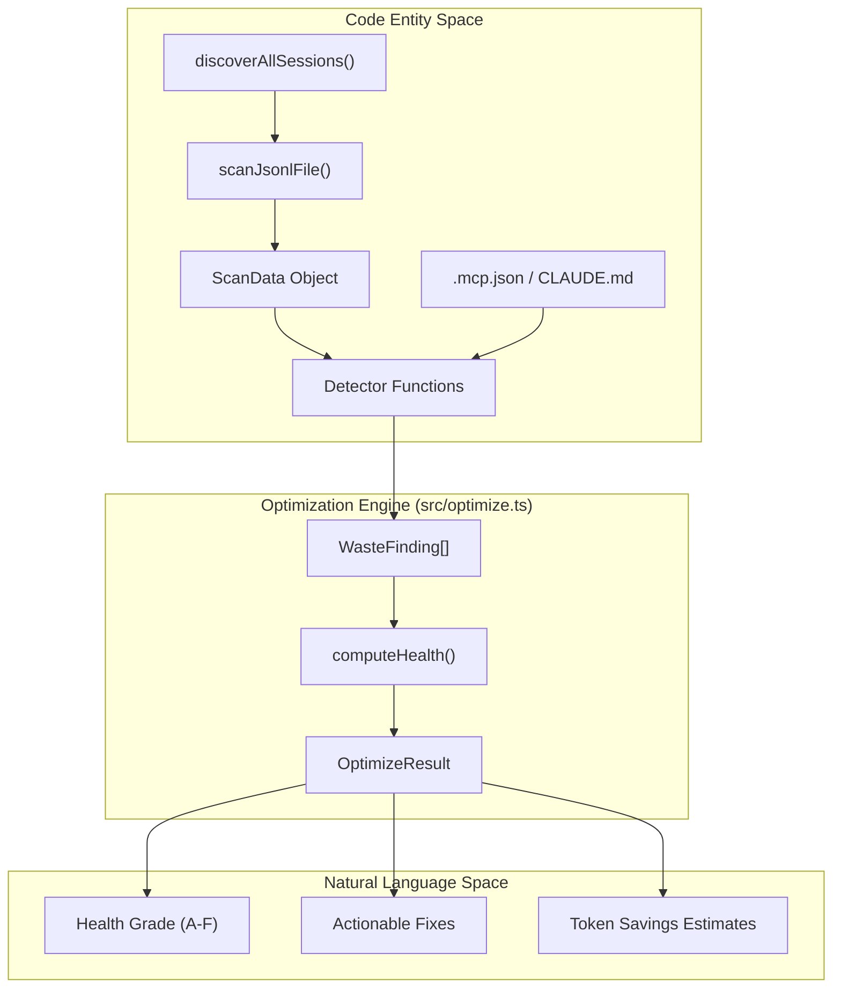
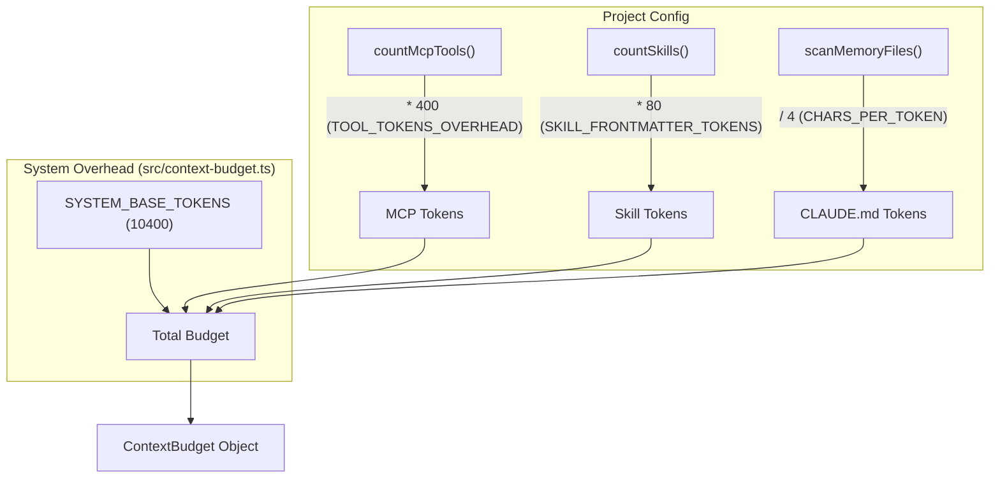

# Optimization Engine (codeburn optimize)

Relevant source files

The following files were used as context for generating this wiki page:

- [src/context-budget.ts](src/context-budget.ts)
- [src/optimize.ts](src/optimize.ts)
- [tests/mcp-coverage.test.ts](tests/mcp-coverage.test.ts)
- [tests/optimize-fs.test.ts](tests/optimize-fs.test.ts)
- [tests/optimize.test.ts](tests/optimize.test.ts)
- [tests/parser-mcp-inventory.test.ts](tests/parser-mcp-inventory.test.ts)

The Optimization Engine is responsible for scanning historical session data to identify inefficient patterns ("waste"), calculating a project health score, and providing actionable fixes. It operates by analyzing tool call sequences, context overhead, and provider-specific configuration files.

## Overview and Implementation

The engine's entry point is the `scanAndDetect` function [src/optimize.ts:222-258](), which orchestrates data collection from the file system and runs a suite of detector functions. It processes `.jsonl` session files (primarily from Claude Code) and project metadata to build a `ScanData` object containing tool calls, API metadata, and project paths.

### Data Flow

The following diagram illustrates how raw session data is transformed into optimization findings.

**Figure 1: Optimization Data Pipeline**

Sources: [src/optimize.ts:222-258](), [src/optimize.ts:163-169](), [src/providers/index.js:23-45]()

## Waste Detectors

The engine employs specialized detectors to identify specific types of token waste. Each detector returns a `WasteFinding` [src/optimize.ts:133-141]() containing an explanation, impact level (`high`, `medium`, `low`), and a suggested fix.

### 1. File Access Patterns
*   **Junk Reads (`detectJunkReads`)**: Identifies when the agent reads files in directories that should be ignored (e.g., `node_modules`, `.git`, `dist`). It flags these if they exceed `MIN_JUNK_READS_TO_FLAG` (3) [src/optimize.ts:43](), [src/optimize.ts:269-309]().
*   **Duplicate Reads (`detectDuplicateReads`)**: Detects multiple reads of the same file within a single session. This often indicates the agent has "forgotten" previous context or is stuck in a loop [src/optimize.ts:311-344]().
*   **Low Read:Edit Ratio (`detectLowReadEditRatio`)**: Flags projects where the agent performs many edits with very few reads, suggesting it may be hallucinating file structure or making blind changes [src/optimize.ts:411-435]().

### 2. Context & Configuration Bloat
*   **Bloated CLAUDE.md (`detectBloatedClaudeMd`)**: Scans for `CLAUDE.md` files exceeding 200 lines. It recursively follows `@-imports` up to a depth of 5 (`MAX_IMPORT_DEPTH`) to calculate the total transitive context weight [src/optimize.ts:102](), [src/optimize.ts:477-518]().
*   **Unused MCP Servers (`detectUnusedMcp`)**: Compares configured MCP servers in `.mcp.json` against actual tool calls. Servers not called within the last 30 days are flagged as dead weight [src/optimize.ts:544-585]().
*   **Cache Bloat (`detectCacheBloat`)**: Analyzes `cacheCreationTokens` from API metadata. If the median cache size exceeds 1.4x the baseline, it suggests the context has grown too large for efficient prompt caching [src/optimize.ts:437-475]().
*   **MCP Tool Coverage (`detectMcpToolCoverage`)**: A high-precision detector that flags MCP servers where a large number of tools are defined but rarely used, leading to "schema tax" [src/optimize.ts:346-409]().

### 3. "Ghost" Entities
The engine detects "Ghost" entities—definitions that exist in the agent's instructions but are never utilized:
*   **Ghost Agents**: Custom agents defined but never invoked [src/optimize.ts:605-628]().
*   **Ghost Skills**: `SKILL.md` files in `.claude/skills/` that are never triggered [src/optimize.ts:630-653]().
*   **Ghost Commands**: Custom slash commands found in `CLAUDE.md` but absent from session logs [src/optimize.ts:655-680]().

Sources: [src/optimize.ts:41-81](), [src/optimize.ts:269-680]()

## Health Scoring and Trend Analysis

### Health Scoring (`computeHealth`)
The health score is a normalized value (0-100) derived from detected findings.
*   **Weights**: Findings are weighted by impact: `high` (15 pts), `medium` (7 pts), `low` (3 pts) [src/optimize.ts:86-88]().
*   **Grades**: Scores are mapped to letter grades:
    *   **A**: ≥ 90
    *   **B**: 75–89
    *   **C**: 55–74
    *   **D**: 30–54
    *   **F**: < 30
Sources: [src/optimize.ts:90-93](), [src/optimize.ts:743-764]()

### Trend Analysis (`computeTrend`)
The engine determines if a finding is `active` or `improving` by comparing occurrences in the "recent window" (last 48 hours, defined by `RECENT_WINDOW_MS`) versus the total period [src/optimize.ts:177-180](). If the ratio of recent occurrences is significantly lower than the historical average (below `IMPROVING_THRESHOLD`), the finding is marked as `improving` [src/optimize.ts:766-784]().

## Context Budget Estimation

The `ContextBudget` system [src/context-budget.ts]() estimates the fixed token overhead sent with every prompt. This is crucial for understanding why even short messages can be expensive.

**Figure 2: Context Budget Calculation Logic**

### Budget Components
| Component | Token Cost Calculation | Source |
| :--- | :--- | :--- |
| **System Base** | Constant 10,400 tokens | [src/context-budget.ts:9]() |
| **MCP Tools** | 400 tokens per tool (est. 5 tools per server) | [src/context-budget.ts:10, 55]() |
| **Skills** | 80 tokens per `SKILL.md` | [src/context-budget.ts:11]() |
| **Memory Files** | ~1 token per 4 characters in `CLAUDE.md` | [src/context-budget.ts:8, 23]() |

Sources: [src/context-budget.ts:8-24](), [src/context-budget.ts:104-122]()
