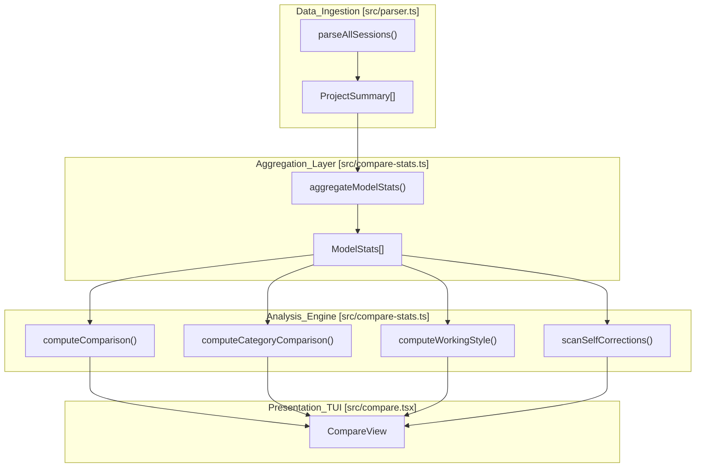
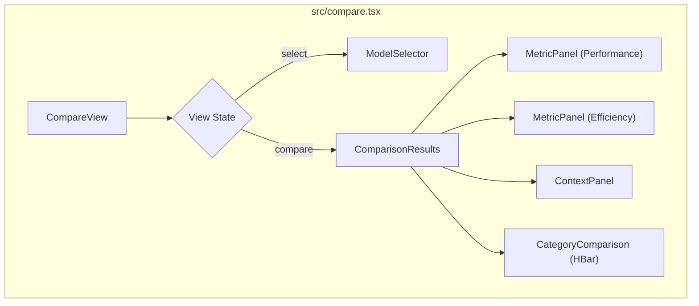

# Model Comparison (codeburn compare)

Relevant source files

The following files were used as context for generating this wiki page:

- [docs/superpowers/plans/2026-04-19-model-comparison.md](docs/superpowers/plans/2026-04-19-model-comparison.md)
- [docs/superpowers/specs/2026-04-19-model-comparison-design.md](docs/superpowers/specs/2026-04-19-model-comparison-design.md)
- [src/compare-stats.ts](src/compare-stats.ts)
- [src/compare.tsx](src/compare.tsx)
- [src/ink-win.ts](src/ink-win.ts)
- [src/sqlite.ts](src/sqlite.ts)
- [tests/compare-stats.test.ts](tests/compare-stats.test.ts)
- [tests/providers/opencode.test.ts](tests/providers/opencode.test.ts)

The `codeburn compare` command provides a Terminal User Interface (TUI) for head-to-head benchmarking of different LLM models based on historical usage data. It aggregates performance, efficiency, and behavioral metrics across multiple sessions to determine which models provide the best "one-shot" coding success, cost-efficiency, and working styles.

### Data Flow and Architecture

The comparison engine follows a pipeline from raw session parsing to normalized metric calculation. It uses the standard `parseAllSessions` utility to gather data and then passes it through specialized statistical aggregators.

#### Model Comparison Pipeline

**Sources:** [src/compare.tsx:5-9](), [src/compare-stats.ts:26-74]()

---

### Core Statistical Aggregation

The engine transforms `ProjectSummary` objects into `ModelStats` objects, which serve as the foundation for all comparisons.

#### `aggregateModelStats`
This function iterates through every turn in every session. It identifies the "primary model" (the first model to respond in a turn) and attributes turn-level success metrics (like one-shot success) to it.
*   **Primary Model Attribution:** If a turn has multiple calls (e.g., a retry), the turn-level metrics are attributed to the first model used in that turn [src/compare-stats.ts:42-45]().
*   **Synthetic Filtering:** Calls marked as `<synthetic>` are excluded from statistics [src/compare-stats.ts:43-43](), [src/compare-stats.ts:57-58]().
*   **Turn Metrics:** It tracks `totalTurns`, `editTurns` (turns containing file modifications), and `oneShotTurns` (edit turns with zero retries) [src/compare-stats.ts:46-53]().
*   **Cost Tracking:** It differentiates between total cost and `editCost` (cost incurred specifically during turns where edits occurred) [src/compare-stats.ts:50-52]().

**Sources:** [src/compare-stats.ts:8-24](), [src/compare-stats.ts:26-74]()

---

### Metric Definitions and Winner Logic

Comparison metrics are defined in `METRICS`, a collection of `MetricDef` objects that specify how to calculate values and whether a higher or lower value is preferable.

| Metric | Calculation | Higher is Better? |
| :--- | :--- | :--- |
| **One-shot rate** | `oneShotTurns / editTurns` | Yes |
| **Retry rate** | `retries / editTurns` | No |
| **Self-correction** | `selfCorrections / totalTurns` | No |
| **Cost / call** | `cost / calls` | No |
| **Cost / edit** | `editCost / editTurns` | No |
| **Output tok / call**| `outputTokens / calls` | No |
| **Cache hit rate** | `cacheReadTokens / totalTokens` | Yes |

#### Winner Selection
The `pickWinner` function determines the "winner" for a specific row by comparing `valueA` and `valueB` against the `higherIsBetter` flag [src/compare-stats.ts:166-171](). 
*   If values are equal, it returns `'tie'`.
*   If data is missing (`null`) for either model, it returns `'none'` [src/compare-stats.ts:167-167]().
*   For "Lower is Better" metrics (e.g., Retry rate), the lower value is assigned the win [src/compare-stats.ts:170-170]().

**Sources:** [src/compare-stats.ts:103-164](), [src/compare-stats.ts:166-171]()

---

### Working Style and Self-Correction Analysis

Beyond raw performance, `codeburn` analyzes the "personality" or working style of models using the `computeWorkingStyle` and `scanSelfCorrections` functions.

#### `computeWorkingStyle`
This function identifies behavioral patterns such as:
*   **Planning Propensity:** Frequency of using tools like `TaskCreate`, `TodoWrite`, or `EnterPlanMode` [src/compare-stats.ts:6-6](), [src/compare-stats.ts:246-248]().
*   **Agent Usage:** Frequency of spawning sub-agents via `hasAgentSpawn` [src/compare-stats.ts:251-253]().
*   **Verbosity:** Normalized output tokens per call [src/compare-stats.ts:256-258]().

#### `scanSelfCorrections`
A "self-correction" is detected when a model issues a tool call that is immediately followed by a "retry" or a corrective action in the same turn without user intervention. The logic specifically looks for assistant calls within the same turn that follow an initial attempt [src/compare-stats.ts:271-300]().

**Sources:** [src/compare-stats.ts:241-268](), [src/compare-stats.ts:271-300]()

---

### TUI Implementation (`CompareView`)

The comparison interface is built using `ink` and consists of two main phases: selection and results.

#### Component Hierarchy

#### Head-to-Head Bar Charts
For category-specific comparisons (e.g., "coding" vs "refactoring"), the TUI renders horizontal bar charts using the `FULL_BLOCK` (`\u2588`) character [src/compare.tsx:26-26]().
*   **One-Shot Rate Bars:** The width of the bar is calculated as `Math.round((rate / 100) * BAR_MAX_WIDTH)` [src/compare.tsx:48-50]().
*   **Low Data Threshold:** Models or categories with fewer than 20 calls are flagged with a "low data" warning [src/compare.tsx:18-18](), [src/compare.tsx:105-117]().
*   **Formatting:** Values are formatted based on their type (cost, percent, decimal, or number) using a centralized `formatValue` helper [src/compare.tsx:28-36]().

**Sources:** [src/compare.tsx:57-130](), [src/compare.tsx:187-220]()

---

### Key Functions and Types Reference

| Symbol | File | Description |
| :--- | :--- | :--- |
| `ModelStats` | [src/compare-stats.ts:8-24]() | Interface for aggregated model data including tokens, cost, and turns. |
| `computeComparison` | [src/compare-stats.ts:173-186]() | Generates `ComparisonRow` array for two models by applying `METRICS`. |
| `computeCategoryComparison` | [src/compare-stats.ts:188-239]() | Breaks down one-shot rates by `TaskCategory` for head-to-head charts. |
| `MetricPanel` | [src/compare.tsx:142-164]() | Renders a table of metrics with highlighted winners in green. |
| `shortName` | [src/compare.tsx:38-40]() | Strips prefixes (e.g., `claude-`) and date suffixes for cleaner TUI display. |
| `patchStdoutForWindows` | [src/ink-win.ts:5-14]() | Fixes terminal flicker on Windows by intercepting specific ANSI escape codes. |

**Sources:** [src/compare-stats.ts:1-300](), [src/compare.tsx:1-250](), [src/ink-win.ts:5-14]()
