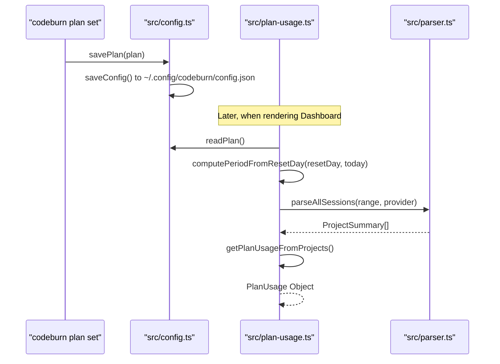
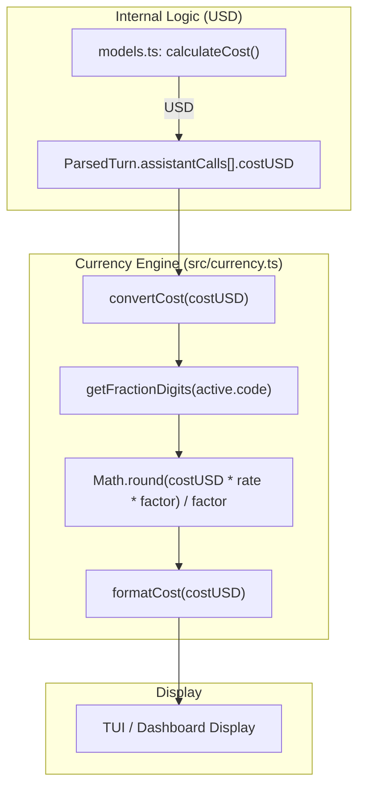

# Subscription Plans and Currency

Relevant source files

The following files were used as context for generating this wiki page:

- [src/config.ts](src/config.ts)
- [src/currency.ts](src/currency.ts)
- [src/day-aggregator.ts](src/day-aggregator.ts)
- [src/export.ts](src/export.ts)
- [src/format.ts](src/format.ts)
- [src/plan-usage.ts](src/plan-usage.ts)
- [src/plans.ts](src/plans.ts)
- [tests/cli-plan.test.ts](tests/cli-plan.test.ts)
- [tests/export.test.ts](tests/export.test.ts)
- [tests/plan-usage.test.ts](tests/plan-usage.test.ts)
- [tests/plans.test.ts](tests/plans.test.ts)

This page documents the systems responsible for managing user subscription budgets, calculating billing periods, projecting monthly spend, and handling multi-currency conversion via external exchange rate APIs.

## Subscription Plans

CodeBurn allows users to define a "Plan" which represents their monthly budget for AI services. This plan is used to calculate "burn" rates and provide visual progress indicators in the dashboard.

### Plan Definition and Presets
Plans are defined by a `PlanId`, a `PlanProvider` (to filter which logs count against the budget), and a monthly USD limit `monthlyUsd` [src/config.ts:8-14](). 

The system provides several builtin presets for common AI subscriptions:
*   **Claude Pro**: $20/mo, provider: `claude` [src/plans.ts:7-12]().
*   **Claude Max**: $200/mo, provider: `claude` [src/plans.ts:13-18]().
*   **Claude Max 5x**: $100/mo, provider: `claude` [src/plans.ts:19-24]().
*   **Cursor Pro**: $20/mo, provider: `cursor` [src/plans.ts:25-30]().

### Configuration Persistence
Plans are stored within the main CodeBurn configuration file at `~/.config/codeburn/config.json` [src/config.ts:25-31](). The `savePlan` and `clearPlan` functions manage these updates using atomic file writes (writing to a `.tmp` file before renaming) to prevent corruption [src/config.ts:42-65]().

### Plan Management Flow
The following diagram illustrates how a plan is set and subsequently used to fetch usage data.

**Plan Configuration and Usage Flow**

Sources: [src/config.ts:50-65](), [src/plan-usage.ts:107-138](), [tests/cli-plan.test.ts:20-42]()

## Billing Period Calculation

CodeBurn calculates the current billing cycle based on a `resetDay` (clamped between 1 and 28) [src/plan-usage.ts:22-25]().

The `computePeriodFromResetDay` function determines the `periodStart` and `periodEnd` [src/plan-usage.ts:27-43]():
1.  If today's date is greater than or equal to the `resetDay`, the period starts in the **current month** and ends in the **next month**.
2.  If today's date is before the `resetDay`, the period starts in the **previous month** and ends in the **current month**.

Sources: [src/plan-usage.ts:27-43](), [tests/plan-usage.test.ts:13-35]()

## Usage Projection (Median-Daily)

To estimate total monthly spend, CodeBurn uses a median-daily projection rather than a simple mean. This prevents a single high-usage day from disproportionately skewing the monthly estimate.

### Projection Algorithm
1.  **Collect Daily Costs**: Iterate through all turns in the current period and map costs to local date keys [src/plan-usage.ts:77-91]().
2.  **Fill Gaps**: Create an array of daily costs for every day from `periodStart` to `today`, filling missing days with `0` [src/plan-usage.ts:93-98]().
3.  **Trailing Window**: Extract the last 7 days of costs [src/plan-usage.ts:100]().
4.  **Median Calculation**: Calculate the median of this window [src/plan-usage.ts:45-53]().
5.  **Extrapolate**: Multiply the `medianDailyCost` by the `daysRemaining` in the cycle and add to current `spent` [src/plan-usage.ts:102-104]().

Sources: [src/plan-usage.ts:45-53](), [src/plan-usage.ts:70-105](), [tests/plan-usage.test.ts:67-95]()

## Currency and FX Engine

While CodeBurn calculates all internal costs in USD, it supports displaying costs in any currency supported by the ISO 4217 standard.

### Currency State
The `active` currency state is managed in `src/currency.ts` and defaults to USD [src/currency.ts:27-29]().

| Property | Type | Description |
| :--- | :--- | :--- |
| `code` | `string` | ISO 4217 currency code (e.g., "EUR") |
| `rate` | `number` | Conversion rate from 1 USD to this currency |
| `symbol` | `string` | Display symbol (e.g., "€") resolved via `Intl.NumberFormat` |

Sources: [src/currency.ts:7-11](), [src/currency.ts:41-48]()

### Frankfurter FX API Integration
Exchange rates are fetched from the [Frankfurter API](https://www.frankfurter.app/) [src/currency.ts:14]().
*   **Validation**: Fetched rates are validated against `MIN_VALID_FX_RATE` (0.0001) and `MAX_VALID_FX_RATE` (1,000,000) to prevent math errors from malformed responses [src/currency.ts:17-25]().
*   **Caching**: Rates are cached locally at `~/.cache/codeburn/exchange-rate.json` with a TTL of 24 hours [src/currency.ts:13](), [src/currency.ts:57-63]().

### Data Flow: USD to Local Currency
The following diagram maps the conversion logic from the pricing engine to the UI.

**Currency Conversion Logic**

Sources: [src/currency.ts:139-155](), [src/currency.ts:50-55]()

### Formatting Logic
The `formatCost` function dynamically adjusts precision based on the value [src/currency.ts:145-155]():
*   **Cost >= 1**: 2 decimal places (e.g., $1.50).
*   **Cost >= 0.01**: 3 decimal places (e.g., $0.005).
*   **Cost < 0.01**: 4 decimal places (e.g., $0.0005).
*   **Zero-decimal currencies**: Rounded to nearest integer (e.g., ¥150) [src/currency.ts:150]().

Sources: [src/currency.ts:145-155]()
