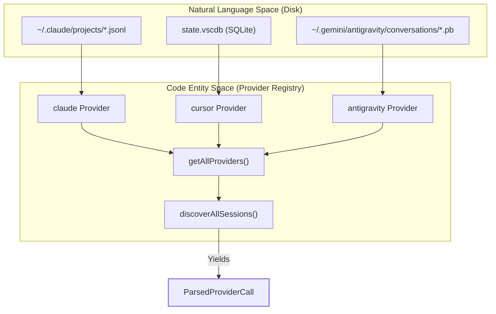
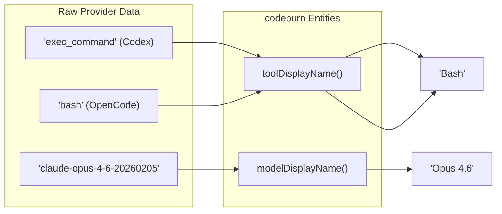

# Provider Plugin System

Relevant source files

The following files were used as context for generating this wiki page:

- [README.md](README.md)
- [assets/menubar-0.8.0.png](assets/menubar-0.8.0.png)
- [src/data/litellm-snapshot.json](src/data/litellm-snapshot.json)
- [src/providers/antigravity.ts](src/providers/antigravity.ts)
- [src/providers/index.ts](src/providers/index.ts)
- [src/providers/opencode.ts](src/providers/opencode.ts)
- [src/providers/types.ts](src/providers/types.ts)
- [tests/provider-registry.test.ts](tests/provider-registry.test.ts)

CodeBurn utilizes a modular **Provider Plugin System** to ingest session data from various AI coding tools. Because each tool (e.g., Claude Code, Cursor, GitHub Copilot) stores its history in different formats—ranging from JSONL logs to SQLite databases—the system abstracts these differences behind a unified `Provider` interface [src/providers/types.ts:32-39]().

## The Provider Interface

Every supported AI tool is implemented as a `Provider` object. This interface ensures that the core aggregation engine can interact with disparate data sources using a consistent set of methods for discovery and parsing.

| Property / Method | Description |
|:---|:---|
| `name` | Internal unique identifier (e.g., `claude`, `cursor`) [src/providers/types.ts:33](). |
| `discoverSessions()` | Scans the local filesystem for session files or database entries [src/providers/types.ts:37](). |
| `createSessionParser()` | Returns a `SessionParser` capable of yielding `ParsedProviderCall` objects [src/providers/types.ts:38](). |
| `modelDisplayName()` | Normalizes raw model strings into human-readable versions (e.g., `gpt-4o` → `GPT-4o`) [src/providers/types.ts:35](). |
| `toolDisplayName()` | Maps provider-specific tool names to canonical CodeBurn names (e.g., `exec_command` → `Bash`) [src/providers/types.ts:36](). |

### Provider Data Flow

The following diagram illustrates how the `getAllProviders` registry bridges the gap between the physical file system (Natural Language Space/Logs) and the internal `ParsedProviderCall` objects (Code Entity Space).

**Diagram: Ingestion Pipeline Mapping**

Sources: [src/providers/types.ts:11-30](), [src/providers/index.ts:91-100](), [src/providers/antigravity.ts:11-11]()

## Provider Registry and Lazy Loading

To maintain a fast startup time and handle optional dependencies (like `better-sqlite3`), CodeBurn uses a registry that distinguishes between **core providers** and **lazy-loaded providers**.

*   **Core Providers**: Synchronously loaded; include `claude`, `codex`, `copilot`, `droid`, `gemini`, `kiloCode`, `kiro`, `openclaw`, `pi`, `omp`, `qwen`, and `rooCode` [src/providers/index.ts:89-89]().
*   **Lazy-Loaded Providers**: Loaded asynchronously only when needed or during full discovery; include `antigravity`, `goose`, `cursor`, `opencode`, and `cursor-agent` [src/providers/index.ts:14-87]().

### Session Discovery
The `discoverAllSessions` function [src/providers/index.ts:104-115]() iterates through all registered providers, calling their respective `discoverSessions` methods to build a list of `SessionSource` objects. This allows the CLI to support the `--provider` flag by filtering the registry before discovery begins.

Sources: [src/providers/index.ts:1-140](), [tests/provider-registry.test.ts:1-15]()

## Integration Summary

Each provider handles specific extraction logic to populate the `ParsedProviderCall` schema.

| Provider | Data Source | Key Logic |
|:---|:---|:---|
| **Claude** | JSONL | Groups messages into turns; extracts tool use and message IDs. |
| **Cursor** | SQLite | Parses `cursorDiskKV` from `state.vscdb`; handles "Auto" model estimation. |
| **Antigravity** | Protobuf / RPC | Communicates with a local language server via RPC to fetch usage data [src/providers/antigravity.ts:143-189](). |
| **OpenCode** | SQLite | Uses `node:sqlite` shim; normalizes complex tool names like `skill` and `patch` [src/providers/opencode.ts:52-65](). |

### Model and Tool Normalization
Providers are responsible for translating "AI-speak" into "Human-speak." For example, the `codex` provider maps `exec_command` to `Bash` [tests/provider-registry.test.ts:43-43](), while the `opencode` provider strips vendor prefixes from model names [tests/provider-registry.test.ts:21-22]().

**Diagram: Normalization Logic**

Sources: [tests/provider-registry.test.ts:17-69](), [src/providers/types.ts:34-36]()

## Detailed Provider Documentation

For deep technical details on specific implementations, including deduplication strategies and filesystem paths, see the child pages:

*   **[Claude Provider](#4.1)**: Documents the Claude provider: JSONL session discovery under `~/.claude/projects/`, turn grouping, tool extraction, deduplication via message IDs, and subagent log handling.
*   **[Cursor Provider](#4.2)**: Documents the Cursor provider: SQLite `state.vscdb` extraction, `cursorDiskKV` bubble parsing, model resolution (`CURSOR_DEFAULT_MODEL`), deduplication key format, and `cursor-agent` variant.
*   **[Other Providers (Codex, Copilot, OpenCode, Pi/OMP, and more)](#4.3)**: Documents the remaining provider plugins including Codex, Copilot, OpenCode (via `sqlite.ts` driver shim), Gemini, Goose, Qwen, Roo Code, and the RPC-based Antigravity integration.

Sources: [src/providers/index.ts:1-139](), [src/providers/opencode.ts:1-13]()
