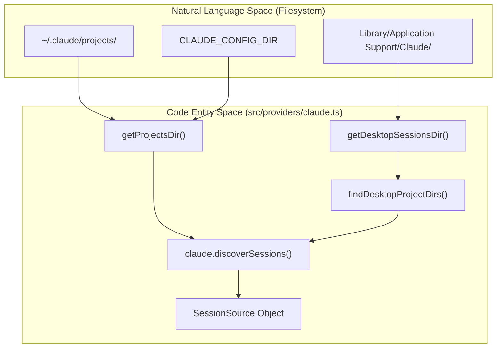
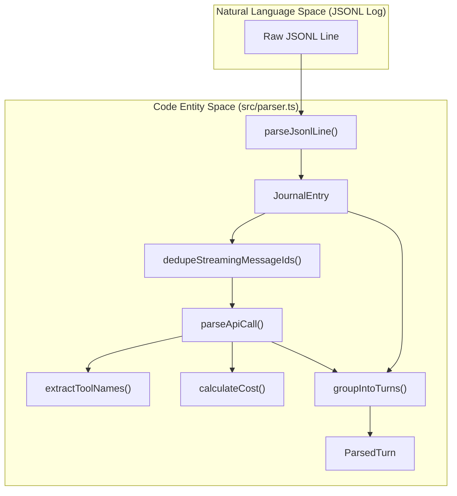

# Claude Provider

Relevant source files

The following files were used as context for generating this wiki page:

- [src/parser.ts](src/parser.ts)
- [src/providers/claude.ts](src/providers/claude.ts)
- [src/types.ts](src/types.ts)

The Claude provider is responsible for discovering and parsing session logs generated by the Claude Desktop application and its associated local agent modes. It handles the ingestion of JSONL-formatted journal entries, groups them into logical conversation turns, and extracts detailed metadata including tool usage, token counts, and subagent spawns.

## Session Discovery

Claude sessions are stored as directories containing JSONL (JSON Lines) files. The provider scans two primary locations for these sessions:

1.  **Standard Config Directory**: Defaults to `~/.claude/projects/`, but can be overridden via the `CLAUDE_CONFIG_DIR` environment variable [src/providers/claude.ts:22-28]().
2.  **Desktop Local Agent Sessions**: Scans platform-specific paths for `local-agent-mode-sessions` [src/providers/claude.ts:30-34]().
    *   **macOS**: `~/Library/Application Support/Claude/local-agent-mode-sessions`
    *   **Windows**: `~/AppData/Roaming/Claude/local-agent-mode-sessions`
    *   **Linux**: `~/.config/Claude/local-agent-mode-sessions`

The discovery process recursively walks these directories (up to a depth of 8) to find `projects` subdirectories containing individual session logs [src/providers/claude.ts:36-60]().

### Session Discovery Data Flow
The following diagram illustrates how `claude.discoverSessions` bridges the local filesystem to the `SessionSource` entities used by the ingestion pipeline.

Title: Claude Session Discovery Flow

Sources: [src/providers/claude.ts:22-106]()

## Ingestion and Parsing Pipeline

The provider processes `JournalEntry` objects [src/types.ts:46-59]() found in the JSONL files. The parsing logic is primarily implemented in `src/parser.ts`.

### Turn Grouping and Deduplication
Conversations are structured into `ParsedTurn` objects [src/types.ts:61-66](). A turn begins when a `user` message is encountered and includes all subsequent `assistant` responses until the next user message [src/parser.ts:161-184]().

To prevent double-counting in environments where logs might overlap or be re-read, the parser uses a `seenMsgIds` Set [src/parser.ts:161](). It extracts a unique ID from the assistant message via `getMessageId` [src/parser.ts:84-88]():
*   Uses `msg.id` if available [src/parser.ts:87]().
*   Falls back to a composite key: `claude:${entry.timestamp}` in `parseApiCall` [src/parser.ts:133]().

The function `dedupeStreamingMessageIds` specifically handles streaming message chunks by ensuring only the final message for a given ID (containing the complete usage and content) is processed, while preserving the original start timestamp [src/parser.ts:137-159]().

### Tool and Subagent Extraction
The parser inspects the `ContentBlock` array of assistant messages to identify:
*   **Core Tools**: Standard tools extracted via `extractCoreTools` [src/parser.ts:58-60]().
*   **MCP Tools**: Identified by the `mcp__` prefix [src/parser.ts:43-45]().
*   **Skills**: Extracted from tool blocks named `Skill` [src/parser.ts:47-56]().
*   **Subagent Spawns**: Detected if the `Agent` tool is present [src/parser.ts:128]().
*   **Plan Mode**: Detected if the `EnterPlanMode` tool is present [src/parser.ts:129]().
*   **Bash Commands**: Extracted from tool inputs using `extractBashCommandsFromContent` for tools matching `BASH_TOOLS` [src/parser.ts:62-69]().

### Data Flow: Raw Log to ParsedTurn
This diagram shows the transformation of a raw `JournalEntry` into a `ParsedApiCall` and eventually a `ParsedTurn`.

Title: Claude Log Parsing Logic

Sources: [src/parser.ts:29-204](), [src/types.ts:61-82]()

## Technical Details

### Token Usage and Costing
The provider extracts detailed token metrics from the `ApiUsage` object [src/types.ts:24-34]() within `parseApiCall` [src/parser.ts:90-116]():
*   `inputTokens` (from `usage.input_tokens`)
*   `outputTokens` (from `usage.output_tokens`)
*   `cacheCreationInputTokens` (from `usage.cache_creation_input_tokens`)
*   `cacheReadInputTokens` (from `usage.cache_read_input_tokens`)
*   `webSearchRequests` (from `usage.server_tool_use.web_search_requests`)

These values are passed to `calculateCost` [src/parser.ts:108-116]() along with the model ID and the `speed` parameter (e.g., 'fast' vs 'standard') to determine the USD cost of the call.

### Model Name Normalization
Claude uses versioned model strings (e.g., `claude-3-5-sonnet-20241022`). The provider maps these to human-readable short names for the UI using a mapping in `src/providers/claude.ts` [src/providers/claude.ts:7-20]().

| Raw Model Prefix | Display Name |
| :--- | :--- |
| `claude-3-7-sonnet` | Sonnet 3.7 |
| `claude-3-5-sonnet` | Sonnet 3.5 |
| `claude-opus-4` | Opus 4 |
| `claude-haiku-3-5` | Haiku 3.5 |

Sources: [src/providers/claude.ts:7-20](), [src/parser.ts:90-135]()

## MCP Inventory Discovery
Claude Code emits specific journal entries with `attachment.type === "deferred_tools_delta"`. The function `extractMcpInventory` parses these to maintain a union of all `mcp__` identifiers available during a session, which is stored in the `mcpInventory` field of the `SessionSummary` [src/parser.ts:206-227]().

Sources: [src/parser.ts:206-227](), [src/types.ts:129-130]()
