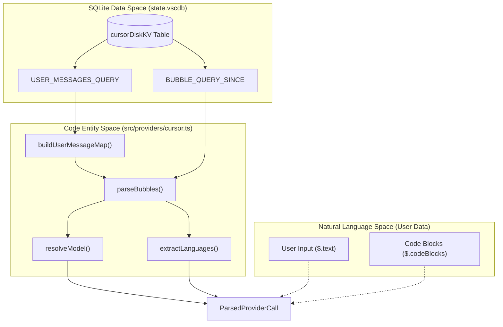
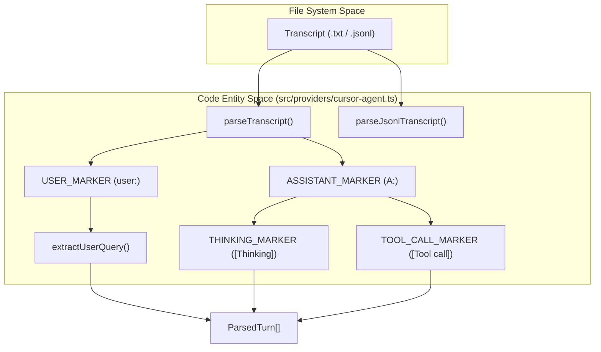

# Cursor Provider

Relevant source files

The following files were used as context for generating this wiki page:

- [src/compare.tsx](src/compare.tsx)
- [src/cursor-cache.ts](src/cursor-cache.ts)
- [src/ink-win.ts](src/ink-win.ts)
- [src/providers/cursor-agent.ts](src/providers/cursor-agent.ts)
- [src/providers/cursor.ts](src/providers/cursor.ts)
- [src/sqlite.ts](src/sqlite.ts)
- [tests/providers/cursor-agent.test.ts](tests/providers/cursor-agent.test.ts)
- [tests/providers/cursor.test.ts](tests/providers/cursor.test.ts)
- [tests/providers/opencode.test.ts](tests/providers/opencode.test.ts)

The Cursor provider is responsible for extracting AI usage data from the Cursor editor. It operates by querying the local SQLite database where Cursor stores its application state and conversation history. This provider includes two variants: the standard `cursor` provider for integrated chat/composer actions and the `cursor-agent` variant for long-running agentic transcripts.

## Data Extraction and SQLite Schema

The primary source of truth for the Cursor provider is the `state.vscdb` SQLite database [src/providers/cursor.ts:62-70](). This database contains a table named `cursorDiskKV` which stores various application state objects as JSON strings.

### Key Database Tables and Queries

The provider targets "bubbles" (individual message turns) and agent-related blobs stored in the `cursorDiskKV` table.

| Query Type | Purpose | Table/Condition |
| :--- | :--- | :--- |
| **Bubble Query** | Extracts token counts, model info, and code blocks. | `cursorDiskKV` WHERE `key LIKE 'bubbleId:%'` [src/providers/cursor.ts:101-114]() |
| **User Message Query** | Maps user text to conversation IDs for context. | `cursorDiskKV` WHERE `key LIKE 'bubbleId:%'` AND `json_extract(value, '$.type') = 1` [src/providers/cursor.ts:129-139]() |
| **Agent KV Query** | Extracts role, content, and request IDs for agentic blobs. | `cursorDiskKV` WHERE `key LIKE 'agentKv:blob:%'` [src/providers/cursor.ts:116-127]() |
| **Validation** | Ensures the database schema is compatible. | `SELECT COUNT(*) FROM cursorDiskKV` [src/providers/cursor.ts:146-155]() |

### Data Flow: SQLite to ParsedProviderCall

The following diagram illustrates how the `parseBubbles` function transforms raw SQLite rows into the canonical `ParsedProviderCall` format.

**Cursor Data Transformation Pipeline**

Sources: [src/providers/cursor.ts:101-114](), [src/providers/cursor.ts:129-144](), [src/providers/cursor.ts:159-171](), [src/providers/cursor.ts:173-220]()

## Model Resolution and Pricing

Cursor often uses internal model identifiers or "default" aliases. The provider resolves these to canonical names for accurate cost calculation.

- **Default Model**: If no model is specified or it is set to `default`, it resolves to `claude-sonnet-4-5` [src/providers/cursor.ts:10-10](), [src/providers/cursor.ts:91-94]().
- **Model Aliases**: Internal names like `gpt-5.1-codex-high` or `grok-code-fast-1` are mapped to readable display names for the UI [src/providers/cursor.ts:12-27]().
- **Cost Calculation**: The `calculateCost` function is called using the resolved pricing model and extracted token counts [src/providers/cursor.ts:215-215]().

## Deduplication and Caching

To prevent double-counting across runs, the provider uses a specific deduplication key format and a file-based cache layer.

### Deduplication Key
The key is constructed as:
`cursor:{conversationId}:{createdAt}:{inputTokens}:{outputTokens}` [src/providers/cursor.ts:207-207]().

### Cursor-Cache Layer
Because querying the SQLite database and parsing large JSON blobs can be expensive, the `cursor-cache.ts` module provides a persistence layer.
- **Fingerprinting**: The cache is validated against the SQLite file's `mtimeMs` and `size` [src/cursor-cache.ts:26-33](), [src/cursor-cache.ts:43-43]().
- **Storage**: Results are stored in `~/.cache/codeburn/cursor-results.json` [src/cursor-cache.ts:16-24]().
- **Functions**: `readCachedResults` [src/cursor-cache.ts:35-50]() and `writeCachedResults` [src/cursor-cache.ts:52-67]().

## Cursor Agent Variant

The `cursor-agent` provider (implemented in `src/providers/cursor-agent.ts`) handles logs from Cursor's agentic workflows, which are typically stored as text transcripts or JSONL files rather than in the primary SQLite DB.

### Discovery and Parsing
- **Base Directory**: Defaults to `~/.cursor` [src/providers/cursor-agent.ts:67-71]().
- **Transcripts**: Scans `projects/*/agent-transcripts/*.txt` [src/providers/cursor-agent.ts:73-75]().
- **Token Estimation**: Since transcripts are raw text, tokens are estimated using a `CHARS_PER_TOKEN` constant (set to 4) [src/providers/cursor-agent.ts:35-35](), [src/providers/cursor-agent.ts:81-84]().

**Agent Transcript Parsing Logic**

Sources: [src/providers/cursor-agent.ts:39-45](), [src/providers/cursor-agent.ts:146-165](), [src/providers/cursor-agent.ts:167-217](), [src/providers/cursor-agent.ts:219-230]()

### Attribution Database
The agent variant also attempts to read from `ai-code-tracking.db` to correlate transcripts with specific conversation metadata like titles and updated timestamps [src/providers/cursor-agent.ts:77-79](), [src/providers/cursor-agent.ts:46-50]().

Sources:
- [src/providers/cursor.ts:1-220]()
- [src/providers/cursor-agent.ts:1-230]()
- [src/cursor-cache.ts:1-67]()
- [src/sqlite.ts:86-101]()
- [tests/providers/cursor.test.ts:1-78]()
- [tests/providers/cursor-agent.test.ts:1-174]()
