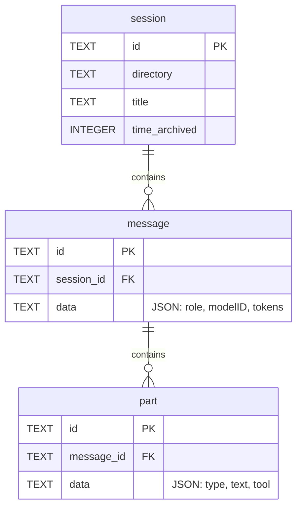

# Other Providers (Codex, Copilot, OpenCode, Pi/OMP, and more)

<details>
<summary>Relevant source files</summary>

The following files were used as context for generating this wiki page:

- [scripts/bundle-litellm.mjs](scripts/bundle-litellm.mjs)
- [src/codex-cache.ts](src/codex-cache.ts)
- [src/providers/codex.ts](src/providers/codex.ts)
- [src/providers/copilot.ts](src/providers/copilot.ts)
- [src/providers/droid.ts](src/providers/droid.ts)
- [src/providers/gemini.ts](src/providers/gemini.ts)
- [src/providers/goose.ts](src/providers/goose.ts)
- [src/providers/kilo-code.ts](src/providers/kilo-code.ts)
- [src/providers/kiro.ts](src/providers/kiro.ts)
- [src/providers/openclaw.ts](src/providers/openclaw.ts)
- [src/providers/pi.ts](src/providers/pi.ts)
- [src/providers/qwen.ts](src/providers/qwen.ts)
- [src/providers/roo-code.ts](src/providers/roo-code.ts)
- [src/providers/vscode-cline-parser.ts](src/providers/vscode-cline-parser.ts)
- [tests/providers/codex.test.ts](tests/providers/codex.test.ts)
- [tests/providers/copilot.test.ts](tests/providers/copilot.test.ts)
- [tests/providers/droid.test.ts](tests/providers/droid.test.ts)
- [tests/providers/kilo-code.test.ts](tests/providers/kilo-code.test.ts)
- [tests/providers/omp.test.ts](tests/providers/omp.test.ts)
- [tests/providers/openclaw.test.ts](tests/providers/openclaw.test.ts)
- [tests/providers/pi.test.ts](tests/providers/pi.test.ts)
- [tests/providers/roo-code.test.ts](tests/providers/roo-code.test.ts)

</details>


This page documents the implementation of the secondary provider plugins in CodeBurn. While the Claude and Cursor providers handle the bulk of common usage, these providers support specialized AI coding tools (Codex, Pi/OMP, Gemini, Droid) and mainstream extensions (Copilot, Roo Code) by parsing local JSONL logs, SQLite databases, and companion settings files.

## Overview of Supported Formats

The providers in this section utilize three primary data ingestion strategies:
1.  **JSONL Streaming**: `codex.ts`, `copilot.ts`, `pi.ts`, `gemini.ts`, `qwen.ts`, and `droid.ts` read line-delimited JSON files.
2.  **SQLite Extraction**: `goose.ts` and `opencode.ts` use the `node:sqlite` shim to query structured relational data.
3.  **Hybrid Metadata**: `droid.ts` pairs `.jsonl` session logs with `.settings.json` files to resolve token usage [src/providers/droid.ts:121-128]().

### Data Flow: Log to Parsed Call

The following diagram illustrates how these providers transform raw local state into the canonical `ParsedProviderCall` format.

**Provider Ingestion Pipeline**
```mermaid
graph TD
    subgraph "Local File System"
        JSONL[".jsonl files"]
        SQL["SQLite DB (.db / .vscdb)"]
        SET["Companion .settings.json"]
    end

    subgraph "Code Entities"
        CP["createParser() / createSessionParser()"]
        SD["discoverSessionsInDir() / discoverSessions()"]
        SQ["sqlite.ts Driver Shim"]
        RP["readSessionFile() / readSessionLines()"]
    end

    JSONL --> RP
    RP --> CP
    SET --> CP
    SQL -->|openDatabase| SQ
    SQ --> CP
    SD -->|SessionSource| CP
    CP -->|AsyncGenerator| PPC["ParsedProviderCall"]
end
```
**Sources:** [src/providers/pi.ts:114-116](), [src/providers/codex.ts:188-190](), [src/providers/copilot.ts:221-223](), [src/providers/droid.ts:111-116](), [src/sqlite.ts:86-101]()

---

## JSONL Providers

### Codex Provider
The Codex provider monitors `~/.codex/sessions` (or `CODEX_HOME`) [src/providers/codex.ts:69-71](). It organizes sessions by a `YYYY/MM/DD` directory structure [src/providers/codex.ts:129-152]().

*   **Large Meta Handling**: Codex CLI 0.128+ writes `session_meta` lines that can exceed 20 KB. The provider uses a 1 MB `FIRST_LINE_READ_CAP` to ensure these are parsed without exhausting memory [src/providers/codex.ts:80-92]().
*   **Token Usage**: Codex provides both `last_token_usage` (incremental) and `total_token_usage` (cumulative) [src/providers/codex.ts:50-55](). The parser calculates deltas from cumulative totals to emit per-turn costs [src/providers/codex.ts:206-210]().
*   **Caching**: Uses `readCachedCodexResults` to skip re-parsing heavy session files (often >250 MB) if the file fingerprint hasn't changed [src/providers/codex.ts:191-201]().

### Copilot Provider
The Copilot provider targets `~/.copilot/session-state` and VS Code workspace transcripts [src/providers/copilot.ts:228-230]().

*   **Format Detection**: It handles both legacy `.jsonl` events and newer VS Code transcripts [src/providers/copilot.ts:61-141]().
*   **Model Inference**: Since transcripts often lack explicit model names, `inferModelFromToolCallIds` uses tool-call ID prefixes (e.g., `toolu_` for Anthropic, `call_` for OpenAI) to guess the active model [src/providers/copilot.ts:156-186]().
*   **Costing**: Copilot logs frequently only include `outputTokens`; `inputTokens` are often 0 in the logs, making Copilot cost estimates a lower bound [src/providers/copilot.ts:112-124]().

### Gemini, Qwen, and Droid
*   **Gemini**: Parses `.json` or `.jsonl` chats in `~/.gemini/tmp`. It subtracts `cached` tokens from `input` to avoid double-charging, as Gemini's usage reports include cached tokens in the input total [src/providers/gemini.ts:105-107]().
*   **Qwen**: Discovers sessions in `~/.qwen/projects`. It extracts reasoning tokens from `thoughtsTokenCount` [src/providers/qwen.ts:119-122]().
*   **Droid**: Unique in that it distributes session-level token usage (from `.settings.json`) evenly across all assistant messages found in the `.jsonl` log [src/providers/droid.ts:210-225]().

**Sources:** [src/providers/codex.ts:1-132](), [src/providers/copilot.ts:1-186](), [src/providers/gemini.ts:105-122](), [src/providers/droid.ts:121-225]()

---

## SQLite Providers (Goose, OpenCode)

These providers query local databases using the `sqlite.ts` driver.

### Goose Provider
Goose stores sessions in a `sessions.db` file located in `XDG_DATA_HOME/goose` or `AppData` [src/providers/goose.ts:52-62]().
*   **Aggregation**: Goose provides `accumulated_input_tokens` and `accumulated_output_tokens` at the session level [src/providers/goose.ts:170-171]().
*   **Tool Extraction**: It performs a sub-query on the `messages` table, parsing `content_json` to find `toolRequest` types [src/providers/goose.ts:89-102]().

### OpenCode Provider
OpenCode utilizes a relational database (`opencode.db`) to store session history. The provider performs complex joins across `session`, `message`, and `part` tables.

**OpenCode Entity Relationship**

**Sources:** [src/providers/goose.ts:8-31](), [src/sqlite.ts:1-15]()

---

## SQLite Driver Shim (`sqlite.ts`)

CodeBurn includes a thin wrapper over `node:sqlite` to avoid native binary dependencies.

| Feature | Description |
| :--- | :--- |
| **Compatibility** | Stable in Node 24, experimental in Node 22/23 [src/sqlite.ts:3-5](). |
| **Lazy Loading** | The driver is only loaded when an SQLite-based provider is invoked [src/sqlite.ts:30-32](). |
| **Warning Suppression** | Intercepts `process.emit` to silence `ExperimentalWarning` for the `sqlite` module [src/sqlite.ts:46-56](). |
| **Read-Only** | Enforces `readOnly: true` when opening databases to prevent corruption [src/sqlite.ts:91](). |

**Sources:** [src/sqlite.ts:1-102]()

---

## Summary of Tool Mappings

Providers normalize internal tool names into the CodeBurn standard via `toolNameMap` objects:

| Provider | Internal Name | CodeBurn Standard |
| :--- | :--- | :--- |
| **Codex** | `exec_command` | Bash [src/providers/codex.ts:26]() |
| **Copilot** | `replace_string_in_file` | Edit [src/providers/copilot.ts:40]() |
| **Goose** | `developer__shell` | Bash [src/providers/goose.ts:39]() |
| **Qwen** | `browser_action` | WebFetch [src/providers/qwen.ts:18]() |
| **Droid** | `Execute` | Bash [src/providers/droid.ts:23]() |
| **OpenClaw** | `dispatch_agent` | Agent [src/providers/openclaw.ts:19]() |

**Sources:** [src/providers/codex.ts:25-35](), [src/providers/copilot.ts:34-53](), [src/providers/goose.ts:38-46](), [src/providers/qwen.ts:10-22](), [src/providers/droid.ts:15-32](), [src/providers/openclaw.ts:10-24]()
