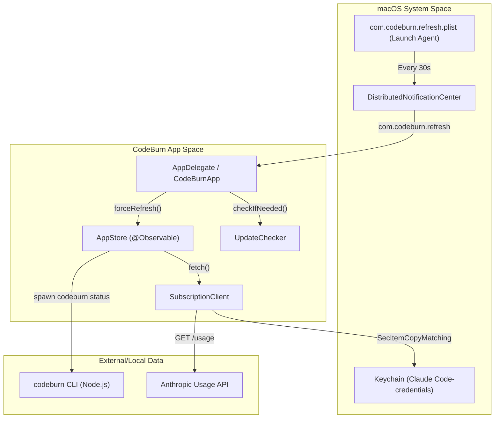
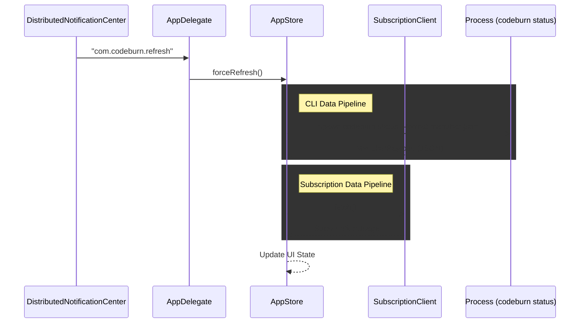

# macOS Menubar Application

Relevant source files

The following files were used as context for generating this wiki page:

- [mac/.gitignore](mac/.gitignore)
- [mac/Package.swift](mac/Package.swift)
- [mac/README.md](mac/README.md)
- [mac/Sources/CodeBurnMenubar/CodeBurnApp.swift](mac/Sources/CodeBurnMenubar/CodeBurnApp.swift)
- [mac/Sources/CodeBurnMenubar/Data/CapacityEstimator.swift](mac/Sources/CodeBurnMenubar/Data/CapacityEstimator.swift)
- [mac/Sources/CodeBurnMenubar/Data/SubscriptionClient.swift](mac/Sources/CodeBurnMenubar/Data/SubscriptionClient.swift)

The CodeBurn macOS Menubar Application is a native Swift/SwiftUI implementation designed to provide real-time visibility into AI coding expenditures and token usage directly from the system tray [mac/README.md:1-3](). It acts as a graphical companion to the `codeburn` CLI, periodically polling local session data and integrating with provider APIs to display cost metrics, usage trends, and optimization insights.

### System Architecture

The application is built as a macOS accessory app (`LSUIElement = true`), meaning it resides exclusively in the menubar without a Dock icon [mac/README.md:45-45](). It follows a reactive architecture using SwiftUI for the view layer and the `@Observable` pattern for state management [mac/Sources/CodeBurnMenubar/CodeBurnApp.swift:3-13]().

#### Data Orchestration and Flow
The application bridges the "Natural Language Space" of user intent to the "Code Entity Space" through a structured data pipeline:

1.  **Trigger**: A Launch Agent `com.codeburn.refresh.plist` or internal timers fire every 30 seconds [mac/Sources/CodeBurnMenubar/CodeBurnApp.swift:5-7, 111-112]().
2.  **Execution**: The `AppStore` triggers a refresh, which invokes the `codeburn` CLI as a subprocess via `CodeburnCLI.makeProcess` [mac/README.md:49-49]().
3.  **Parsing**: The CLI output (JSON) is decoded into a `MenubarPayload` [mac/README.md:49-49]().
4.  **Observation**: The `AppStore` updates its `@Observable` state, triggering SwiftUI view refreshes across the `MenuBarContent` hierarchy [mac/Sources/CodeBurnMenubar/CodeBurnApp.swift:29-29]().

**Menubar System Context**

Sources: [mac/Sources/CodeBurnMenubar/CodeBurnApp.swift:54-59](), [mac/Sources/CodeBurnMenubar/CodeBurnApp.swift:80-116](), [mac/Sources/CodeBurnMenubar/Data/SubscriptionClient.swift:33-49](), [mac/README.md:49-52]()

### Component Overviews

#### App Lifecycle and State Management
The `AppDelegate` manages the application's lifecycle, including setting the activation policy to `.accessory` and disabling sudden termination to ensure background polling remains active [mac/Sources/CodeBurnMenubar/CodeBurnApp.swift:35-44](). It installs a Launch Agent to provide a "heartbeat" for data refreshes even when the app is in the background [mac/Sources/CodeBurnMenubar/CodeBurnApp.swift:90-117](). The `AppStore` serves as the central state container, handling data fetching and currency persistence [mac/Sources/CodeBurnMenubar/CodeBurnApp.swift:29-29]().

For details, see [App Lifecycle and State Management](#5.1).

#### Menubar UI Views
The UI is implemented using a `NSPopover` containing a SwiftUI view hierarchy [mac/Sources/CodeBurnMenubar/CodeBurnApp.swift:27-28](). The layout is defined in `MenuBarContent.swift` and includes sections for cost summaries, heatmaps, and optimization findings [mac/README.md:58-63](). It uses a custom "warm terracotta" palette for its visual identity [mac/README.md:79-89]().

For details, see [Menubar UI Views](#5.2).

#### Data Layer and Subscription Integration
The app communicates with the `codeburn` CLI by invoking `codeburn status --format menubar-json` [mac/README.md:49-49](). It also includes a `SubscriptionClient` that retrieves Claude OAuth credentials from the macOS Keychain or `~/.claude/.credentials.json` to fetch real-time usage percentages from Anthropic's API [mac/Sources/CodeBurnMenubar/Data/SubscriptionClient.swift:33-61](). A `CapacityEstimator` is used to reverse-engineer token limits from these percentage snapshots [mac/Sources/CodeBurnMenubar/Data/CapacityEstimator.swift:33-43]().

For details, see [Data Layer and Subscription Integration](#5.3).

#### Installation and Updates
Installation is handled via the CLI command `npx codeburn menubar`, which automates downloading the `.app` bundle from GitHub, moving it to `~/Applications`, and clearing Gatekeeper quarantine [mac/README.md:15-19](). The app includes an internal `UpdateChecker` that polls the GitHub Releases API to notify users of new versions [mac/Sources/CodeBurnMenubar/CodeBurnApp.swift:59-59]().

For details, see [Installation and Updates](#5.4).

### Code Entity Mapping

The following table maps system responsibilities to the primary Swift entities:

| Responsibility | Code Entity | Key Method/Property |
| :--- | :--- | :--- |
| **Main Entry Point** | `CodeBurnApp` | `@main` [mac/Sources/CodeBurnMenubar/CodeBurnApp.swift:13-14]() |
| **System Integration** | `AppDelegate` | `applicationDidFinishLaunching` [mac/Sources/CodeBurnMenubar/CodeBurnApp.swift:42-60]() |
| **Central State** | `AppStore` | `@Observable class AppStore` [mac/Sources/CodeBurnMenubar/CodeBurnApp.swift:29-29]() |
| **Usage API Client** | `SubscriptionClient` | `fetch()` [mac/Sources/CodeBurnMenubar/Data/SubscriptionClient.swift:34-49]() |
| **Token Estimation** | `CapacityEstimator` | `estimate(_:asOf:)` [mac/Sources/CodeBurnMenubar/Data/CapacityEstimator.swift:43-93]() |
| **Update Management** | `UpdateChecker` | `checkIfNeeded()` [mac/Sources/CodeBurnMenubar/CodeBurnApp.swift:59-59]() |

**Data Pipeline Entity Map**

Sources: [mac/Sources/CodeBurnMenubar/CodeBurnApp.swift:80-88](), [mac/Sources/CodeBurnMenubar/CodeBurnApp.swift:168-179](), [mac/Sources/CodeBurnMenubar/Data/SubscriptionClient.swift:34-49](), [mac/README.md:49-52]()
