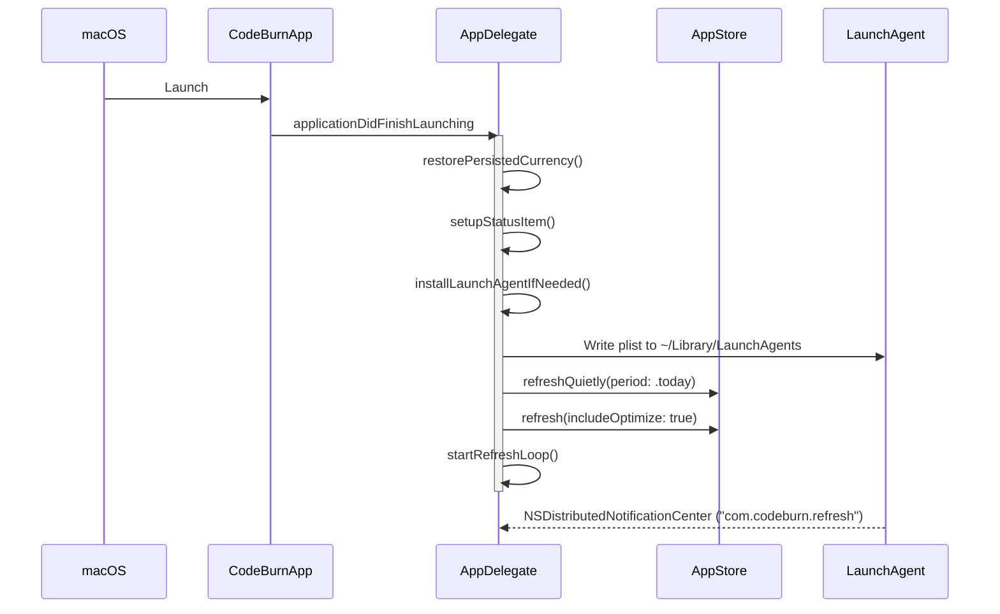
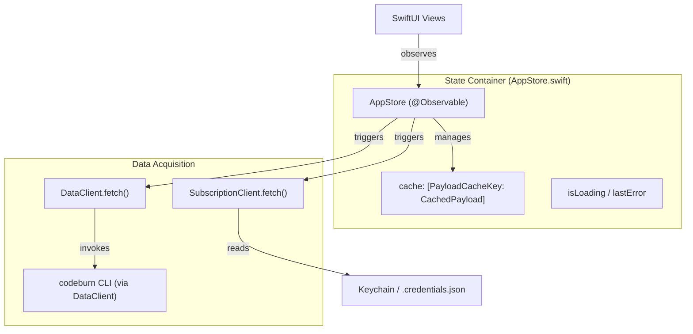

# App Lifecycle and State Management

Relevant source files

The following files were used as context for generating this wiki page:

- [mac/Sources/CodeBurnMenubar/AppStore.swift](mac/Sources/CodeBurnMenubar/AppStore.swift)
- [mac/Sources/CodeBurnMenubar/CodeBurnApp.swift](mac/Sources/CodeBurnMenubar/CodeBurnApp.swift)
- [mac/Sources/CodeBurnMenubar/Data/SubscriptionClient.swift](mac/Sources/CodeBurnMenubar/Data/SubscriptionClient.swift)

The CodeBurn macOS menubar application operates as a high-frequency observer of local AI development activity. It manages a complex lifecycle involving background polling, Launch Agent persistence, and a reactive state container that synchronizes with the `codeburn` CLI.

## CodeBurnApp and AppDelegate

The application entry point is `CodeBurnApp`, which utilizes `@NSApplicationDelegateAdaptor` to manage the `AppDelegate` lifecycle [mac/Sources/CodeBurnMenubar/CodeBurnApp.swift:14-23](). The app is configured as an `.accessory` type [mac/Sources/CodeBurnMenubar/CodeBurnApp.swift:39](), meaning it does not appear in the Dock and has no main window, existing solely in the system menubar.

### Lifecycle Management
To ensure continuous monitoring, the app explicitly opts out of system power-saving features:
*   **App Nap & Termination**: It disables `automaticTerminationSupportEnabled` and `disableSuddenTermination()` [mac/Sources/CodeBurnMenubar/CodeBurnApp.swift:43-44]().
*   **Background Activity**: It registers a background activity session with the reason "CodeBurn menubar polls AI coding cost every 30 seconds while idle in the background." [mac/Sources/CodeBurnMenubar/CodeBurnApp.swift:45-48]().

### Refresh Strategies
The app employs three distinct triggers for data synchronization:
1.  **Heartbeat Timer**: A `DispatchSourceTimer` (configured via `refreshIntervalSeconds = 30`) runs on the main queue to perform background refreshes [mac/Sources/CodeBurnMenubar/CodeBurnApp.swift:5-7]().
2.  **Wake Observers**: Listeners for `NSWorkspace.didWakeNotification` and `screensDidWakeNotification` trigger `forceRefresh()` when the Mac resumes from sleep [mac/Sources/CodeBurnMenubar/CodeBurnApp.swift:62-78]().
3.  **Launch Agent Heartbeat**: The app installs a Launch Agent (`com.codeburn.refresh.plist`) that uses `osascript` to broadcast a `com.codeburn.refresh` notification via `NSDistributedNotificationCenter` every 30 seconds [mac/Sources/CodeBurnMenubar/CodeBurnApp.swift:90-117](). This ensures the app remains active even if the main process is throttled by the OS.

### App Initialization Flow
The following diagram maps the startup sequence to specific code entities.

**Startup and Initialization Sequence**

Sources: [mac/Sources/CodeBurnMenubar/CodeBurnApp.swift:42-60](), [mac/Sources/CodeBurnMenubar/CodeBurnApp.swift:80-140](), [mac/Sources/CodeBurnMenubar/CodeBurnApp.swift:168-179]()

## AppStore: Reactive State Container

The `AppStore` is the central `@Observable` state container [mac/Sources/CodeBurnMenubar/AppStore.swift:18-19](). It manages the UI state (selections, loading indicators, errors) and caches payloads from the CLI.

### Data Flow and Caching
`AppStore` maintains a `cache` of `MenubarPayload` objects keyed by a combination of `Period` and `ProviderFilter` [mac/Sources/CodeBurnMenubar/AppStore.swift:36-41](). 

| Feature | Implementation |
| :--- | :--- |
| **Cache TTL** | 30 seconds [mac/Sources/CodeBurnMenubar/AppStore.swift:4]() |
| **Active Refresh** | `refresh(includeOptimize:force:)` toggles `loadingCount` for UI feedback [mac/Sources/CodeBurnMenubar/AppStore.swift:102-114]() |
| **Quiet Refresh** | `refreshQuietly(period:)` updates the cache without incrementing `loadingCount` [mac/Sources/CodeBurnMenubar/AppStore.swift:147-154]() |
| **Concurrency Guard** | `inFlightKeys` prevents duplicate `DataClient.fetch` calls for the same period/provider [mac/Sources/CodeBurnMenubar/AppStore.swift:100-112]() |

### State Transitions
The store handles user interactions (switching periods or providers) via `switchTo(period:)` and `switchTo(provider:)`. These methods cancel any `switchTask` currently in-flight and trigger parallel refreshes for both the specific filter and the "All Providers" view to keep the UI in sync [mac/Sources/CodeBurnMenubar/AppStore.swift:69-98]().

**State Management Entity Mapping**

Sources: [mac/Sources/CodeBurnMenubar/AppStore.swift:18-51](), [mac/Sources/CodeBurnMenubar/AppStore.swift:102-142](), [mac/Sources/CodeBurnMenubar/Data/SubscriptionClient.swift:33-49]()

## Currency Persistence and FX Handling

The menubar app synchronizes its currency settings with the CLI configuration.

1.  **Restoration**: On launch, `restorePersistedCurrency()` loads the currency code using `CLICurrencyConfig.loadCode()` [mac/Sources/CodeBurnMenubar/CodeBurnApp.swift:184-188]().
2.  **FX Resolution**: It resolves the exchange rate from `FXRateCache.shared.cachedRate(for:)` or fetches it live in the background [mac/Sources/CodeBurnMenubar/CodeBurnApp.swift:189-193]().
3.  **Persistence**: The app ensures that currency settings persisted by the `codeburn currency` CLI command are picked up upon app relaunch [mac/Sources/CodeBurnMenubar/CodeBurnApp.swift:181-184]().

Sources: [mac/Sources/CodeBurnMenubar/CodeBurnApp.swift:184-194]()

## Claude Subscription Integration

The app integrates with Claude's OAuth system to provide usage percentages and capacity estimates.

*   **Credential Discovery**: `SubscriptionClient` attempts to load credentials from `~/.claude/.credentials.json` (via `SafeFile.read`) or the macOS Keychain (`Claude Code-credentials`) [mac/Sources/CodeBurnMenubar/Data/SubscriptionClient.swift:53-61]().
*   **Sanitization**: Because the Claude CLI may line-wrap long tokens in the Keychain, `sanitizeKeychainData(_:)` performs regex-based cleaning to strip newlines and stray spaces before parsing the JSON [mac/Sources/CodeBurnMenubar/Data/SubscriptionClient.swift:93-103]().
*   **Refresh Logic**: If a usage fetch fails with a 401 status, the client automatically attempts to `refreshAccessToken` using the stored refresh token [mac/Sources/CodeBurnMenubar/Data/SubscriptionClient.swift:41-48]().
*   **State Tracking**: `AppStore` tracks `subscriptionLoadState` (.idle, .loading, .loaded, .failed, or .noCredentials) to drive the UI for the Claude usage pill [mac/Sources/CodeBurnMenubar/AppStore.swift:158-176]().

Sources: [mac/Sources/CodeBurnMenubar/AppStore.swift:158-176](), [mac/Sources/CodeBurnMenubar/Data/SubscriptionClient.swift:33-49](), [mac/Sources/CodeBurnMenubar/Data/SubscriptionClient.swift:93-103]()
