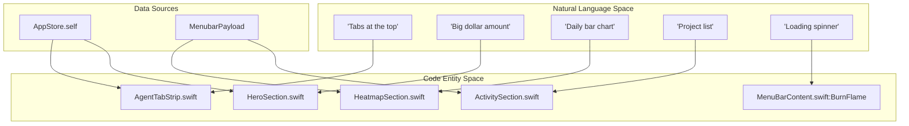
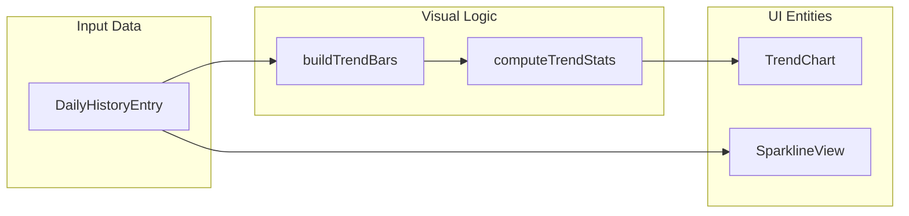

# Menubar UI Views

Relevant source files

The following files were used as context for generating this wiki page:

- [mac/Sources/CodeBurnMenubar/CurrencyState.swift](mac/Sources/CodeBurnMenubar/CurrencyState.swift)
- [mac/Sources/CodeBurnMenubar/Data/DataClient.swift](mac/Sources/CodeBurnMenubar/Data/DataClient.swift)
- [mac/Sources/CodeBurnMenubar/Security/TerminalLauncher.swift](mac/Sources/CodeBurnMenubar/Security/TerminalLauncher.swift)
- [mac/Sources/CodeBurnMenubar/Theme/Theme.swift](mac/Sources/CodeBurnMenubar/Theme/Theme.swift)
- [mac/Sources/CodeBurnMenubar/Theme/ThemeState.swift](mac/Sources/CodeBurnMenubar/Theme/ThemeState.swift)
- [mac/Sources/CodeBurnMenubar/Views/ActivitySection.swift](mac/Sources/CodeBurnMenubar/Views/ActivitySection.swift)
- [mac/Sources/CodeBurnMenubar/Views/AgentTabStrip.swift](mac/Sources/CodeBurnMenubar/Views/AgentTabStrip.swift)
- [mac/Sources/CodeBurnMenubar/Views/FindingsSection.swift](mac/Sources/CodeBurnMenubar/Views/FindingsSection.swift)
- [mac/Sources/CodeBurnMenubar/Views/HeatmapSection.swift](mac/Sources/CodeBurnMenubar/Views/HeatmapSection.swift)
- [mac/Sources/CodeBurnMenubar/Views/HeroSection.swift](mac/Sources/CodeBurnMenubar/Views/HeroSection.swift)
- [mac/Sources/CodeBurnMenubar/Views/MenuBarContent.swift](mac/Sources/CodeBurnMenubar/Views/MenuBarContent.swift)
- [mac/Sources/CodeBurnMenubar/Views/ModelsSection.swift](mac/Sources/CodeBurnMenubar/Views/ModelsSection.swift)
- [mac/Sources/CodeBurnMenubar/Views/PeriodSegmentedControl.swift](mac/Sources/CodeBurnMenubar/Views/PeriodSegmentedControl.swift)
- [mac/Sources/CodeBurnMenubar/Views/SparklineView.swift](mac/Sources/CodeBurnMenubar/Views/SparklineView.swift)
- [src/daily-cache.ts](src/daily-cache.ts)
- [tests/daily-cache.test.ts](tests/daily-cache.test.ts)

The CodeBurn macOS application provides a high-density, interactive dashboard via a native SwiftUI menubar interface. This page documents the view hierarchy, data flow, and specialized UI components that render the parsed session data and insights.

## View Hierarchy and Data Flow

The menubar UI is structured as a vertical stack of specialized sections within a `VStack` inside `MenuBarContent`. Data is propagated from the `AppStore` (the central `@Observable` state container) via the SwiftUI `@Environment`.

### Hierarchy Overview
1.  **Header**: App branding and update notifications [mac/Sources/CodeBurnMenubar/Views/MenuBarContent.swift:10]().
2.  **AgentTabStrip**: Horizontal provider filtering (Claude, Cursor, etc.) [mac/Sources/CodeBurnMenubar/Views/MenuBarContent.swift:15]().
3.  **HeroSection**: Primary KPIs (Cost, Calls, Sessions) [mac/Sources/CodeBurnMenubar/Views/MenuBarContent.swift:22]().
4.  **PeriodSegmentedControl**: Time-range filtering (Today, 7D, 30D, Month, All) [mac/Sources/CodeBurnMenubar/Views/MenuBarContent.swift:24]().
5.  **HeatmapSection**: Swappable visualizations (Trends, Forecast, Pulse) [mac/Sources/CodeBurnMenubar/Views/MenuBarContent.swift:29]().
6.  **ActivitySection**: Project-level breakdown [mac/Sources/CodeBurnMenubar/Views/MenuBarContent.swift:35]().
7.  **ModelsSection**: Model-level cost and token breakdown [mac/Sources/CodeBurnMenubar/Views/MenuBarContent.swift:37]().
8.  **FindingsSection**: AI-generated optimization tips [mac/Sources/CodeBurnMenubar/Views/MenuBarContent.swift:39]().
9.  **FooterBar**: App settings and external links [mac/Sources/CodeBurnMenubar/Views/MenuBarContent.swift:54]().

### Data Flow Diagram: Natural Language to Code Entities

The following diagram maps user interface concepts to the specific SwiftUI views and data structures that implement them.

**UI Component Mapping**

Sources: [mac/Sources/CodeBurnMenubar/Views/MenuBarContent.swift:5-58](), [mac/Sources/CodeBurnMenubar/Views/AgentTabStrip.swift:3-10]()

---

## Primary Layout Components

### MenuBarContent
The root popover view. It manages the global layout and handles the "Empty State" logic when a specific provider has no data for a selected period [mac/Sources/CodeBurnMenubar/Views/MenuBarContent.swift:60-65](). It also manages the `BurnLoadingOverlay` which is triggered when `store.isLoading` is true [mac/Sources/CodeBurnMenubar/Views/MenuBarContent.swift:44-47]().

### AgentTabStrip
A horizontal `ScrollView` containing `AgentTab` buttons. It filters the entire dashboard by provider (e.g., Claude, Cursor, Codex).
*   **Visibility Logic**: Tabs are only shown for providers detected on the local machine [mac/Sources/CodeBurnMenubar/Views/AgentTabStrip.swift:36-44]().
*   **Data Binding**: Tapping a tab calls `store.switchTo(provider:)`, which triggers a data refresh for the selected filter [mac/Sources/CodeBurnMenubar/Views/AgentTabStrip.swift:10-11]().
*   **Cost Badges**: Each tab optionally displays a compact currency badge for the cost associated with that specific provider [mac/Sources/CodeBurnMenubar/Views/AgentTabStrip.swift:72-77]().

### PeriodSegmentedControl
A custom control for switching the time window of the data. It uses a `HStack` of buttons that update `store.selectedPeriod` [mac/Sources/CodeBurnMenubar/Views/PeriodSegmentedControl.swift:7-10](). The UI uses `NSColor.windowBackgroundColor` to highlight the active segment [mac/Sources/CodeBurnMenubar/Views/PeriodSegmentedControl.swift:22]().

Sources: [mac/Sources/CodeBurnMenubar/Views/MenuBarContent.swift:5-58](), [mac/Sources/CodeBurnMenubar/Views/AgentTabStrip.swift:3-60](), [mac/Sources/CodeBurnMenubar/Views/PeriodSegmentedControl.swift:3-36]()

---

## Visualization Sections

### HeatmapSection
This section implements a "Pill Switcher" (`InsightPillSwitcher`) to toggle between different analytical views [mac/Sources/CodeBurnMenubar/Views/HeatmapSection.swift:15-17]().

| View Mode | Implementation | Description |
| :--- | :--- | :--- |
| **Trend** | `TrendInsight` | A 19-day bar chart showing daily spend or tokens [mac/Sources/CodeBurnMenubar/Views/HeatmapSection.swift:84-139](). |
| **Forecast** | `ForecastInsight` | Projects monthly burn based on current velocity [mac/Sources/CodeBurnMenubar/Views/HeatmapSection.swift:47](). |
| **Pulse** | `PulseInsight` | Displays efficiency KPIs like cache hit rate and one-shot rate [mac/Sources/CodeBurnMenubar/Views/HeatmapSection.swift:48](). |
| **Plan** | `PlanInsight` | Claude-specific subscription usage (only visible for Claude provider) [mac/Sources/CodeBurnMenubar/Views/HeatmapSection.swift:27-34](). |

### TrendChart
A specialized bar chart within `TrendInsight`.
*   **Metric Selection**: Automatically switches between Token counts (for "All Providers" view) and Currency amounts (for specific providers) [mac/Sources/CodeBurnMenubar/Views/HeatmapSection.swift:92-95]().
*   **Interactivity**: Supports hover states to show specific values for a given day [mac/Sources/CodeBurnMenubar/Views/HeatmapSection.swift:174]().

### Visual Data Flow Diagram

Sources: [mac/Sources/CodeBurnMenubar/Views/HeatmapSection.swift:8-51](), [mac/Sources/CodeBurnMenubar/Views/SparklineView.swift:3-41]()

---

## Breakdown Sections

### ActivitySection & ModelsSection
Both sections utilize collapsible layouts to show relative contributions to total cost.
*   **ActivityRow**: Displays project name, cost, turn count, and one-shot rate.
*   **ModelRow**: Displays model name, cost, and call count.
*   **Data Source**: These sections consume `store.payload.current` which contains `projectBreakdown` and `modelBreakdown` respectively.

### FindingsSection
Renders "Tips" derived from history analysis and the optimization engine [mac/Sources/CodeBurnMenubar/Views/FindingsSection.swift:6-12]().
*   **Categories**: Groups findings into "Wins", "Improvements", and "Risks" [mac/Sources/CodeBurnMenubar/Views/FindingsSection.swift:133-190]().
*   **Optimization Integration**: If the CLI detected specific waste patterns, the "Improvements" group lists them with projected savings [mac/Sources/CodeBurnMenubar/Views/FindingsSection.swift:165-171]().
*   **Interactivity**: Provides a button to "Open Full Optimize", which invokes `TerminalLauncher.open(subcommand: ["optimize"])` to launch the CLI dashboard in a terminal window [mac/Sources/CodeBurnMenubar/Views/FindingsSection.swift:78-80]().

Sources: [mac/Sources/CodeBurnMenubar/Views/FindingsSection.swift:4-131](), [mac/Sources/CodeBurnMenubar/Security/TerminalLauncher.swift:17-32]()

---

## Brand Animations and Overlays

### BurnLoadingOverlay
A translucent overlay that blurs underlying content using `.ultraThinMaterial` while data is being fetched from the CLI [mac/Sources/CodeBurnMenubar/Views/MenuBarContent.swift:120-139]().

### BurnFlame
The primary loading indicator, representing the CodeBurn brand.
*   **Visual Construction**: A `ZStack` layering a pulsing `flame.fill` for glow, a static `flame` outline, and a gradient-filled `flame.fill` [mac/Sources/CodeBurnMenubar/Views/MenuBarContent.swift:151-194]().
*   **Animation**: The gradient flame is masked by a `Rectangle` whose height is driven by `fillProgress`, creating a bottom-up filling effect [mac/Sources/CodeBurnMenubar/Views/MenuBarContent.swift:184-190]().
*   **Theming**: Uses `Theme.brandAccent` colors which are dynamically updated based on the user's selected preset in `ThemeState` [mac/Sources/CodeBurnMenubar/Theme/Theme.swift:8-11]().

Sources: [mac/Sources/CodeBurnMenubar/Views/MenuBarContent.swift:117-194](), [mac/Sources/CodeBurnMenubar/Theme/Theme.swift:1-28](), [mac/Sources/CodeBurnMenubar/Theme/ThemeState.swift:75-88]()
