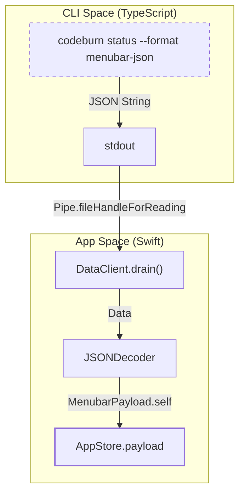
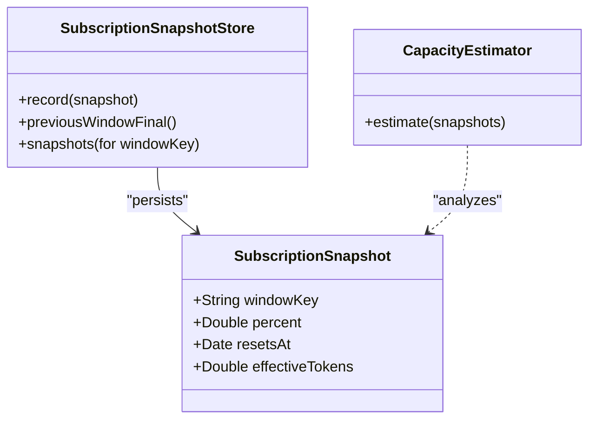

# Data Layer and Subscription Integration

Relevant source files

The following files were used as context for generating this wiki page:

- [mac/Sources/CodeBurnMenubar/CodeBurnApp.swift](mac/Sources/CodeBurnMenubar/CodeBurnApp.swift)
- [mac/Sources/CodeBurnMenubar/Data/DataClient.swift](mac/Sources/CodeBurnMenubar/Data/DataClient.swift)
- [mac/Sources/CodeBurnMenubar/Data/MenubarPayload.swift](mac/Sources/CodeBurnMenubar/Data/MenubarPayload.swift)
- [mac/Sources/CodeBurnMenubar/Data/SubscriptionClient.swift](mac/Sources/CodeBurnMenubar/Data/SubscriptionClient.swift)
- [mac/Sources/CodeBurnMenubar/Data/SubscriptionSnapshotStore.swift](mac/Sources/CodeBurnMenubar/Data/SubscriptionSnapshotStore.swift)
- [mac/Sources/CodeBurnMenubar/Data/SubscriptionUsage.swift](mac/Sources/CodeBurnMenubar/Data/SubscriptionUsage.swift)
- [mac/Sources/CodeBurnMenubar/Data/UpdateChecker.swift](mac/Sources/CodeBurnMenubar/Data/UpdateChecker.swift)
- [mac/Sources/CodeBurnMenubar/Security/CodeburnCLI.swift](mac/Sources/CodeBurnMenubar/Security/CodeburnCLI.swift)
- [mac/Sources/CodeBurnMenubar/Security/SafeFile.swift](mac/Sources/CodeBurnMenubar/Security/SafeFile.swift)
- [mac/Sources/CodeBurnMenubar/Views/MenuBarContent.swift](mac/Sources/CodeBurnMenubar/Views/MenuBarContent.swift)
- [mac/Tests/CodeBurnMenubarTests/CapacityEstimatorTests.swift](mac/Tests/CodeBurnMenubarTests/CapacityEstimatorTests.swift)

The CodeBurn macOS menubar application relies on a specialized data layer to bridge the gap between the TypeScript-based CLI and the native Swift environment. This layer handles high-frequency CLI invocations, manages OAuth-based subscription data from Claude, and implements a reverse-engineered capacity estimation engine to track token limits.

## DataClient: CLI Invocation Bridge

The `DataClient` is a Swift utility that executes the `codeburn` CLI to retrieve usage metrics. It specifically invokes the `status` command with the `--format menubar-json` flag to obtain a structured payload optimized for the menubar UI [mac/Sources/CodeBurnMenubar/Data/DataClient.swift:22-28]().

### Execution and Safety
To ensure stability and prevent resource leaks, `DataClient` implements several safety mechanisms:
*   **Direct Invocation**: It uses `argv` directly via `CodeburnCLI.makeProcess` rather than shell interpretation to avoid injection risks [mac/Sources/CodeBurnMenubar/Security/CodeburnCLI.swift:3-6]().
*   **Safe Arguments**: The `CodeburnCLI` validates all binary paths against a `safeArgPattern` to prevent shell-injection attacks [mac/Sources/CodeBurnMenubar/Security/CodeburnCLI.swift:11-30]().
*   **Concurrent Draining**: It drains `stdout` and `stderr` pipes concurrently using a `drain` helper to prevent deadlocks when the child process blocks on a full pipe buffer [mac/Sources/CodeBurnMenubar/Data/DataClient.swift:64-67]().
*   **Resource Bounds**: It enforces a 20MB payload limit (`maxPayloadBytes`) and a 45-second wall-clock timeout [mac/Sources/CodeBurnMenubar/Data/DataClient.swift:7-9]().

### Data Flow: CLI to Swift
The following diagram illustrates how raw CLI output is transformed into native Swift models.

**CLI Data Ingestion Pipeline**

Sources: [mac/Sources/CodeBurnMenubar/Data/DataClient.swift:22-42](), [mac/Sources/CodeBurnMenubar/Security/CodeburnCLI.swift:35-50]()

## MenubarPayload Schema

The `MenubarPayload` is the canonical data structure used for cross-process communication. It provides a summarized view of a specific time period (e.g., "Today", "7 Days") including cost, activity categories, and optimization findings [mac/Sources/CodeBurnMenubar/Data/MenubarPayload.swift:5-10]().

| Component | Description | Key Code Entities |
| :--- | :--- | :--- |
| **Current** | Metrics for the active period (cost, sessions, providers). | `CurrentBlock` [mac/Sources/CodeBurnMenubar/Data/MenubarPayload.swift:61-73]() |
| **Optimize** | Summary of potential savings and top detected findings. | `OptimizeBlock` [mac/Sources/CodeBurnMenubar/Data/MenubarPayload.swift:88-92]() |
| **History** | Rolling window of daily usage for sparklines and heatmaps. | `HistoryBlock` [mac/Sources/CodeBurnMenubar/Data/MenubarPayload.swift:12-14]() |

### Effective Token Calculation
Because Claude subscriptions use complex weighting for different token types, the menubar app calculates `effectiveTokens` to align with Anthropic's pricing ratios:
`effectiveTokens = input + (5.0 * output) + cacheWrite + (0.1 * cacheRead)` [mac/Sources/CodeBurnMenubar/Data/MenubarPayload.swift:38-40]().

Sources: [mac/Sources/CodeBurnMenubar/Data/MenubarPayload.swift:5-10](), [mac/Sources/CodeBurnMenubar/Data/MenubarPayload.swift:38-41]()

## Subscription Integration (Claude OAuth)

The `SubscriptionClient` manages integration with Claude's subscription tiers by reading OAuth credentials and fetching usage data from Anthropic's APIs.

### Credential Handling
The client attempts to load credentials from two locations:
1.  **File System**: `~/.claude/.credentials.json` [mac/Sources/CodeBurnMenubar/Data/SubscriptionClient.swift:4-5]().
2.  **macOS Keychain**: Service name `Claude Code-credentials` [mac/Sources/CodeBurnMenubar/Data/SubscriptionClient.swift:5-6]().

Because the CLI's keychain writer often introduces line-wraps and control characters, `SubscriptionClient` includes a `sanitizeKeychainData` function that uses regular expressions to strip newlines and leading spaces from tokens before JSON decoding [mac/Sources/CodeBurnMenubar/Data/SubscriptionClient.swift:93-103]().

### Usage Fetching and Tiers
The client tracks utilization percentages for various windows, such as the 5-hour rolling limit and 7-day limits for specific models like Opus or Sonnet [mac/Sources/CodeBurnMenubar/Data/SubscriptionUsage.swift:24-34](). It maps raw tier strings to internal `Tier` enums (`pro`, `max5x`, `team`, etc.) to drive UI logic [mac/Sources/CodeBurnMenubar/Data/SubscriptionUsage.swift:36-45]().

Sources: [mac/Sources/CodeBurnMenubar/Data/SubscriptionClient.swift:33-49](), [mac/Sources/CodeBurnMenubar/Data/SubscriptionUsage.swift:3-22]()

## Capacity Estimation

Since Claude's API only provides usage as a percentage (e.g., "45% of your limit used"), the `CapacityEstimator` reverse-engineers the absolute token limits by correlating `effectiveTokens` from local logs with the percentages reported by the subscription service.

### Estimation Logic
1.  **Snapshot Collection**: The app records `SubscriptionSnapshot` objects containing the percentage and the calculated `effectiveTokens` at that moment [mac/Sources/CodeBurnMenubar/Data/SubscriptionSnapshotStore.swift:6-12]().
2.  **Linear Regression**: It performs a regression on these snapshots to find the 100% intercept.
3.  **Gating**: Estimates are only produced if there are at least 5 snapshots and the percentage range spans at least 15 points to ensure mathematical significance [mac/Tests/CodeBurnMenubarTests/CapacityEstimatorTests.swift:23-39]().
4.  **Recency Weighting**: Newer snapshots have a higher weight (typically a 30-day half-life) to account for subscription tier changes [mac/Tests/CodeBurnMenubarTests/CapacityEstimatorTests.swift:105-111]().

**Capacity Estimation Data Relationship**

Sources: [mac/Sources/CodeBurnMenubar/Data/SubscriptionSnapshotStore.swift:6-12](), [mac/Tests/CodeBurnMenubarTests/CapacityEstimatorTests.swift:15-19]()

## SubscriptionSnapshotStore

The `SubscriptionSnapshotStore` provides persistent storage for utilization readings. It ensures that when a usage window resets (e.g., a new 7-day cycle begins), the app can still reference the "final" reading of the previous cycle [mac/Sources/CodeBurnMenubar/Data/SubscriptionSnapshotStore.swift:56-60]().

*   **Persistence**: Data is saved to `~/.cache/codeburn/subscription-snapshots.json` using `SafeFile` for atomic writes [mac/Sources/CodeBurnMenubar/Data/SubscriptionSnapshotStore.swift:14-23]().
*   **Security**: `SafeFile` refuses to follow symlinks and uses `O_NOFOLLOW` and `rename` to prevent clobbering attacks [mac/Sources/CodeBurnMenubar/Security/SafeFile.swift:5-18]().
*   **Concurrency**: Access is serialized via a `SnapshotLock` actor to prevent race conditions during writes [mac/Sources/CodeBurnMenubar/Data/SubscriptionSnapshotStore.swift:26-29]().
*   **Idempotency**: If multiple snapshots are recorded for the same reset window, only the one with the highest percentage is kept to preserve the "peak" usage [mac/Sources/CodeBurnMenubar/Data/SubscriptionSnapshotStore.swift:35-43]().

Sources: [mac/Sources/CodeBurnMenubar/Data/SubscriptionSnapshotStore.swift:31-54](), [mac/Sources/CodeBurnMenubar/Security/SafeFile.swift:26-66]()

## UpdateChecker

The `UpdateChecker` is an `@Observable` class that polls the GitHub Releases API to detect new versions of the Menubar app [mac/Sources/CodeBurnMenubar/Data/UpdateChecker.swift:4-11]().

*   **Version Comparison**: It uses `.orderedDescending` numeric comparison to determine if the `latestVersion` from GitHub is newer than the `currentVersion` in `CFBundleShortVersionString` [mac/Sources/CodeBurnMenubar/Data/UpdateChecker.swift:16-27]().
*   **Update Execution**: When triggered, it invokes `codeburn menubar --force` via `CodeburnCLI` to perform the actual download and installation [mac/Sources/CodeBurnMenubar/Data/UpdateChecker.swift:64-72]().

Sources: [mac/Sources/CodeBurnMenubar/Data/UpdateChecker.swift:11-37](), [mac/Sources/CodeBurnMenubar/Data/UpdateChecker.swift:64-93]()
