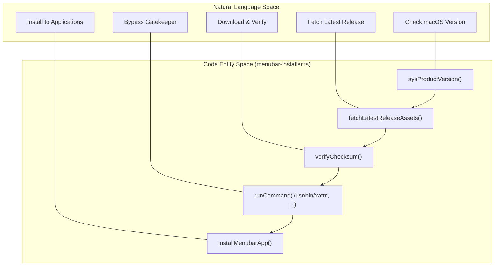
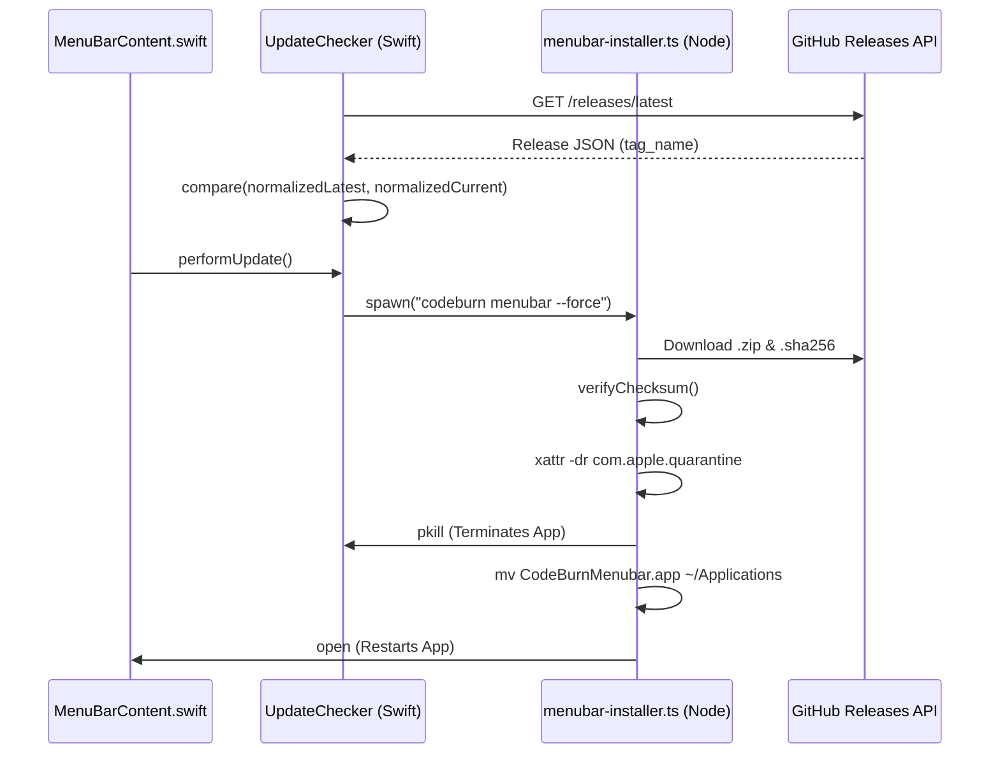

# Installation and Updates

Relevant source files

The following files were used as context for generating this wiki page:

- [.github/workflows/release-menubar.yml](.github/workflows/release-menubar.yml)
- [SECURITY.md](SECURITY.md)
- [mac/.gitignore](mac/.gitignore)
- [mac/Package.swift](mac/Package.swift)
- [mac/README.md](mac/README.md)
- [mac/Scripts/package-app.sh](mac/Scripts/package-app.sh)
- [mac/Sources/CodeBurnMenubar/Data/CapacityEstimator.swift](mac/Sources/CodeBurnMenubar/Data/CapacityEstimator.swift)
- [mac/Sources/CodeBurnMenubar/Data/UpdateChecker.swift](mac/Sources/CodeBurnMenubar/Data/UpdateChecker.swift)
- [src/menubar-installer.ts](src/menubar-installer.ts)

The CodeBurn ecosystem provides a seamless installation and update experience for both the CLI and the macOS Menubar application. This page details the automation behind the `codeburn menubar` installer, the in-app update checking mechanism, and the build pipeline used to package the native application.

## macOS Menubar Installer

The Menubar application is typically installed and managed via the CLI using the `codeburn menubar` command. This logic is implemented in `menubar-installer.ts`.

### Platform Validation
Before proceeding, the installer validates the host environment:
- **OS Check**: Only `darwin` (macOS) is supported [src/menubar-installer.ts:40-42]().
- **Version Check**: Requires macOS 14.0 (Sonoma) or higher [src/menubar-installer.ts:18-18](). It uses `/usr/bin/sw_vers -productVersion` to determine the current OS version [src/menubar-installer.ts:50-61]().

### Installation Flow
The `installMenubarApp` function orchestrates the lifecycle [src/menubar-installer.ts:147-195]():

1.  **Discovery**: It queries the GitHub Releases API (`/releases/latest`) to find the most recent `.zip` asset matching the pattern `CodeBurnMenubar-*.zip` [src/menubar-installer.ts:63-83]().
2.  **Verification**: If a `.sha256` asset is found, the installer verifies the archive integrity using `verifyChecksum` before proceeding [src/menubar-installer.ts:85-105](), [src/menubar-installer.ts:170-175]().
3.  **Staging**: The zip is downloaded to a temporary directory created via `mkdtemp` [src/menubar-installer.ts:164-168]().
4.  **Quarantine Removal**: After unzipping, the installer executes `/usr/bin/xattr -dr com.apple.quarantine` on the `.app` bundle [src/menubar-installer.ts:188-188](). This prevents Gatekeeper from blocking the app on its first launch, which is common for binaries downloaded outside the Mac App Store.
5.  **Placement**: The app is moved to `~/Applications` [src/menubar-installer.ts:150-151](). If an existing version is running, the installer kills the process using `pkill` before replacing the bundle [src/menubar-installer.ts:139-145]().
6.  **Execution**: Finally, it launches the app using `/usr/bin/open` [src/menubar-installer.ts:156-156]().

### Installer Logic Flow
The following diagram maps the natural language installation steps to the specific code entities in `menubar-installer.ts`.

"Installation Data Flow"

Sources: [src/menubar-installer.ts:39-195]()

## In-App Update Checker

Once installed, the Menubar app monitors for updates independently using the `UpdateChecker` class.

### Version Comparison
The app compares its local `CFBundleShortVersionString` against the version tag found in the latest GitHub release [mac/Sources/CodeBurnMenubar/Data/UpdateChecker.swift:16-27]().
- **Interval**: Checks are performed every 48 hours to avoid API rate limiting [mac/Sources/CodeBurnMenubar/Data/UpdateChecker.swift:5-5]().
- **Persistence**: The last check timestamp and latest known version are stored in `UserDefaults` [mac/Sources/CodeBurnMenubar/Data/UpdateChecker.swift:57-58]().

### Performing Updates
When a user triggers an update, the app calls `performUpdate()` [mac/Sources/CodeBurnMenubar/Data/UpdateChecker.swift:64-93]():
1.  It spawns a child process of the `codeburn` CLI via `CodeburnCLI.makeProcess` [mac/Sources/CodeBurnMenubar/Data/UpdateChecker.swift:68-68]().
2.  It executes the subcommand `menubar --force` [mac/Sources/CodeBurnMenubar/Data/UpdateChecker.swift:68-68]().
3.  This re-triggers the `installMenubarApp` logic in the CLI, which downloads the new version, replaces the current binary, and restarts the app.

### Update System Architecture
This diagram shows how the Swift `UpdateChecker` interacts with the Node.js CLI to perform an in-place upgrade.

"Update Mechanism Interaction"

Sources: [mac/Sources/CodeBurnMenubar/Data/UpdateChecker.swift:11-93](), [src/menubar-installer.ts:147-195]()

## Build and Packaging Pipeline

The project uses a custom shell script, `package-app.sh`, to create distributable bundles. This script is utilized by the `.github/workflows/release-menubar.yml` workflow.

### Packaging Process
The `package-app.sh` script performs the following steps [mac/Scripts/package-app.sh:11-110]():
1.  **Universal Binary**: Compiles the Swift code for both `arm64` and `x86_64` architectures using `swift build -c release` [mac/Scripts/package-app.sh:32-32]().
2.  **Bundle Assembly**: Creates the `.app` folder structure (`Contents/MacOS`, `Contents/Resources`) and generates a standard `Info.plist` with the provided version [mac/Scripts/package-app.sh:41-82]().
3.  **Ad-hoc Signing**: Executes `codesign --force --sign -` [mac/Scripts/package-app.sh:93-93](). This ensures the bundle is internally consistent for macOS 14+ requirements and prevents Gatekeeper edge cases [mac/Scripts/package-app.sh:88-91]().
4.  **Compression**: Uses `/usr/bin/ditto` to create a `.zip` archive that preserves macOS metadata and resource forks [mac/Scripts/package-app.sh:99-99]().
5.  **Checksum Generation**: Computes a SHA-256 hash of the final zip for verification by the installer [mac/Scripts/package-app.sh:104-104]().

### CI/CD Integration
The GitHub Action `release-menubar.yml` triggers on tags matching `mac-v*` [.github/workflows/release-menubar.yml:8-10](). It runs the packaging script and uploads the resulting zip and checksum to the GitHub Release [.github/workflows/release-menubar.yml:68-70]().

| Component | Responsibility | File |
| :--- | :--- | :--- |
| **Installer** | Downloads, verifies checksum, unquarantines, and moves app | [src/menubar-installer.ts]() |
| **UpdateChecker** | Polls GitHub API and invokes CLI `--force` update | [mac/Sources/CodeBurnMenubar/Data/UpdateChecker.swift]() |
| **Package Script** | Compiles universal binary, signs, and generates checksum | [mac/Scripts/package-app.sh]() |
| **Release Workflow** | Automates build and asset upload on git tag | [.github/workflows/release-menubar.yml]() |

Sources: [mac/Scripts/package-app.sh:1-110](), [.github/workflows/release-menubar.yml:1-72](), [mac/Sources/CodeBurnMenubar/Data/UpdateChecker.swift:1-104](), [src/menubar-installer.ts:1-195]()
