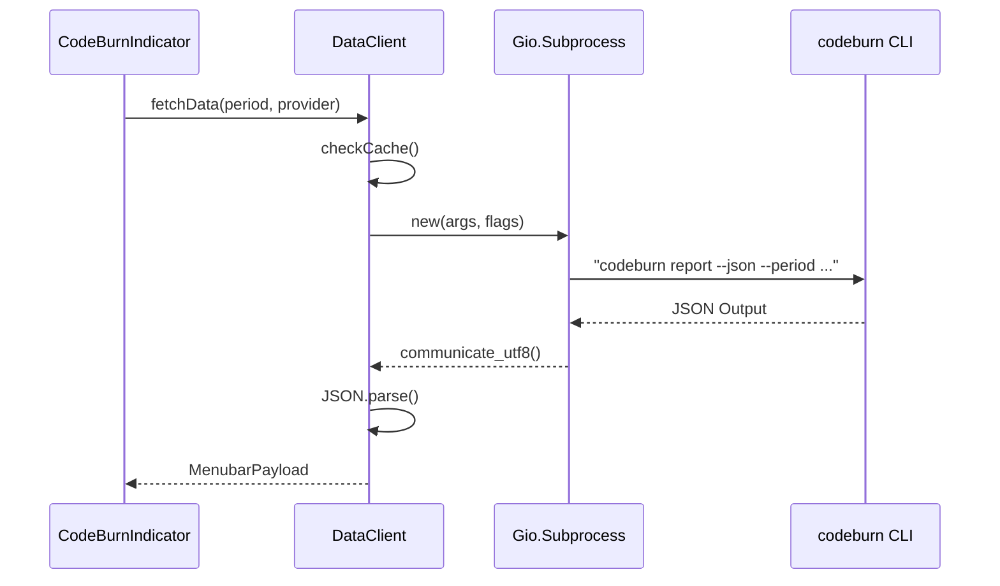

# GNOME Shell Extension

<details>
<summary>Relevant source files</summary>

The following files were used as context for generating this wiki page:

- [gnome/README.md](gnome/README.md)
- [gnome/extension.js](gnome/extension.js)
- [gnome/icons/codeburn-symbolic.svg](gnome/icons/codeburn-symbolic.svg)
- [gnome/indicator.js](gnome/indicator.js)
- [gnome/install.sh](gnome/install.sh)

</details>


The CodeBurn GNOME Shell extension provides a Linux-native equivalent to the macOS menubar application, allowing users to monitor AI coding costs and token usage directly from the GNOME status area. It acts as a graphical frontend to the `codeburn` CLI, periodically polling data and rendering interactive charts and insights using the GNOME Shell's `St` and `Clutter` toolkits.

### System Overview

The extension is composed of a core entry point that manages the lifecycle, an indicator class that handles the UI and user interactions, and a data client that interfaces with the system's CLI.

#### Extension Component Relationship
This diagram maps the high-level logical components to their specific implementation classes and files.

```mermaid
graph TD
    subgraph "GNOME Shell Environment"
        [CodeBurnExtension] -->|instantiates| [CodeBurnIndicator]
        [CodeBurnIndicator] -->|uses| [DataClient]
    end

    subgraph "External"
        [DataClient] -->|executes| [codeburn_CLI_binary]
        [CodeBurnIndicator] -->|fetches| [Frankfurter_API]
    end

    style [CodeBurnExtension] stroke-width:2px
    style [CodeBurnIndicator] stroke-width:2px
    style [DataClient] stroke-width:2px
```
**Sources:** [gnome/extension.js:5-17](), [gnome/indicator.js:103-141](), [gnome/dataClient.js:1-10]()

---

### Extension Architecture and Indicator UI

The extension's entry point is the `CodeBurnExtension` class, which manages the addition and removal of the indicator from the GNOME status area [gnome/extension.js:5-17](). The primary UI logic resides in `CodeBurnIndicator`, a subclass of `PanelMenu.Button` [gnome/indicator.js:103-104]().

The UI is built using GNOME's `St` (Shell Toolkit) and `Clutter` actors. It features a panel button displaying a flame icon and current cost [gnome/indicator.js:145-161](), and a complex popup menu containing:
*   **Provider Tabs:** Filters data by specific AI tools like Claude, Cursor, or Copilot [gnome/indicator.js:32-45]().
*   **Period Tabs:** Switches between timeframes (Today, 7 Days, Month, etc.) [gnome/indicator.js:16-22]().
*   **Insight Pills:** Toggles between different data visualizations such as Activity, Trends, and Forecasts [gnome/indicator.js:24-30]().
*   **Visualizations:** Custom-drawn bar charts for token usage and sparklines for trend analysis.

For details on the UI rendering and widget hierarchy, see [Extension Architecture and Indicator UI](#6.1).

**Sources:** [gnome/indicator.js:103-200](), [gnome/extension.js:8-11]()

---

### Data Client and Configuration

Communication with the CodeBurn core logic is handled by the `DataClient` class. Unlike the macOS app which uses Swift's `Process`, the GNOME extension utilizes `Gio.Subprocess` to execute CLI commands like `codeburn report --json` [gnome/dataClient.js:1-20]().

#### Data Flow and Command Execution
This diagram illustrates how the `DataClient` bridges the GNOME Shell (GJS) environment to the Node.js CLI.


**Sources:** [gnome/indicator.js:320-350](), [gnome/dataClient.js:30-60]()

The extension uses `GSettings` for configuration persistence, allowing users to customize the refresh interval, toggle "Compact Mode" (icon only), and set budget alerts [gnome/README.md:41-49](). Installation is automated via a shell script that compiles schemas and moves files to the local extensions directory [gnome/install.sh:1-33]().

For details on subprocess security, caching, and GSettings integration, see [GNOME Data Client and Configuration](#6.2).

**Sources:** [gnome/dataClient.js:1-80](), [gnome/install.sh:1-39](), [gnome/README.md:41-49]()

---

### Installation and Setup

The extension requires the CodeBurn CLI to be installed globally via `npm`.

| Requirement | Description |
| :--- | :--- |
| **GNOME Shell** | Version 45 or later (supports ESM) |
| **CodeBurn CLI** | Must be available in system PATH or configured manually |
| **Build Tools** | `glib-compile-schemas` for configuration support |

**Quick Install:**
1.  Navigate to the `gnome/` directory.
2.  Run `./install.sh` [gnome/install.sh:1-33]().
3.  Restart GNOME Shell or log out/in.
4.  Enable via `gnome-extensions enable codeburn@codeburn.dev`.

**Sources:** [gnome/README.md:5-27](), [gnome/install.sh:1-33]()
