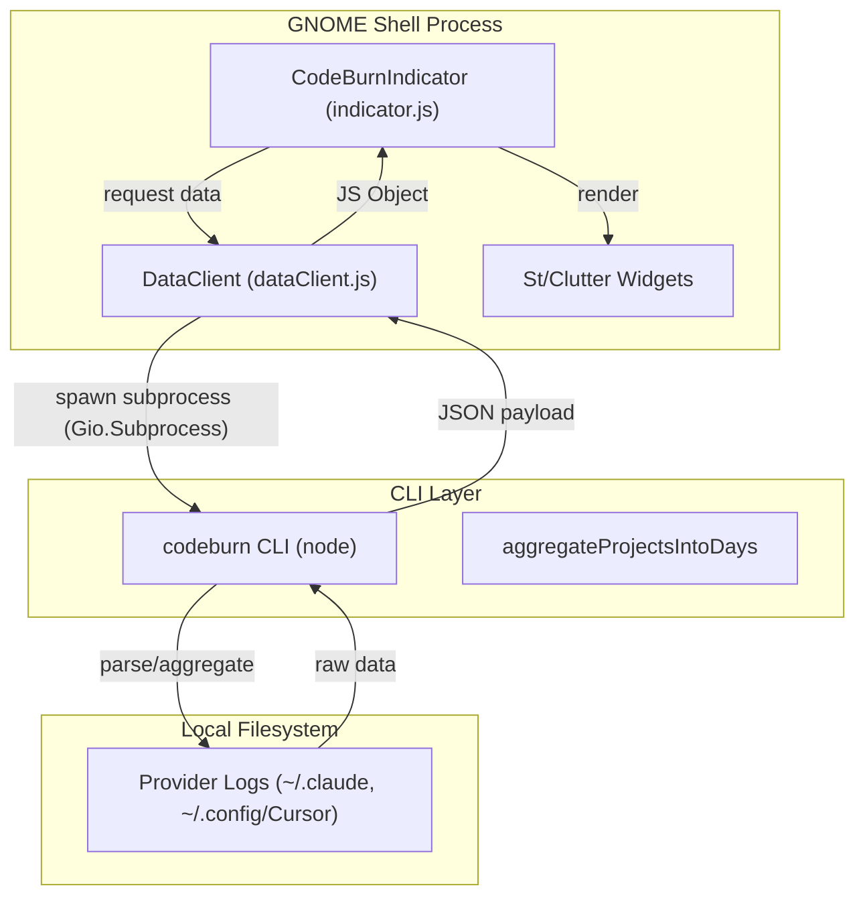
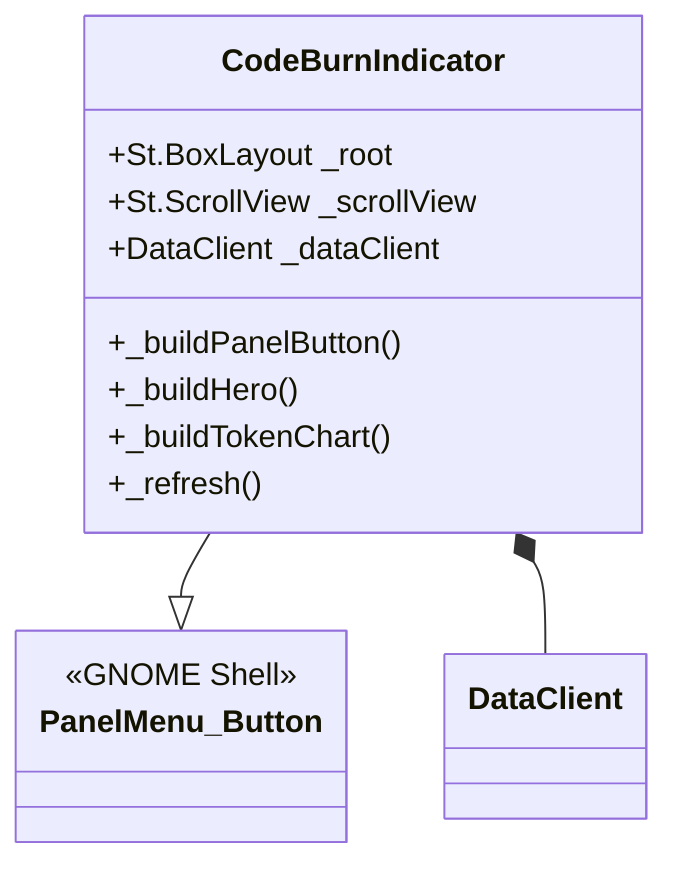

# Extension Architecture and Indicator UI

Relevant source files

The following files were used as context for generating this wiki page:

- [gnome/extension.js](gnome/extension.js)
- [gnome/indicator.js](gnome/indicator.js)
- [gnome/metadata.json](gnome/metadata.json)
- [gnome/stylesheet.css](gnome/stylesheet.css)

The CodeBurn GNOME extension provides a Linux-native interface for monitoring AI coding assistant costs and token usage directly from the GNOME Shell top panel. It is built using the GNOME JavaScript (GJS) environment, utilizing the `St` (Shell Toolkit) and `Clutter` libraries for UI rendering.

## Core Architecture

The extension is structured into three primary components: the `CodeBurnExtension` lifecycle manager, the `CodeBurnIndicator` UI controller, and the `DataClient` for CLI communication.

### Extension Lifecycle
The `CodeBurnExtension` class handles the standard GNOME extension lifecycle hooks. Upon activation, it instantiates the indicator and adds it to the system status area.

| Class | Role | Key Methods |
| :--- | :--- | :--- |
| `CodeBurnExtension` | Entry point and lifecycle management. | `enable()`, `disable()` |
| `CodeBurnIndicator` | Main UI component; manages state and rendering. | `_init()`, `_refresh()`, `_buildPopup()` |
| `DataClient` | Asynchronous bridge to the `codeburn` CLI. | `getPeriodData()`, `getSummary()` |

### Data Flow Diagram
The following diagram illustrates the flow of data from the local provider logs (e.g., Claude, Cursor) through the CLI to the GNOME UI.

**GNOME Extension Data Pipeline**

**Sources:**
- `gnome/extension.js:5-17`
- `gnome/indicator.js:103-141`
- `gnome/dataClient.js` (referenced via `gnome/indicator.js:9`)

## Indicator UI Components

The `CodeBurnIndicator` extends `PanelMenu.Button` and consists of two main parts: the Panel Button (visible in the top bar) and the Popup Menu (the dashboard).

### Panel Button
The panel button displays a "flame" icon (`🔥`) and a summary label.
- **Flame Icon:** A `St.Label` with the `codeburn-flame` style class [gnome/indicator.js:147-151]().
- **Label:** Displays the current cost or status; visibility is toggled by the `compact-mode` setting [gnome/indicator.js:152-159]().

### Popup Dashboard
The dashboard is a complex hierarchy of `St.BoxLayout` and `St.ScrollView` containers. It is organized into several functional areas:

1.  **Agent Tabs:** A horizontal scrollable row of provider badges (Claude, Cursor, etc.) [gnome/indicator.js:342-367]().
2.  **Hero Section:** Displays the primary cost for the selected period in large text, using the `codeburn-hero-amount` style [gnome/indicator.js:401-419]().
3.  **Period Tabs:** Switches between "Today", "7 Days", "30 Days", "Month", and "6 Months" [gnome/indicator.js:16-22](), [gnome/indicator.js:421-438]().
4.  **Insight Pills:** Toggles between different data views like "Activity", "Trend", and "Stats" [gnome/indicator.js:24-30](), [gnome/indicator.js:440-457]().
5.  **Token Chart:** A histogram or sparkline visualization of usage [gnome/indicator.js:459-480]().

**UI Class Association**

**Sources:**
- `gnome/indicator.js:104-141`
- `gnome/indicator.js:165-200`
- `gnome/stylesheet.css:1-135`

## Rendering and Visuals

The extension uses a combination of CSS and imperative widget construction for its visuals.

### Bar Charts and Sparklines
Usage intensity for different projects is rendered using horizontal bar charts.
- **Track:** A `St.BoxLayout` with `codeburn-bar-track` (width: 240px) [gnome/indicator.js:14](), [gnome/indicator.js:655-659]().
- **Fill:** A child `St.Widget` with `codeburn-bar-fill` whose width is calculated as a percentage of the maximum value in the dataset [gnome/indicator.js:660-664]().

### Theming
The extension monitors the GNOME color scheme setting (`org.gnome.desktop.interface color-scheme`) to apply appropriate light/dark theme classes.
- **Signal Connection:** `_themeSettings.connect('changed::color-scheme', ...)` [gnome/indicator.js:131-133]().
- **Application:** The `_applyThemeClass()` method toggles the `codeburn-light` class on the root element [gnome/indicator.js:317-325]().

### Formatting Helpers
The indicator includes several utility functions for data presentation:
- `formatCost`: Handles currency symbols, FX rates, and "k" suffixing for large values [gnome/indicator.js:75-83]().
- `formatTokensCompact`: Converts raw numbers to B/M/k notation [gnome/indicator.js:85-91]().
- `formatTime`: Generates relative time strings (e.g., "5m ago") for the "Last Updated" footer [gnome/indicator.js:93-101]().

**Sources:**
- `gnome/indicator.js:75-101`
- `gnome/indicator.js:650-675`
- `gnome/stylesheet.css:197-207`

## State and Settings Integration

The extension state is synchronized with GNOME GSettings. Key settings include:
- `codeburn-path`: Path to the CLI executable [gnome/indicator.js:110]().
- `default-period`: The initial time range shown on load [gnome/indicator.js:113]().
- `compact-mode`: Toggles the panel label visibility [gnome/indicator.js:159]().
- `refresh-interval`: Controls the `_startRefreshLoop()` frequency [gnome/indicator.js:139]().

**Sources:**
- `gnome/indicator.js:109-120`
- `gnome/metadata.json:7`
